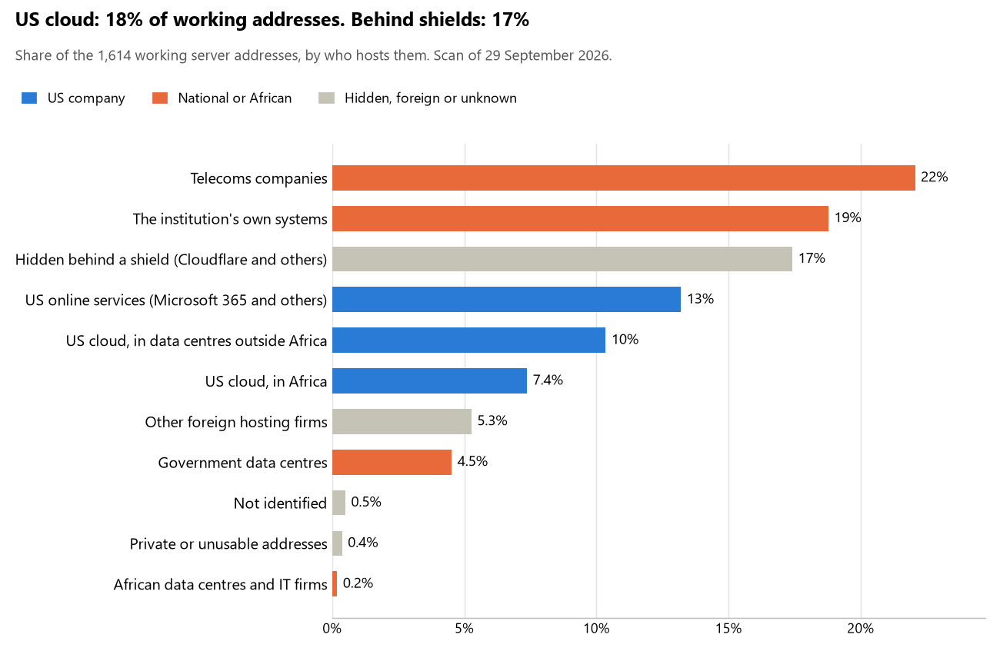

# Angola: who hosts the state's front door

29 September 2026 · Bill Anderson · scan of 29 September 2026

The scan covered 41 state bodies, banks and state-owned companies in Angola. 18% of their working server addresses are on US cloud: Amazon, Microsoft, Google or Oracle. 17% are behind shields such as Cloudflare, which hide the host. 23% are on government data centres or the institutions' own systems.

The scan found 1,679 web and mail names and 1,614 working addresses. 20 of the 41 institutions use US cloud for at least part of their estate. 19 use Microsoft for email and 1 use Google.

Of the 54 countries scanned so far, Angola has the 20th highest US cloud share (median 13%) and the 18th highest share behind shields (median 12%).

## Where it lives

286 addresses are on US cloud. Where they are: 50% in Europe, 42% in Africa, 7% on worldwide delivery networks (no fixed location) and 2% in a region the providers do not publish.

281 addresses are behind shields: Cloudflare (100%). The host behind a shield cannot be seen, so the US cloud share is a minimum.

## Banks against government

| Share of working addresses | Government (31) | Banks (10) |
| --- | --- | --- |
| On US cloud | 20% | 14% |
| …of which in Africa | 11% | <1% |
| US online services (Microsoft 365 and others) | 10% | 19% |
| Behind a shield | 7% | 35% |
| Government data centres | 7% | 0% |
| Run by the institution itself | 13% | 30% |
| Telecoms companies | 34% | <1% |
| African data centres and IT firms | <1% | <1% |
| Other foreign hosting firms | 8% | 1% |

8 of 10 banks and 12 of 31 government bodies use US cloud somewhere. "Government" includes the central bank, the payment switch, the stock exchange and the state-owned companies.

## Email

19 of the 41 institutions use Microsoft 365 for email and 1 use Google.

- **Microsoft 365:** 19. Ministério das Finanças, Banco Nacional de Angola, Banco Angolano de Investimentos (BAI), Banco de Fomento Angola (BFA), Banco BIC, Banco Millennium Atlântico, Standard Bank de Angola, Banco de Poupança e Crédito (BPC), Banco Sol, Banco Keve, Banco Caixa Geral Angola, Banco Comércio e Indústria (BCI), Instituto Nacional de Estatística, Instituto Nacional de Segurança Social, Bolsa de Dívida e Valores de Angola (BODIVA), Comissão do Mercado de Capitais, Empresa Nacional de Distribuição de Electricidade (ENDE), Porto de Luanda E.P. and Tribunal de Contas.
- **Google (SIAC):** 1. Serviço Integrado de Atendimento ao Cidadão.
- **Government data centre (CENTRO NACIONAL DAS TECNOLOGIAS DE INFORMACAO):** 3. Agência de Protecção de Dados, Comissão Nacional Eleitoral and Instituto Angolano das Comunicações (INACOM).
- **Own mail servers:** 2. Angola Telecom and Instituto Nacional de Fomento da Sociedade da Informação (INFOSI).
- **Telecoms companies:** 10. Assembleia Nacional (Angola Telecom), Ministério das Relações Exteriores (Angola Cables), Ministério da Defesa Nacional Antigos Combatentes e Veteranos da Pátria (Angola Cables), Polícia Nacional de Angola (Angola Cables), Ministério da Justiça e dos Direitos Humanos (Angola Cables), Ministério do Interior (Angola Cables), Ministério da Saúde (Angola Cables), Instituto Geográfico e Cadastral de Angola (IGCA) (Angola Cables), Governo de Angola (zona gov.ao) (Angola Cables) and Procuradoria-Geral da República (Angola Cables).
- **Foreign hosting firms (Interserver):** 1. Tribunal Supremo.
- **Not identified:** 1. EMIS Empresa Interbancária de Serviços.
- **No mail on the domain scanned:** 4. Presidência da República / Governo de Angola, Administração Geral Tributária, Fundo Soberano de Angola (FSDEA) and Serviço Nacional da Contratação Pública (Portal Compras Públicas).

## Institution by institution

Each figure is a share of that institution's working addresses. The rest are with telecoms companies, African data centres, US online services or foreign hosts. Rows follow the order of institution types.

| Institution | Type | On US cloud | …in Africa | Behind a shield | Own or government | Email |
| --- | --- | --- | --- | --- | --- | --- |
| Presidência da República / Governo de Angola | Presidency | 0% | 0% | 0% | 29% | — |
| Assembleia Nacional | Parliament | 0% | 0% | 88% | 0% | Telecoms |
| Ministério das Relações Exteriores | Foreign Affairs | 37% | 37% | 0% | 2% | Telecoms |
| Ministério da Defesa Nacional Antigos Combatentes e Veteranos da Pátria | Defence | 0% | 0% | 0% | 22% | Telecoms |
| Polícia Nacional de Angola | Police | 0% | 0% | 0% | 15% | Telecoms |
| Ministério da Justiça e dos Direitos Humanos | Justice | 0% | 0% | 0% | 7% | Telecoms |
| Tribunal Supremo | Justice | 0% | 0% | 0% | 0% | Foreign host |
| Ministério das Finanças | Treasury / Finance | 40% | 40% | 0% | 40% | Microsoft |
| Administração Geral Tributária | Revenue Service | 0% | 0% | 0% | 80% | — |
| Ministério do Interior | Interior / Home Affairs | 0% | 0% | 0% | 23% | Telecoms |
| Banco Nacional de Angola | Central Bank | 2% | 0% | 24% | 46% | Microsoft |
| Banco Angolano de Investimentos (BAI) | Commercial Banks | 9% | 0% | 47% | 18% | Microsoft |
| Banco de Fomento Angola (BFA) | Commercial Banks | 17% | 1% | 0% | 79% | Microsoft |
| Banco BIC | Commercial Banks | 0% | 0% | 76% | 21% | Microsoft |
| Banco Millennium Atlântico | Commercial Banks | 4% | 1% | 45% | 25% | Microsoft |
| Standard Bank de Angola | Commercial Banks | 30% | 0% | 34% | 18% | Microsoft |
| Banco de Poupança e Crédito (BPC) | Commercial Banks | 32% | 0% | 0% | 62% | Microsoft |
| Banco Sol | Commercial Banks | 3% | 0% | 22% | 17% | Microsoft |
| Banco Keve | Commercial Banks | 30% | 0% | 7% | 17% | Microsoft |
| Banco Caixa Geral Angola | Commercial Banks | 0% | 0% | 85% | 8% | Microsoft |
| Banco Comércio e Indústria (BCI) | Commercial Banks | 24% | 0% | 5% | 32% | Microsoft |
| Serviço Integrado de Atendimento ao Cidadão (SIAC) | Civil registry / National ID authority | 10% | 0% | 0% | 20% | Google |
| Agência de Protecção de Dados | Data protection authority | 0% | 0% | 0% | 57% | Government |
| Comissão Nacional Eleitoral | Electoral commission | 2% | 0% | 4% | 24% | Government |
| Instituto Nacional de Estatística | Statistics office | 0% | 0% | 0% | 6% | Microsoft |
| Ministério da Saúde | Health ministry / National health insurance | 0% | 0% | 0% | 14% | Telecoms |
| Instituto Nacional de Segurança Social | Social protection / Social registry | 35% | 0% | 0% | 0% | Microsoft |
| Instituto Geográfico e Cadastral de Angola (IGCA) | Land registry | 0% | 0% | 0% | 29% | Telecoms |
| EMIS Empresa Interbancária de Serviços | National payment switch | 22% | 0% | 0% | 52% | Not identified |
| Bolsa de Dívida e Valores de Angola (BODIVA) | Stock exchange | 54% | 0% | 0% | 8% | Microsoft |
| Comissão do Mercado de Capitais | Securities regulator | 15% | 0% | 0% | 0% | Microsoft |
| Fundo Soberano de Angola (FSDEA) | Sovereign wealth fund / National pension fund | 0% | 0% | 0% | 0% | — |
| Serviço Nacional da Contratação Pública (Portal Compras Públicas) | Public procurement authority | 0% | 0% | 0% | 100% | — |
| Empresa Nacional de Distribuição de Electricidade (ENDE) | Energy utility | 0% | 0% | 0% | 0% | Microsoft |
| Porto de Luanda E.P. | Ports authority | 30% | 0% | 7% | 10% | Microsoft |
| Angola Telecom | State-owned telco / National backbone operator | 54% | 0% | 0% | 41% | Own servers |
| Instituto Nacional de Fomento da Sociedade da Informação (INFOSI) | E-government agency | 0% | 0% | 0% | 88% | Own servers |
| Governo de Angola (zona gov.ao) | E-government agency | 0% | 0% | 0% | 29% | Telecoms |
| Instituto Angolano das Comunicações (INACOM) | Communications regulator | 0% | 0% | 0% | 44% | Government |
| Tribunal de Contas | Audit office | 10% | 0% | 0% | 5% | Microsoft |
| Procuradoria-Geral da República | Anti-corruption commission | 0% | 0% | 0% | 58% | Telecoms |

No institution or working domain was found for 6 of the 36 types: Armed Forces, Customs, Intelligence, Immigration / Passports, National data centre / Government cloud operator and Cybersecurity agency / National CERT.

## What stood out

- **Most on US cloud.** Angola Telecom (54%) and Bolsa de Dívida e Valores de Angola (BODIVA) (54%) have more than half their working addresses on US cloud.
- **US cloud in Africa.** Ministério das Finanças has 40% of its working addresses in US cloud data centres in Africa, the highest share in Angola.
- **Core state bodies at home.** Administração Geral Tributária (80%) keeps at least 80% of its working addresses on government data centres or its own systems.
- **Core state bodies on foreign hosting firms.** Ministério da Justiça e dos Direitos Humanos (Hetzner) and Tribunal Supremo (Interserver).
- **No Chinese cloud.** The scan found no address on Huawei, Alibaba or Tencent cloud.

## What this can and cannot tell you

The scan sees only the front door: websites, email, login portals, remote-access gateways and online banking. It cannot see where a bank's core ledger, the ID register or the payroll run.

- **Every US figure is a minimum.** Anything behind a shield or a mail filter could also be on US cloud. In Angola that is 17% of working addresses.
- **It counts addresses, not importance.** An institution with many test and marketing sites weighs more than one with few.
- **The list of institutions was drawn up for this scan.** Each domain was checked to exist, not confirmed as the institution's main one.
- **It is a snapshot.** Every figure is as of 29 September 2026.
- **Nothing was touched.** The scan used public address lookups, public certificate records and the cloud companies' published address lists. It never connected to any institution's systems.

The data and method are in `R&D/Hyperscaler-dependence/scan/AGO/` and `R&D/Hyperscaler-dependence/HYPERSCALER-SCAN.md` in the Corpus repository.
