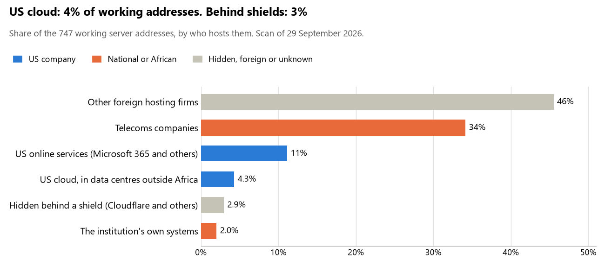

# Burundi: who hosts the state's front door

29 September 2026 · Bill Anderson · scan of 29 September 2026

The scan covered 33 state bodies, banks and state-owned companies in Burundi. 4% of their working server addresses are on US cloud: Amazon, Microsoft, Google or Oracle. 3% are behind shields such as Cloudflare, which hide the host. 2% are on government data centres or the institutions' own systems.

The scan found 784 web and mail names and 747 working addresses. 5 of the 33 institutions use US cloud for at least part of their estate. 9 use Microsoft for email and 2 use Google.

Of the 54 countries scanned so far, Burundi has the 52nd highest US cloud share (median 13%) and the 44th highest share behind shields (median 12%).

## Where it lives

32 addresses are on US cloud. Where they are: 88% in Europe, 9% in a region the providers do not publish and 3% in North America.

22 addresses are behind shields: Cloudflare (100%). The host behind a shield cannot be seen, so the US cloud share is a minimum.

## Banks against government

| Share of working addresses | Government (23) | Banks (10) |
| --- | --- | --- |
| On US cloud | 1% | 11% |
| …of which in Africa | 0% | 0% |
| US online services (Microsoft 365 and others) | 1% | 30% |
| Behind a shield | 0% | 9% |
| Government data centres | 0% | 0% |
| Run by the institution itself | 2% | 2% |
| Telecoms companies | 49% | 5% |
| African data centres and IT firms | 0% | 0% |
| Other foreign hosting firms | 46% | 44% |

3 of 10 banks and 2 of 23 government bodies use US cloud somewhere. "Government" includes the central bank, the payment switch, the stock exchange and the state-owned companies.

## Email

9 of the 33 institutions use Microsoft 365 for email and 2 use Google.

- **Microsoft 365:** 9. Ministère des Finances, du Budget et de l'Économie numérique, Banque commerciale du Burundi (BANCOBU), Banque de crédit de Bujumbura, Banque de gestion et de financement, KCB Bank Burundi, Banque burundaise pour le commerce et l'investissement, Banque communautaire et agricole du Burundi, Banque de l'habitat du Burundi and Banque d'investissement pour les jeunes.
- **Google:** 2. Assemblée nationale and Burundi Backbone System.
- **Own mail servers:** 1. CRDB Bank Burundi.
- **Telecoms companies:** 14. Présidence de la République du Burundi (Burundi Backbone System SM), Sénat (Burundi Backbone System SM), Ministère de la Défense nationale et des Anciens combattants (Burundi Backbone System SM), Force de défense nationale du Burundi (Burundi Backbone System SM), Ministère de la Justice, des Droits de la personne humaine et du Genre (Burundi Backbone System SM), Ministère de l'Intérieur, du Développement communautaire et de la Sécurité publique (Burundi Backbone System SM), Banque de la République du Burundi (Burundi Backbone System SM), Interbank Burundi (CBINET Burundi), Commission électorale nationale indépendante (Burundi Backbone System SM), Ministère de la Santé publique (Burundi Backbone System SM), Régie de production et de distribution d'eau et d'électricité (VIETTEL BURUNDI SA), Office national des télécommunications (Burundi Backbone System SM), Gouvernement du Burundi (zone parente) (VIETTEL BURUNDI SA) and Agence de régulation et de contrôle des télécommunications (Burundi Backbone System SM).
- **Foreign hosting firms:** 7. Ministère des Affaires étrangères, de l'Intégration régionale et de la Coopération au développement (Hetzner), Office burundais des recettes (Contabo), Institut national de la statistique du Burundi (Contabo), Autorité de régulation du marché des capitaux (Contabo), Institut national de sécurité sociale (Contabo), Autorité de régulation des marchés publics (TWENTYI 20i Limited) and Cour des comptes (Hetzner).

## Institution by institution

Each figure is a share of that institution's working addresses. The rest are with telecoms companies, African data centres, US online services or foreign hosts. Rows follow the order of institution types.

| Institution | Type | On US cloud | …in Africa | Behind a shield | Own or government | Email |
| --- | --- | --- | --- | --- | --- | --- |
| Présidence de la République du Burundi | Presidency | 0% | 0% | 0% | 0% | Telecoms |
| Assemblée nationale | Parliament | 0% | 0% | 0% | 0% | Google |
| Sénat | Parliament | 0% | 0% | 0% | 0% | Telecoms |
| Ministère des Affaires étrangères, de l'Intégration régionale et de la Coopération au développement | Foreign Affairs | 0% | 0% | 0% | 0% | Foreign host |
| Ministère de la Défense nationale et des Anciens combattants | Defence | 0% | 0% | 0% | 0% | Telecoms |
| Force de défense nationale du Burundi | Armed Forces | 0% | 0% | 0% | 0% | Telecoms |
| Ministère de la Justice, des Droits de la personne humaine et du Genre | Justice | 0% | 0% | 0% | 0% | Telecoms |
| Ministère des Finances, du Budget et de l'Économie numérique | Treasury / Finance | 6% | 0% | 0% | 0% | Microsoft |
| Office burundais des recettes | Revenue Service | 0% | 0% | 0% | 0% | Foreign host |
| Ministère de l'Intérieur, du Développement communautaire et de la Sécurité publique | Interior / Home Affairs | 0% | 0% | 0% | 0% | Telecoms |
| Banque de la République du Burundi | Central Bank | 0% | 0% | 0% | 0% | Telecoms |
| Banque commerciale du Burundi (BANCOBU) | Commercial Banks | 20% | 0% | 0% | 0% | Microsoft |
| Interbank Burundi | Commercial Banks | 0% | 0% | 0% | 0% | Telecoms |
| Banque de crédit de Bujumbura | Commercial Banks | 9% | 0% | 0% | 0% | Microsoft |
| Banque de gestion et de financement | Commercial Banks | 0% | 0% | 0% | 0% | Microsoft |
| CRDB Bank Burundi | Commercial Banks | 0% | 0% | 78% | 22% | Own servers |
| KCB Bank Burundi | Commercial Banks | 42% | 0% | 22% | 0% | Microsoft |
| Banque burundaise pour le commerce et l'investissement | Commercial Banks | 0% | 0% | 0% | 0% | Microsoft |
| Banque communautaire et agricole du Burundi | Commercial Banks | 0% | 0% | 0% | 0% | Microsoft |
| Banque de l'habitat du Burundi | Commercial Banks | 0% | 0% | 0% | 0% | Microsoft |
| Banque d'investissement pour les jeunes | Commercial Banks | 0% | 0% | 0% | 0% | Microsoft |
| Commission électorale nationale indépendante | Electoral commission | 0% | 0% | 0% | 0% | Telecoms |
| Institut national de la statistique du Burundi | Statistics office | 0% | 0% | 0% | 0% | Foreign host |
| Ministère de la Santé publique | Health ministry / National health insurance | 0% | 0% | 0% | 0% | Telecoms |
| Autorité de régulation du marché des capitaux | Securities regulator | 0% | 0% | 0% | 0% | Foreign host |
| Institut national de sécurité sociale | Sovereign wealth fund / National pension fund | 0% | 0% | 0% | 0% | Foreign host |
| Autorité de régulation des marchés publics | Public procurement authority | 15% | 0% | 0% | 0% | Foreign host |
| Régie de production et de distribution d'eau et d'électricité | Energy utility | 0% | 0% | 0% | 0% | Telecoms |
| Office national des télécommunications | State-owned telco / National backbone operator | 0% | 0% | 0% | 0% | Telecoms |
| Burundi Backbone System | State-owned telco / National backbone operator | 0% | 0% | 0% | 69% | Google |
| Gouvernement du Burundi (zone parente) | E-government agency | 0% | 0% | 0% | 0% | Telecoms |
| Agence de régulation et de contrôle des télécommunications | Communications regulator | 0% | 0% | 0% | 0% | Telecoms |
| Cour des comptes | Audit office | 0% | 0% | 0% | 0% | Foreign host |

No institution or working domain was found for 14 of the 36 types: Police, Customs, Intelligence, Civil registry / National ID authority, Data protection authority, Immigration / Passports, Social protection / Social registry, Land registry, National payment switch, Stock exchange, Ports authority, National data centre / Government cloud operator, Cybersecurity agency / National CERT and Anti-corruption commission.

## What stood out

- **Little US cloud in Africa.** 0% of Burundi's US cloud addresses are in the providers' African data centres.
- **Core state bodies on foreign hosting firms.** Assemblée nationale (Contabo), Ministère des Affaires étrangères, de l'Intégration régionale et de la Coopération au développement (Hetzner), Office burundais des recettes (Contabo and Hetzner) and Banque de la République du Burundi (Contabo).
- **No Chinese cloud.** The scan found no address on Huawei, Alibaba or Tencent cloud.

## What this can and cannot tell you

The scan sees only the front door: websites, email, login portals, remote-access gateways and online banking. It cannot see where a bank's core ledger, the ID register or the payroll run.

- **Every US figure is a minimum.** Anything behind a shield or a mail filter could also be on US cloud. In Burundi that is 3% of working addresses.
- **It counts addresses, not importance.** An institution with many test and marketing sites weighs more than one with few.
- **The list of institutions was drawn up for this scan.** Each domain was checked to exist, not confirmed as the institution's main one.
- **It is a snapshot.** Every figure is as of 29 September 2026.
- **Nothing was touched.** The scan used public address lookups, public certificate records and the cloud companies' published address lists. It never connected to any institution's systems.

The data and method are in `R&D/Hyperscaler-dependence/scan/BDI/` and `R&D/Hyperscaler-dependence/HYPERSCALER-SCAN.md` in the Corpus repository.
