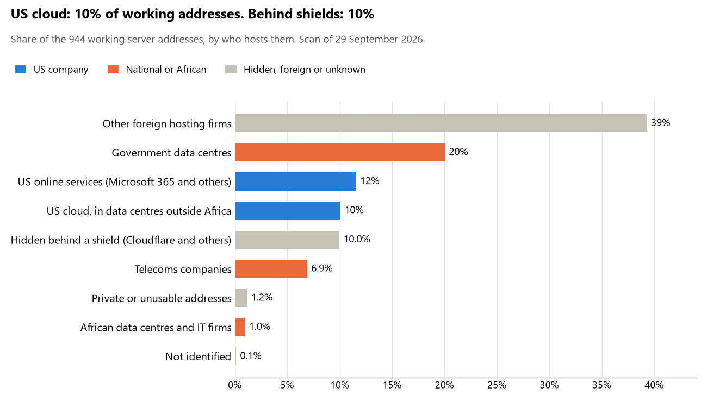

# Benin: who hosts the state's front door

29 September 2026 · Bill Anderson · scan of 29 September 2026

The scan covered 34 state bodies, banks and state-owned companies in Benin. 10% of their working server addresses are on US cloud: Amazon, Microsoft, Google or Oracle. 10% are behind shields such as Cloudflare, which hide the host. 20% are on government data centres or the institutions' own systems.

The scan found 891 web and mail names and 944 working addresses. 12 of the 34 institutions use US cloud for at least part of their estate. 16 use Microsoft for email and 1 use Google.

Of the 54 countries scanned so far, Benin has the 33rd highest US cloud share (median 13%) and the 31st highest share behind shields (median 12%).

## Where it lives

95 addresses are on US cloud. Where they are: 66% in Europe, 16% on worldwide delivery networks (no fixed location), 12% in North America and 6% in a region the providers do not publish.

94 addresses are behind shields: Cloudflare (98%) and Fastly (2%). The host behind a shield cannot be seen, so the US cloud share is a minimum.

## Banks against government

| Share of working addresses | Government (30) | Banks (4) |
| --- | --- | --- |
| On US cloud | 10% | 9% |
| …of which in Africa | 0% | 0% |
| US online services (Microsoft 365 and others) | 11% | 15% |
| Behind a shield | 6% | 47% |
| Government data centres | 22% | 0% |
| Run by the institution itself | 0% | 0% |
| Telecoms companies | 8% | 0% |
| African data centres and IT firms | 1% | 0% |
| Other foreign hosting firms | 41% | 28% |

1 of 4 banks and 11 of 30 government bodies use US cloud somewhere. "Government" includes the central bank, the payment switch, the stock exchange and the state-owned companies.

## Email

16 of the 34 institutions use Microsoft 365 for email and 1 use Google.

- **Microsoft 365:** 16. Présidence de la République du Bénin, Ministère des Affaires étrangères et de la Coopération, Direction générale de la Police républicaine, Ministère de la Justice et de la Législation, Banque internationale pour l'industrie et le commerce (BIIC), Agence nationale d'identification des personnes (ANIP), Commission électorale nationale autonome (CENA), Ministère de la Santé, GIM-UEMOA, Bourse régionale des valeurs mobilières (BRVM), Autorité des marchés financiers de l'UMOA (AMF-UMOA), Caisse nationale de sécurité sociale (CNSS), Société béninoise d'énergie électrique (SBEE), Agence des systèmes d'information et du numérique (ASIN), Gouvernement de la République du Bénin and bjCSIRT.
- **Google (BCEAO):** 1. Banque centrale des États de l'Afrique de l'Ouest.
- **Government data centre (SOCIETE BENINOISE D'INFRASTRUCTURES NUMERIQUES):** 1. Ministère de l'Économie et des Finances.
- **US cloud:** 1. Port autonome de Cotonou.
- **Foreign hosting firms:** 8. Assemblée nationale du Bénin (Infomaniak-AS Infomaniak Network SA), Ministère de la Défense nationale (Hetzner), Direction générale du Trésor et de la Comptabilité publique (IONOS), Institut national de la statistique et de la démographie (INStaD) (Neue Medien Muennich GmbH), Agence nationale du domaine et du foncier (ANDF) (DAInternationalGroup DA International Group Ltd.), Autorité de régulation des marchés publics (ARMP) (Awareness Software Limited), Autorité de régulation des communications électroniques et de la poste (ARCEP) (Infomaniak-AS Infomaniak Network SA) and Cour des comptes (Hosting).
- **Behind a mail filter, provider not visible:** 2. Bank of Africa Bénin and Autorité de protection des données personnelles (APDP).
- **No mail on the domain scanned:** 5. Direction générale des Impôts, Ministère de l'Intérieur et de la Sécurité publique, NSIA Banque Bénin, Coris Bank International Bénin and Agence nationale de la protection sociale (ANPS).

## Institution by institution

Each figure is a share of that institution's working addresses. The rest are with telecoms companies, African data centres, US online services or foreign hosts. Rows follow the order of institution types.

| Institution | Type | On US cloud | …in Africa | Behind a shield | Own or government | Email |
| --- | --- | --- | --- | --- | --- | --- |
| Présidence de la République du Bénin | Presidency | 37% | 0% | 26% | 24% | Microsoft |
| Assemblée nationale du Bénin | Parliament | 0% | 0% | 0% | 8% | Foreign host |
| Ministère des Affaires étrangères et de la Coopération | Foreign Affairs | 0% | 0% | 0% | 80% | Microsoft |
| Ministère de la Défense nationale | Defence | 0% | 0% | 3% | 19% | Foreign host |
| Direction générale de la Police républicaine | Police | 0% | 0% | 55% | 36% | Microsoft |
| Ministère de la Justice et de la Législation | Justice | 0% | 0% | 0% | 100% | Microsoft |
| Ministère de l'Économie et des Finances | Treasury / Finance | 0% | 0% | 0% | 57% | Government |
| Direction générale du Trésor et de la Comptabilité publique | Treasury / Finance | 0% | 0% | 0% | 0% | Foreign host |
| Direction générale des Impôts | Revenue Service | 0% | 0% | 0% | 0% | — |
| Ministère de l'Intérieur et de la Sécurité publique | Interior / Home Affairs | 0% | 0% | 0% | 100% | — |
| Banque centrale des États de l'Afrique de l'Ouest (BCEAO) | Central Bank | 10% | 0% | 0% | 0% | Google |
| Banque internationale pour l'industrie et le commerce (BIIC) | Commercial Banks | 27% | 0% | 0% | 0% | Microsoft |
| Bank of Africa Bénin | Commercial Banks | 0% | 0% | 0% | 0% | Filtered |
| NSIA Banque Bénin | Commercial Banks | 0% | 0% | 100% | 0% | — |
| Coris Bank International Bénin | Commercial Banks | 0% | 0% | 0% | 0% | — |
| Agence nationale d'identification des personnes (ANIP) | Civil registry / National ID authority | 0% | 0% | 5% | 73% | Microsoft |
| Autorité de protection des données personnelles (APDP) | Data protection authority | 9% | 0% | 9% | 0% | Filtered |
| Commission électorale nationale autonome (CENA) | Electoral commission | 0% | 0% | 0% | 86% | Microsoft |
| Institut national de la statistique et de la démographie (INStaD) | Statistics office | 5% | 0% | 0% | 0% | Foreign host |
| Ministère de la Santé | Health ministry / National health insurance | 0% | 0% | 50% | 42% | Microsoft |
| Agence nationale de la protection sociale (ANPS) | Social protection / Social registry | 0% | 0% | 0% | 100% | — |
| Agence nationale du domaine et du foncier (ANDF) | Land registry | 17% | 0% | 0% | 31% | Foreign host |
| GIM-UEMOA | National payment switch | 0% | 0% | 0% | 0% | Microsoft |
| Bourse régionale des valeurs mobilières (BRVM) | Stock exchange | 25% | 0% | 0% | 0% | Microsoft |
| Autorité des marchés financiers de l'UMOA (AMF-UMOA) | Securities regulator | 0% | 0% | 13% | 0% | Microsoft |
| Caisse nationale de sécurité sociale (CNSS) | Sovereign wealth fund / National pension fund | 29% | 0% | 0% | 0% | Microsoft |
| Autorité de régulation des marchés publics (ARMP) | Public procurement authority | 0% | 0% | 0% | 0% | Foreign host |
| Société béninoise d'énergie électrique (SBEE) | Energy utility | 4% | 0% | 0% | 6% | Microsoft |
| Port autonome de Cotonou | Ports authority | 94% | 0% | 0% | 0% | US cloud |
| Agence des systèmes d'information et du numérique (ASIN) | E-government agency | 7% | 0% | 21% | 52% | Microsoft |
| Gouvernement de la République du Bénin | E-government agency | 0% | 0% | 40% | 40% | Microsoft |
| bjCSIRT | Cybersecurity agency / National CERT | 0% | 0% | 0% | 80% | Microsoft |
| Autorité de régulation des communications électroniques et de la poste (ARCEP) | Communications regulator | 10% | 0% | 0% | 0% | Foreign host |
| Cour des comptes | Audit office | 0% | 0% | 0% | 57% | Foreign host |

No institution or working domain was found for 7 of the 36 types: Armed Forces, Customs, Intelligence, Immigration / Passports, State-owned telco / National backbone operator, National data centre / Government cloud operator and Anti-corruption commission.

## What stood out

- **Most on US cloud.** Port autonome de Cotonou (94%) has more than half its working addresses on US cloud.
- **Little US cloud in Africa.** 0% of Benin's US cloud addresses are in the providers' African data centres.
- **Core state bodies at home.** Ministère des Affaires étrangères et de la Coopération (80%) and Ministère de la Justice et de la Législation (100%) keep at least 80% of their working addresses on government data centres or their own systems.
- **Core state bodies on foreign hosting firms.** Présidence de la République du Bénin (OVH), Assemblée nationale du Bénin (Infomaniak-AS Infomaniak Network SA), Ministère de la Défense nationale (Hetzner and DigitalOcean), Ministère de l'Économie et des Finances (PlanetHoster and Hosting), Direction générale du Trésor et de la Comptabilité publique (IONOS and Host Europe (GoDaddy)) and Direction générale des Impôts (PlanetHoster), and 1 more.
- **No Chinese cloud.** The scan found no address on Huawei, Alibaba or Tencent cloud.

## What this can and cannot tell you

The scan sees only the front door: websites, email, login portals, remote-access gateways and online banking. It cannot see where a bank's core ledger, the ID register or the payroll run.

- **Every US figure is a minimum.** Anything behind a shield or a mail filter could also be on US cloud. In Benin that is 10% of working addresses.
- **It counts addresses, not importance.** An institution with many test and marketing sites weighs more than one with few.
- **The list of institutions was drawn up for this scan.** Each domain was checked to exist, not confirmed as the institution's main one.
- **It is a snapshot.** Every figure is as of 29 September 2026.
- **Nothing was touched.** The scan used public address lookups, public certificate records and the cloud companies' published address lists. It never connected to any institution's systems.

The data and method are in `R&D/Hyperscaler-dependence/scan/BEN/` and `R&D/Hyperscaler-dependence/HYPERSCALER-SCAN.md` in the Corpus repository.
