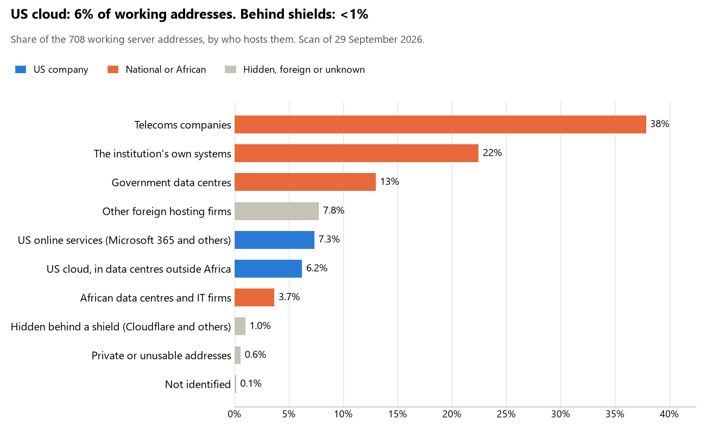

# Burkina Faso: who hosts the state's front door

29 September 2026 · Bill Anderson · scan of 29 September 2026

The scan covered 36 state bodies, banks and state-owned companies in Burkina Faso. 6% of their working server addresses are on US cloud: Amazon, Microsoft, Google or Oracle. <1% are behind shields such as Cloudflare, which hide the host. 35% are on government data centres or the institutions' own systems.

The scan found 607 web and mail names and 708 working addresses. 6 of the 36 institutions use US cloud for at least part of their estate. 6 use Microsoft for email and 1 use Google.

Of the 54 countries scanned so far, Burkina Faso has the 47th highest US cloud share (median 13%) and the 51st highest share behind shields (median 12%).

## Where it lives

44 addresses are on US cloud. Where they are: 77% in Europe, 16% on worldwide delivery networks (no fixed location) and 7% in North America.

7 addresses are behind shields: Imperva (71%) and Cloudflare (29%). The host behind a shield cannot be seen, so the US cloud share is a minimum.

## Banks against government

| Share of working addresses | Government (32) | Banks (4) |
| --- | --- | --- |
| On US cloud | 3% | 40% |
| …of which in Africa | 0% | 0% |
| US online services (Microsoft 365 and others) | 8% | 4% |
| Behind a shield | <1% | 7% |
| Government data centres | 14% | 0% |
| Run by the institution itself | 23% | 19% |
| Telecoms companies | 41% | 4% |
| African data centres and IT firms | 4% | 0% |
| Other foreign hosting firms | 6% | 25% |

2 of 4 banks and 4 of 32 government bodies use US cloud somewhere. "Government" includes the central bank, the payment switch, the stock exchange and the state-owned companies.

## Email

6 of the 36 institutions use Microsoft 365 for email and 1 use Google.

- **Microsoft 365:** 6. Bank of Africa Burkina Faso, GIM-UEMOA, Bourse régionale des valeurs mobilières (BRVM), Autorité des marchés financiers de l'UMOA (AMF-UMOA), Société nationale d'électricité du Burkina and Moov Africa Burkina Faso (ex-Onatel).
- **Google (BCEAO):** 1. Banque centrale des États de l'Afrique de l'Ouest.
- **Government data centre (Agence Nationale de Promotion des TIC):** 9. Ministère de la Guerre et de la Défense patriotique, Police nationale du Burkina Faso, Direction générale des impôts (ancien portail), Ministère de l'Administration territoriale et de la Mobilité, Office national d'identification, Ministère de la Santé et de l'Hygiène publique, Autorité de régulation de la commande publique, Cour des comptes and Autorité supérieure de contrôle d'État et de lutte contre la corruption.
- **Own mail servers:** 7. Ministère des Affaires étrangères et de la Coopération régionale, Ministère de la Justice et des Droits humains, Ministère de l'Économie et des Finances, Société Générale Burkina Faso, Commission de l'informatique et des libertés, Agence nationale de promotion des TIC and Autorité de régulation des communications électroniques et des postes.
- **Telecoms companies:** 4. Direction générale des impôts (portail eSINTAX) (Sancfis Faso SA), Direction générale des douanes (ONATEL), Institut national de la statistique et de la démographie (Internet Puissance Plus Burkina SA) and Caisse nationale de sécurité sociale (ONATEL).
- **Foreign hosting firms:** 4. Assemblée législative du peuple (OVH), Direction générale des impôts (Groupe LWS SARL), United Bank for Africa Burkina (Host Europe) and Caisse autonome de retraite des fonctionnaires (OVH).
- **No mail on the domain scanned:** 5. Présidence du Faso, Coris Bank International, Commission électorale nationale indépendante, Portail du gouvernement du Burkina Faso and Agence nationale de sécurité des systèmes d'information.

## Institution by institution

Each figure is a share of that institution's working addresses. The rest are with telecoms companies, African data centres, US online services or foreign hosts. Rows follow the order of institution types.

| Institution | Type | On US cloud | …in Africa | Behind a shield | Own or government | Email |
| --- | --- | --- | --- | --- | --- | --- |
| Présidence du Faso | Presidency | 0% | 0% | 0% | 0% | — |
| Assemblée législative du peuple | Parliament | 0% | 0% | 0% | 0% | Foreign host |
| Ministère des Affaires étrangères et de la Coopération régionale | Foreign Affairs | 0% | 0% | 0% | 100% | Own servers |
| Ministère de la Guerre et de la Défense patriotique | Defence | 0% | 0% | 0% | 100% | Government |
| Police nationale du Burkina Faso | Police | 0% | 0% | 0% | 100% | Government |
| Ministère de la Justice et des Droits humains | Justice | 0% | 0% | 0% | 38% | Own servers |
| Ministère de l'Économie et des Finances | Treasury / Finance | 0% | 0% | 0% | 100% | Own servers |
| Direction générale des impôts | Revenue Service | 0% | 0% | 0% | 6% | Foreign host |
| Direction générale des impôts (ancien portail) | Revenue Service | 0% | 0% | 0% | 29% | Government |
| Direction générale des impôts (portail eSINTAX) | Revenue Service | 10% | 0% | 0% | 23% | Telecoms |
| Direction générale des douanes | Customs | 0% | 0% | 0% | 0% | Telecoms |
| Ministère de l'Administration territoriale et de la Mobilité | Interior / Home Affairs | 0% | 0% | 0% | 100% | Government |
| Banque centrale des États de l'Afrique de l'Ouest (BCEAO) | Central Bank | 10% | 0% | 0% | 0% | Google |
| Coris Bank International | Commercial Banks | 0% | 0% | 0% | 0% | — |
| Bank of Africa Burkina Faso | Commercial Banks | 60% | 0% | 0% | 0% | Microsoft |
| Société Générale Burkina Faso | Commercial Banks | 0% | 0% | 0% | 100% | Own servers |
| United Bank for Africa Burkina | Commercial Banks | 18% | 0% | 45% | 0% | Foreign host |
| Office national d'identification | Civil registry / National ID authority | 0% | 0% | 0% | 57% | Government |
| Commission de l'informatique et des libertés | Data protection authority | 0% | 0% | 0% | 100% | Own servers |
| Commission électorale nationale indépendante | Electoral commission | no working address | | | | — |
| Institut national de la statistique et de la démographie | Statistics office | 0% | 0% | 0% | 0% | Telecoms |
| Ministère de la Santé et de l'Hygiène publique | Health ministry / National health insurance | <1% | 0% | 0% | 35% | Government |
| Caisse nationale de sécurité sociale | Social protection / Social registry | 0% | 0% | 0% | 0% | Telecoms |
| GIM-UEMOA | National payment switch | 0% | 0% | 0% | 0% | Microsoft |
| Bourse régionale des valeurs mobilières (BRVM) | Stock exchange | 28% | 0% | 0% | 0% | Microsoft |
| Autorité des marchés financiers de l'UMOA (AMF-UMOA) | Securities regulator | 0% | 0% | 13% | 0% | Microsoft |
| Caisse autonome de retraite des fonctionnaires | Sovereign wealth fund / National pension fund | 0% | 0% | 0% | 0% | Foreign host |
| Autorité de régulation de la commande publique | Public procurement authority | 0% | 0% | 0% | 100% | Government |
| Société nationale d'électricité du Burkina | Energy utility | 0% | 0% | 0% | 79% | Microsoft |
| Moov Africa Burkina Faso (ex-Onatel) | State-owned telco / National backbone operator | 0% | 0% | 0% | 0% | Microsoft |
| Agence nationale de promotion des TIC | E-government agency | 0% | 0% | 0% | 100% | Own servers |
| Portail du gouvernement du Burkina Faso | E-government agency | no working address | | | | — |
| Agence nationale de sécurité des systèmes d'information | Cybersecurity agency / National CERT | 0% | 0% | 0% | 100% | — |
| Autorité de régulation des communications électroniques et des postes | Communications regulator | 0% | 0% | 0% | 89% | Own servers |
| Cour des comptes | Audit office | 0% | 0% | 0% | 100% | Government |
| Autorité supérieure de contrôle d'État et de lutte contre la corruption | Anti-corruption commission | 0% | 0% | 0% | 57% | Government |

No institution or working domain was found for 6 of the 36 types: Armed Forces, Intelligence, Immigration / Passports, Land registry, Ports authority and National data centre / Government cloud operator.

## What stood out

- **Most on US cloud.** Bank of Africa Burkina Faso (60%) has more than half its working addresses on US cloud.
- **Little US cloud in Africa.** 0% of Burkina Faso's US cloud addresses are in the providers' African data centres.
- **Core state bodies at home.** Ministère des Affaires étrangères et de la Coopération régionale (100%), Ministère de la Guerre et de la Défense patriotique (100%), Police nationale du Burkina Faso (100%), Ministère de l'Économie et des Finances (100%) and Ministère de l'Administration territoriale et de la Mobilité (100%) keep at least 80% of their working addresses on government data centres or their own systems.
- **Core state bodies on foreign hosting firms.** Présidence du Faso (Infomaniak-AS Infomaniak Network SA), Assemblée législative du peuple (OVH), Direction générale des impôts (Groupe LWS SARL) and Banque centrale des États de l'Afrique de l'Ouest (BCEAO) (NETWORK TRANSIT HOLDINGS LLC and Digiweb ltd).
- **No Chinese cloud.** The scan found no address on Huawei, Alibaba or Tencent cloud.

## What this can and cannot tell you

The scan sees only the front door: websites, email, login portals, remote-access gateways and online banking. It cannot see where a bank's core ledger, the ID register or the payroll run.

- **Every US figure is a minimum.** Anything behind a shield or a mail filter could also be on US cloud. In Burkina Faso that is <1% of working addresses.
- **It counts addresses, not importance.** An institution with many test and marketing sites weighs more than one with few.
- **The list of institutions was drawn up for this scan.** Each domain was checked to exist, not confirmed as the institution's main one.
- **It is a snapshot.** Every figure is as of 29 September 2026.
- **Nothing was touched.** The scan used public address lookups, public certificate records and the cloud companies' published address lists. It never connected to any institution's systems.

The data and method are in `R&D/Hyperscaler-dependence/scan/BFA/` and `R&D/Hyperscaler-dependence/HYPERSCALER-SCAN.md` in the Corpus repository.
