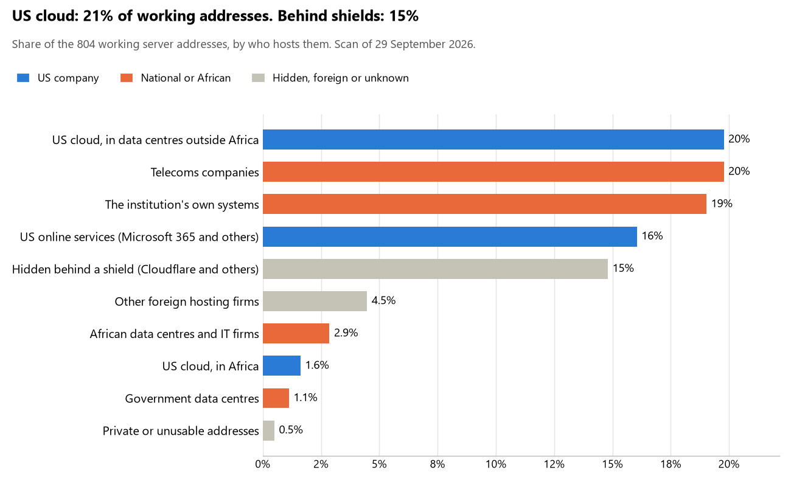

# Botswana: who hosts the state's front door

29 September 2026 · Bill Anderson · scan of 29 September 2026

The scan covered 28 state bodies, banks and state-owned companies in Botswana. 21% of their working server addresses are on US cloud: Amazon, Microsoft, Google or Oracle. 15% are behind shields such as Cloudflare, which hide the host. 20% are on government data centres or the institutions' own systems.

The scan found 599 web and mail names and 804 working addresses. 14 of the 28 institutions use US cloud for at least part of their estate. 13 use Microsoft for email and none use Google.

Of the 54 countries scanned so far, Botswana has the 14th highest US cloud share (median 13%) and the 24th highest share behind shields (median 12%).

## Where it lives

172 addresses are on US cloud. Where they are: 55% in Europe, 27% on worldwide delivery networks (no fixed location), 8% in Africa, 8% in a region the providers do not publish, 2% in North America and 1% in Asia or the Middle East.

119 addresses are behind shields: Cloudflare (55%), Akamai (30%) and Radware (13%). The host behind a shield cannot be seen, so the US cloud share is a minimum.

## Banks against government

| Share of working addresses | Government (20) | Banks (8) |
| --- | --- | --- |
| On US cloud | 19% | 25% |
| …of which in Africa | 3% | 0% |
| US online services (Microsoft 365 and others) | 18% | 13% |
| Behind a shield | 2% | 35% |
| Government data centres | 2% | 0% |
| Run by the institution itself | 24% | 11% |
| Telecoms companies | 28% | 7% |
| African data centres and IT firms | 2% | 4% |
| Other foreign hosting firms | 5% | 4% |

5 of 8 banks and 9 of 20 government bodies use US cloud somewhere. "Government" includes the central bank, the payment switch, the stock exchange and the state-owned companies.

## Email

13 of the 28 institutions use Microsoft 365 for email and none use Google.

- **Microsoft 365:** 13. First National Bank of Botswana, Bank Gaborone, Bank BBS, First Capital Bank Botswana, Botswana Stock Exchange, Non-Bank Financial Institutions Regulatory Authority, Botswana Public Officers Pension Fund, Public Procurement Regulatory Authority (formerly PPADB), Botswana Power Corporation, Botswana Telecommunications Corporation, Botswana Fibre Networks (BoFiNet), BW-CIRT and Botswana Communications Regulatory Authority.
- **Own mail servers:** 1. Government of Botswana portal.
- **Telecoms companies (Botswana Telecommunications Corporation):** 1. Botswana Defence Force.
- **US cloud:** 1. Statistics Botswana.
- **Behind a mail filter, provider not visible:** 1. Botswana Unified Revenue Service.
- **No mail on the domain scanned:** 11. National Assembly of Botswana, Botswana Police Service, Ministry of Justice, Ministry of Finance, Bank of Botswana, Absa Bank Botswana, Stanbic Bank Botswana, Access Bank Botswana, Bank of Baroda Botswana, Independent Electoral Commission and Ministry of Health.

## Institution by institution

Each figure is a share of that institution's working addresses. The rest are with telecoms companies, African data centres, US online services or foreign hosts. Rows follow the order of institution types.

| Institution | Type | On US cloud | …in Africa | Behind a shield | Own or government | Email |
| --- | --- | --- | --- | --- | --- | --- |
| National Assembly of Botswana | Parliament | 0% | 0% | 0% | 100% | — |
| Botswana Defence Force | Armed Forces | 0% | 0% | 0% | 0% | Telecoms |
| Botswana Police Service | Police | 0% | 0% | 0% | 0% | — |
| Ministry of Justice | Justice | 0% | 0% | 0% | 100% | — |
| Ministry of Finance | Treasury / Finance | 0% | 0% | 0% | 100% | — |
| Botswana Unified Revenue Service | Revenue Service | 0% | 0% | 8% | 0% | Filtered |
| Bank of Botswana | Central Bank | 17% | 0% | 17% | 0% | — |
| First National Bank of Botswana | Commercial Banks | 40% | 0% | 2% | 27% | Microsoft |
| Absa Bank Botswana | Commercial Banks | 17% | 0% | 33% | 24% | — |
| Stanbic Bank Botswana | Commercial Banks | 25% | 0% | 68% | 0% | — |
| Bank Gaborone | Commercial Banks | 29% | 0% | 13% | 35% | Microsoft |
| Bank BBS | Commercial Banks | 0% | 0% | 0% | 0% | Microsoft |
| Access Bank Botswana | Commercial Banks | 0% | 0% | 100% | 0% | — |
| First Capital Bank Botswana | Commercial Banks | 52% | 0% | 0% | 0% | Microsoft |
| Bank of Baroda Botswana | Commercial Banks | 0% | 0% | 29% | 0% | — |
| Independent Electoral Commission | Electoral commission | 0% | 0% | 0% | 100% | — |
| Statistics Botswana | Statistics office | 18% | 0% | 0% | 0% | US cloud |
| Ministry of Health | Health ministry / National health insurance | 0% | 0% | 0% | 67% | — |
| Botswana Stock Exchange | Stock exchange | 45% | 0% | 0% | 0% | Microsoft |
| Non-Bank Financial Institutions Regulatory Authority | Securities regulator | 0% | 0% | 0% | 0% | Microsoft |
| Botswana Public Officers Pension Fund | Sovereign wealth fund / National pension fund | 0% | 0% | 0% | 0% | Microsoft |
| Public Procurement Regulatory Authority (formerly PPADB) | Public procurement authority | 14% | 0% | 0% | 0% | Microsoft |
| Botswana Power Corporation | Energy utility | 42% | 19% | 0% | 0% | Microsoft |
| Botswana Telecommunications Corporation | State-owned telco / National backbone operator | 13% | 4% | 0% | 74% | Microsoft |
| Government of Botswana portal | E-government agency | 0% | 0% | 0% | 83% | Own servers |
| Botswana Fibre Networks (BoFiNet) | National data centre / Government cloud operator | 4% | 0% | 11% | 41% | Microsoft |
| BW-CIRT | Cybersecurity agency / National CERT | 35% | 0% | 0% | 0% | Microsoft |
| Botswana Communications Regulatory Authority | Communications regulator | 45% | 0% | 0% | 0% | Microsoft |

No institution or working domain was found for 15 of the 36 types: Presidency, Foreign Affairs, Defence, Customs, Intelligence, Interior / Home Affairs, Civil registry / National ID authority, Data protection authority, Immigration / Passports, Social protection / Social registry, Land registry, National payment switch, Ports authority, Audit office and Anti-corruption commission.

## What stood out

- **Most on US cloud.** First Capital Bank Botswana (52%) has more than half its working addresses on US cloud.
- **Little US cloud in Africa.** 8% of Botswana's US cloud addresses are in the providers' African data centres.
- **Core state bodies at home.** National Assembly of Botswana (100%) keeps at least 80% of its working addresses on government data centres or its own systems.
- **Core state bodies on foreign hosting firms.** Botswana Police Service (IONOS).
- **No Chinese cloud.** The scan found no address on Huawei, Alibaba or Tencent cloud.

## What this can and cannot tell you

The scan sees only the front door: websites, email, login portals, remote-access gateways and online banking. It cannot see where a bank's core ledger, the ID register or the payroll run.

- **Every US figure is a minimum.** Anything behind a shield or a mail filter could also be on US cloud. In Botswana that is 15% of working addresses.
- **It counts addresses, not importance.** An institution with many test and marketing sites weighs more than one with few.
- **The list of institutions was drawn up for this scan.** Each domain was checked to exist, not confirmed as the institution's main one.
- **It is a snapshot.** Every figure is as of 29 September 2026.
- **Nothing was touched.** The scan used public address lookups, public certificate records and the cloud companies' published address lists. It never connected to any institution's systems.

The data and method are in `R&D/Hyperscaler-dependence/scan/BWA/` and `R&D/Hyperscaler-dependence/HYPERSCALER-SCAN.md` in the Corpus repository.
