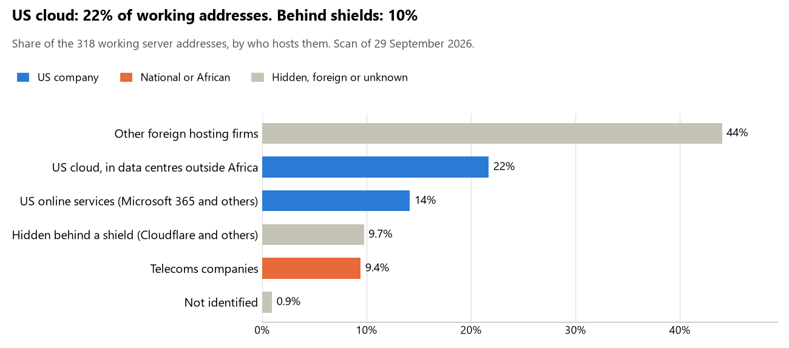

# Central African Republic: who hosts the state's front door

29 September 2026 · Bill Anderson · scan of 29 September 2026

The scan covered 23 state bodies, banks and state-owned companies in Central African Republic. 22% of their working server addresses are on US cloud: Amazon, Microsoft, Google or Oracle. 10% are behind shields such as Cloudflare, which hide the host. 0% are on government data centres or the institutions' own systems.

The scan found 151 web and mail names and 318 working addresses. 5 of the 23 institutions use US cloud for at least part of their estate. 5 use Microsoft for email and 2 use Google.

Of the 54 countries scanned so far, Central African Republic has the 12th highest US cloud share (median 13%) and the 33rd highest share behind shields (median 12%).

## Where it lives

69 addresses are on US cloud. Where they are: 55% in Europe, 25% on worldwide delivery networks (no fixed location) and 20% in a region the providers do not publish.

31 addresses are behind shields: Cloudflare (100%). The host behind a shield cannot be seen, so the US cloud share is a minimum.

## Banks against government

| Share of working addresses | Government (22) | Banks (1) |
| --- | --- | --- |
| On US cloud | 22% | 0% |
| …of which in Africa | 0% | 0% |
| US online services (Microsoft 365 and others) | 14% | 0% |
| Behind a shield | 10% | 0% |
| Government data centres | 0% | 0% |
| Run by the institution itself | 0% | 0% |
| Telecoms companies | 8% | 100% |
| African data centres and IT firms | 0% | 0% |
| Other foreign hosting firms | 45% | 0% |

0 of 1 banks and 5 of 22 government bodies use US cloud somewhere. "Government" includes the central bank, the payment switch, the stock exchange and the state-owned companies.

## Email

5 of the 23 institutions use Microsoft 365 for email and 2 use Google.

- **Microsoft 365:** 5. Ministère des Affaires étrangères et des Centrafricains de l'Étranger, Ministère de la Sécurité publique, Bourse des Valeurs Mobilières de l'Afrique Centrale (BVMAC), Commission de Surveillance du Marché Financier de l'Afrique Centrale (COSUMAF) and Gouvernement de la République centrafricaine.
- **Google:** 2. Institut centrafricain des statistiques et des études économiques et sociales (ICASEES) and Cellule centrafricaine de l'Internet et de la Sécurité (CCIS).
- **Telecoms companies:** 2. Banque des États de l'Afrique Centrale (CAMTEL) and Banque Populaire Maroco-Centrafricaine (BPMC) (Wana Corporate).
- **US cloud (ANE):** 1. Autorité nationale des élections.
- **Foreign hosting firms:** 4. Ministère des Finances et du Budget (OVH), Direction générale des Douanes et Droits indirects (Rackspace Hosting), Ministère de la Santé et de la Population (OVH) and Autorité de régulation des communications électroniques et de la Poste (ARCEP) (Hetzner).
- **No mail on the domain scanned:** 9. Présidence de la République centrafricaine, Assemblée nationale, Ministère de la Défense nationale et de la Reconstruction de l'armée, Ministère de la Défense nationale (portail gouv.cf), Ministère de la Justice et des Droits humains, Ministère de l'Administration du territoire, Groupement Interbancaire Monétique de l'Afrique Centrale (GIMAC), Direction générale des marchés publics (DGMP) and Portail du Gouvernement.

## Institution by institution

Each figure is a share of that institution's working addresses. The rest are with telecoms companies, African data centres, US online services or foreign hosts. Rows follow the order of institution types.

| Institution | Type | On US cloud | …in Africa | Behind a shield | Own or government | Email |
| --- | --- | --- | --- | --- | --- | --- |
| Présidence de la République centrafricaine | Presidency | 100% | 0% | 0% | 0% | — |
| Assemblée nationale | Parliament | 0% | 0% | 91% | 0% | — |
| Ministère des Affaires étrangères et des Centrafricains de l'Étranger | Foreign Affairs | 0% | 0% | 0% | 0% | Microsoft |
| Ministère de la Défense nationale et de la Reconstruction de l'armée | Defence | 0% | 0% | 0% | 0% | — |
| Ministère de la Défense nationale (portail gouv.cf) | Defence | 0% | 0% | 0% | 0% | — |
| Ministère de la Justice et des Droits humains | Justice | 0% | 0% | 0% | 0% | — |
| Ministère des Finances et du Budget | Treasury / Finance | 0% | 0% | 0% | 0% | Foreign host |
| Direction générale des Douanes et Droits indirects | Customs | 0% | 0% | 0% | 0% | Foreign host |
| Ministère de la Sécurité publique | Interior / Home Affairs | 0% | 0% | 0% | 0% | Microsoft |
| Ministère de l'Administration du territoire | Interior / Home Affairs | 0% | 0% | 0% | 0% | — |
| Banque des États de l'Afrique Centrale | Central Bank | 33% | 0% | 0% | 0% | Telecoms |
| Banque Populaire Maroco-Centrafricaine (BPMC) | Commercial Banks | 0% | 0% | 0% | 0% | Telecoms |
| Autorité nationale des élections (ANE) | Electoral commission | 82% | 0% | 18% | 0% | US cloud |
| Institut centrafricain des statistiques et des études économiques et sociales (ICASEES) | Statistics office | 0% | 0% | 11% | 0% | Google |
| Ministère de la Santé et de la Population | Health ministry / National health insurance | 0% | 0% | 0% | 0% | Foreign host |
| Groupement Interbancaire Monétique de l'Afrique Centrale (GIMAC) | National payment switch | 0% | 0% | 0% | 0% | — |
| Bourse des Valeurs Mobilières de l'Afrique Centrale (BVMAC) | Stock exchange | 0% | 0% | 0% | 0% | Microsoft |
| Commission de Surveillance du Marché Financier de l'Afrique Centrale (COSUMAF) | Securities regulator | 41% | 0% | 23% | 0% | Microsoft |
| Direction générale des marchés publics (DGMP) | Public procurement authority | 0% | 0% | 18% | 0% | — |
| Portail du Gouvernement | E-government agency | 0% | 0% | 0% | 0% | — |
| Gouvernement de la République centrafricaine | E-government agency | 0% | 0% | 0% | 0% | Microsoft |
| Cellule centrafricaine de l'Internet et de la Sécurité (CCIS) | Cybersecurity agency / National CERT | 100% | 0% | 0% | 0% | Google |
| Autorité de régulation des communications électroniques et de la Poste (ARCEP) | Communications regulator | 0% | 0% | 0% | 0% | Foreign host |

No institution or working domain was found for 16 of the 36 types: Armed Forces, Police, Revenue Service, Intelligence, Civil registry / National ID authority, Data protection authority, Immigration / Passports, Social protection / Social registry, Land registry, Sovereign wealth fund / National pension fund, Energy utility, Ports authority, State-owned telco / National backbone operator, National data centre / Government cloud operator, Audit office and Anti-corruption commission.

## What stood out

- **Most on US cloud.** Cellule centrafricaine de l'Internet et de la Sécurité (CCIS) (100%) and Autorité nationale des élections (ANE) (82%) have more than half their working addresses on US cloud.
- **Little US cloud in Africa.** 0% of Central African Republic's US cloud addresses are in the providers' African data centres.
- **Core state bodies on foreign hosting firms.** Assemblée nationale (Hostinger), Ministère des Affaires étrangères et des Centrafricains de l'Étranger (Infomaniak-AS Infomaniak Network SA and Scaleway SAS), Ministère de la Défense nationale et de la Reconstruction de l'armée (Scaleway SAS), Ministère de la Défense nationale (portail gouv.cf) (Infomaniak-AS Infomaniak Network SA), Ministère de la Justice et des Droits humains (Infomaniak-AS Infomaniak Network SA) and Ministère des Finances et du Budget (Infomaniak-AS Infomaniak Network SA), and 4 more.
- **No Chinese cloud.** The scan found no address on Huawei, Alibaba or Tencent cloud.

## What this can and cannot tell you

The scan sees only the front door: websites, email, login portals, remote-access gateways and online banking. It cannot see where a bank's core ledger, the ID register or the payroll run.

- **Every US figure is a minimum.** Anything behind a shield or a mail filter could also be on US cloud. In Central African Republic that is 10% of working addresses.
- **It counts addresses, not importance.** An institution with many test and marketing sites weighs more than one with few.
- **The list of institutions was drawn up for this scan.** Each domain was checked to exist, not confirmed as the institution's main one.
- **It is a snapshot.** Every figure is as of 29 September 2026.
- **Nothing was touched.** The scan used public address lookups, public certificate records and the cloud companies' published address lists. It never connected to any institution's systems.

The data and method are in `R&D/Hyperscaler-dependence/scan/CAF/` and `R&D/Hyperscaler-dependence/HYPERSCALER-SCAN.md` in the Corpus repository.
