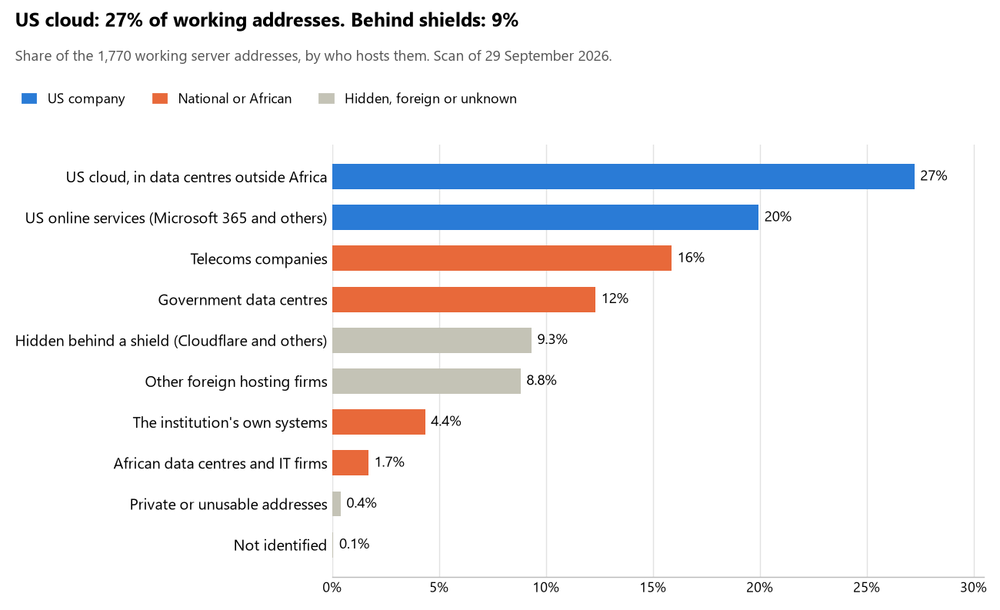

# Cote d'Ivoire: who hosts the state's front door

29 September 2026 · Bill Anderson · scan of 29 September 2026

The scan covered 39 state bodies, banks and state-owned companies in Cote d'Ivoire. 27% of their working server addresses are on US cloud: Amazon, Microsoft, Google or Oracle. 9% are behind shields such as Cloudflare, which hide the host. 17% are on government data centres or the institutions' own systems.

The scan found 1,210 web and mail names and 1,770 working addresses. 25 of the 39 institutions use US cloud for at least part of their estate. 29 use Microsoft for email and 1 use Google.

Of the 54 countries scanned so far, Cote d'Ivoire has the 8th highest US cloud share (median 13%) and the 34th highest share behind shields (median 12%).

## Where it lives

482 addresses are on US cloud. Where they are: 86% in Europe, 11% on worldwide delivery networks (no fixed location), 2% in North America and 1% in a region the providers do not publish.

165 addresses are behind shields: Cloudflare (66%), Imperva (32%) and Sucuri (1%). The host behind a shield cannot be seen, so the US cloud share is a minimum.

## Banks against government

| Share of working addresses | Government (31) | Banks (8) |
| --- | --- | --- |
| On US cloud | 27% | 29% |
| …of which in Africa | 0% | 0% |
| US online services (Microsoft 365 and others) | 18% | 27% |
| Behind a shield | 10% | 4% |
| Government data centres | 15% | 0% |
| Run by the institution itself | 3% | 12% |
| Telecoms companies | 15% | 19% |
| African data centres and IT firms | 2% | 0% |
| Other foreign hosting firms | 9% | 8% |

6 of 8 banks and 19 of 31 government bodies use US cloud somewhere. "Government" includes the central bank, the payment switch, the stock exchange and the state-owned companies.

## Email

29 of the 39 institutions use Microsoft 365 for email and 1 use Google.

- **Microsoft 365:** 29. Assemblée nationale, Sénat, Ministère des Affaires étrangères, Ministère de la Défense, Ministère de la Justice et des Droits de l'Homme, Ministère de l'Économie et des Finances, Direction générale des impôts (DGI), Direction générale des douanes, Ministère de l'Intérieur et de la Sécurité, Banque nationale d'investissement (BNI), Société ivoirienne de banque (SIB), BICICI, Bridge Bank Group Côte d'Ivoire, Bank of Africa Côte d'Ivoire, Office national de l'état civil et de l'identification (ONECI), ARTCI - Autorité de protection des données personnelles, Ministère de la Santé, Agence foncière rurale (AFOR), GIM-UEMOA, Bourse régionale des valeurs mobilières (BRVM), Autorité des marchés financiers de l'UMOA (AMF-UMOA), Caisse nationale de prévoyance sociale (CNPS), Autorité de régulation de la commande publique (ARCOP), Compagnie ivoirienne d'électricité (CIE), CI-ENERGIES, Agence nationale du service universel des télécommunications (ANSUT), Autorité de régulation des télécommunications/TIC (ARTCI), Cour des comptes and Haute autorité pour la bonne gouvernance (HABG).
- **Google (BCEAO):** 1. Banque centrale des États de l'Afrique de l'Ouest.
- **Government data centre (SOCIETE NATIONALE DE DEVELOPPEMENT INFORMATIQUE):** 1. Portail du gouvernement (parent zone).
- **Own mail servers:** 1. Présidence de la République de Côte d'Ivoire.
- **Telecoms companies:** 2. Commission électorale indépendante (CEI) (VEONE) and Institut national de la statistique (INS) (Afrique Technologies & Services).
- **US cloud:** 1. NSIA Banque Côte d'Ivoire.
- **Foreign hosting firms (OVH):** 2. Police nationale and Port autonome d'Abidjan.
- **No mail on the domain scanned:** 2. Société Générale Côte d'Ivoire and Coris Bank International Côte d'Ivoire.

## Institution by institution

Each figure is a share of that institution's working addresses. The rest are with telecoms companies, African data centres, US online services or foreign hosts. Rows follow the order of institution types.

| Institution | Type | On US cloud | …in Africa | Behind a shield | Own or government | Email |
| --- | --- | --- | --- | --- | --- | --- |
| Présidence de la République de Côte d'Ivoire | Presidency | 0% | 0% | 0% | 82% | Own servers |
| Assemblée nationale | Parliament | 34% | 0% | 0% | 5% | Microsoft |
| Sénat | Parliament | 0% | 0% | 0% | 0% | Microsoft |
| Ministère des Affaires étrangères | Foreign Affairs | 12% | 0% | 2% | 66% | Microsoft |
| Ministère de la Défense | Defence | 32% | 0% | 0% | 20% | Microsoft |
| Police nationale | Police | 0% | 0% | 0% | 0% | Foreign host |
| Ministère de la Justice et des Droits de l'Homme | Justice | 35% | 0% | 0% | 15% | Microsoft |
| Ministère de l'Économie et des Finances | Treasury / Finance | 24% | 0% | 0% | 41% | Microsoft |
| Direction générale des impôts (DGI) | Revenue Service | 33% | 0% | 0% | 8% | Microsoft |
| Direction générale des douanes | Customs | 67% | 0% | 0% | 0% | Microsoft |
| Ministère de l'Intérieur et de la Sécurité | Interior / Home Affairs | 37% | 0% | 0% | 37% | Microsoft |
| Banque centrale des États de l'Afrique de l'Ouest (BCEAO) | Central Bank | 10% | 0% | 0% | 0% | Google |
| Société Générale Côte d'Ivoire | Commercial Banks | 5% | 0% | 26% | 45% | — |
| Banque nationale d'investissement (BNI) | Commercial Banks | 20% | 0% | 0% | 0% | Microsoft |
| NSIA Banque Côte d'Ivoire | Commercial Banks | 32% | 0% | 0% | 9% | US cloud |
| Société ivoirienne de banque (SIB) | Commercial Banks | 0% | 0% | 0% | 0% | Microsoft |
| BICICI | Commercial Banks | 29% | 0% | 0% | 0% | Microsoft |
| Bridge Bank Group Côte d'Ivoire | Commercial Banks | 46% | 0% | 4% | 18% | Microsoft |
| Coris Bank International Côte d'Ivoire | Commercial Banks | 0% | 0% | 0% | 0% | — |
| Bank of Africa Côte d'Ivoire | Commercial Banks | 66% | 0% | 0% | 5% | Microsoft |
| Office national de l'état civil et de l'identification (ONECI) | Civil registry / National ID authority | 15% | 0% | 72% | 0% | Microsoft |
| ARTCI - Autorité de protection des données personnelles | Data protection authority | 0% | 0% | 0% | 20% | Microsoft |
| Commission électorale indépendante (CEI) | Electoral commission | 27% | 0% | 0% | 0% | Telecoms |
| Institut national de la statistique (INS) | Statistics office | 0% | 0% | 0% | 0% | Telecoms |
| Ministère de la Santé | Health ministry / National health insurance | 24% | 0% | 0% | 41% | Microsoft |
| Agence foncière rurale (AFOR) | Land registry | 12% | 0% | 12% | 0% | Microsoft |
| GIM-UEMOA | National payment switch | 0% | 0% | 0% | 0% | Microsoft |
| Bourse régionale des valeurs mobilières (BRVM) | Stock exchange | 32% | 0% | 0% | 0% | Microsoft |
| Autorité des marchés financiers de l'UMOA (AMF-UMOA) | Securities regulator | 0% | 0% | 17% | 0% | Microsoft |
| Caisse nationale de prévoyance sociale (CNPS) | Sovereign wealth fund / National pension fund | 14% | 0% | 25% | 0% | Microsoft |
| Autorité de régulation de la commande publique (ARCOP) | Public procurement authority | 0% | 0% | 0% | 0% | Microsoft |
| Compagnie ivoirienne d'électricité (CIE) | Energy utility | 45% | 0% | 0% | 0% | Microsoft |
| CI-ENERGIES | Energy utility | 24% | 0% | 0% | 0% | Microsoft |
| Port autonome d'Abidjan | Ports authority | 0% | 0% | 0% | 0% | Foreign host |
| Agence nationale du service universel des télécommunications (ANSUT) | State-owned telco / National backbone operator | 66% | 0% | 20% | 0% | Microsoft |
| Portail du gouvernement (parent zone) | E-government agency | 0% | 0% | 0% | 86% | Government |
| Autorité de régulation des télécommunications/TIC (ARTCI) | Communications regulator | 44% | 0% | 4% | 26% | Microsoft |
| Cour des comptes | Audit office | 0% | 0% | 0% | 31% | Microsoft |
| Haute autorité pour la bonne gouvernance (HABG) | Anti-corruption commission | 0% | 0% | 5% | 29% | Microsoft |

No institution or working domain was found for 6 of the 36 types: Armed Forces, Intelligence, Immigration / Passports, Social protection / Social registry, National data centre / Government cloud operator and Cybersecurity agency / National CERT.

## What stood out

- **Most on US cloud.** Direction générale des douanes (67%), Bank of Africa Côte d'Ivoire (66%) and Agence nationale du service universel des télécommunications (ANSUT) (66%) have more than half their working addresses on US cloud.
- **Little US cloud in Africa.** 0% of Cote d'Ivoire's US cloud addresses are in the providers' African data centres.
- **Core state bodies at home.** Présidence de la République de Côte d'Ivoire (82%) keeps at least 80% of its working addresses on government data centres or its own systems.
- **Core state bodies on foreign hosting firms.** Présidence de la République de Côte d'Ivoire (OVH and GANDI-AS-2 GANDI SAS), Sénat (Contabo), Police nationale (OVH), Ministère de l'Économie et des Finances (OVH), Direction générale des impôts (DGI) (DataPipe, Inc.) and Direction générale des douanes (DigitalOcean and OVH), and 1 more.
- **No Chinese cloud.** The scan found no address on Huawei, Alibaba or Tencent cloud.

## What this can and cannot tell you

The scan sees only the front door: websites, email, login portals, remote-access gateways and online banking. It cannot see where a bank's core ledger, the ID register or the payroll run.

- **Every US figure is a minimum.** Anything behind a shield or a mail filter could also be on US cloud. In Cote d'Ivoire that is 9% of working addresses.
- **It counts addresses, not importance.** An institution with many test and marketing sites weighs more than one with few.
- **The list of institutions was drawn up for this scan.** Each domain was checked to exist, not confirmed as the institution's main one.
- **It is a snapshot.** Every figure is as of 29 September 2026.
- **Nothing was touched.** The scan used public address lookups, public certificate records and the cloud companies' published address lists. It never connected to any institution's systems.

The data and method are in `R&D/Hyperscaler-dependence/scan/CIV/` and `R&D/Hyperscaler-dependence/HYPERSCALER-SCAN.md` in the Corpus repository.
