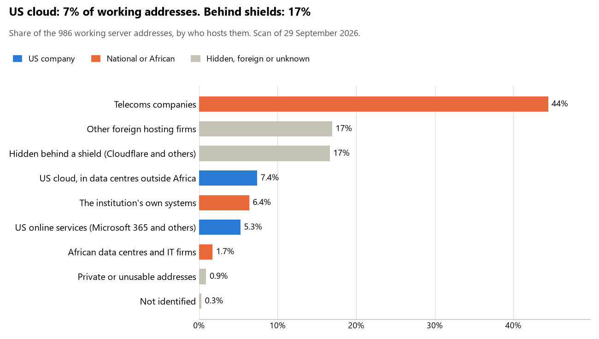

# Cameroon: who hosts the state's front door

29 September 2026 · Bill Anderson · scan of 29 September 2026

The scan covered 39 state bodies, banks and state-owned companies in Cameroon. 7% of their working server addresses are on US cloud: Amazon, Microsoft, Google or Oracle. 17% are behind shields such as Cloudflare, which hide the host. 6% are on government data centres or the institutions' own systems.

The scan found 760 web and mail names and 986 working addresses. 6 of the 39 institutions use US cloud for at least part of their estate. 5 use Microsoft for email and 2 use Google.

Of the 54 countries scanned so far, Cameroon has the 46th highest US cloud share (median 13%) and the 19th highest share behind shields (median 12%).

## Where it lives

73 addresses are on US cloud. Where they are: 86% in Europe, 8% on worldwide delivery networks (no fixed location) and 5% in a region the providers do not publish.

164 addresses are behind shields: Cloudflare (96%) and Imperva (4%). The host behind a shield cannot be seen, so the US cloud share is a minimum.

## Banks against government

| Share of working addresses | Government (32) | Banks (7) |
| --- | --- | --- |
| On US cloud | 8% | 6% |
| …of which in Africa | 0% | 0% |
| US online services (Microsoft 365 and others) | 6% | 4% |
| Behind a shield | 2% | 48% |
| Government data centres | 0% | 0% |
| Run by the institution itself | 8% | 4% |
| Telecoms companies | 56% | 19% |
| African data centres and IT firms | 0% | 6% |
| Other foreign hosting firms | 19% | 13% |

3 of 7 banks and 3 of 32 government bodies use US cloud somewhere. "Government" includes the central bank, the payment switch, the stock exchange and the state-owned companies.

## Email

5 of the 39 institutions use Microsoft 365 for email and 2 use Google.

- **Microsoft 365:** 5. Afriland First Bank, AFG Bank Cameroun (formerly Banque Atlantique Cameroun), Bourse des valeurs mobilières de l'Afrique centrale, COSUMAF and Eneo Cameroun.
- **Google:** 2. Ministère de la Défense and Caisse nationale de prévoyance sociale.
- **Own mail servers:** 3. Société Générale Cameroun, Cameroon Telecommunications and Agence nationale des technologies de l'information et de la communication.
- **Telecoms companies:** 18. Présidence de la République (CAMTEL), Sénat (CAMTEL), Délégation générale à la Sûreté nationale (CAMTEL), Ministère des Finances (CAMTEL), Direction générale du Trésor et de la Coopération financière et monétaire (CAMTEL), Direction générale des impôts (CAMTEL), Ministère de l'Administration territoriale (CAMTEL), Banque des États de l'Afrique centrale (CAMTEL), BICEC (Network Solutions), Bureau national de l'état civil (CAMTEL), Elections Cameroon (CAMTEL), Institut national de la statistique (CAMTEL), Ministère de la Santé publique (CAMTEL), COLEPS e-procurement (CAMTEL), COLEPS e-procurement (alternate) (CAMTEL), Port autonome de Douala (CAMTEL), Agence de régulation des télécommunications (Network Solutions) and Commission nationale anti-corruption (CAMTEL).
- **Foreign hosting firms:** 6. Assemblée nationale (Gandi), Ministère des Relations extérieures (OVH), Ministère de la Justice (LiquidNet US LLC), Société Commerciale de Banque Cameroun (LiquidNet US LLC), Commercial Bank Cameroun (Contabo) and Agence de régulation des marchés publics (Hetzner).
- **No mail on the domain scanned:** 5. Direction générale des douanes, CCA Bank, Ministère des Domaines du Cadastre et des Affaires foncières, GIMAC and Government of Cameroon.

## Institution by institution

Each figure is a share of that institution's working addresses. The rest are with telecoms companies, African data centres, US online services or foreign hosts. Rows follow the order of institution types.

| Institution | Type | On US cloud | …in Africa | Behind a shield | Own or government | Email |
| --- | --- | --- | --- | --- | --- | --- |
| Présidence de la République | Presidency | 0% | 0% | 0% | 0% | Telecoms |
| Assemblée nationale | Parliament | 0% | 0% | 0% | 0% | Foreign host |
| Sénat | Parliament | 0% | 0% | 0% | 0% | Telecoms |
| Ministère des Relations extérieures | Foreign Affairs | 0% | 0% | 0% | 0% | Foreign host |
| Ministère de la Défense | Defence | 0% | 0% | 0% | 0% | Google |
| Délégation générale à la Sûreté nationale | Police | 0% | 0% | 0% | 0% | Telecoms |
| Ministère de la Justice | Justice | 0% | 0% | 0% | 0% | Foreign host |
| Ministère des Finances | Treasury / Finance | 0% | 0% | 0% | 0% | Telecoms |
| Direction générale du Trésor et de la Coopération financière et monétaire | Treasury / Finance | 0% | 0% | 0% | 0% | Telecoms |
| Direction générale des impôts | Revenue Service | 0% | 0% | 0% | 0% | Telecoms |
| Direction générale des douanes | Customs | 0% | 0% | 0% | 0% | — |
| Ministère de l'Administration territoriale | Interior / Home Affairs | 0% | 0% | 0% | 0% | Telecoms |
| Banque des États de l'Afrique centrale | Central Bank | 35% | 0% | 0% | 0% | Telecoms |
| Afriland First Bank | Commercial Banks | 2% | 0% | 70% | 0% | Microsoft |
| Société Générale Cameroun | Commercial Banks | 0% | 0% | 33% | 52% | Own servers |
| AFG Bank Cameroun (formerly Banque Atlantique Cameroun) | Commercial Banks | 28% | 0% | 0% | 0% | Microsoft |
| Société Commerciale de Banque Cameroun | Commercial Banks | 0% | 0% | 93% | 0% | Foreign host |
| CCA Bank | Commercial Banks | 75% | 0% | 0% | 0% | — |
| BICEC | Commercial Banks | 0% | 0% | 0% | 0% | Telecoms |
| Commercial Bank Cameroun | Commercial Banks | 0% | 0% | 0% | 0% | Foreign host |
| Bureau national de l'état civil | Civil registry / National ID authority | 0% | 0% | 0% | 0% | Telecoms |
| Elections Cameroon | Electoral commission | 0% | 0% | 0% | 0% | Telecoms |
| Institut national de la statistique | Statistics office | 0% | 0% | 0% | 0% | Telecoms |
| Ministère de la Santé publique | Health ministry / National health insurance | 0% | 0% | 0% | 0% | Telecoms |
| Ministère des Domaines du Cadastre et des Affaires foncières | Land registry | 0% | 0% | 0% | 0% | — |
| GIMAC | National payment switch | 0% | 0% | 0% | 0% | — |
| Bourse des valeurs mobilières de l'Afrique centrale | Stock exchange | 0% | 0% | 0% | 0% | Microsoft |
| COSUMAF | Securities regulator | 44% | 0% | 25% | 0% | Microsoft |
| Caisse nationale de prévoyance sociale | Sovereign wealth fund / National pension fund | 0% | 0% | 0% | 0% | Google |
| Agence de régulation des marchés publics | Public procurement authority | 0% | 0% | 0% | 0% | Foreign host |
| COLEPS e-procurement | Public procurement authority | 0% | 0% | 0% | 0% | Telecoms |
| COLEPS e-procurement (alternate) | Public procurement authority | 0% | 0% | 0% | 0% | Telecoms |
| Eneo Cameroun | Energy utility | 24% | 0% | 2% | 0% | Microsoft |
| Port autonome de Douala | Ports authority | 0% | 0% | 0% | 0% | Telecoms |
| Cameroon Telecommunications | State-owned telco / National backbone operator | 0% | 0% | 0% | 91% | Own servers |
| Agence nationale des technologies de l'information et de la communication | E-government agency | 0% | 0% | 0% | 71% | Own servers |
| Government of Cameroon | E-government agency | 0% | 0% | 0% | 0% | — |
| Agence de régulation des télécommunications | Communications regulator | 0% | 0% | 0% | 0% | Telecoms |
| Commission nationale anti-corruption | Anti-corruption commission | 0% | 0% | 0% | 0% | Telecoms |

No institution or working domain was found for 8 of the 36 types: Armed Forces, Intelligence, Data protection authority, Immigration / Passports, Social protection / Social registry, National data centre / Government cloud operator, Cybersecurity agency / National CERT and Audit office.

## What stood out

- **Most on US cloud.** CCA Bank (75%) has more than half its working addresses on US cloud.
- **Little US cloud in Africa.** 0% of Cameroon's US cloud addresses are in the providers' African data centres.
- **Core state bodies on foreign hosting firms.** Assemblée nationale (Gandi and GANDI-AS-2 GANDI SAS), Ministère des Relations extérieures (OVH), Ministère de la Justice (LiquidNet US LLC) and Direction générale du Trésor et de la Coopération financière et monétaire (Hostinger).
- **No Chinese cloud.** The scan found no address on Huawei, Alibaba or Tencent cloud.

## What this can and cannot tell you

The scan sees only the front door: websites, email, login portals, remote-access gateways and online banking. It cannot see where a bank's core ledger, the ID register or the payroll run.

- **Every US figure is a minimum.** Anything behind a shield or a mail filter could also be on US cloud. In Cameroon that is 17% of working addresses.
- **It counts addresses, not importance.** An institution with many test and marketing sites weighs more than one with few.
- **The list of institutions was drawn up for this scan.** Each domain was checked to exist, not confirmed as the institution's main one.
- **It is a snapshot.** Every figure is as of 29 September 2026.
- **Nothing was touched.** The scan used public address lookups, public certificate records and the cloud companies' published address lists. It never connected to any institution's systems.

The data and method are in `R&D/Hyperscaler-dependence/scan/CMR/` and `R&D/Hyperscaler-dependence/HYPERSCALER-SCAN.md` in the Corpus repository.
