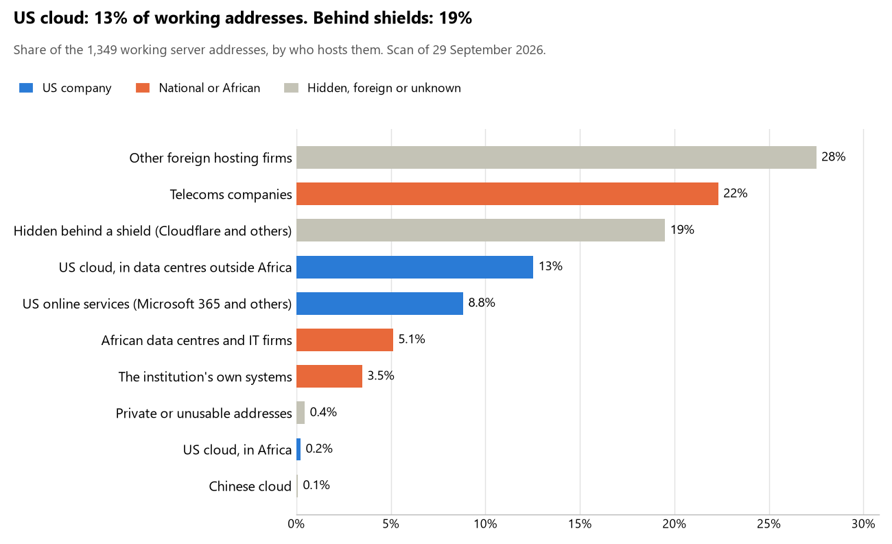

# DR Congo: who hosts the state's front door

29 September 2026 · Bill Anderson · scan of 29 September 2026

The scan covered 45 state bodies, banks and state-owned companies in DR Congo. 13% of their working server addresses are on US cloud: Amazon, Microsoft, Google or Oracle. 19% are behind shields such as Cloudflare, which hide the host. 3% are on government data centres or the institutions' own systems.

The scan found 1,059 web and mail names and 1,349 working addresses. 20 of the 45 institutions use US cloud for at least part of their estate. 10 use Microsoft for email and 4 use Google.

Of the 54 countries scanned so far, DR Congo has the 28th highest US cloud share (median 13%) and the 16th highest share behind shields (median 12%).

## Where it lives

172 addresses are on US cloud. Where they are: 45% on worldwide delivery networks (no fixed location), 36% in Europe, 11% in a region the providers do not publish, 6% in North America and 2% in Africa.

263 addresses are behind shields: Cloudflare (99%), Imperva (<1%) and F5 (<1%). The host behind a shield cannot be seen, so the US cloud share is a minimum.

## Banks against government

| Share of working addresses | Government (36) | Banks (9) |
| --- | --- | --- |
| On US cloud | 6% | 24% |
| …of which in Africa | <1% | <1% |
| US online services (Microsoft 365 and others) | 7% | 13% |
| Behind a shield | 3% | 49% |
| Government data centres | 0% | 0% |
| Run by the institution itself | 4% | 2% |
| Telecoms companies | 32% | 4% |
| African data centres and IT firms | 7% | 2% |
| Other foreign hosting firms | 40% | 5% |

7 of 9 banks and 13 of 36 government bodies use US cloud somewhere. "Government" includes the central bank, the payment switch, the stock exchange and the state-owned companies.

## Email

10 of the 45 institutions use Microsoft 365 for email and 4 use Google.

- **Microsoft 365:** 10. Ministère du Budget, Banque Centrale du Congo, Rawbank, Equity Banque Commerciale du Congo (EquityBCDC), Standard Bank Congo, FirstBank DRC, Bank of Africa RDC, Solidaire Banque, Fonds de solidarité de santé (FSS) and Ministère des Affaires foncières.
- **Google:** 4. Sofibanque, Direction générale de migration, Caisse nationale de sécurité sociale des agents publics de l'État (CNSSAP) and Cour des comptes.
- **Telecoms companies:** 8. Présidence de la République Démocratique du Congo (United SA), Administration des Finances (Secrétariat général aux Finances) (United SA), Commission électorale nationale indépendante (CENI) (Societe Congolaise des Postes et Telecommunications), Caisse nationale de sécurité sociale (CNSS) (Societe Congolaise des Postes et Telecommunications), Société nationale d'électricité (SNEL) (United SA), Société congolaise des postes et télécommunications (SCPT) (United SA), Agence pour le développement du numérique (ADN) (United SA) and Autorité de régulation de la poste et des télécommunications (ARPTC) (Global Broadband Solution Inc).
- **African hosts (Xneelo):** 1. Ministère de la Santé publique, Hygiène et Prévoyance sociale.
- **US cloud (ONIP):** 1. Office national d'identification de la population.
- **Foreign hosting firms:** 14. Sénat (Infomaniak-AS Infomaniak Network SA), Ministère des Affaires étrangères, Coopération internationale, Francophonie et Diaspora congolaise (OVH), Ministère de la Défense nationale et Anciens Combattants (OVH), Police nationale congolaise (OVH), Ministère de la Justice (OVH), Cour constitutionnelle (Groupe LWS SARL), Cour de cassation (Hostinger), Conseil supérieur de la magistrature (Sharktech), Direction générale des recettes administratives, judiciaires, domaniales et de participations (DGRAD) (Hetzner), Direction générale des douanes et accises (Zoho), Trust Merchant Bank (TMB) (ZSAH zsah Limited), Institut national de la statistique (Contabo), Autorité de régulation des marchés publics (ARMP) (Groupe LWS SARL) and Inspection générale des finances (LiquidNet US LLC).
- **Behind a mail filter, provider not visible:** 3. Assemblée nationale, Direction générale des impôts and Société commerciale des transports et des ports (SCTP).
- **Not identified:** 1. Ministère de l'Intérieur, Sécurité, Décentralisation et Affaires coutumières.
- **No mail on the domain scanned:** 3. Access Bank RDC, Système intégré de gestion des marchés publics and Portail gouvernemental (zone parente des ministères).

## Institution by institution

Each figure is a share of that institution's working addresses. The rest are with telecoms companies, African data centres, US online services or foreign hosts. Rows follow the order of institution types.

| Institution | Type | On US cloud | …in Africa | Behind a shield | Own or government | Email |
| --- | --- | --- | --- | --- | --- | --- |
| Présidence de la République Démocratique du Congo | Presidency | 0% | 0% | 0% | 0% | Telecoms |
| Assemblée nationale | Parliament | 40% | 0% | 27% | 0% | Filtered |
| Sénat | Parliament | 0% | 0% | 0% | 0% | Foreign host |
| Ministère des Affaires étrangères, Coopération internationale, Francophonie et Diaspora congolaise | Foreign Affairs | 0% | 0% | 0% | 0% | Foreign host |
| Ministère de la Défense nationale et Anciens Combattants | Defence | 0% | 0% | 0% | 0% | Foreign host |
| Police nationale congolaise | Police | 0% | 0% | 0% | 0% | Foreign host |
| Ministère de la Justice | Justice | 0% | 0% | 0% | 0% | Foreign host |
| Cour constitutionnelle | Justice | 0% | 0% | 0% | 0% | Foreign host |
| Cour de cassation | Justice | 0% | 0% | 0% | 0% | Foreign host |
| Conseil supérieur de la magistrature | Justice | 0% | 0% | 0% | 0% | Foreign host |
| Administration des Finances (Secrétariat général aux Finances) | Treasury / Finance | 0% | 0% | 0% | 0% | Telecoms |
| Ministère du Budget | Treasury / Finance | 0% | 0% | 0% | 0% | Microsoft |
| Direction générale des impôts | Revenue Service | 27% | 0% | 27% | 0% | Filtered |
| Direction générale des recettes administratives, judiciaires, domaniales et de participations (DGRAD) | Revenue Service | 0% | 0% | 0% | 0% | Foreign host |
| Direction générale des douanes et accises | Customs | 11% | 0% | 0% | 2% | Foreign host |
| Ministère de l'Intérieur, Sécurité, Décentralisation et Affaires coutumières | Interior / Home Affairs | 0% | 0% | 0% | 0% | Not identified |
| Banque Centrale du Congo | Central Bank | 15% | 0% | 24% | 54% | Microsoft |
| Rawbank | Commercial Banks | 3% | 0% | 94% | 0% | Microsoft |
| Equity Banque Commerciale du Congo (EquityBCDC) | Commercial Banks | 27% | 0% | 0% | 7% | Microsoft |
| Trust Merchant Bank (TMB) | Commercial Banks | 15% | <1% | 82% | 0% | Foreign host |
| Standard Bank Congo | Commercial Banks | 50% | 0% | 29% | 17% | Microsoft |
| FirstBank DRC | Commercial Banks | 89% | 0% | 2% | 0% | Microsoft |
| Sofibanque | Commercial Banks | 0% | 0% | 63% | 0% | Google |
| Bank of Africa RDC | Commercial Banks | 26% | 0% | 0% | 0% | Microsoft |
| Access Bank RDC | Commercial Banks | 0% | 0% | 100% | 0% | — |
| Solidaire Banque | Commercial Banks | 24% | 0% | 0% | 0% | Microsoft |
| Office national d'identification de la population (ONIP) | Civil registry / National ID authority | 21% | 0% | 0% | 0% | US cloud |
| Commission électorale nationale indépendante (CENI) | Electoral commission | 0% | 0% | 0% | 0% | Telecoms |
| Institut national de la statistique | Statistics office | 0% | 0% | 0% | 0% | Foreign host |
| Direction générale de migration | Immigration / Passports | 21% | 0% | 21% | 0% | Google |
| Ministère de la Santé publique, Hygiène et Prévoyance sociale | Health ministry / National health insurance | 0% | 0% | 0% | 0% | African host |
| Fonds de solidarité de santé (FSS) | Health ministry / National health insurance | 0% | 0% | 0% | 0% | Microsoft |
| Caisse nationale de sécurité sociale des agents publics de l'État (CNSSAP) | Social protection / Social registry | 20% | 0% | 0% | 0% | Google |
| Ministère des Affaires foncières | Land registry | 0% | 0% | 0% | 0% | Microsoft |
| Caisse nationale de sécurité sociale (CNSS) | Sovereign wealth fund / National pension fund | 9% | 0% | 0% | 0% | Telecoms |
| Autorité de régulation des marchés publics (ARMP) | Public procurement authority | 0% | 0% | 0% | 0% | Foreign host |
| Système intégré de gestion des marchés publics | Public procurement authority | 0% | 0% | 0% | 0% | — |
| Société nationale d'électricité (SNEL) | Energy utility | 28% | 6% | 0% | 0% | Telecoms |
| Société commerciale des transports et des ports (SCTP) | Ports authority | 31% | 0% | 31% | 0% | Filtered |
| Société congolaise des postes et télécommunications (SCPT) | State-owned telco / National backbone operator | 0% | 0% | 0% | 12% | Telecoms |
| Agence pour le développement du numérique (ADN) | E-government agency | 0% | 0% | 0% | 0% | Telecoms |
| Portail gouvernemental (zone parente des ministères) | E-government agency | no working address | | | | — |
| Autorité de régulation de la poste et des télécommunications (ARPTC) | Communications regulator | 8% | 8% | 0% | 0% | Telecoms |
| Cour des comptes | Audit office | 11% | 0% | 0% | 0% | Google |
| Inspection générale des finances | Audit office | 67% | 0% | 0% | 0% | Foreign host |

No institution or working domain was found for 9 of the 36 types: Armed Forces, Intelligence, Data protection authority, National payment switch, Stock exchange, Securities regulator, National data centre / Government cloud operator, Cybersecurity agency / National CERT and Anti-corruption commission.

## What stood out

- **Most on US cloud.** FirstBank DRC (89%), Inspection générale des finances (67%) and Standard Bank Congo (50%) have more than half their working addresses on US cloud.
- **Little US cloud in Africa.** 2% of DR Congo's US cloud addresses are in the providers' African data centres.
- **Core state bodies on foreign hosting firms.** Présidence de la République Démocratique du Congo (PlanetHoster), Assemblée nationale (Hostinger), Sénat (Infomaniak-AS Infomaniak Network SA), Ministère des Affaires étrangères, Coopération internationale, Francophonie et Diaspora congolaise (OVH), Ministère de la Défense nationale et Anciens Combattants (OVH) and Police nationale congolaise (OVH), and 9 more.
- **Chinese cloud.** 1 address, all at Solidaire Banque, is on Chinese cloud.

## What this can and cannot tell you

The scan sees only the front door: websites, email, login portals, remote-access gateways and online banking. It cannot see where a bank's core ledger, the ID register or the payroll run.

- **Every US figure is a minimum.** Anything behind a shield or a mail filter could also be on US cloud. In DR Congo that is 19% of working addresses.
- **It counts addresses, not importance.** An institution with many test and marketing sites weighs more than one with few.
- **The list of institutions was drawn up for this scan.** Each domain was checked to exist, not confirmed as the institution's main one.
- **It is a snapshot.** Every figure is as of 29 September 2026.
- **Nothing was touched.** The scan used public address lookups, public certificate records and the cloud companies' published address lists. It never connected to any institution's systems.

The data and method are in `R&D/Hyperscaler-dependence/scan/COD/` and `R&D/Hyperscaler-dependence/HYPERSCALER-SCAN.md` in the Corpus repository.
