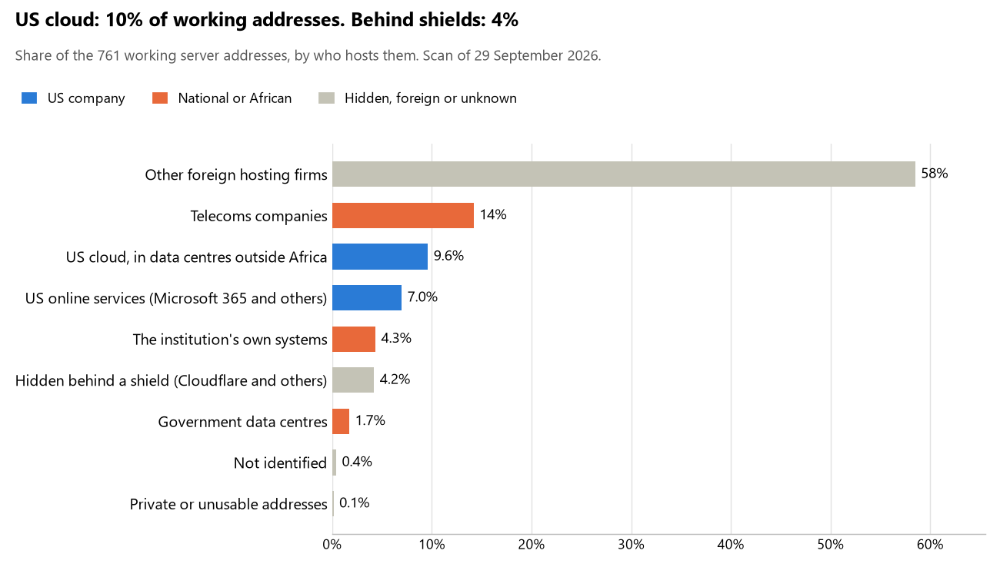

# Congo: who hosts the state's front door

29 September 2026 · Bill Anderson · scan of 29 September 2026

The scan covered 30 state bodies, banks and state-owned companies in Congo. 10% of their working server addresses are on US cloud: Amazon, Microsoft, Google or Oracle. 4% are behind shields such as Cloudflare, which hide the host. 6% are on government data centres or the institutions' own systems.

The scan found 552 web and mail names and 761 working addresses. 7 of the 30 institutions use US cloud for at least part of their estate. 5 use Microsoft for email and 2 use Google.

Of the 54 countries scanned so far, Congo has the 37th highest US cloud share (median 13%) and the 43rd highest share behind shields (median 12%).

## Where it lives

73 addresses are on US cloud. Where they are: 90% in Europe, 7% on worldwide delivery networks (no fixed location) and 3% in North America.

32 addresses are behind shields: Cloudflare (84%) and Imperva (16%). The host behind a shield cannot be seen, so the US cloud share is a minimum.

## Banks against government

| Share of working addresses | Government (25) | Banks (5) |
| --- | --- | --- |
| On US cloud | 7% | 27% |
| …of which in Africa | 0% | 0% |
| US online services (Microsoft 365 and others) | 6% | 14% |
| Behind a shield | 2% | 17% |
| Government data centres | 2% | 0% |
| Run by the institution itself | 5% | 0% |
| Telecoms companies | 12% | 33% |
| African data centres and IT firms | 0% | 0% |
| Other foreign hosting firms | 65% | 9% |

1 of 5 banks and 6 of 25 government bodies use US cloud somewhere. "Government" includes the central bank, the payment switch, the stock exchange and the state-owned companies.

## Email

5 of the 30 institutions use Microsoft 365 for email and 2 use Google.

- **Microsoft 365:** 5. Direction générale des impôts et des domaines, Crédit du Congo, Bourse des valeurs mobilières de l'Afrique centrale, Commission de surveillance du marché financier de l'Afrique centrale and Port autonome de Pointe-Noire.
- **Google:** 2. Ministère des Postes des Télécommunications et de l'Économie numérique (Data Center National) and Cour des comptes et de discipline budgétaire.
- **Government data centre (ARPCE):** 1. Assemblée nationale.
- **Own mail servers:** 1. Agence de régulation des postes et des communications électroniques.
- **Telecoms companies:** 6. Sénat (VEONE), Ministère des Finances du Budget et du Portefeuille public (MTN CONGO), Banque des États de l'Afrique centrale (CAMTEL), Bank of Africa Congo (ex La Congolaise de Banque) (Office National des Postes et Telecommunications ONPT (Maroc Telecom) / IAM), Banque commerciale internationale (Network Solutions) and Caisse nationale de sécurité sociale (IP-Max IP-Max SA).
- **US cloud:** 1. Banque postale du Congo.
- **Foreign hosting firms:** 11. Présidence de la République (Groupe LWS SARL), Ministère des Affaires étrangères de la Francophonie et des Congolais de l'étranger (Infomaniak-AS Infomaniak Network SA), Ministère de la Justice des Droits humains et de la Promotion des peuples autochtones (Groupe LWS SARL), Ministère de l'Intérieur de la Décentralisation et du Développement local (Groupe LWS SARL), Institut national de la statistique (A2 Hosting), Ministère de la Santé et de la Population (Groupe LWS SARL), Autorité de régulation des marchés publics (Groupe LWS SARL), Énergie électrique du Congo (Groupe LWS SARL), Congo Télécom (OVH), Agence de développement de l'économie numérique (Groupe LWS SARL) and Agence nationale de sécurité des systèmes d'information (Hetzner).
- **No mail on the domain scanned:** 3. United Bank for Africa Congo, GIMAC and Gouvernement de la République du Congo (zone parente).

## Institution by institution

Each figure is a share of that institution's working addresses. The rest are with telecoms companies, African data centres, US online services or foreign hosts. Rows follow the order of institution types.

| Institution | Type | On US cloud | …in Africa | Behind a shield | Own or government | Email |
| --- | --- | --- | --- | --- | --- | --- |
| Présidence de la République | Presidency | 0% | 0% | 0% | 0% | Foreign host |
| Assemblée nationale | Parliament | 0% | 0% | 0% | 90% | Government |
| Sénat | Parliament | 0% | 0% | 0% | 0% | Telecoms |
| Ministère des Affaires étrangères de la Francophonie et des Congolais de l'étranger | Foreign Affairs | 0% | 0% | 0% | 0% | Foreign host |
| Ministère de la Justice des Droits humains et de la Promotion des peuples autochtones | Justice | 0% | 0% | 0% | 0% | Foreign host |
| Ministère des Finances du Budget et du Portefeuille public | Treasury / Finance | 0% | 0% | 0% | 0% | Telecoms |
| Direction générale des impôts et des domaines | Revenue Service | 0% | 0% | 0% | 0% | Microsoft |
| Ministère de l'Intérieur de la Décentralisation et du Développement local | Interior / Home Affairs | 0% | 0% | 0% | 0% | Foreign host |
| Banque des États de l'Afrique centrale | Central Bank | 33% | 0% | 0% | 0% | Telecoms |
| Bank of Africa Congo (ex La Congolaise de Banque) | Commercial Banks | 0% | 0% | 0% | 0% | Telecoms |
| Crédit du Congo | Commercial Banks | 0% | 0% | 24% | 0% | Microsoft |
| Banque commerciale internationale | Commercial Banks | 0% | 0% | 14% | 0% | Telecoms |
| Banque postale du Congo | Commercial Banks | 96% | 0% | 4% | 0% | US cloud |
| United Bank for Africa Congo | Commercial Banks | 0% | 0% | 71% | 0% | — |
| Institut national de la statistique | Statistics office | 21% | 0% | 0% | 0% | Foreign host |
| Ministère de la Santé et de la Population | Health ministry / National health insurance | 4% | 0% | 2% | 0% | Foreign host |
| GIMAC | National payment switch | 0% | 0% | 0% | 0% | — |
| Bourse des valeurs mobilières de l'Afrique centrale | Stock exchange | 0% | 0% | 0% | 0% | Microsoft |
| Commission de surveillance du marché financier de l'Afrique centrale | Securities regulator | 44% | 0% | 25% | 0% | Microsoft |
| Caisse nationale de sécurité sociale | Sovereign wealth fund / National pension fund | 0% | 0% | 0% | 0% | Telecoms |
| Autorité de régulation des marchés publics | Public procurement authority | 0% | 0% | 0% | 0% | Foreign host |
| Énergie électrique du Congo | Energy utility | 0% | 0% | 0% | 0% | Foreign host |
| Port autonome de Pointe-Noire | Ports authority | 0% | 0% | 0% | 0% | Microsoft |
| Congo Télécom | State-owned telco / National backbone operator | 0% | 0% | 0% | 47% | Foreign host |
| Agence de développement de l'économie numérique | E-government agency | 0% | 0% | 0% | 0% | Foreign host |
| Gouvernement de la République du Congo (zone parente) | E-government agency | 0% | 0% | 0% | 50% | — |
| Ministère des Postes des Télécommunications et de l'Économie numérique (Data Center National) | National data centre / Government cloud operator | 13% | 0% | 0% | 0% | Google |
| Agence nationale de sécurité des systèmes d'information | Cybersecurity agency / National CERT | 0% | 0% | 0% | 12% | Foreign host |
| Agence de régulation des postes et des communications électroniques | Communications regulator | 22% | 0% | 0% | 30% | Own servers |
| Cour des comptes et de discipline budgétaire | Audit office | 0% | 0% | 0% | 0% | Google |

No institution or working domain was found for 12 of the 36 types: Defence, Armed Forces, Police, Customs, Intelligence, Civil registry / National ID authority, Data protection authority, Electoral commission, Immigration / Passports, Social protection / Social registry, Land registry and Anti-corruption commission.

## What stood out

- **Most on US cloud.** Banque postale du Congo (96%) has more than half its working addresses on US cloud.
- **Little US cloud in Africa.** 0% of Congo's US cloud addresses are in the providers' African data centres.
- **Core state bodies at home.** Assemblée nationale (90%) keeps at least 80% of its working addresses on government data centres or its own systems.
- **Core state bodies on foreign hosting firms.** Présidence de la République (Groupe LWS SARL), Ministère des Affaires étrangères de la Francophonie et des Congolais de l'étranger (Infomaniak-AS Infomaniak Network SA), Ministère de la Justice des Droits humains et de la Promotion des peuples autochtones (Groupe LWS SARL), Ministère des Finances du Budget et du Portefeuille public (PlanetHoster), Ministère de l'Intérieur de la Décentralisation et du Développement local (Groupe LWS SARL) and Banque des États de l'Afrique centrale (OVH).
- **No Chinese cloud.** The scan found no address on Huawei, Alibaba or Tencent cloud.

## What this can and cannot tell you

The scan sees only the front door: websites, email, login portals, remote-access gateways and online banking. It cannot see where a bank's core ledger, the ID register or the payroll run.

- **Every US figure is a minimum.** Anything behind a shield or a mail filter could also be on US cloud. In Congo that is 4% of working addresses.
- **It counts addresses, not importance.** An institution with many test and marketing sites weighs more than one with few.
- **The list of institutions was drawn up for this scan.** Each domain was checked to exist, not confirmed as the institution's main one.
- **It is a snapshot.** Every figure is as of 29 September 2026.
- **Nothing was touched.** The scan used public address lookups, public certificate records and the cloud companies' published address lists. It never connected to any institution's systems.

The data and method are in `R&D/Hyperscaler-dependence/scan/COG/` and `R&D/Hyperscaler-dependence/HYPERSCALER-SCAN.md` in the Corpus repository.
