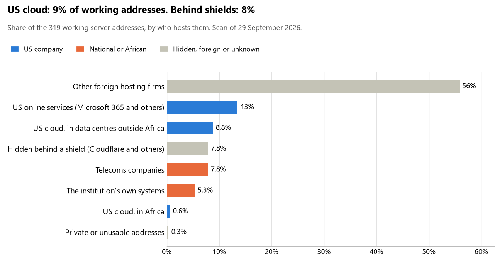

# Comoros: who hosts the state's front door

29 September 2026 · Bill Anderson · scan of 29 September 2026

The scan covered 25 state bodies, banks and state-owned companies in Comoros. 9% of their working server addresses are on US cloud: Amazon, Microsoft, Google or Oracle. 8% are behind shields such as Cloudflare, which hide the host. 5% are on government data centres or the institutions' own systems.

The scan found 216 web and mail names and 319 working addresses. 8 of the 25 institutions use US cloud for at least part of their estate. 2 use Microsoft for email and 3 use Google.

Of the 54 countries scanned so far, Comoros has the 38th highest US cloud share (median 13%) and the 39th highest share behind shields (median 12%).

## Where it lives

30 addresses are on US cloud. Where they are: 60% on worldwide delivery networks (no fixed location), 20% in North America, 13% in a region the providers do not publish and 7% in Africa.

25 addresses are behind shields: Cloudflare (100%). The host behind a shield cannot be seen, so the US cloud share is a minimum.

## Banks against government

| Share of working addresses | Government (19) | Banks (6) |
| --- | --- | --- |
| On US cloud | 9% | 10% |
| …of which in Africa | <1% | 0% |
| US online services (Microsoft 365 and others) | 9% | 24% |
| Behind a shield | 11% | 0% |
| Government data centres | 0% | 0% |
| Run by the institution itself | 8% | 0% |
| Telecoms companies | 7% | 10% |
| African data centres and IT firms | 0% | 0% |
| Other foreign hosting firms | 57% | 54% |

2 of 6 banks and 6 of 19 government bodies use US cloud somewhere. "Government" includes the central bank, the payment switch, the stock exchange and the state-owned companies.

## Email

2 of the 25 institutions use Microsoft 365 for email and 3 use Google.

- **Microsoft 365:** 2. Banque Centrale des Comores and Exim Bank Comores.
- **Google:** 3. Banque de Développement des Comores, Agence nationale de développement du numérique (ANADEN) and ANRTIC.
- **Own mail servers:** 1. Comores Telecom.
- **Telecoms companies (Comores Telecom):** 1. Ministère de la Justice.
- **US cloud (parent zone):** 1. Portail gouvernemental.
- **Foreign hosting firms:** 10. Direction générale de la Police et de la Sûreté nationale (PlanetHoster), Douanes comoriennes (PlanetHoster), AFG Bank Comores (Namecheap), Banque Fédérale de Commerce (Iomart Managed Services Limited), Union des Meck (Meck-Moroni) (PlanetHoster), Société nationale des postes et services financiers (Banque Postale) (INHERENT ADISTA SAS), Commission électorale nationale indépendante (OVH), Caisse nationale de retraites (Input Output Flood LLC), Société comorienne des ports (Input Output Flood LLC) and Cour suprême (section des comptes) (Input Output Flood LLC).
- **Behind a mail filter, provider not visible:** 4. Ministère des Finances du Budget et du Secteur bancaire, INSEED, Autorité de régulation des marchés publics and Direction nationale de cybersécurité (ANADEN).
- **No mail on the domain scanned:** 3. Présidence de l'Union des Comores (Beit-Salam), Direction générale des Impôts and Société nationale d'électricité des Comores (SONELEC).

## Institution by institution

Each figure is a share of that institution's working addresses. The rest are with telecoms companies, African data centres, US online services or foreign hosts. Rows follow the order of institution types.

| Institution | Type | On US cloud | …in Africa | Behind a shield | Own or government | Email |
| --- | --- | --- | --- | --- | --- | --- |
| Présidence de l'Union des Comores (Beit-Salam) | Presidency | no working address | | | | — |
| Direction générale de la Police et de la Sûreté nationale | Police | 0% | 0% | 0% | 0% | Foreign host |
| Ministère de la Justice | Justice | 0% | 0% | 0% | 0% | Telecoms |
| Ministère des Finances du Budget et du Secteur bancaire | Treasury / Finance | 24% | 0% | 24% | 0% | Filtered |
| Direction générale des Impôts | Revenue Service | no working address | | | | — |
| Douanes comoriennes | Customs | 0% | 0% | 0% | 0% | Foreign host |
| Banque Centrale des Comores | Central Bank | 31% | 0% | 0% | 0% | Microsoft |
| Banque de Développement des Comores | Commercial Banks | 17% | 0% | 0% | 0% | Google |
| AFG Bank Comores | Commercial Banks | 0% | 0% | 0% | 0% | Foreign host |
| Exim Bank Comores | Commercial Banks | 19% | 0% | 0% | 0% | Microsoft |
| Banque Fédérale de Commerce | Commercial Banks | 0% | 0% | 0% | 0% | Foreign host |
| Union des Meck (Meck-Moroni) | Commercial Banks | 0% | 0% | 0% | 0% | Foreign host |
| Société nationale des postes et services financiers (Banque Postale) | Commercial Banks | 0% | 0% | 0% | 0% | Foreign host |
| Commission électorale nationale indépendante | Electoral commission | 0% | 0% | 0% | 0% | Foreign host |
| INSEED | Statistics office | 0% | 0% | 82% | 0% | Filtered |
| Caisse nationale de retraites | Sovereign wealth fund / National pension fund | 0% | 0% | 0% | 0% | Foreign host |
| Autorité de régulation des marchés publics | Public procurement authority | 24% | 0% | 24% | 0% | Filtered |
| Société nationale d'électricité des Comores (SONELEC) | Energy utility | no working address | | | | — |
| Société comorienne des ports | Ports authority | 0% | 0% | 0% | 0% | Foreign host |
| Comores Telecom | State-owned telco / National backbone operator | 0% | 0% | 0% | 100% | Own servers |
| Agence nationale de développement du numérique (ANADEN) | E-government agency | 10% | 0% | 0% | 0% | Google |
| Portail gouvernemental (parent zone) | E-government agency | 50% | 50% | 0% | 0% | US cloud |
| Direction nationale de cybersécurité (ANADEN) | Cybersecurity agency / National CERT | 24% | 0% | 24% | 0% | Filtered |
| ANRTIC | Communications regulator | 0% | 0% | 15% | 0% | Google |
| Cour suprême (section des comptes) | Audit office | 0% | 0% | 0% | 0% | Foreign host |

No institution or working domain was found for 17 of the 36 types: Parliament, Foreign Affairs, Defence, Armed Forces, Intelligence, Interior / Home Affairs, Civil registry / National ID authority, Data protection authority, Immigration / Passports, Health ministry / National health insurance, Social protection / Social registry, Land registry, National payment switch, Stock exchange, Securities regulator, National data centre / Government cloud operator and Anti-corruption commission.

## What stood out

- **US cloud in Africa.** Portail gouvernemental (parent zone) has 50% of its working addresses in US cloud data centres in Africa, the highest share in Comoros.
- **Core state bodies on foreign hosting firms.** Direction générale de la Police et de la Sûreté nationale (PlanetHoster), Ministère de la Justice (OVH), Ministère des Finances du Budget et du Secteur bancaire (Hostinger), Douanes comoriennes (PlanetHoster) and Banque Centrale des Comores (Infomaniak-AS Infomaniak Network SA).
- **No Chinese cloud.** The scan found no address on Huawei, Alibaba or Tencent cloud.

## What this can and cannot tell you

The scan sees only the front door: websites, email, login portals, remote-access gateways and online banking. It cannot see where a bank's core ledger, the ID register or the payroll run.

- **Every US figure is a minimum.** Anything behind a shield or a mail filter could also be on US cloud. In Comoros that is 8% of working addresses.
- **It counts addresses, not importance.** An institution with many test and marketing sites weighs more than one with few.
- **The list of institutions was drawn up for this scan.** Each domain was checked to exist, not confirmed as the institution's main one.
- **It is a snapshot.** Every figure is as of 29 September 2026.
- **Nothing was touched.** The scan used public address lookups, public certificate records and the cloud companies' published address lists. It never connected to any institution's systems.

The data and method are in `R&D/Hyperscaler-dependence/scan/COM/` and `R&D/Hyperscaler-dependence/HYPERSCALER-SCAN.md` in the Corpus repository.
