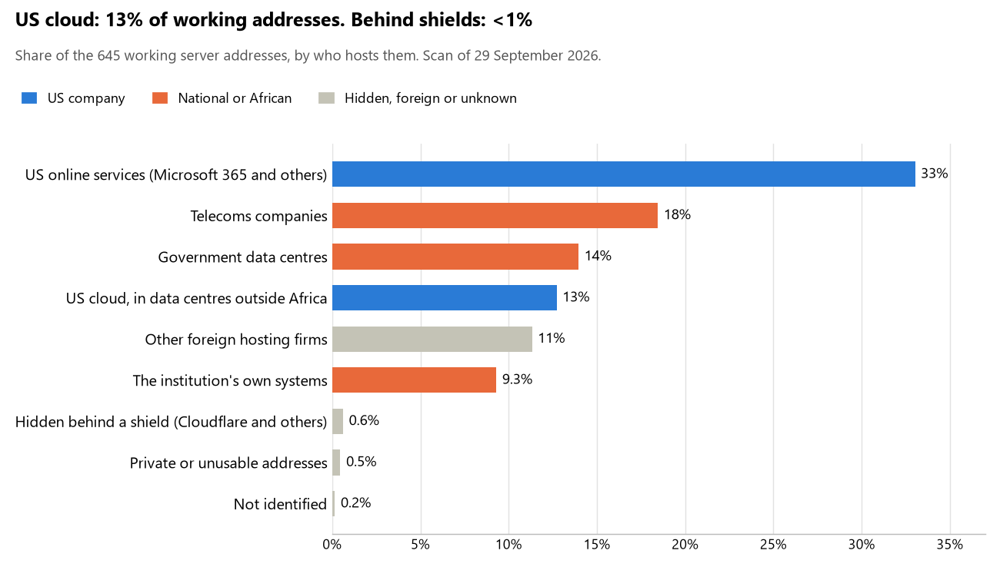

# Cape Verde: who hosts the state's front door

29 September 2026 · Bill Anderson · scan of 29 September 2026

The scan covered 34 state bodies, banks and state-owned companies in Cape Verde. 13% of their working server addresses are on US cloud: Amazon, Microsoft, Google or Oracle. <1% are behind shields such as Cloudflare, which hide the host. 23% are on government data centres or the institutions' own systems.

The scan found 517 web and mail names and 645 working addresses. 13 of the 34 institutions use US cloud for at least part of their estate. 19 use Microsoft for email and 1 use Google.

Of the 54 countries scanned so far, Cape Verde has the 29th highest US cloud share (median 13%) and the 52nd highest share behind shields (median 12%).

## Where it lives

82 addresses are on US cloud. Where they are: 100% in Europe.

4 addresses are behind shields: Cloudflare (100%). The host behind a shield cannot be seen, so the US cloud share is a minimum.

## Banks against government

| Share of working addresses | Government (29) | Banks (5) |
| --- | --- | --- |
| On US cloud | 10% | 24% |
| …of which in Africa | 0% | 0% |
| US online services (Microsoft 365 and others) | 34% | 29% |
| Behind a shield | <1% | 2% |
| Government data centres | 17% | 0% |
| Run by the institution itself | 9% | 11% |
| Telecoms companies | 15% | 31% |
| African data centres and IT firms | 0% | 0% |
| Other foreign hosting firms | 13% | 4% |

5 of 5 banks and 8 of 29 government bodies use US cloud somewhere. "Government" includes the central bank, the payment switch, the stock exchange and the state-owned companies.

## Email

19 of the 34 institutions use Microsoft 365 for email and 1 use Google.

- **Microsoft 365:** 19. Presidência da República, Assembleia Nacional, Ministério dos Negócios Estrangeiros e Comunidades, Forças Armadas de Cabo Verde, Ministério das Finanças, Ministério da Administração Interna, Caixa Económica de Cabo Verde, Banco Comercial do Atlântico, Banco Cabo-verdiano de Negócios, Banco BAI Cabo Verde, Comissão Nacional de Proteção de Dados, Comissão Nacional de Eleições, Instituto Nacional de Previdência Social, SISP - Sociedade Interbancária e Sistemas de Pagamentos, Bolsa de Valores de Cabo Verde, ENAPOR, NOSi - Núcleo Operacional para a Sociedade de Informação, Portal Único do Governo and Agência Reguladora Multissectorial da Economia.
- **Google:** 1. Polícia Nacional.
- **Government data centre (NOSi EPE):** 2. Ministério Público / Procuradoria-Geral da República and Conselho de Prevenção da Corrupção.
- **Own mail servers:** 1. Banco de Cabo Verde.
- **Telecoms companies:** 2. Banco Interatlântico (EUNETPT NOS COMUNICACOES, S.A.) and CV Telecom (SERVICOS DE COMUNICACOES E MULTIMEDIA S.A.).
- **Foreign hosting firms:** 2. Auditoria Geral do Mercado de Valores Mobiliários (ALMOUROLTEC ALMOUROLTEC SERVICOS DE INFORMATICA E INTERNET LDA) and Electra (OVH).
- **No mail on the domain scanned:** 7. Governo de Cabo Verde, Ministério da Justiça, Tribunal Constitucional, Instituto Nacional de Estatística, Ministério da Saúde, Autoridade Reguladora das Aquisições Públicas and Tribunal de Contas.

## Institution by institution

Each figure is a share of that institution's working addresses. The rest are with telecoms companies, African data centres, US online services or foreign hosts. Rows follow the order of institution types.

| Institution | Type | On US cloud | …in Africa | Behind a shield | Own or government | Email |
| --- | --- | --- | --- | --- | --- | --- |
| Presidência da República | Presidency | 0% | 0% | 0% | 0% | Microsoft |
| Governo de Cabo Verde | Presidency | 0% | 0% | 0% | 100% | — |
| Assembleia Nacional | Parliament | 29% | 0% | 0% | 0% | Microsoft |
| Ministério dos Negócios Estrangeiros e Comunidades | Foreign Affairs | 0% | 0% | 0% | 13% | Microsoft |
| Forças Armadas de Cabo Verde | Armed Forces | 0% | 0% | 0% | 19% | Microsoft |
| Polícia Nacional | Police | 0% | 0% | 0% | 78% | Google |
| Ministério da Justiça | Justice | 0% | 0% | 0% | 100% | — |
| Ministério Público / Procuradoria-Geral da República | Justice | 0% | 0% | 0% | 75% | Government |
| Tribunal Constitucional | Justice | 0% | 0% | 0% | 0% | — |
| Ministério das Finanças | Treasury / Finance | 5% | 0% | 0% | 52% | Microsoft |
| Ministério da Administração Interna | Interior / Home Affairs | 0% | 0% | 0% | 0% | Microsoft |
| Banco de Cabo Verde | Central Bank | 0% | 0% | 0% | 89% | Own servers |
| Caixa Económica de Cabo Verde | Commercial Banks | 6% | 0% | 0% | 38% | Microsoft |
| Banco Comercial do Atlântico | Commercial Banks | 5% | 0% | 10% | 0% | Microsoft |
| Banco Cabo-verdiano de Negócios | Commercial Banks | 26% | 0% | 0% | 21% | Microsoft |
| Banco Interatlântico | Commercial Banks | 38% | 0% | 0% | 0% | Telecoms |
| Banco BAI Cabo Verde | Commercial Banks | 33% | 0% | 0% | 0% | Microsoft |
| Comissão Nacional de Proteção de Dados | Data protection authority | 42% | 0% | 0% | 0% | Microsoft |
| Comissão Nacional de Eleições | Electoral commission | 21% | 0% | 0% | 43% | Microsoft |
| Instituto Nacional de Estatística | Statistics office | 0% | 0% | 0% | 50% | — |
| Ministério da Saúde | Health ministry / National health insurance | 0% | 0% | 0% | 100% | — |
| Instituto Nacional de Previdência Social | Social protection / Social registry | 0% | 0% | 0% | 36% | Microsoft |
| SISP - Sociedade Interbancária e Sistemas de Pagamentos | National payment switch | 29% | 0% | 0% | 0% | Microsoft |
| Bolsa de Valores de Cabo Verde | Stock exchange | 17% | 0% | 0% | 11% | Microsoft |
| Auditoria Geral do Mercado de Valores Mobiliários | Securities regulator | 0% | 0% | 0% | 0% | Foreign host |
| Autoridade Reguladora das Aquisições Públicas | Public procurement authority | 0% | 0% | 0% | 60% | — |
| Electra | Energy utility | 0% | 0% | 0% | 0% | Foreign host |
| ENAPOR | Ports authority | 0% | 0% | 10% | 0% | Microsoft |
| CV Telecom | State-owned telco / National backbone operator | 0% | 0% | 0% | 0% | Telecoms |
| NOSi - Núcleo Operacional para a Sociedade de Informação | E-government agency | 4% | 0% | 0% | 63% | Microsoft |
| Portal Único do Governo | E-government agency | 0% | 0% | 0% | 46% | Microsoft |
| Agência Reguladora Multissectorial da Economia | Communications regulator | 17% | 0% | 0% | 0% | Microsoft |
| Tribunal de Contas | Audit office | 0% | 0% | 0% | 60% | — |
| Conselho de Prevenção da Corrupção | Anti-corruption commission | 0% | 0% | 0% | 100% | Government |

No institution or working domain was found for 10 of the 36 types: Defence, Revenue Service, Customs, Intelligence, Civil registry / National ID authority, Immigration / Passports, Land registry, Sovereign wealth fund / National pension fund, National data centre / Government cloud operator and Cybersecurity agency / National CERT.

## What stood out

- **Little US cloud in Africa.** 0% of Cape Verde's US cloud addresses are in the providers' African data centres.
- **Core state bodies at home.** Governo de Cabo Verde (100%) and Banco de Cabo Verde (89%) keep at least 80% of their working addresses on government data centres or their own systems.
- **Core state bodies on foreign hosting firms.** Presidência da República (InMotion Hosting), Tribunal Constitucional (Contabo), Ministério da Administração Interna (Hetzner) and Banco de Cabo Verde (AS_BINTER_SISTEMAS BINTER SISTEMAS SL).
- **No Chinese cloud.** The scan found no address on Huawei, Alibaba or Tencent cloud.

## What this can and cannot tell you

The scan sees only the front door: websites, email, login portals, remote-access gateways and online banking. It cannot see where a bank's core ledger, the ID register or the payroll run.

- **Every US figure is a minimum.** Anything behind a shield or a mail filter could also be on US cloud. In Cape Verde that is <1% of working addresses.
- **It counts addresses, not importance.** An institution with many test and marketing sites weighs more than one with few.
- **The list of institutions was drawn up for this scan.** Each domain was checked to exist, not confirmed as the institution's main one.
- **It is a snapshot.** Every figure is as of 29 September 2026.
- **Nothing was touched.** The scan used public address lookups, public certificate records and the cloud companies' published address lists. It never connected to any institution's systems.

The data and method are in `R&D/Hyperscaler-dependence/scan/CPV/` and `R&D/Hyperscaler-dependence/HYPERSCALER-SCAN.md` in the Corpus repository.
