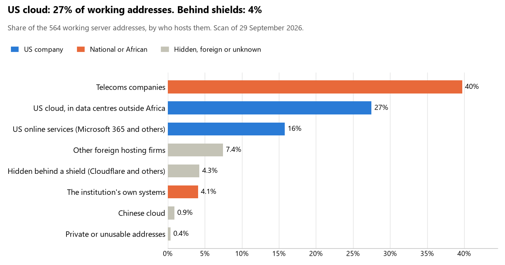

# Djibouti: who hosts the state's front door

29 September 2026 · Bill Anderson · scan of 29 September 2026

The scan covered 35 state bodies, banks and state-owned companies in Djibouti. 27% of their working server addresses are on US cloud: Amazon, Microsoft, Google or Oracle. 4% are behind shields such as Cloudflare, which hide the host. 4% are on government data centres or the institutions' own systems.

The scan found 360 web and mail names and 564 working addresses. 10 of the 35 institutions use US cloud for at least part of their estate. 6 use Microsoft for email and 5 use Google.

Of the 54 countries scanned so far, Djibouti has the 7th highest US cloud share (median 13%) and the 42nd highest share behind shields (median 12%).

## Where it lives

155 addresses are on US cloud. Where they are: 51% in Europe, 45% on worldwide delivery networks (no fixed location), 3% in North America and 2% in a region the providers do not publish.

24 addresses are behind shields: Cloudflare (100%). The host behind a shield cannot be seen, so the US cloud share is a minimum.

## Banks against government

| Share of working addresses | Government (29) | Banks (6) |
| --- | --- | --- |
| On US cloud | 15% | 50% |
| …of which in Africa | 0% | 0% |
| US online services (Microsoft 365 and others) | 14% | 19% |
| Behind a shield | 0% | 12% |
| Government data centres | 0% | 0% |
| Run by the institution itself | 6% | 0% |
| Telecoms companies | 58% | 8% |
| African data centres and IT firms | 0% | 0% |
| Other foreign hosting firms | 7% | 8% |

4 of 6 banks and 6 of 29 government bodies use US cloud somewhere. "Government" includes the central bank, the payment switch, the stock exchange and the state-owned companies.

## Email

6 of the 35 institutions use Microsoft 365 for email and 5 use Google.

- **Microsoft 365:** 6. Banque pour le Commerce et l'Industrie - Mer Rouge, Exim Bank Djibouti, Banque de Dépôt et de Crédit de Djibouti, International Investment Bank (IIB), Fonds souverain de Djibouti and Autorité des ports et des zones franches de Djibouti (DPFZA).
- **Google:** 5. Banque centrale de Djibouti, CAC International Bank, Caisse nationale de sécurité sociale (CNSS), Électricité de Djibouti (EDD) and Djibouti Data Center (DDC).
- **Own mail servers:** 1. Djibouti Télécom.
- **Telecoms companies:** 20. Présidence de la République de Djibouti (DJIBOUTI TELECOM S.A.), Assemblée nationale (DJIBOUTI TELECOM S.A.), Ministère des Affaires étrangères et de la Coopération internationale (DJIBOUTI TELECOM S.A.), Ministère de la Défense (DJIBOUTI TELECOM S.A.), Direction générale de la Police nationale (DJIBOUTI TELECOM S.A.), Ministère de la Justice et des Affaires pénitentiaires (DJIBOUTI TELECOM S.A.), Ministère de l'Économie et des Finances (DJIBOUTI TELECOM S.A.), Direction générale des Impôts (DJIBOUTI TELECOM S.A.), Direction générale des Douanes et Droits indirects (DJIBOUTI TELECOM S.A.), Ministère de l'Intérieur (DJIBOUTI TELECOM S.A.), Silkroad International Bank (Global Communications Limited), Commission électorale nationale indépendante (CENI) (DJIBOUTI TELECOM S.A.), Institut national de la statistique de Djibouti (INSTAD) (DJIBOUTI TELECOM S.A.), Ministère de la Santé (DJIBOUTI TELECOM S.A.), Ministère des Affaires sociales et des Solidarités (DJIBOUTI TELECOM S.A.), Agence nationale des systèmes d'information de l'État (ANSIE) (DJIBOUTI TELECOM S.A.), Autorité nationale de cybersécurité (DJIBOUTI TELECOM S.A.), DJ-CERT (DJIBOUTI TELECOM S.A.), Autorité de régulation multisectorielle de Djibouti (ARMD) (DJIBOUTI TELECOM S.A.) and Commission nationale indépendante pour la prévention et la lutte contre la corruption (DJIBOUTI TELECOM S.A.).
- **No mail on the domain scanned:** 3. Commission nationale des marchés publics - Portail des marchés publics, Portail E-Gouvernement and Cour des comptes de Djibouti.

## Institution by institution

Each figure is a share of that institution's working addresses. The rest are with telecoms companies, African data centres, US online services or foreign hosts. Rows follow the order of institution types.

| Institution | Type | On US cloud | …in Africa | Behind a shield | Own or government | Email |
| --- | --- | --- | --- | --- | --- | --- |
| Présidence de la République de Djibouti | Presidency | 0% | 0% | 0% | 0% | Telecoms |
| Assemblée nationale | Parliament | 0% | 0% | 0% | 0% | Telecoms |
| Ministère des Affaires étrangères et de la Coopération internationale | Foreign Affairs | 0% | 0% | 0% | 0% | Telecoms |
| Ministère de la Défense | Defence | 0% | 0% | 0% | 0% | Telecoms |
| Direction générale de la Police nationale | Police | 0% | 0% | 0% | 0% | Telecoms |
| Ministère de la Justice et des Affaires pénitentiaires | Justice | 0% | 0% | 0% | 0% | Telecoms |
| Ministère de l'Économie et des Finances | Treasury / Finance | 0% | 0% | 0% | 0% | Telecoms |
| Direction générale des Impôts | Revenue Service | 0% | 0% | 0% | 0% | Telecoms |
| Direction générale des Douanes et Droits indirects | Customs | 0% | 0% | 0% | 0% | Telecoms |
| Ministère de l'Intérieur | Interior / Home Affairs | 0% | 0% | 0% | 0% | Telecoms |
| Banque centrale de Djibouti | Central Bank | 38% | 0% | 0% | 0% | Google |
| Banque pour le Commerce et l'Industrie - Mer Rouge | Commercial Banks | 0% | 0% | 65% | 0% | Microsoft |
| CAC International Bank | Commercial Banks | 12% | 0% | 0% | 0% | Google |
| Exim Bank Djibouti | Commercial Banks | 29% | 0% | 0% | 0% | Microsoft |
| Banque de Dépôt et de Crédit de Djibouti | Commercial Banks | 65% | 0% | 0% | 0% | Microsoft |
| International Investment Bank (IIB) | Commercial Banks | 86% | 0% | 0% | 0% | Microsoft |
| Silkroad International Bank | Commercial Banks | 0% | 0% | 0% | 0% | Telecoms |
| Commission électorale nationale indépendante (CENI) | Electoral commission | 7% | 0% | 0% | 0% | Telecoms |
| Institut national de la statistique de Djibouti (INSTAD) | Statistics office | 6% | 0% | 0% | 0% | Telecoms |
| Ministère de la Santé | Health ministry / National health insurance | 0% | 0% | 0% | 0% | Telecoms |
| Caisse nationale de sécurité sociale (CNSS) | Health ministry / National health insurance | 36% | 0% | 0% | 0% | Google |
| Ministère des Affaires sociales et des Solidarités | Social protection / Social registry | 0% | 0% | 0% | 0% | Telecoms |
| Fonds souverain de Djibouti | Sovereign wealth fund / National pension fund | 0% | 0% | 0% | 0% | Microsoft |
| Commission nationale des marchés publics - Portail des marchés publics | Public procurement authority | 0% | 0% | 0% | 0% | — |
| Électricité de Djibouti (EDD) | Energy utility | 0% | 0% | 0% | 0% | Google |
| Autorité des ports et des zones franches de Djibouti (DPFZA) | Ports authority | 58% | 0% | 0% | 0% | Microsoft |
| Djibouti Télécom | State-owned telco / National backbone operator | 0% | 0% | 0% | 100% | Own servers |
| Agence nationale des systèmes d'information de l'État (ANSIE) | E-government agency | 0% | 0% | 0% | 0% | Telecoms |
| Portail E-Gouvernement | E-government agency | 0% | 0% | 0% | 0% | — |
| Djibouti Data Center (DDC) | National data centre / Government cloud operator | 19% | 0% | 0% | 0% | Google |
| Autorité nationale de cybersécurité | Cybersecurity agency / National CERT | 0% | 0% | 0% | 0% | Telecoms |
| DJ-CERT | Cybersecurity agency / National CERT | 0% | 0% | 0% | 0% | Telecoms |
| Autorité de régulation multisectorielle de Djibouti (ARMD) | Communications regulator | 0% | 0% | 0% | 0% | Telecoms |
| Cour des comptes de Djibouti | Audit office | 0% | 0% | 0% | 0% | — |
| Commission nationale indépendante pour la prévention et la lutte contre la corruption | Anti-corruption commission | 0% | 0% | 0% | 0% | Telecoms |

No institution or working domain was found for 9 of the 36 types: Armed Forces, Intelligence, Civil registry / National ID authority, Data protection authority, Immigration / Passports, Land registry, National payment switch, Stock exchange and Securities regulator.

## What stood out

- **Most on US cloud.** International Investment Bank (IIB) (86%), Banque de Dépôt et de Crédit de Djibouti (65%) and Autorité des ports et des zones franches de Djibouti (DPFZA) (58%) have more than half their working addresses on US cloud.
- **Little US cloud in Africa.** 0% of Djibouti's US cloud addresses are in the providers' African data centres.
- **Core state bodies on foreign hosting firms.** Direction générale de la Police nationale (Railway).
- **Chinese cloud.** 5 addresses, all at Silkroad International Bank, are on Chinese cloud.

## What this can and cannot tell you

The scan sees only the front door: websites, email, login portals, remote-access gateways and online banking. It cannot see where a bank's core ledger, the ID register or the payroll run.

- **Every US figure is a minimum.** Anything behind a shield or a mail filter could also be on US cloud. In Djibouti that is 4% of working addresses.
- **It counts addresses, not importance.** An institution with many test and marketing sites weighs more than one with few.
- **The list of institutions was drawn up for this scan.** Each domain was checked to exist, not confirmed as the institution's main one.
- **It is a snapshot.** Every figure is as of 29 September 2026.
- **Nothing was touched.** The scan used public address lookups, public certificate records and the cloud companies' published address lists. It never connected to any institution's systems.

The data and method are in `R&D/Hyperscaler-dependence/scan/DJI/` and `R&D/Hyperscaler-dependence/HYPERSCALER-SCAN.md` in the Corpus repository.
