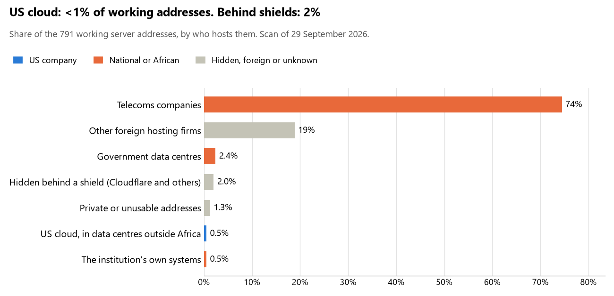

# Algeria: who hosts the state's front door

29 September 2026 · Bill Anderson · scan of 29 September 2026

The scan covered 40 state bodies, banks and state-owned companies in Algeria. <1% of their working server addresses are on US cloud: Amazon, Microsoft, Google or Oracle. 2% are behind shields such as Cloudflare, which hide the host. 3% are on government data centres or the institutions' own systems.

The scan found 716 web and mail names and 791 working addresses. 1 of the 40 institutions use US cloud for at least part of their estate. 1 use Microsoft for email and none use Google.

Of the 54 countries scanned so far, Algeria has the 54th highest US cloud share (median 13%) and the 45th highest share behind shields (median 12%).

## Where it lives

4 addresses are on US cloud. Where they are: 100% in Europe.

16 addresses are behind shields: Cloudflare (63%) and Imperva (38%). The host behind a shield cannot be seen, so the US cloud share is a minimum.

## Banks against government

| Share of working addresses | Government (30) | Banks (10) |
| --- | --- | --- |
| On US cloud | <1% | 0% |
| …of which in Africa | 0% | 0% |
| US online services (Microsoft 365 and others) | 0% | 0% |
| Behind a shield | 2% | 3% |
| Government data centres | 2% | 4% |
| Run by the institution itself | 0% | 2% |
| Telecoms companies | 83% | 45% |
| African data centres and IT firms | 0% | 0% |
| Other foreign hosting firms | 12% | 44% |

0 of 10 banks and 1 of 30 government bodies use US cloud somewhere. "Government" includes the central bank, the payment switch, the stock exchange and the state-owned companies.

## Email

1 of the 40 institutions use Microsoft 365 for email and none use Google.

- **Microsoft 365:** 1. Gulf Bank Algeria.
- **Telecoms companies:** 25. Présidence de la République (Telecom Algeria), Conseil de la Nation (Telecom Algeria), Ministère des Affaires étrangères (Telecom Algeria), Ministère de la Justice (Telecom Algeria), Direction générale des impôts (Telecom Algeria), Ministère de l'Intérieur des Collectivités locales et de l'Aménagement du territoire (Telecom Algeria), Banque nationale d'Algérie (Telecom Algeria), CNEP-Banque (Telecom Algeria), Banque de l'agriculture et du développement rural (Telecom Algeria), Autorité nationale de protection des données à caractère personnel (Telecom Algeria), Autorité nationale indépendante des élections (Telecom Algeria), Office national des statistiques (Telecom Algeria), Ministère de la Santé (Telecom Algeria), Ministère du Travail de l'Emploi et de la Sécurité sociale (Telecom Algeria), Agence nationale du cadastre (Telecom Algeria), Société de gestion de la Bourse des valeurs d'Alger (Telecom Algeria), Commission d'organisation et de surveillance des opérations de bourse (Telecom Algeria), Caisse nationale des retraites (Telecom Algeria), Sonelgaz (Telecom Algeria), Entreprise portuaire d'Alger (Telecom Algeria), Algérie Télécom (Telecom Algeria), Ministère de la Poste et des Télécommunications (Telecom Algeria), CERIST (Algerian Academic Research Network), Autorité de régulation de la poste et des communications électroniques (Telecom Algeria) and Cour des comptes (Telecom Algeria).
- **Foreign hosting firms:** 11. Assemblée populaire nationale, Ministère de la Défense nationale, Ministère des Finances, Direction générale des douanes, Banque d'Algérie, Banque extérieure d'Algérie, Crédit populaire d'Algérie, Banque de développement local, Al Baraka Bank Algeria (OVH), Al Salam Bank Algeria and Caisse nationale des assurances sociales.
- **Behind a mail filter, provider not visible:** 1. Société Générale Algérie.
- **No mail on the domain scanned:** 2. Direction générale de la Sûreté nationale and SATIM.

## Institution by institution

Each figure is a share of that institution's working addresses. The rest are with telecoms companies, African data centres, US online services or foreign hosts. Rows follow the order of institution types.

| Institution | Type | On US cloud | …in Africa | Behind a shield | Own or government | Email |
| --- | --- | --- | --- | --- | --- | --- |
| Présidence de la République | Presidency | 0% | 0% | 0% | 0% | Telecoms |
| Assemblée populaire nationale | Parliament | 0% | 0% | 0% | 0% | Foreign host |
| Conseil de la Nation | Parliament | 0% | 0% | 0% | 0% | Telecoms |
| Ministère des Affaires étrangères | Foreign Affairs | 0% | 0% | 0% | 0% | Telecoms |
| Ministère de la Défense nationale | Defence | 0% | 0% | 0% | 32% | Foreign host |
| Direction générale de la Sûreté nationale | Police | 0% | 0% | 0% | 0% | — |
| Ministère de la Justice | Justice | 0% | 0% | 0% | 0% | Telecoms |
| Ministère des Finances | Treasury / Finance | 0% | 0% | 0% | 0% | Foreign host |
| Direction générale des impôts | Revenue Service | 0% | 0% | 0% | 0% | Telecoms |
| Direction générale des douanes | Customs | 0% | 0% | 0% | 0% | Foreign host |
| Ministère de l'Intérieur des Collectivités locales et de l'Aménagement du territoire | Interior / Home Affairs | 0% | 0% | 0% | 0% | Telecoms |
| Banque d'Algérie | Central Bank | 0% | 0% | 0% | 24% | Foreign host |
| Banque nationale d'Algérie | Commercial Banks | 0% | 0% | 0% | 18% | Telecoms |
| Banque extérieure d'Algérie | Commercial Banks | 0% | 0% | 0% | 0% | Foreign host |
| Crédit populaire d'Algérie | Commercial Banks | 0% | 0% | 0% | 0% | Foreign host |
| CNEP-Banque | Commercial Banks | 0% | 0% | 0% | 0% | Telecoms |
| Banque de développement local | Commercial Banks | 0% | 0% | 0% | 11% | Foreign host |
| Banque de l'agriculture et du développement rural | Commercial Banks | 0% | 0% | 0% | 0% | Telecoms |
| Société Générale Algérie | Commercial Banks | 0% | 0% | 50% | 33% | Filtered |
| Gulf Bank Algeria | Commercial Banks | 0% | 0% | 0% | 0% | Microsoft |
| Al Baraka Bank Algeria | Commercial Banks | 0% | 0% | 0% | 0% | Foreign host |
| Al Salam Bank Algeria | Commercial Banks | 0% | 0% | 0% | 0% | Foreign host |
| Autorité nationale de protection des données à caractère personnel | Data protection authority | 0% | 0% | 0% | 0% | Telecoms |
| Autorité nationale indépendante des élections | Electoral commission | 0% | 0% | 0% | 0% | Telecoms |
| Office national des statistiques | Statistics office | 0% | 0% | 0% | 0% | Telecoms |
| Ministère de la Santé | Health ministry / National health insurance | 0% | 0% | 0% | 0% | Telecoms |
| Caisse nationale des assurances sociales | Health ministry / National health insurance | 0% | 0% | 0% | 0% | Foreign host |
| Ministère du Travail de l'Emploi et de la Sécurité sociale | Social protection / Social registry | 0% | 0% | 0% | 0% | Telecoms |
| Agence nationale du cadastre | Land registry | 0% | 0% | 0% | 0% | Telecoms |
| SATIM | National payment switch | 0% | 0% | 100% | 0% | — |
| Société de gestion de la Bourse des valeurs d'Alger | Stock exchange | 0% | 0% | 0% | 0% | Telecoms |
| Commission d'organisation et de surveillance des opérations de bourse | Securities regulator | 0% | 0% | 0% | 0% | Telecoms |
| Caisse nationale des retraites | Sovereign wealth fund / National pension fund | 0% | 0% | 0% | 0% | Telecoms |
| Sonelgaz | Energy utility | 0% | 0% | 0% | 0% | Telecoms |
| Entreprise portuaire d'Alger | Ports authority | 0% | 0% | 0% | 0% | Telecoms |
| Algérie Télécom | State-owned telco / National backbone operator | 0% | 0% | 0% | 0% | Telecoms |
| Ministère de la Poste et des Télécommunications | E-government agency | 0% | 0% | 0% | 0% | Telecoms |
| CERIST | National data centre / Government cloud operator | 2% | 0% | 0% | 0% | Telecoms |
| Autorité de régulation de la poste et des communications électroniques | Communications regulator | 0% | 0% | 0% | 0% | Telecoms |
| Cour des comptes | Audit office | 0% | 0% | 0% | 0% | Telecoms |

No institution or working domain was found for 7 of the 36 types: Armed Forces, Intelligence, Civil registry / National ID authority, Immigration / Passports, Public procurement authority, Cybersecurity agency / National CERT and Anti-corruption commission.

## What stood out

- **Little US cloud in Africa.** 0% of Algeria's US cloud addresses are in the providers' African data centres.
- **Core state bodies on foreign hosting firms.** Présidence de la République (), Assemblée populaire nationale (), Ministère de la Défense nationale (), Ministère des Finances (), Direction générale des impôts () and Direction générale des douanes (), and 1 more.
- **No Chinese cloud.** The scan found no address on Huawei, Alibaba or Tencent cloud.

## What this can and cannot tell you

The scan sees only the front door: websites, email, login portals, remote-access gateways and online banking. It cannot see where a bank's core ledger, the ID register or the payroll run.

- **Every US figure is a minimum.** Anything behind a shield or a mail filter could also be on US cloud. In Algeria that is 2% of working addresses.
- **It counts addresses, not importance.** An institution with many test and marketing sites weighs more than one with few.
- **The list of institutions was drawn up for this scan.** Each domain was checked to exist, not confirmed as the institution's main one.
- **It is a snapshot.** Every figure is as of 29 September 2026.
- **Nothing was touched.** The scan used public address lookups, public certificate records and the cloud companies' published address lists. It never connected to any institution's systems.

The data and method are in `R&D/Hyperscaler-dependence/scan/DZA/` and `R&D/Hyperscaler-dependence/HYPERSCALER-SCAN.md` in the Corpus repository.
