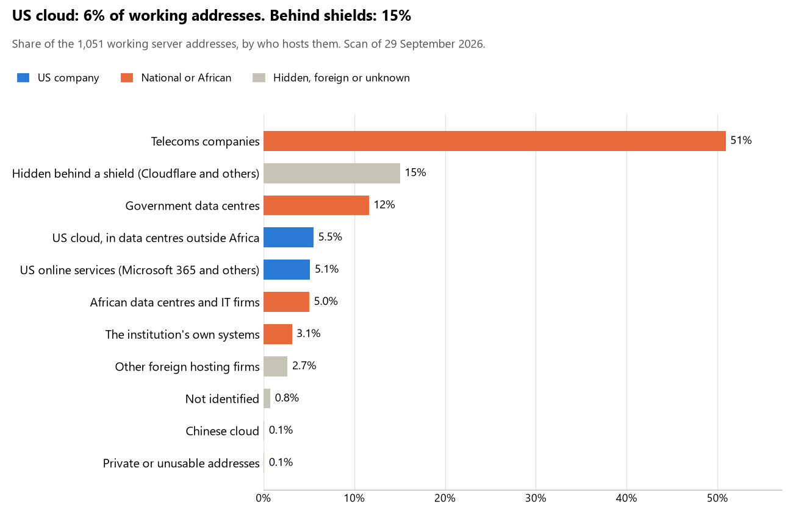

# Egypt: who hosts the state's front door

29 September 2026 · Bill Anderson · scan of 29 September 2026

The scan covered 39 state bodies, banks and state-owned companies in Egypt. 6% of their working server addresses are on US cloud: Amazon, Microsoft, Google or Oracle. 15% are behind shields such as Cloudflare, which hide the host. 15% are on government data centres or the institutions' own systems.

The scan found 1,132 web and mail names and 1,051 working addresses. 13 of the 39 institutions use US cloud for at least part of their estate. 6 use Microsoft for email and none use Google.

Of the 54 countries scanned so far, Egypt has the 50th highest US cloud share (median 13%) and the 23rd highest share behind shields (median 12%).

## Where it lives

58 addresses are on US cloud. Where they are: 52% in Europe, 34% on worldwide delivery networks (no fixed location), 10% in a region the providers do not publish and 3% in North America.

158 addresses are behind shields: Cloudflare (47%), Akamai (35%) and F5 (15%). The host behind a shield cannot be seen, so the US cloud share is a minimum.

## Banks against government

| Share of working addresses | Government (29) | Banks (10) |
| --- | --- | --- |
| On US cloud | 7% | 4% |
| …of which in Africa | 0% | 0% |
| US online services (Microsoft 365 and others) | 7% | 2% |
| Behind a shield | 14% | 16% |
| Government data centres | 21% | 0% |
| Run by the institution itself | 4% | 2% |
| Telecoms companies | 41% | 63% |
| African data centres and IT firms | 2% | 10% |
| Other foreign hosting firms | 3% | 3% |

5 of 10 banks and 8 of 29 government bodies use US cloud somewhere. "Government" includes the central bank, the payment switch, the stock exchange and the state-owned companies.

## Email

6 of the 39 institutions use Microsoft 365 for email and none use Google.

- **Microsoft 365:** 6. Presidency of the Arab Republic of Egypt, Arab African International Bank, Suez Canal Bank, Universal Health Insurance Authority, Ministry of Social Solidarity and Telecom Egypt.
- **Government data centre:** 7. Ministry of Finance (Ministry of Communications and Information Technology), Personal Data Protection Centre (Ministry of Communications and Information Technology), National Organization for Social Insurance (IDSC), General Authority for Governmental Services (e-procurement) (Ministry of Communications and Information Technology), Egypt CERT (Ministry of Communications and Information Technology), National Telecom Regulatory Authority (Ministry of Communications and Information Technology) and Accountability State Authority (Ministry of Communications and Information Technology).
- **Own mail servers:** 1. Central Bank of Egypt.
- **Telecoms companies:** 19. House of Representatives (Link Egypt), Ministry of Foreign Affairs (Link Egypt), Ministry of Defence (AFMIC), Egyptian Tax Authority (Link Egypt), Ministry of Interior (TE-AS), National Bank of Egypt (Link Egypt), Banque Misr (Vodafone Data), Commercial International Bank (Vodafone Data), Banque du Caire (Vodafone Data), Agricultural Bank of Egypt (ETISALAT MISR), Abu Dhabi Islamic Bank Egypt (TE-AS), Central Agency for Public Mobilization and Statistics (TE-AS), Ministry of Health and Population (AFMIC), Egyptian Banks Company (TE-AS), Egyptian Exchange (TE-AS), Financial Regulatory Authority (TE-AS), Egyptian Electricity Holding Company (TE-AS), Alexandria Port Authority (Link Egypt) and Administrative Control Authority (TE-AS).
- **Foreign hosting firms:** 2. QNB Egypt (Host Europe) and National Election Authority (Zoho).
- **Not identified:** 2. Ministry of Justice and Egyptian Customs Authority.
- **No mail on the domain scanned:** 2. HSBC Egypt and Egypt Government Portal.

## Institution by institution

Each figure is a share of that institution's working addresses. The rest are with telecoms companies, African data centres, US online services or foreign hosts. Rows follow the order of institution types.

| Institution | Type | On US cloud | …in Africa | Behind a shield | Own or government | Email |
| --- | --- | --- | --- | --- | --- | --- |
| Presidency of the Arab Republic of Egypt | Presidency | 0% | 0% | 52% | 0% | Microsoft |
| House of Representatives | Parliament | 0% | 0% | 0% | 0% | Telecoms |
| Ministry of Foreign Affairs | Foreign Affairs | 0% | 0% | 97% | 0% | Telecoms |
| Ministry of Defence | Defence | 0% | 0% | 0% | 9% | Telecoms |
| Ministry of Justice | Justice | 0% | 0% | 0% | 0% | Not identified |
| Ministry of Finance | Treasury / Finance | 6% | 0% | 0% | 35% | Government |
| Egyptian Tax Authority | Revenue Service | 0% | 0% | 0% | 78% | Telecoms |
| Egyptian Customs Authority | Customs | 0% | 0% | 0% | 0% | Not identified |
| Ministry of Interior | Interior / Home Affairs | 0% | 0% | 0% | 43% | Telecoms |
| Central Bank of Egypt | Central Bank | 0% | 0% | 44% | 38% | Own servers |
| National Bank of Egypt | Commercial Banks | 11% | 0% | 5% | 0% | Telecoms |
| Banque Misr | Commercial Banks | 0% | 0% | 3% | 0% | Telecoms |
| Commercial International Bank | Commercial Banks | 0% | 0% | 6% | 0% | Telecoms |
| Arab African International Bank | Commercial Banks | 5% | 0% | 10% | 0% | Microsoft |
| QNB Egypt | Commercial Banks | 50% | 0% | 0% | 0% | Foreign host |
| Banque du Caire | Commercial Banks | 2% | 0% | 0% | 0% | Telecoms |
| Agricultural Bank of Egypt | Commercial Banks | 0% | 0% | 13% | 0% | Telecoms |
| HSBC Egypt | Commercial Banks | 6% | 0% | 72% | 13% | — |
| Abu Dhabi Islamic Bank Egypt | Commercial Banks | 0% | 0% | 5% | 0% | Telecoms |
| Suez Canal Bank | Commercial Banks | 0% | 0% | 23% | 0% | Microsoft |
| Personal Data Protection Centre | Data protection authority | 0% | 0% | 0% | 100% | Government |
| National Election Authority | Electoral commission | 15% | 0% | 25% | 0% | Foreign host |
| Central Agency for Public Mobilization and Statistics | Statistics office | 0% | 0% | 0% | 0% | Telecoms |
| Ministry of Health and Population | Health ministry / National health insurance | 19% | 0% | 0% | 25% | Telecoms |
| Universal Health Insurance Authority | Health ministry / National health insurance | 49% | 0% | 0% | 11% | Microsoft |
| Ministry of Social Solidarity | Social protection / Social registry | 0% | 0% | 31% | 16% | Microsoft |
| Egyptian Banks Company | National payment switch | 0% | 0% | 0% | 0% | Telecoms |
| Egyptian Exchange | Stock exchange | 4% | 0% | 0% | 69% | Telecoms |
| Financial Regulatory Authority | Securities regulator | 7% | 0% | 0% | 7% | Telecoms |
| National Organization for Social Insurance | Sovereign wealth fund / National pension fund | 0% | 0% | 57% | 14% | Government |
| General Authority for Governmental Services (e-procurement) | Public procurement authority | 0% | 0% | 0% | 75% | Government |
| Egyptian Electricity Holding Company | Energy utility | 29% | 0% | 0% | 0% | Telecoms |
| Alexandria Port Authority | Ports authority | 0% | 0% | 0% | 0% | Telecoms |
| Telecom Egypt | State-owned telco / National backbone operator | 2% | 0% | 2% | 0% | Microsoft |
| Egypt Government Portal | E-government agency | 0% | 0% | 0% | 0% | — |
| Egypt CERT | Cybersecurity agency / National CERT | 0% | 0% | 25% | 56% | Government |
| National Telecom Regulatory Authority | Communications regulator | 0% | 0% | 0% | 76% | Government |
| Accountability State Authority | Audit office | 0% | 0% | 0% | 50% | Government |
| Administrative Control Authority | Anti-corruption commission | 0% | 0% | 0% | 0% | Telecoms |

No institution or working domain was found for 7 of the 36 types: Armed Forces, Police, Intelligence, Civil registry / National ID authority, Immigration / Passports, Land registry and National data centre / Government cloud operator.

## What stood out

- **Most on US cloud.** QNB Egypt (50%) has more than half its working addresses on US cloud.
- **Little US cloud in Africa.** 0% of Egypt's US cloud addresses are in the providers' African data centres.
- **Core state bodies on foreign hosting firms.** Ministry of Defence (Contabo).
- **Chinese cloud.** 1 address, all at Telecom Egypt, is on Chinese cloud.

## What this can and cannot tell you

The scan sees only the front door: websites, email, login portals, remote-access gateways and online banking. It cannot see where a bank's core ledger, the ID register or the payroll run.

- **Every US figure is a minimum.** Anything behind a shield or a mail filter could also be on US cloud. In Egypt that is 15% of working addresses.
- **It counts addresses, not importance.** An institution with many test and marketing sites weighs more than one with few.
- **The list of institutions was drawn up for this scan.** Each domain was checked to exist, not confirmed as the institution's main one.
- **It is a snapshot.** Every figure is as of 29 September 2026.
- **Nothing was touched.** The scan used public address lookups, public certificate records and the cloud companies' published address lists. It never connected to any institution's systems.

The data and method are in `R&D/Hyperscaler-dependence/scan/EGY/` and `R&D/Hyperscaler-dependence/HYPERSCALER-SCAN.md` in the Corpus repository.
