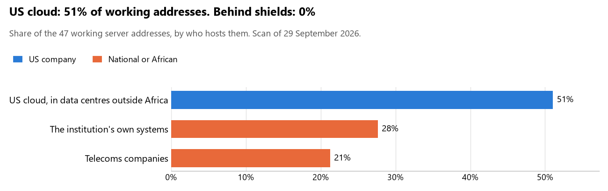

# Eritrea: who hosts the state's front door

29 September 2026 · Bill Anderson · scan of 29 September 2026

The scan covered 5 state bodies, banks and state-owned companies in Eritrea. 51% of their working server addresses are on US cloud: Amazon, Microsoft, Google or Oracle. 0% are behind shields such as Cloudflare, which hide the host. 28% are on government data centres or the institutions' own systems.

The scan found 37 web and mail names and 47 working addresses. 2 of the 5 institutions use US cloud for at least part of their estate. 0 use Microsoft for email and none use Google.

Of the 54 countries scanned so far, Eritrea has the 1st highest US cloud share (median 13%) and the 53rd highest share behind shields (median 12%).

## Where it lives

24 addresses are on US cloud. Where they are: 58% in North America and 42% on worldwide delivery networks (no fixed location).

## Banks against government

| Share of working addresses | Government (4) | Banks (1) |
| --- | --- | --- |
| On US cloud | 32% | 100% |
| …of which in Africa | 0% | 0% |
| US online services (Microsoft 365 and others) | 0% | 0% |
| Behind a shield | 0% | 0% |
| Government data centres | 0% | 0% |
| Run by the institution itself | 38% | 0% |
| Telecoms companies | 29% | 0% |
| African data centres and IT firms | 0% | 0% |
| Other foreign hosting firms | 0% | 0% |

1 of 1 banks and 1 of 4 government bodies use US cloud somewhere. "Government" includes the central bank, the payment switch, the stock exchange and the state-owned companies.

## Email

0 of the 5 institutions use Microsoft 365 for email and none use Google.

- **US cloud:** 2. Housing and Commerce Bank of Eritrea and Ministry of Information.
- **Behind a mail filter, provider not visible:** 1. Bank of Eritrea.
- **No mail on the domain scanned:** 2. Eritrean Telecommunication Services Corporation (EriTel) and Government of Eritrea (parent zone).

## Institution by institution

Each figure is a share of that institution's working addresses. The rest are with telecoms companies, African data centres, US online services or foreign hosts. Rows follow the order of institution types.

| Institution | Type | On US cloud | …in Africa | Behind a shield | Own or government | Email |
| --- | --- | --- | --- | --- | --- | --- |
| Bank of Eritrea | Central Bank | 0% | 0% | 0% | 0% | Filtered |
| Housing and Commerce Bank of Eritrea | Commercial Banks | 100% | 0% | 0% | 0% | US cloud |
| Eritrean Telecommunication Services Corporation (EriTel) | State-owned telco / National backbone operator | 0% | 0% | 0% | 100% | — |
| Government of Eritrea (parent zone) | E-government agency | 0% | 0% | 0% | 0% | — |
| Ministry of Information | E-government agency | 100% | 0% | 0% | 0% | US cloud |

No institution or working domain was found for 32 of the 36 types: Presidency, Parliament, Foreign Affairs, Defence, Armed Forces, Police, Justice, Treasury / Finance, Revenue Service, Customs, Intelligence, Interior / Home Affairs, Civil registry / National ID authority, Data protection authority, Electoral commission, Statistics office, Immigration / Passports, Health ministry / National health insurance, Social protection / Social registry, Land registry, National payment switch, Stock exchange, Securities regulator, Sovereign wealth fund / National pension fund, Public procurement authority, Energy utility, Ports authority, National data centre / Government cloud operator, Cybersecurity agency / National CERT, Communications regulator, Audit office and Anti-corruption commission.

## What stood out

- **Most on US cloud.** Ministry of Information (100%) and Housing and Commerce Bank of Eritrea (100%) have more than half their working addresses on US cloud.
- **Little US cloud in Africa.** 0% of Eritrea's US cloud addresses are in the providers' African data centres.
- **No Chinese cloud.** The scan found no address on Huawei, Alibaba or Tencent cloud.

## What this can and cannot tell you

The scan sees only the front door: websites, email, login portals, remote-access gateways and online banking. It cannot see where a bank's core ledger, the ID register or the payroll run.

- **Every US figure is a minimum.** Anything behind a shield or a mail filter could also be on US cloud. In Eritrea that is 0% of working addresses.
- **It counts addresses, not importance.** An institution with many test and marketing sites weighs more than one with few.
- **The list of institutions was drawn up for this scan.** Each domain was checked to exist, not confirmed as the institution's main one.
- **It is a snapshot.** Every figure is as of 29 September 2026.
- **Nothing was touched.** The scan used public address lookups, public certificate records and the cloud companies' published address lists. It never connected to any institution's systems.

The data and method are in `R&D/Hyperscaler-dependence/scan/ERI/` and `R&D/Hyperscaler-dependence/HYPERSCALER-SCAN.md` in the Corpus repository.
