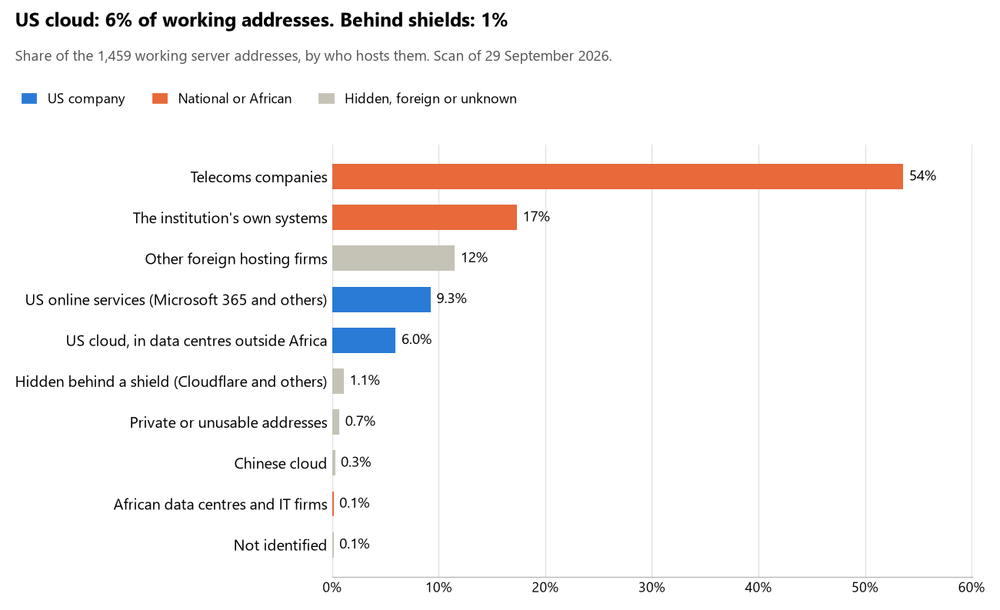

# Ethiopia: who hosts the state's front door

29 September 2026 · Bill Anderson · scan of 29 September 2026

The scan covered 40 state bodies, banks and state-owned companies in Ethiopia. 6% of their working server addresses are on US cloud: Amazon, Microsoft, Google or Oracle. 1% are behind shields such as Cloudflare, which hide the host. 17% are on government data centres or the institutions' own systems.

The scan found 1,846 web and mail names and 1,459 working addresses. 11 of the 40 institutions use US cloud for at least part of their estate. 13 use Microsoft for email and 5 use Google.

Of the 54 countries scanned so far, Ethiopia has the 49th highest US cloud share (median 13%) and the 47th highest share behind shields (median 12%).

## Where it lives

87 addresses are on US cloud. Where they are: 46% on worldwide delivery networks (no fixed location), 41% in Europe, 10% in a region the providers do not publish and 2% in North America.

16 addresses are behind shields: Cloudflare (63%) and Fastly (38%). The host behind a shield cannot be seen, so the US cloud share is a minimum.

## Banks against government

| Share of working addresses | Government (30) | Banks (10) |
| --- | --- | --- |
| On US cloud | 3% | 18% |
| …of which in Africa | 0% | 0% |
| US online services (Microsoft 365 and others) | 10% | 8% |
| Behind a shield | 1% | <1% |
| Government data centres | 0% | 0% |
| Run by the institution itself | 21% | 1% |
| Telecoms companies | 59% | 31% |
| African data centres and IT firms | 0% | <1% |
| Other foreign hosting firms | 5% | 40% |

5 of 10 banks and 6 of 30 government bodies use US cloud somewhere. "Government" includes the central bank, the payment switch, the stock exchange and the state-owned companies.

## Email

13 of the 40 institutions use Microsoft 365 for email and 5 use Google.

- **Microsoft 365:** 13. Ministry of Foreign Affairs, Ministry of Finance, Dashen Bank, Bank of Oromia, National Election Board of Ethiopia, Ministry of Health, Ethiopian Securities Exchange, Ethiopian Capital Market Authority, Ethiopian Investment Holdings, Public Procurement and Property Authority, Ministry of Innovation and Technology, Ethiopian Communications Authority and Office of the Federal Auditor General.
- **Google:** 5. Ministry of Revenues, National Bank of Ethiopia, Cooperative Bank of Oromia, National ID Program (Fayda) and Information Network Security Administration.
- **Own mail servers:** 2. Bank of Abyssinia and Ethio Telecom.
- **Telecoms companies (Ethio Telecom):** 13. Office of the Prime Minister, House of Peoples' Representatives, Ministry of Defence, Ministry of Justice, Federal Supreme Court, Ethiopian Customs Commission, National Intelligence and Security Service, Ministry of Peace, Hibret Bank, Immigration and Citizenship Service, Ministry of Labor and Skills, Ethiopian Electric Utility and Federal Ethics and Anti-Corruption Commission.
- **Foreign hosting firms:** 3. Nib International Bank (HostDime.com, Inc.), Wegagen Bank (HostDime.com, Inc.) and EthSwitch (Zoho).
- **Behind a mail filter, provider not visible:** 2. Awash Bank and Zemen Bank.
- **No mail on the domain scanned:** 2. Federal Police Commission and Commercial Bank of Ethiopia.

## Institution by institution

Each figure is a share of that institution's working addresses. The rest are with telecoms companies, African data centres, US online services or foreign hosts. Rows follow the order of institution types.

| Institution | Type | On US cloud | …in Africa | Behind a shield | Own or government | Email |
| --- | --- | --- | --- | --- | --- | --- |
| Office of the Prime Minister | Presidency | 0% | 0% | 0% | 0% | Telecoms |
| House of Peoples' Representatives | Parliament | 0% | 0% | 0% | 0% | Telecoms |
| Ministry of Foreign Affairs | Foreign Affairs | 0% | 0% | 0% | 0% | Microsoft |
| Ministry of Defence | Defence | 0% | 0% | 0% | 0% | Telecoms |
| Federal Police Commission | Police | 0% | 0% | 0% | 0% | — |
| Ministry of Justice | Justice | 12% | 0% | 0% | 0% | Telecoms |
| Federal Supreme Court | Justice | 0% | 0% | 0% | 0% | Telecoms |
| Ministry of Finance | Treasury / Finance | 0% | 0% | 0% | 0% | Microsoft |
| Ministry of Revenues | Revenue Service | 0% | 0% | 0% | 0% | Google |
| Ethiopian Customs Commission | Customs | 0% | 0% | 0% | 0% | Telecoms |
| National Intelligence and Security Service | Intelligence | 0% | 0% | 0% | 0% | Telecoms |
| Ministry of Peace | Interior / Home Affairs | 0% | 0% | 0% | 0% | Telecoms |
| National Bank of Ethiopia | Central Bank | 0% | 0% | 0% | 0% | Google |
| Commercial Bank of Ethiopia | Commercial Banks | 78% | 0% | 0% | 0% | — |
| Awash Bank | Commercial Banks | 19% | 0% | 0% | 0% | Filtered |
| Dashen Bank | Commercial Banks | 0% | 0% | 0% | 0% | Microsoft |
| Bank of Abyssinia | Commercial Banks | 29% | 0% | 5% | 7% | Own servers |
| Cooperative Bank of Oromia | Commercial Banks | 18% | 0% | 0% | 0% | Google |
| Nib International Bank | Commercial Banks | 0% | 0% | 0% | 0% | Foreign host |
| Wegagen Bank | Commercial Banks | 0% | 0% | 0% | 0% | Foreign host |
| Hibret Bank | Commercial Banks | 0% | 0% | 0% | 0% | Telecoms |
| Bank of Oromia | Commercial Banks | 40% | 0% | 0% | 0% | Microsoft |
| Zemen Bank | Commercial Banks | 0% | 0% | 0% | 0% | Filtered |
| National ID Program (Fayda) | Civil registry / National ID authority | 0% | 0% | 0% | 0% | Google |
| National Election Board of Ethiopia | Electoral commission | 0% | 0% | 10% | 0% | Microsoft |
| Immigration and Citizenship Service | Immigration / Passports | 0% | 0% | 0% | 0% | Telecoms |
| Ministry of Health | Health ministry / National health insurance | 0% | 0% | 0% | 0% | Microsoft |
| Ministry of Labor and Skills | Social protection / Social registry | 0% | 0% | 14% | 0% | Telecoms |
| EthSwitch | National payment switch | 0% | 0% | 0% | 0% | Foreign host |
| Ethiopian Securities Exchange | Stock exchange | 13% | 0% | 0% | 0% | Microsoft |
| Ethiopian Capital Market Authority | Securities regulator | 0% | 0% | 13% | 0% | Microsoft |
| Ethiopian Investment Holdings | Sovereign wealth fund / National pension fund | 21% | 0% | 0% | 0% | Microsoft |
| Public Procurement and Property Authority | Public procurement authority | 0% | 0% | 0% | 0% | Microsoft |
| Ethiopian Electric Utility | Energy utility | 20% | 0% | 0% | 0% | Telecoms |
| Ethio Telecom | State-owned telco / National backbone operator | 4% | 0% | 0% | 94% | Own servers |
| Ministry of Innovation and Technology | E-government agency | 40% | 0% | 0% | 0% | Microsoft |
| Information Network Security Administration | National data centre / Government cloud operator | 0% | 0% | 0% | 0% | Google |
| Ethiopian Communications Authority | Communications regulator | 0% | 0% | 0% | 0% | Microsoft |
| Office of the Federal Auditor General | Audit office | 0% | 0% | 0% | 0% | Microsoft |
| Federal Ethics and Anti-Corruption Commission | Anti-corruption commission | 0% | 0% | 0% | 0% | Telecoms |

No institution or working domain was found for 6 of the 36 types: Armed Forces, Data protection authority, Statistics office, Land registry, Ports authority and Cybersecurity agency / National CERT.

## What stood out

- **Most on US cloud.** Commercial Bank of Ethiopia (78%) has more than half its working addresses on US cloud.
- **Little US cloud in Africa.** 0% of Ethiopia's US cloud addresses are in the providers' African data centres.
- **Core state bodies on foreign hosting firms.** National Bank of Ethiopia (HostDime.com, Inc.).
- **Chinese cloud.** 4 addresses, all at Ethio Telecom, are on Chinese cloud.

## What this can and cannot tell you

The scan sees only the front door: websites, email, login portals, remote-access gateways and online banking. It cannot see where a bank's core ledger, the ID register or the payroll run.

- **Every US figure is a minimum.** Anything behind a shield or a mail filter could also be on US cloud. In Ethiopia that is 1% of working addresses.
- **It counts addresses, not importance.** An institution with many test and marketing sites weighs more than one with few.
- **The list of institutions was drawn up for this scan.** Each domain was checked to exist, not confirmed as the institution's main one.
- **It is a snapshot.** Every figure is as of 29 September 2026.
- **Nothing was touched.** The scan used public address lookups, public certificate records and the cloud companies' published address lists. It never connected to any institution's systems.

The data and method are in `R&D/Hyperscaler-dependence/scan/ETH/` and `R&D/Hyperscaler-dependence/HYPERSCALER-SCAN.md` in the Corpus repository.
