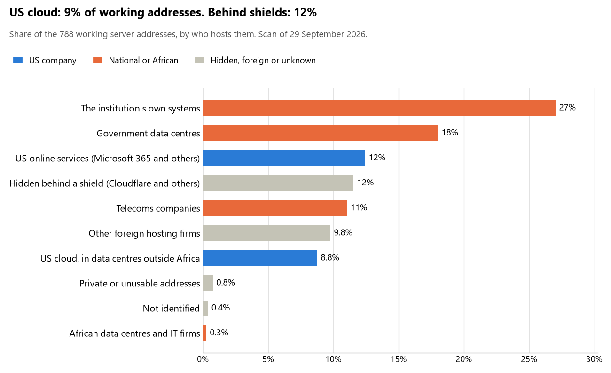

# Gabon: who hosts the state's front door

29 September 2026 · Bill Anderson · scan of 29 September 2026

The scan covered 36 state bodies, banks and state-owned companies in Gabon. 9% of their working server addresses are on US cloud: Amazon, Microsoft, Google or Oracle. 12% are behind shields such as Cloudflare, which hide the host. 45% are on government data centres or the institutions' own systems.

The scan found 525 web and mail names and 788 working addresses. 7 of the 36 institutions use US cloud for at least part of their estate. 11 use Microsoft for email and none use Google.

Of the 54 countries scanned so far, Gabon has the 42nd highest US cloud share (median 13%) and the 28th highest share behind shields (median 12%).

## Where it lives

69 addresses are on US cloud. Where they are: 77% in Europe, 9% on worldwide delivery networks (no fixed location), 9% in North America and 6% in a region the providers do not publish.

91 addresses are behind shields: Cloudflare (95%) and Imperva (5%). The host behind a shield cannot be seen, so the US cloud share is a minimum.

## Banks against government

| Share of working addresses | Government (31) | Banks (5) |
| --- | --- | --- |
| On US cloud | 9% | 6% |
| …of which in Africa | 0% | 0% |
| US online services (Microsoft 365 and others) | 12% | 15% |
| Behind a shield | 4% | 63% |
| Government data centres | 21% | 0% |
| Run by the institution itself | 31% | 0% |
| Telecoms companies | 12% | 5% |
| African data centres and IT firms | <1% | 0% |
| Other foreign hosting firms | 10% | 11% |

2 of 5 banks and 5 of 31 government bodies use US cloud somewhere. "Government" includes the central bank, the payment switch, the stock exchange and the state-owned companies.

## Email

11 of the 36 institutions use Microsoft 365 for email and none use Google.

- **Microsoft 365:** 11. Union Gabonaise de Banque, AFG Bank Gabon (ex-BICIG), Banque pour le Commerce et l'Entrepreneuriat du Gabon, Caisse Nationale de Sécurité Sociale, Bourse des Valeurs Mobilières de l'Afrique Centrale, Commission de Surveillance du Marché Financier de l'Afrique Centrale, Fonds Gabonais d'Investissements Stratégiques, Caisse des Pensions et des Prestations Familiales des Agents de l'État, Société d'Énergie et d'Eau du Gabon, Gabon Télécom and Autorité de Régulation des Communications Électroniques et des Postes.
- **Government data centre (Agence Nationale des Infrastructures Numeriques et des Frequences):** 12. Présidence de la République gabonaise, Assemblée nationale, Sénat, Ministère des Affaires étrangères, Ministère de la Défense nationale, Forces de Police Nationale, Ministère de la Justice, Direction Générale des Impôts, Ministère de l'Intérieur, de la Sécurité et de la Décentralisation, Direction Générale de la Documentation et de l'Immigration, Ministère de la Santé and Portail officiel du Gouvernement gabonais.
- **Own mail servers:** 4. Ministère de l'Économie et des Participations, Ministère de l'Économie; des Finances; de la Dette et des Participations (Budget), Direction Générale des Douanes et Droits Indirects and Agence Nationale des Infrastructures Numériques et des Fréquences.
- **Telecoms companies:** 3. Parlement de la République gabonaise (Eurofiber France SAS), Banque des États de l'Afrique Centrale (CAMTEL) and Caisse Nationale d'Assurance Maladie et de Garantie Sociale (Gabon Telecom / Office of Posts and Telecommunications of Gabon).
- **Foreign hosting firms:** 3. United Bank for Africa Gabon (Host Europe), Direction Générale de la Statistique (FR-OC3NETWORK OC3 NETWORK SAS) and Office des Ports et Rades du Gabon (alwaysdata alwaysdata SARL).
- **Behind a mail filter, provider not visible (INSTAT portal):** 1. Direction Générale de la Statistique.
- **No mail on the domain scanned:** 2. BGFIBank Gabon and Groupement Interbancaire Monétique de l'Afrique Centrale.

## Institution by institution

Each figure is a share of that institution's working addresses. The rest are with telecoms companies, African data centres, US online services or foreign hosts. Rows follow the order of institution types.

| Institution | Type | On US cloud | …in Africa | Behind a shield | Own or government | Email |
| --- | --- | --- | --- | --- | --- | --- |
| Présidence de la République gabonaise | Presidency | 0% | 0% | 0% | 73% | Government |
| Parlement de la République gabonaise | Parliament | 0% | 0% | 17% | 0% | Telecoms |
| Assemblée nationale | Parliament | 0% | 0% | 0% | 100% | Government |
| Sénat | Parliament | 0% | 0% | 0% | 100% | Government |
| Ministère des Affaires étrangères | Foreign Affairs | 0% | 0% | 0% | 90% | Government |
| Ministère de la Défense nationale | Defence | 0% | 0% | 0% | 91% | Government |
| Forces de Police Nationale | Police | 0% | 0% | 0% | 100% | Government |
| Ministère de la Justice | Justice | 0% | 0% | 0% | 92% | Government |
| Ministère de l'Économie et des Participations | Treasury / Finance | 0% | 0% | 0% | 100% | Own servers |
| Ministère de l'Économie; des Finances; de la Dette et des Participations (Budget) | Treasury / Finance | 0% | 0% | 0% | 87% | Own servers |
| Direction Générale des Impôts | Revenue Service | 0% | 0% | 0% | 50% | Government |
| Direction Générale des Douanes et Droits Indirects | Customs | 0% | 0% | 0% | 83% | Own servers |
| Ministère de l'Intérieur, de la Sécurité et de la Décentralisation | Interior / Home Affairs | 0% | 0% | 0% | 94% | Government |
| Banque des États de l'Afrique Centrale | Central Bank | 36% | 0% | 0% | 0% | Telecoms |
| BGFIBank Gabon | Commercial Banks | 0% | 0% | 100% | 0% | — |
| Union Gabonaise de Banque | Commercial Banks | 17% | 0% | 0% | 0% | Microsoft |
| AFG Bank Gabon (ex-BICIG) | Commercial Banks | 0% | 0% | 0% | 0% | Microsoft |
| United Bank for Africa Gabon | Commercial Banks | 18% | 0% | 45% | 0% | Foreign host |
| Banque pour le Commerce et l'Entrepreneuriat du Gabon | Commercial Banks | 0% | 0% | 97% | 0% | Microsoft |
| Direction Générale de la Statistique | Statistics office | 0% | 0% | 0% | 75% | Foreign host |
| Direction Générale de la Statistique (INSTAT portal) | Statistics office | 24% | 0% | 24% | 0% | Filtered |
| Direction Générale de la Documentation et de l'Immigration | Immigration / Passports | 0% | 0% | 0% | 38% | Government |
| Ministère de la Santé | Health ministry / National health insurance | 0% | 0% | 0% | 100% | Government |
| Caisse Nationale d'Assurance Maladie et de Garantie Sociale | Health ministry / National health insurance | 0% | 0% | 0% | 29% | Telecoms |
| Caisse Nationale de Sécurité Sociale | Social protection / Social registry | 42% | 0% | 0% | 0% | Microsoft |
| Groupement Interbancaire Monétique de l'Afrique Centrale | National payment switch | 0% | 0% | 0% | 0% | — |
| Bourse des Valeurs Mobilières de l'Afrique Centrale | Stock exchange | 0% | 0% | 0% | 0% | Microsoft |
| Commission de Surveillance du Marché Financier de l'Afrique Centrale | Securities regulator | 47% | 0% | 26% | 0% | Microsoft |
| Fonds Gabonais d'Investissements Stratégiques | Sovereign wealth fund / National pension fund | 0% | 0% | 15% | 0% | Microsoft |
| Caisse des Pensions et des Prestations Familiales des Agents de l'État | Sovereign wealth fund / National pension fund | 0% | 0% | 0% | 24% | Microsoft |
| Société d'Énergie et d'Eau du Gabon | Energy utility | 27% | 0% | 0% | 0% | Microsoft |
| Office des Ports et Rades du Gabon | Ports authority | 0% | 0% | 0% | 0% | Foreign host |
| Gabon Télécom | State-owned telco / National backbone operator | 0% | 0% | 0% | 0% | Microsoft |
| Agence Nationale des Infrastructures Numériques et des Fréquences | E-government agency | 0% | 0% | 0% | 97% | Own servers |
| Portail officiel du Gouvernement gabonais | E-government agency | 0% | 0% | 0% | 100% | Government |
| Autorité de Régulation des Communications Électroniques et des Postes | Communications regulator | 0% | 0% | 0% | 0% | Microsoft |

No institution or working domain was found for 11 of the 36 types: Armed Forces, Intelligence, Civil registry / National ID authority, Data protection authority, Electoral commission, Land registry, Public procurement authority, National data centre / Government cloud operator, Cybersecurity agency / National CERT, Audit office and Anti-corruption commission.

## What stood out

- **Little US cloud in Africa.** 0% of Gabon's US cloud addresses are in the providers' African data centres.
- **Core state bodies at home.** Assemblée nationale (100%), Sénat (100%), Ministère des Affaires étrangères (90%), Ministère de la Défense nationale (91%), Forces de Police Nationale (100%), Ministère de la Justice (92%), Ministère de l'Économie et des Participations (100%), Ministère de l'Économie; des Finances; de la Dette et des Participations (Budget) (87%), Direction Générale des Douanes et Droits Indirects (83%) and Ministère de l'Intérieur, de la Sécurité et de la Décentralisation (94%) keep at least 80% of their working addresses on government data centres or their own systems.
- **Core state bodies on foreign hosting firms.** Présidence de la République gabonaise (Hetzner and Akamai Connected Cloud (Linode)), Ministère des Affaires étrangères (FR-OC3NETWORK OC3 NETWORK SAS), Ministère de la Défense nationale (FR-OC3NETWORK OC3 NETWORK SAS), Ministère de la Justice (FR-OC3NETWORK OC3 NETWORK SAS), Ministère de l'Économie; des Finances; de la Dette et des Participations (Budget) (Ntirety, Inc.) and Direction Générale des Douanes et Droits Indirects (FR-OC3NETWORK OC3 NETWORK SAS), and 1 more.
- **No Chinese cloud.** The scan found no address on Huawei, Alibaba or Tencent cloud.

## What this can and cannot tell you

The scan sees only the front door: websites, email, login portals, remote-access gateways and online banking. It cannot see where a bank's core ledger, the ID register or the payroll run.

- **Every US figure is a minimum.** Anything behind a shield or a mail filter could also be on US cloud. In Gabon that is 12% of working addresses.
- **It counts addresses, not importance.** An institution with many test and marketing sites weighs more than one with few.
- **The list of institutions was drawn up for this scan.** Each domain was checked to exist, not confirmed as the institution's main one.
- **It is a snapshot.** Every figure is as of 29 September 2026.
- **Nothing was touched.** The scan used public address lookups, public certificate records and the cloud companies' published address lists. It never connected to any institution's systems.

The data and method are in `R&D/Hyperscaler-dependence/scan/GAB/` and `R&D/Hyperscaler-dependence/HYPERSCALER-SCAN.md` in the Corpus repository.
