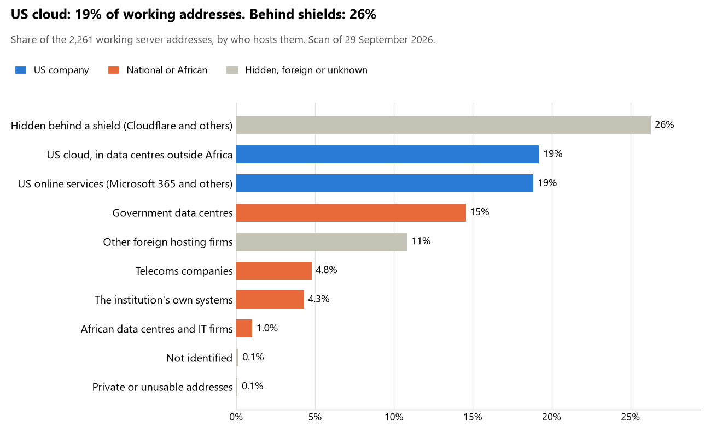

# Ghana: who hosts the state's front door

29 September 2026 · Bill Anderson · scan of 29 September 2026

The scan covered 44 state bodies, banks and state-owned companies in Ghana. 19% of their working server addresses are on US cloud: Amazon, Microsoft, Google or Oracle. 26% are behind shields such as Cloudflare, which hide the host. 19% are on government data centres or the institutions' own systems.

The scan found 1,883 web and mail names and 2,261 working addresses. 37 of the 44 institutions use US cloud for at least part of their estate. 31 use Microsoft for email and 2 use Google.

Of the 54 countries scanned so far, Ghana has the 17th highest US cloud share (median 13%) and the 11th highest share behind shields (median 12%).

## Where it lives

434 addresses are on US cloud. Where they are: 72% in Europe, 15% in North America, 9% on worldwide delivery networks (no fixed location), 4% in a region the providers do not publish and <1% in Asia or the Middle East.

594 addresses are behind shields: Cloudflare (72%), Imperva (14%) and Akamai (5%). The host behind a shield cannot be seen, so the US cloud share is a minimum.

## Banks against government

| Share of working addresses | Government (34) | Banks (10) |
| --- | --- | --- |
| On US cloud | 19% | 21% |
| …of which in Africa | 0% | 0% |
| US online services (Microsoft 365 and others) | 21% | 12% |
| Behind a shield | 24% | 36% |
| Government data centres | 18% | 0% |
| Run by the institution itself | <1% | 18% |
| Telecoms companies | 5% | 5% |
| African data centres and IT firms | <1% | 2% |
| Other foreign hosting firms | 12% | 7% |

8 of 10 banks and 29 of 34 government bodies use US cloud somewhere. "Government" includes the central bank, the payment switch, the stock exchange and the state-owned companies.

## Email

31 of the 44 institutions use Microsoft 365 for email and 2 use Google.

- **Microsoft 365:** 31. Ministry of Foreign Affairs and Regional Integration, Ministry of Defence, Ghana Police Service, Ministry of Justice and Attorney-General's Department, Judicial Service of Ghana, Ministry of Finance, Ghana Revenue Authority, Ministry of the Interior, Bank of Ghana, Fidelity Bank Ghana, Zenith Bank Ghana, OmniBSIC Bank Ghana, Access Bank Ghana, Agricultural Development Bank, National Identification Authority, Data Protection Commission, Ghana Statistical Service, Ministry of Health, National Health Insurance Authority, Ministry of Gender Children and Social Protection, Lands Commission, Ghana Stock Exchange, Securities and Exchange Commission Ghana, Public Procurement Authority, Ghana Electronic Procurement System, Ghana Ports and Harbours Authority, National Information Technology Agency, Cyber Security Authority, National Communications Authority, Ghana Audit Service and Office of the Special Prosecutor.
- **Google:** 2. Office of the President and First Atlantic Bank.
- **Government data centre (Ghana Government):** 1. Parliament of Ghana.
- **US cloud:** 2. GCB Bank and Electricity Company of Ghana.
- **Foreign hosting firms:** 3. Guaranty Trust Bank Ghana (Atlantic Metro Communications II, Inc.), Electoral Commission of Ghana (InMotion Hosting, Inc.) and Ghana Interbank Payment and Settlement Systems (IONOS).
- **Behind a mail filter, provider not visible:** 1. Social Security and National Insurance Trust.
- **Not identified:** 1. Ghana Armed Forces.
- **No mail on the domain scanned:** 3. Absa Bank Ghana, Stanbic Bank Ghana and Ghana Immigration Service.

## Institution by institution

Each figure is a share of that institution's working addresses. The rest are with telecoms companies, African data centres, US online services or foreign hosts. Rows follow the order of institution types.

| Institution | Type | On US cloud | …in Africa | Behind a shield | Own or government | Email |
| --- | --- | --- | --- | --- | --- | --- |
| Office of the President | Presidency | 43% | 0% | 0% | 57% | Google |
| Parliament of Ghana | Parliament | 0% | 0% | 0% | 73% | Government |
| Ministry of Foreign Affairs and Regional Integration | Foreign Affairs | 29% | 0% | 0% | 19% | Microsoft |
| Ministry of Defence | Defence | 24% | 0% | 0% | 16% | Microsoft |
| Ghana Armed Forces | Armed Forces | 0% | 0% | 100% | 0% | Not identified |
| Ghana Police Service | Police | 18% | 0% | 0% | 54% | Microsoft |
| Ministry of Justice and Attorney-General's Department | Justice | 35% | 0% | 0% | 31% | Microsoft |
| Judicial Service of Ghana | Justice | 24% | 0% | 0% | 11% | Microsoft |
| Ministry of Finance | Treasury / Finance | 13% | 0% | 0% | 5% | Microsoft |
| Ghana Revenue Authority | Revenue Service | 32% | 0% | 1% | 26% | Microsoft |
| Ministry of the Interior | Interior / Home Affairs | 27% | 0% | 0% | 18% | Microsoft |
| Bank of Ghana | Central Bank | 24% | 0% | 10% | 10% | Microsoft |
| GCB Bank | Commercial Banks | 96% | 0% | 4% | 0% | US cloud |
| Absa Bank Ghana | Commercial Banks | 16% | 0% | 37% | 19% | — |
| Stanbic Bank Ghana | Commercial Banks | 0% | 0% | 92% | 0% | — |
| Fidelity Bank Ghana | Commercial Banks | 27% | 0% | 26% | 23% | Microsoft |
| Zenith Bank Ghana | Commercial Banks | 12% | 0% | 16% | 48% | Microsoft |
| OmniBSIC Bank Ghana | Commercial Banks | 29% | 0% | 26% | 0% | Microsoft |
| Guaranty Trust Bank Ghana | Commercial Banks | 4% | 0% | 41% | 30% | Foreign host |
| First Atlantic Bank | Commercial Banks | 36% | 0% | 0% | 36% | Google |
| Access Bank Ghana | Commercial Banks | 0% | 0% | 90% | 7% | Microsoft |
| Agricultural Development Bank | Commercial Banks | 29% | 0% | 0% | 0% | Microsoft |
| National Identification Authority | Civil registry / National ID authority | 37% | 0% | 0% | 13% | Microsoft |
| Data Protection Commission | Data protection authority | 0% | 0% | 0% | 40% | Microsoft |
| Electoral Commission of Ghana | Electoral commission | 34% | 0% | 7% | 14% | Foreign host |
| Ghana Statistical Service | Statistics office | 7% | 0% | 0% | 0% | Microsoft |
| Ghana Immigration Service | Immigration / Passports | 27% | 0% | 7% | 53% | — |
| Ministry of Health | Health ministry / National health insurance | 29% | 0% | 0% | 17% | Microsoft |
| National Health Insurance Authority | Health ministry / National health insurance | 39% | 0% | 0% | 12% | Microsoft |
| Ministry of Gender Children and Social Protection | Social protection / Social registry | 12% | 0% | 0% | 39% | Microsoft |
| Lands Commission | Land registry | 3% | 0% | 0% | 16% | Microsoft |
| Ghana Interbank Payment and Settlement Systems | National payment switch | 0% | 0% | 0% | 0% | Foreign host |
| Ghana Stock Exchange | Stock exchange | 9% | 0% | 81% | 0% | Microsoft |
| Securities and Exchange Commission Ghana | Securities regulator | 20% | 0% | 0% | 43% | Microsoft |
| Social Security and National Insurance Trust | Sovereign wealth fund / National pension fund | 0% | 0% | 0% | 64% | Filtered |
| Public Procurement Authority | Public procurement authority | 31% | 0% | 0% | 13% | Microsoft |
| Ghana Electronic Procurement System | Public procurement authority | 30% | 0% | 0% | 17% | Microsoft |
| Electricity Company of Ghana | Energy utility | 33% | 0% | 64% | 0% | US cloud |
| Ghana Ports and Harbours Authority | Ports authority | 52% | 0% | 0% | 10% | Microsoft |
| National Information Technology Agency | E-government agency | 8% | 0% | 0% | 79% | Microsoft |
| Cyber Security Authority | Cybersecurity agency / National CERT | 30% | 0% | 0% | 23% | Microsoft |
| National Communications Authority | Communications regulator | 48% | 0% | 0% | 7% | Microsoft |
| Ghana Audit Service | Audit office | 54% | 0% | 0% | 6% | Microsoft |
| Office of the Special Prosecutor | Anti-corruption commission | 27% | 0% | 0% | 21% | Microsoft |

No institution or working domain was found for 4 of the 36 types: Customs, Intelligence, State-owned telco / National backbone operator and National data centre / Government cloud operator.

## What stood out

- **Most on US cloud.** GCB Bank (96%), Ghana Audit Service (54%) and Ghana Ports and Harbours Authority (52%) have more than half their working addresses on US cloud.
- **Little US cloud in Africa.** 0% of Ghana's US cloud addresses are in the providers' African data centres.
- **Core state bodies on foreign hosting firms.** Parliament of Ghana (Unified Layer (Bluehost)), Judicial Service of Ghana (Namecheap and Hetzner), Ministry of Finance (Hetzner and Hostinger), Ghana Revenue Authority (Sawtel, Inc) and Bank of Ghana (Unified Layer (Bluehost)).
- **No Chinese cloud.** The scan found no address on Huawei, Alibaba or Tencent cloud.
- **Names anyone could claim.** 2 web addresses at Electricity Company of Ghana point at a deleted cloud name that anyone could register and then publish under. We have flagged them and do not name them here.

## What this can and cannot tell you

The scan sees only the front door: websites, email, login portals, remote-access gateways and online banking. It cannot see where a bank's core ledger, the ID register or the payroll run.

- **Every US figure is a minimum.** Anything behind a shield or a mail filter could also be on US cloud. In Ghana that is 26% of working addresses.
- **It counts addresses, not importance.** An institution with many test and marketing sites weighs more than one with few.
- **The list of institutions was drawn up for this scan.** Each domain was checked to exist, not confirmed as the institution's main one.
- **It is a snapshot.** Every figure is as of 29 September 2026.
- **Nothing was touched.** The scan used public address lookups, public certificate records and the cloud companies' published address lists. It never connected to any institution's systems.

The data and method are in `R&D/Hyperscaler-dependence/scan/GHA/` and `R&D/Hyperscaler-dependence/HYPERSCALER-SCAN.md` in the Corpus repository.
