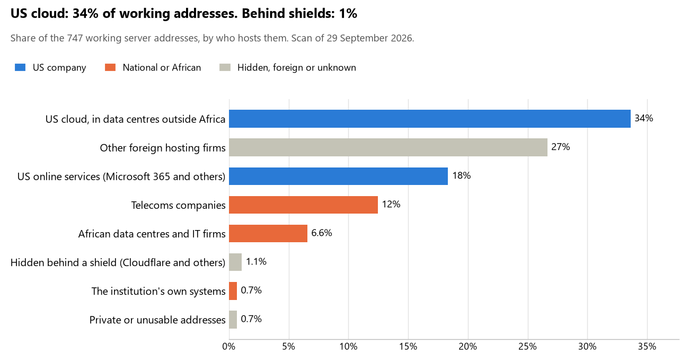

# Guinea: who hosts the state's front door

29 September 2026 · Bill Anderson · scan of 29 September 2026

The scan covered 33 state bodies, banks and state-owned companies in Guinea. 34% of their working server addresses are on US cloud: Amazon, Microsoft, Google or Oracle. 1% are behind shields such as Cloudflare, which hide the host. <1% are on government data centres or the institutions' own systems.

The scan found 610 web and mail names and 747 working addresses. 21 of the 33 institutions use US cloud for at least part of their estate. 12 use Microsoft for email and 2 use Google.

Of the 54 countries scanned so far, Guinea has the 2nd highest US cloud share (median 13%) and the 47th highest share behind shields (median 12%).

## Where it lives

251 addresses are on US cloud. Where they are: 46% in North America, 27% in Europe, 25% on worldwide delivery networks (no fixed location) and 2% in a region the providers do not publish.

8 addresses are behind shields: Cloudflare (100%). The host behind a shield cannot be seen, so the US cloud share is a minimum.

## Banks against government

| Share of working addresses | Government (29) | Banks (4) |
| --- | --- | --- |
| On US cloud | 33% | 36% |
| …of which in Africa | 0% | 0% |
| US online services (Microsoft 365 and others) | 19% | 13% |
| Behind a shield | 1% | 0% |
| Government data centres | 0% | 0% |
| Run by the institution itself | <1% | 0% |
| Telecoms companies | 13% | 7% |
| African data centres and IT firms | 7% | 0% |
| Other foreign hosting firms | 25% | 44% |

2 of 4 banks and 19 of 29 government bodies use US cloud somewhere. "Government" includes the central bank, the payment switch, the stock exchange and the state-owned companies.

## Email

12 of the 33 institutions use Microsoft 365 for email and 2 use Google.

- **Microsoft 365:** 12. Conseil national de la transition, Ministère de l'Administration du territoire et de la Décentralisation, Banque centrale de la République de Guinée, AFG Bank Guinée, FirstBank Guinée, Ministère de la Santé et de l'Hygiène publique, Guinéenne de Monétique, Électricité de Guinée, Agence nationale de digitalisation de l'État, Autorité de régulation des postes et télécommunications, Cour des comptes and Agence nationale de lutte contre la corruption et de promotion de la bonne gouvernance.
- **Google:** 2. Ministère du Budget and Caisse nationale de sécurité sociale.
- **Telecoms companies:** 2. Direction générale des douanes (Telecom) and Banque Populaire Maroco-Guinéenne (Wana Corporate).
- **US cloud:** 10. Présidence de la République de Guinée, Ministère des Affaires étrangères, de l'Intégration africaine et des Guinéens établis à l'étranger, Ministère de la Défense nationale, Ministère de la Justice et des Droits de l'Homme, Ministère de l'Économie et des Finances, Direction générale des impôts, Direction générale des élections, Ministère de l'Urbanisme, de l'Habitat et de l'Aménagement du territoire, Port autonome de Conakry and Société de gestion et d'exploitation du backbone national.
- **Foreign hosting firms:** 4. Banque Islamique de Guinée (Groupe LWS SARL), Agence nationale d'inclusion économique et sociale (Unified Layer), Autorité de régulation des marchés publics (OVH) and Agence nationale de la sécurité des systèmes d'information (Ikoula Net SAS).
- **No mail on the domain scanned:** 3. Ministère de la Sécurité et de la Protection civile, Institut national de la statistique and Portail officiel e-Gouv (zone gov.gn).

## Institution by institution

Each figure is a share of that institution's working addresses. The rest are with telecoms companies, African data centres, US online services or foreign hosts. Rows follow the order of institution types.

| Institution | Type | On US cloud | …in Africa | Behind a shield | Own or government | Email |
| --- | --- | --- | --- | --- | --- | --- |
| Présidence de la République de Guinée | Presidency | 93% | 0% | 0% | 0% | US cloud |
| Conseil national de la transition | Parliament | 42% | 0% | 0% | 0% | Microsoft |
| Ministère des Affaires étrangères, de l'Intégration africaine et des Guinéens établis à l'étranger | Foreign Affairs | 92% | 0% | 0% | 0% | US cloud |
| Ministère de la Défense nationale | Defence | 100% | 0% | 0% | 0% | US cloud |
| Ministère de la Sécurité et de la Protection civile | Police | no working address | | | | — |
| Ministère de la Justice et des Droits de l'Homme | Justice | 100% | 0% | 0% | 0% | US cloud |
| Ministère de l'Économie et des Finances | Treasury / Finance | 68% | 0% | 0% | 0% | US cloud |
| Ministère du Budget | Treasury / Finance | 0% | 0% | 0% | 0% | Google |
| Direction générale des impôts | Revenue Service | 56% | 0% | 0% | 0% | US cloud |
| Direction générale des douanes | Customs | 0% | 0% | 0% | 0% | Telecoms |
| Ministère de l'Administration du territoire et de la Décentralisation | Interior / Home Affairs | 44% | 0% | 0% | 0% | Microsoft |
| Banque centrale de la République de Guinée | Central Bank | 0% | 0% | 0% | 0% | Microsoft |
| AFG Bank Guinée | Commercial Banks | 54% | 0% | 0% | 0% | Microsoft |
| Banque Islamique de Guinée | Commercial Banks | 0% | 0% | 0% | 0% | Foreign host |
| Banque Populaire Maroco-Guinéenne | Commercial Banks | 0% | 0% | 0% | 0% | Telecoms |
| FirstBank Guinée | Commercial Banks | 100% | 0% | 0% | 0% | Microsoft |
| Direction générale des élections | Electoral commission | 20% | 0% | 0% | 0% | US cloud |
| Institut national de la statistique | Statistics office | 0% | 0% | 0% | 0% | — |
| Ministère de la Santé et de l'Hygiène publique | Health ministry / National health insurance | 32% | 0% | 0% | 0% | Microsoft |
| Agence nationale d'inclusion économique et sociale | Social protection / Social registry | 0% | 0% | 0% | 0% | Foreign host |
| Ministère de l'Urbanisme, de l'Habitat et de l'Aménagement du territoire | Land registry | 84% | 0% | 0% | 0% | US cloud |
| Guinéenne de Monétique | National payment switch | 0% | 0% | 0% | 0% | Microsoft |
| Caisse nationale de sécurité sociale | Sovereign wealth fund / National pension fund | 40% | 0% | 0% | 0% | Google |
| Autorité de régulation des marchés publics | Public procurement authority | 0% | 0% | 0% | 0% | Foreign host |
| Électricité de Guinée | Energy utility | 24% | 0% | 11% | 0% | Microsoft |
| Port autonome de Conakry | Ports authority | 100% | 0% | 0% | 0% | US cloud |
| Société de gestion et d'exploitation du backbone national | State-owned telco / National backbone operator | 67% | 0% | 0% | 28% | US cloud |
| Agence nationale de digitalisation de l'État | E-government agency | 29% | 0% | 0% | 0% | Microsoft |
| Portail officiel e-Gouv (zone gov.gn) | E-government agency | no working address | | | | — |
| Agence nationale de la sécurité des systèmes d'information | Cybersecurity agency / National CERT | 6% | 0% | 24% | 0% | Foreign host |
| Autorité de régulation des postes et télécommunications | Communications regulator | 20% | 0% | 0% | 0% | Microsoft |
| Cour des comptes | Audit office | 55% | 0% | 0% | 0% | Microsoft |
| Agence nationale de lutte contre la corruption et de promotion de la bonne gouvernance | Anti-corruption commission | 0% | 0% | 0% | 0% | Microsoft |

No institution or working domain was found for 8 of the 36 types: Armed Forces, Intelligence, Civil registry / National ID authority, Data protection authority, Immigration / Passports, Stock exchange, Securities regulator and National data centre / Government cloud operator.

## What stood out

- **Most on US cloud.** Port autonome de Conakry (100%), Ministère de la Justice et des Droits de l'Homme (100%), Ministère de la Défense nationale (100%), FirstBank Guinée (100%) and Présidence de la République de Guinée (93%) have more than half their working addresses on US cloud. 7 more are over half.
- **Little US cloud in Africa.** 0% of Guinea's US cloud addresses are in the providers' African data centres.
- **Core state bodies on foreign hosting firms.** Ministère des Affaires étrangères, de l'Intégration africaine et des Guinéens établis à l'étranger (TM TECHNOLOGY SERVICES SDN. BHD.), Ministère de l'Économie et des Finances (DigitalOcean), Ministère du Budget (Hetzner and Atlantic Metro Communications II, Inc.), Direction générale des impôts (Contabo), Direction générale des douanes (Hetzner) and Banque centrale de la République de Guinée (OVH).
- **No Chinese cloud.** The scan found no address on Huawei, Alibaba or Tencent cloud.

## What this can and cannot tell you

The scan sees only the front door: websites, email, login portals, remote-access gateways and online banking. It cannot see where a bank's core ledger, the ID register or the payroll run.

- **Every US figure is a minimum.** Anything behind a shield or a mail filter could also be on US cloud. In Guinea that is 1% of working addresses.
- **It counts addresses, not importance.** An institution with many test and marketing sites weighs more than one with few.
- **The list of institutions was drawn up for this scan.** Each domain was checked to exist, not confirmed as the institution's main one.
- **It is a snapshot.** Every figure is as of 29 September 2026.
- **Nothing was touched.** The scan used public address lookups, public certificate records and the cloud companies' published address lists. It never connected to any institution's systems.

The data and method are in `R&D/Hyperscaler-dependence/scan/GIN/` and `R&D/Hyperscaler-dependence/HYPERSCALER-SCAN.md` in the Corpus repository.
