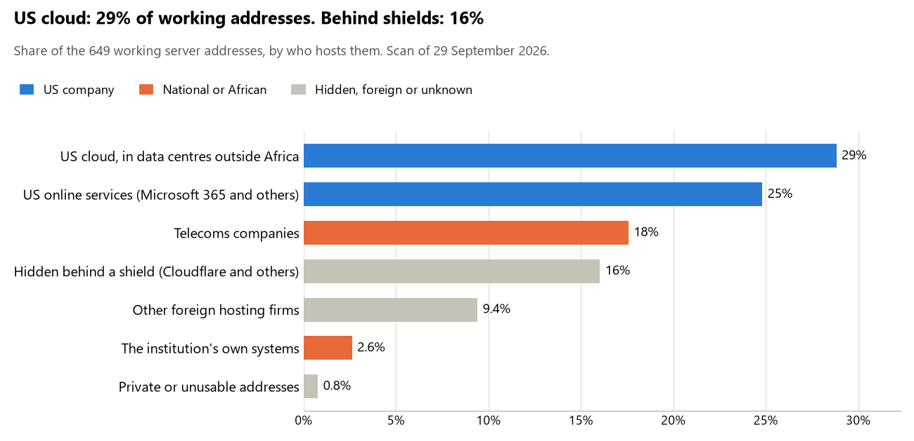

# Gambia: who hosts the state's front door

29 September 2026 · Bill Anderson · scan of 29 September 2026

The scan covered 30 state bodies, banks and state-owned companies in Gambia. 29% of their working server addresses are on US cloud: Amazon, Microsoft, Google or Oracle. 16% are behind shields such as Cloudflare, which hide the host. 3% are on government data centres or the institutions' own systems.

The scan found 407 web and mail names and 649 working addresses. 12 of the 30 institutions use US cloud for at least part of their estate. 12 use Microsoft for email and 1 use Google.

Of the 54 countries scanned so far, Gambia has the 5th highest US cloud share (median 13%) and the 21st highest share behind shields (median 12%).

## Where it lives

187 addresses are on US cloud. Where they are: 59% in Europe, 19% in North America, 13% on worldwide delivery networks (no fixed location) and 9% in a region the providers do not publish.

104 addresses are behind shields: Cloudflare (93%), Fastly (4%) and Imperva (3%). The host behind a shield cannot be seen, so the US cloud share is a minimum.

## Banks against government

| Share of working addresses | Government (24) | Banks (6) |
| --- | --- | --- |
| On US cloud | 28% | 30% |
| …of which in Africa | 0% | 0% |
| US online services (Microsoft 365 and others) | 25% | 24% |
| Behind a shield | 19% | 8% |
| Government data centres | 0% | 0% |
| Run by the institution itself | 3% | <1% |
| Telecoms companies | 18% | 16% |
| African data centres and IT firms | 0% | 0% |
| Other foreign hosting firms | 5% | 21% |

3 of 6 banks and 9 of 24 government bodies use US cloud somewhere. "Government" includes the central bank, the payment switch, the stock exchange and the state-owned companies.

## Email

12 of the 30 institutions use Microsoft 365 for email and 1 use Google.

- **Microsoft 365:** 12. Gambia Revenue Authority, Central Bank of The Gambia, Zenith Bank Gambia Limited, Arab Gambian Islamic Bank, Banque Sahelo-Saharienne pour l'Investissement et le Commerce Gambia, Vista Bank (Gambia) Limited, Gambia Bureau of Statistics, Gamswitch, Social Security and Housing Finance Corporation, National Water and Electricity Company, Gambia Ports Authority and Public Utilities Regulatory Authority.
- **Google:** 1. Independent Electoral Commission.
- **Own mail servers:** 1. Gamtel.
- **Telecoms companies:** 3. Office of the President (QCell Limited), Gambia Police Force (Gamtel Co.) and Ministry of Information and Communication Infrastructure (Gamtel Co.).
- **US cloud:** 1. National Assembly of The Gambia.
- **Foreign hosting firms:** 3. Trust Bank Limited (Unified Layer), Gambia Public Procurement Authority (Contabo) and National Audit Office (Newfold Digital, Inc.).
- **Not identified:** 8. Ministry of Foreign Affairs, Ministry of Defence, Ministry of Justice, Judiciary of The Gambia, Ministry of Finance and Economic Affairs, Ministry of Interior, Gambia Immigration Department and Ministry of Health.
- **No mail on the domain scanned:** 1. Mega Bank Gambia Limited.

## Institution by institution

Each figure is a share of that institution's working addresses. The rest are with telecoms companies, African data centres, US online services or foreign hosts. Rows follow the order of institution types.

| Institution | Type | On US cloud | …in Africa | Behind a shield | Own or government | Email |
| --- | --- | --- | --- | --- | --- | --- |
| Office of the President | Presidency | 0% | 0% | 0% | 0% | Telecoms |
| National Assembly of The Gambia | Parliament | 85% | 0% | 0% | 0% | US cloud |
| Ministry of Foreign Affairs | Foreign Affairs | 0% | 0% | 0% | 0% | Not identified |
| Ministry of Defence | Defence | 0% | 0% | 0% | 0% | Not identified |
| Gambia Police Force | Police | 0% | 0% | 0% | 0% | Telecoms |
| Ministry of Justice | Justice | 0% | 0% | 0% | 0% | Not identified |
| Judiciary of The Gambia | Justice | 0% | 0% | 0% | 0% | Not identified |
| Ministry of Finance and Economic Affairs | Treasury / Finance | 0% | 0% | 0% | 0% | Not identified |
| Gambia Revenue Authority | Revenue Service | 45% | 0% | 0% | 0% | Microsoft |
| Ministry of Interior | Interior / Home Affairs | 0% | 0% | 0% | 0% | Not identified |
| Central Bank of The Gambia | Central Bank | 17% | 0% | 0% | 0% | Microsoft |
| Trust Bank Limited | Commercial Banks | 0% | 0% | 25% | 0% | Foreign host |
| Zenith Bank Gambia Limited | Commercial Banks | 13% | 0% | 13% | 4% | Microsoft |
| Arab Gambian Islamic Bank | Commercial Banks | 0% | 0% | 0% | 0% | Microsoft |
| Banque Sahelo-Saharienne pour l'Investissement et le Commerce Gambia | Commercial Banks | 42% | 0% | 11% | 0% | Microsoft |
| Mega Bank Gambia Limited | Commercial Banks | 0% | 0% | 20% | 0% | — |
| Vista Bank (Gambia) Limited | Commercial Banks | 63% | 0% | 0% | 0% | Microsoft |
| Independent Electoral Commission | Electoral commission | 0% | 0% | 86% | 0% | Google |
| Gambia Bureau of Statistics | Statistics office | 58% | 0% | 0% | 0% | Microsoft |
| Gambia Immigration Department | Immigration / Passports | 0% | 0% | 0% | 0% | Not identified |
| Ministry of Health | Health ministry / National health insurance | 0% | 0% | 0% | 0% | Not identified |
| Gamswitch | National payment switch | 14% | 0% | 3% | 0% | Microsoft |
| Social Security and Housing Finance Corporation | Sovereign wealth fund / National pension fund | 39% | 0% | 9% | 0% | Microsoft |
| Gambia Public Procurement Authority | Public procurement authority | 90% | 0% | 0% | 0% | Foreign host |
| National Water and Electricity Company | Energy utility | 55% | 0% | 0% | 0% | Microsoft |
| Gambia Ports Authority | Ports authority | 50% | 0% | 4% | 0% | Microsoft |
| Gamtel | State-owned telco / National backbone operator | 0% | 0% | 0% | 100% | Own servers |
| Ministry of Information and Communication Infrastructure | E-government agency | 0% | 0% | 0% | 0% | Telecoms |
| Public Utilities Regulatory Authority | Communications regulator | 0% | 0% | 79% | 0% | Microsoft |
| National Audit Office | Audit office | 0% | 0% | 0% | 0% | Foreign host |

No institution or working domain was found for 12 of the 36 types: Armed Forces, Customs, Intelligence, Civil registry / National ID authority, Data protection authority, Social protection / Social registry, Land registry, Stock exchange, Securities regulator, National data centre / Government cloud operator, Cybersecurity agency / National CERT and Anti-corruption commission.

## What stood out

- **Most on US cloud.** Gambia Public Procurement Authority (90%), National Assembly of The Gambia (85%), Vista Bank (Gambia) Limited (63%), Gambia Bureau of Statistics (57%) and National Water and Electricity Company (55%) have more than half their working addresses on US cloud. 1 more are over half.
- **Little US cloud in Africa.** 0% of Gambia's US cloud addresses are in the providers' African data centres.
- **Core state bodies on foreign hosting firms.** National Assembly of The Gambia (DigitalOcean).
- **No Chinese cloud.** The scan found no address on Huawei, Alibaba or Tencent cloud.

## What this can and cannot tell you

The scan sees only the front door: websites, email, login portals, remote-access gateways and online banking. It cannot see where a bank's core ledger, the ID register or the payroll run.

- **Every US figure is a minimum.** Anything behind a shield or a mail filter could also be on US cloud. In Gambia that is 16% of working addresses.
- **It counts addresses, not importance.** An institution with many test and marketing sites weighs more than one with few.
- **The list of institutions was drawn up for this scan.** Each domain was checked to exist, not confirmed as the institution's main one.
- **It is a snapshot.** Every figure is as of 29 September 2026.
- **Nothing was touched.** The scan used public address lookups, public certificate records and the cloud companies' published address lists. It never connected to any institution's systems.

The data and method are in `R&D/Hyperscaler-dependence/scan/GMB/` and `R&D/Hyperscaler-dependence/HYPERSCALER-SCAN.md` in the Corpus repository.
