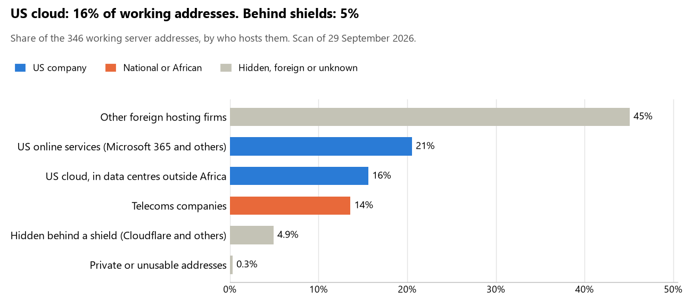

# Guinea-Bissau: who hosts the state's front door

29 September 2026 · Bill Anderson · scan of 29 September 2026

The scan covered 20 state bodies, banks and state-owned companies in Guinea-Bissau. 16% of their working server addresses are on US cloud: Amazon, Microsoft, Google or Oracle. 5% are behind shields such as Cloudflare, which hide the host. 0% are on government data centres or the institutions' own systems.

The scan found 276 web and mail names and 346 working addresses. 6 of the 20 institutions use US cloud for at least part of their estate. 5 use Microsoft for email and 3 use Google.

Of the 54 countries scanned so far, Guinea-Bissau has the 24th highest US cloud share (median 13%) and the 41st highest share behind shields (median 12%).

## Where it lives

54 addresses are on US cloud. Where they are: 52% on worldwide delivery networks (no fixed location), 28% in a region the providers do not publish, 17% in Europe and 4% in North America.

17 addresses are behind shields: Cloudflare (100%). The host behind a shield cannot be seen, so the US cloud share is a minimum.

## Banks against government

| Share of working addresses | Government (18) | Banks (2) |
| --- | --- | --- |
| On US cloud | 17% | 0% |
| …of which in Africa | 0% | 0% |
| US online services (Microsoft 365 and others) | 18% | 38% |
| Behind a shield | 6% | 0% |
| Government data centres | 0% | 0% |
| Run by the institution itself | 0% | 0% |
| Telecoms companies | 15% | 0% |
| African data centres and IT firms | 0% | 0% |
| Other foreign hosting firms | 43% | 62% |

0 of 2 banks and 6 of 18 government bodies use US cloud somewhere. "Government" includes the central bank, the payment switch, the stock exchange and the state-owned companies.

## Email

5 of the 20 institutions use Microsoft 365 for email and 3 use Google.

- **Microsoft 365:** 5. Banco da União (BDU-SA), GIM-UEMOA, Bourse Régionale des Valeurs Mobilières (BRVM), Autorité des Marchés Financiers de l'UMOA (AMF-UMOA) and Instituto Nacional de Segurança Social (INSS).
- **Google:** 3. Banco Central dos Estados da África Ocidental (BCEAO), Banco da África Ocidental (BAO) and Autoridade Reguladora Nacional das TIC (ARN).
- **US cloud (MINSAP):** 1. Ministério da Saúde Pública.
- **Foreign hosting firms:** 6. Presidência da República da Guiné-Bissau (DOMINIOS, S.A.), Assembleia Nacional Popular (IT Services, Lda), Ministério dos Negócios Estrangeiros, Cooperação Internacional e das Comunidades (PlanetHoster), Ministério das Finanças (IT Services, Lda), Comissão Nacional de Eleições (IT Services, Lda) and Tribunal de Contas (Hosting).
- **Behind a mail filter, provider not visible:** 2. Polícia Judiciária da Guiné-Bissau and Procuradoria-Geral da República (Ministério Público).
- **No mail on the domain scanned:** 3. Instituto Nacional de Estatística (INE), Direção-Geral dos Concursos Públicos and Portal do Governo da Guiné-Bissau.

## Institution by institution

Each figure is a share of that institution's working addresses. The rest are with telecoms companies, African data centres, US online services or foreign hosts. Rows follow the order of institution types.

| Institution | Type | On US cloud | …in Africa | Behind a shield | Own or government | Email |
| --- | --- | --- | --- | --- | --- | --- |
| Presidência da República da Guiné-Bissau | Presidency | 0% | 0% | 0% | 0% | Foreign host |
| Assembleia Nacional Popular | Parliament | 0% | 0% | 0% | 0% | Foreign host |
| Ministério dos Negócios Estrangeiros, Cooperação Internacional e das Comunidades | Foreign Affairs | 0% | 0% | 0% | 0% | Foreign host |
| Polícia Judiciária da Guiné-Bissau | Police | 31% | 0% | 69% | 0% | Filtered |
| Procuradoria-Geral da República (Ministério Público) | Justice | 24% | 0% | 24% | 0% | Filtered |
| Ministério das Finanças | Treasury / Finance | 0% | 0% | 0% | 0% | Foreign host |
| Banco Central dos Estados da África Ocidental (BCEAO) | Central Bank | 10% | 0% | 0% | 0% | Google |
| Banco da África Ocidental (BAO) | Commercial Banks | 0% | 0% | 0% | 0% | Google |
| Banco da União (BDU-SA) | Commercial Banks | 0% | 0% | 0% | 0% | Microsoft |
| Comissão Nacional de Eleições | Electoral commission | 0% | 0% | 0% | 0% | Foreign host |
| Instituto Nacional de Estatística (INE) | Statistics office | 0% | 0% | 0% | 0% | — |
| Ministério da Saúde Pública (MINSAP) | Health ministry / National health insurance | 97% | 0% | 0% | 0% | US cloud |
| GIM-UEMOA | National payment switch | 0% | 0% | 0% | 0% | Microsoft |
| Bourse Régionale des Valeurs Mobilières (BRVM) | Stock exchange | 28% | 0% | 0% | 0% | Microsoft |
| Autorité des Marchés Financiers de l'UMOA (AMF-UMOA) | Securities regulator | 0% | 0% | 13% | 0% | Microsoft |
| Instituto Nacional de Segurança Social (INSS) | Sovereign wealth fund / National pension fund | 0% | 0% | 0% | 0% | Microsoft |
| Direção-Geral dos Concursos Públicos | Public procurement authority | 0% | 0% | 0% | 0% | — |
| Portal do Governo da Guiné-Bissau | E-government agency | 0% | 0% | 100% | 0% | — |
| Autoridade Reguladora Nacional das TIC (ARN) | Communications regulator | 0% | 0% | 0% | 0% | Google |
| Tribunal de Contas | Audit office | 24% | 0% | 0% | 0% | Foreign host |

No institution or working domain was found for 17 of the 36 types: Defence, Armed Forces, Revenue Service, Customs, Intelligence, Interior / Home Affairs, Civil registry / National ID authority, Data protection authority, Immigration / Passports, Social protection / Social registry, Land registry, Energy utility, Ports authority, State-owned telco / National backbone operator, National data centre / Government cloud operator, Cybersecurity agency / National CERT and Anti-corruption commission.

## What stood out

- **Most on US cloud.** Ministério da Saúde Pública (MINSAP) (97%) has more than half its working addresses on US cloud.
- **Little US cloud in Africa.** 0% of Guinea-Bissau's US cloud addresses are in the providers' African data centres.
- **Core state bodies on foreign hosting firms.** Presidência da República da Guiné-Bissau (wix and wix_com Wix.com Ltd.), Assembleia Nacional Popular (IT Services, Lda), Ministério dos Negócios Estrangeiros, Cooperação Internacional e das Comunidades (PlanetHoster), Procuradoria-Geral da República (Ministério Público) (Hostinger), Ministério das Finanças (IT Services, Lda) and Banco Central dos Estados da África Ocidental (BCEAO) (NETWORK TRANSIT HOLDINGS LLC and OVH).
- **No Chinese cloud.** The scan found no address on Huawei, Alibaba or Tencent cloud.

## What this can and cannot tell you

The scan sees only the front door: websites, email, login portals, remote-access gateways and online banking. It cannot see where a bank's core ledger, the ID register or the payroll run.

- **Every US figure is a minimum.** Anything behind a shield or a mail filter could also be on US cloud. In Guinea-Bissau that is 5% of working addresses.
- **It counts addresses, not importance.** An institution with many test and marketing sites weighs more than one with few.
- **The list of institutions was drawn up for this scan.** Each domain was checked to exist, not confirmed as the institution's main one.
- **It is a snapshot.** Every figure is as of 29 September 2026.
- **Nothing was touched.** The scan used public address lookups, public certificate records and the cloud companies' published address lists. It never connected to any institution's systems.

The data and method are in `R&D/Hyperscaler-dependence/scan/GNB/` and `R&D/Hyperscaler-dependence/HYPERSCALER-SCAN.md` in the Corpus repository.
