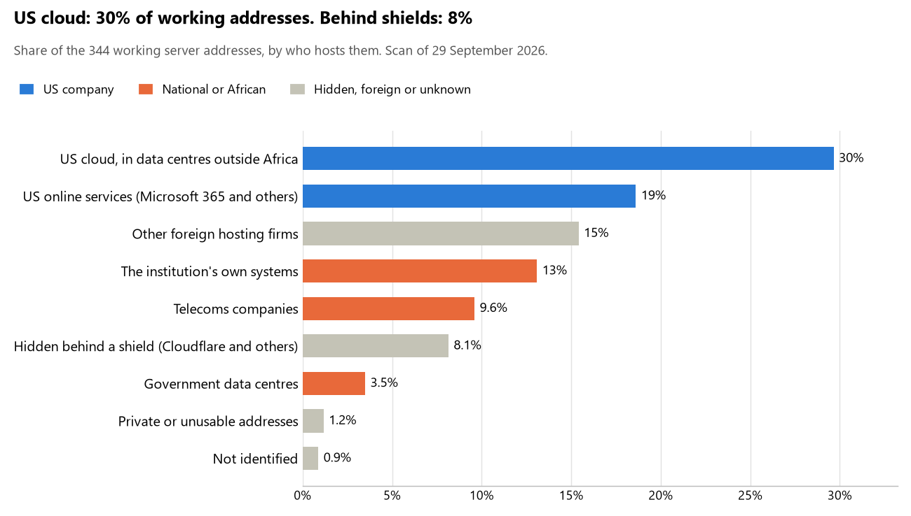

# Equatorial Guinea: who hosts the state's front door

29 September 2026 · Bill Anderson · scan of 29 September 2026

The scan covered 18 state bodies, banks and state-owned companies in Equatorial Guinea. 30% of their working server addresses are on US cloud: Amazon, Microsoft, Google or Oracle. 8% are behind shields such as Cloudflare, which hide the host. 17% are on government data centres or the institutions' own systems.

The scan found 212 web and mail names and 344 working addresses. 8 of the 18 institutions use US cloud for at least part of their estate. 7 use Microsoft for email and none use Google.

Of the 54 countries scanned so far, Equatorial Guinea has the 4th highest US cloud share (median 13%) and the 37th highest share behind shields (median 12%).

## Where it lives

102 addresses are on US cloud. Where they are: 75% in Europe, 24% in a region the providers do not publish and 2% on worldwide delivery networks (no fixed location).

28 addresses are behind shields: Cloudflare (100%). The host behind a shield cannot be seen, so the US cloud share is a minimum.

## Banks against government

| Share of working addresses | Government (15) | Banks (3) |
| --- | --- | --- |
| On US cloud | 30% | 29% |
| …of which in Africa | 0% | 0% |
| US online services (Microsoft 365 and others) | 21% | 4% |
| Behind a shield | 10% | 0% |
| Government data centres | 4% | 0% |
| Run by the institution itself | 11% | 25% |
| Telecoms companies | 8% | 19% |
| African data centres and IT firms | 0% | 0% |
| Other foreign hosting firms | 15% | 17% |

1 of 3 banks and 7 of 15 government bodies use US cloud somewhere. "Government" includes the central bank, the payment switch, the stock exchange and the state-owned companies.

## Email

7 of the 18 institutions use Microsoft 365 for email and none use Google.

- **Microsoft 365:** 7. CCEI Bank GE, Bourse des Valeurs Mobilières de l'Afrique Centrale (BVMAC), Commission de Surveillance du Marché Financier de l'Afrique Centrale (COSUMAF), Sociedad de Electricidad de Guinea Ecuatorial (SEGESA), General de Telecomunicaciones SA (GETESA), Gestor de Infraestructuras de Telecomunicaciones de Guinea Ecuatorial (GITGE) and Gobierno de la República de Guinea Ecuatorial.
- **Government data centre (Gestora de Infraestructuras de Telecomunicaciones de Guinea Ecuatorial):** 2. Presidencia del Gobierno and Ministerio de Asuntos Exteriores y de Cooperación Internacional y Diaspora.
- **Own mail servers (SGBGE):** 1. Société Générale de Banques en Guinée Équatoriale.
- **Telecoms companies (CAMTEL):** 1. Banque des États de l'Afrique Centrale (BEAC).
- **US cloud (INEGE):** 1. Instituto Nacional de Estadística de Guinea Ecuatorial.
- **Foreign hosting firms:** 3. Senado de Guinea Ecuatorial (IONOS), Ministerio de Hacienda y Presupuestos (cloudbuilders Cloud Builders SA) and Órgano Regulador de Telecomunicaciones (ORTEL) (GoDaddy).
- **Behind a mail filter, provider not visible (BANGE):** 1. Banco Nacional de Guinea Ecuatorial.
- **No mail on the domain scanned:** 2. Ministerio de Sanidad y Bienestar Social (MINSABS) and GIMAC.

## Institution by institution

Each figure is a share of that institution's working addresses. The rest are with telecoms companies, African data centres, US online services or foreign hosts. Rows follow the order of institution types.

| Institution | Type | On US cloud | …in Africa | Behind a shield | Own or government | Email |
| --- | --- | --- | --- | --- | --- | --- |
| Presidencia del Gobierno | Presidency | 0% | 0% | 0% | 100% | Government |
| Senado de Guinea Ecuatorial | Parliament | 0% | 0% | 0% | 0% | Foreign host |
| Ministerio de Asuntos Exteriores y de Cooperación Internacional y Diaspora | Foreign Affairs | 0% | 0% | 0% | 100% | Government |
| Ministerio de Hacienda y Presupuestos | Treasury / Finance | 0% | 0% | 0% | 0% | Foreign host |
| Banque des États de l'Afrique Centrale (BEAC) | Central Bank | 33% | 0% | 0% | 0% | Telecoms |
| CCEI Bank GE | Commercial Banks | 58% | 0% | 0% | 0% | Microsoft |
| Banco Nacional de Guinea Ecuatorial (BANGE) | Commercial Banks | 0% | 0% | 0% | 14% | Filtered |
| Société Générale de Banques en Guinée Équatoriale (SGBGE) | Commercial Banks | 0% | 0% | 0% | 92% | Own servers |
| Instituto Nacional de Estadística de Guinea Ecuatorial (INEGE) | Statistics office | 64% | 0% | 29% | 0% | US cloud |
| Ministerio de Sanidad y Bienestar Social (MINSABS) | Health ministry / National health insurance | 0% | 0% | 100% | 0% | — |
| GIMAC | National payment switch | 0% | 0% | 0% | 0% | — |
| Bourse des Valeurs Mobilières de l'Afrique Centrale (BVMAC) | Stock exchange | 0% | 0% | 0% | 0% | Microsoft |
| Commission de Surveillance du Marché Financier de l'Afrique Centrale (COSUMAF) | Securities regulator | 47% | 0% | 26% | 0% | Microsoft |
| Sociedad de Electricidad de Guinea Ecuatorial (SEGESA) | Energy utility | 46% | 0% | 0% | 0% | Microsoft |
| General de Telecomunicaciones SA (GETESA) | State-owned telco / National backbone operator | 17% | 0% | 0% | 29% | Microsoft |
| Gestor de Infraestructuras de Telecomunicaciones de Guinea Ecuatorial (GITGE) | State-owned telco / National backbone operator | 21% | 0% | 0% | 40% | Microsoft |
| Gobierno de la República de Guinea Ecuatorial | E-government agency | 0% | 0% | 0% | 89% | Microsoft |
| Órgano Regulador de Telecomunicaciones (ORTEL) | Communications regulator | 45% | 0% | 0% | 0% | Foreign host |

No institution or working domain was found for 21 of the 36 types: Defence, Armed Forces, Police, Justice, Revenue Service, Customs, Intelligence, Interior / Home Affairs, Civil registry / National ID authority, Data protection authority, Electoral commission, Immigration / Passports, Social protection / Social registry, Land registry, Sovereign wealth fund / National pension fund, Public procurement authority, Ports authority, National data centre / Government cloud operator, Cybersecurity agency / National CERT, Audit office and Anti-corruption commission.

## What stood out

- **Most on US cloud.** Instituto Nacional de Estadística de Guinea Ecuatorial (INEGE) (64%) and CCEI Bank GE (58%) have more than half their working addresses on US cloud.
- **Little US cloud in Africa.** 0% of Equatorial Guinea's US cloud addresses are in the providers' African data centres.
- **Core state bodies at home.** Presidencia del Gobierno (100%) and Ministerio de Asuntos Exteriores y de Cooperación Internacional y Diaspora (100%) keep at least 80% of their working addresses on government data centres or their own systems.
- **Core state bodies on foreign hosting firms.** Senado de Guinea Ecuatorial (IONOS), Ministerio de Hacienda y Presupuestos (cloudbuilders Cloud Builders SA) and Banque des États de l'Afrique Centrale (BEAC) (OVH).
- **No Chinese cloud.** The scan found no address on Huawei, Alibaba or Tencent cloud.

## What this can and cannot tell you

The scan sees only the front door: websites, email, login portals, remote-access gateways and online banking. It cannot see where a bank's core ledger, the ID register or the payroll run.

- **Every US figure is a minimum.** Anything behind a shield or a mail filter could also be on US cloud. In Equatorial Guinea that is 8% of working addresses.
- **It counts addresses, not importance.** An institution with many test and marketing sites weighs more than one with few.
- **The list of institutions was drawn up for this scan.** Each domain was checked to exist, not confirmed as the institution's main one.
- **It is a snapshot.** Every figure is as of 29 September 2026.
- **Nothing was touched.** The scan used public address lookups, public certificate records and the cloud companies' published address lists. It never connected to any institution's systems.

The data and method are in `R&D/Hyperscaler-dependence/scan/GNQ/` and `R&D/Hyperscaler-dependence/HYPERSCALER-SCAN.md` in the Corpus repository.
