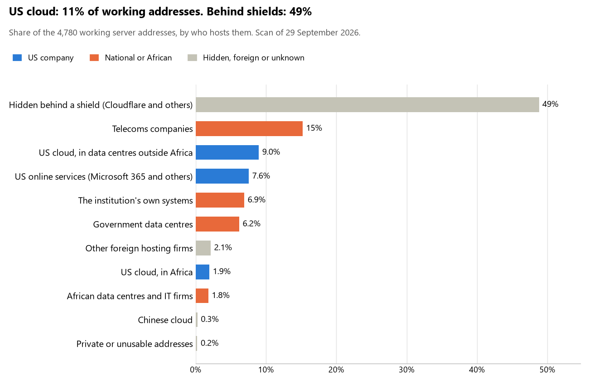

# Kenya: who hosts the state's front door

28 September 2026 · Bill Anderson

About one tenth (11%) of the public-facing systems of 50 Kenyan state bodies, banks and utilities run on Amazon, Microsoft, Google or Oracle. That is well under South Africa's 28%. Almost half (48%) sit behind Cloudflare and similar shields, so we can't see who hosts them. About one eighth (13%) run on the government's own data centres or the institutions' own systems.

The scan covered the main ministries and agencies, the ten largest banks, the payment switch, the stock exchange and the big state-owned companies, Safaricom included. It found 3,645 web and mail names, pointing to 4,747 working server addresses. 29 of the 50 use US cloud for at least part of their public estate. 26 use Microsoft for email, and 5 use Google.

## Where it lives

Where Kenya does use US cloud, it mostly uses Europe. About half of the 521 US-cloud addresses are in Microsoft's Dublin and Amsterdam data centres or Amazon's in Ireland. A quarter are Amazon's and Microsoft's worldwide delivery networks, and under a fifth are in South Africa. The US itself hosts almost none.

The shield half is the part we cannot see into. Cloudflare fronts most of it and Imperva most of the rest. The servers behind them could be anywhere, including on US cloud, so the 11% is a floor, not a ceiling.

## Banks against government

Kenya's banks lean on US cloud more than twice as much as its government does. The government leans instead on telecoms companies and its own data centres.

| Share of working addresses | Government (40 bodies) | Banks (10) |
| --- | --- | --- |
| On US cloud | 8% | 20% |
| …of which hosted in South Africa | 2% | 1% |
| US online services (Microsoft 365 and others) | 7% | 12% |
| Hidden behind a shield | 45% | 55% |
| Government data centres | 9% | — |
| Run by the institution itself | 8% | 5% |
| Run by telecoms companies | 20% | 4% |

"Government" here includes the Central Bank, the payment switch, the stock exchange and the state-owned companies (Kenya Power, KenGen, the ports, Telkom Kenya and Safaricom). Eight of the ten banks use US cloud somewhere; so do 21 of the 40 government bodies.

## Email

Microsoft carries the email of 26 of the 50 institutions. But the heart of government runs its mail through its own national data centre at Konza.

- **Microsoft 365:** 26, including Parliament, the Judiciary, the Central Bank, the electoral commission and eight of the ten banks.
- **The government's own data centre (Konza):** 9. They are the Office of the President, the Treasury, Foreign Affairs, Interior, Immigration, Health, Lands, Social Protection and the ICT Authority.
- **Google:** 5. They are eCitizen, the ICT ministry, the statistics bureau, the tenders portal and PesaLink.
- **Local providers or their own servers:** 4. Defence uses Telkom Kenya, the anti-corruption commission uses Safaricom and the revenue authority runs its own. The NSSF uses Host Africa, a South African host.
- **Amazon:** the National Police Service.
- **Behind a mail filter, provider unseen:** Safaricom.
- **No mail on the domain scanned:** 4. They are the Attorney General, the intelligence service, Absa Kenya and Stanbic Kenya, which probably use other domains.

## Institution by institution

Prime Bank, the Auditor-General and NCBA lean hardest on US cloud. Konza, Stanbic, DTB, Family Bank and Safaricom hide most of their estate behind a shield. Each figure is a share of that institution's working addresses. Whatever a row does not add up to sits with telecoms companies, African data centres, US online services or foreign hosts.

| Institution | Sector | On US cloud | …of which in SA | Behind a shield | Own or government | Email |
| --- | --- | --- | --- | --- | --- | --- |
| Prime Bank | Bank | 53% | 0% | 8% | 7% | Microsoft |
| Office of the Auditor-General | Government | 52% | 0% | 0% | 0% | Microsoft |
| NCBA Group | Bank | 48% | 3% | 16% | 14% | Microsoft |
| Equity Bank | Bank | 44% | 0% | 10% | 19% | Microsoft |
| Absa Bank Kenya | Bank | 37% | 18% | 33% | 13% | — |
| Procurement regulator (PPRA) | Government | 32% | 0% | 0% | 0% | Microsoft |
| Social Health Authority | Government | 31% | 27% | 29% | 0% | Microsoft |
| National KE-CIRT/CC | Government | 26% | 0% | 0% | 0% | Microsoft |
| Communications Authority | Government | 25% | 0% | 6% | 0% | Microsoft |
| Co-operative Bank of Kenya | Bank | 22% | 0% | 4% | 15% | Microsoft |
| Nairobi Securities Exchange | Government | 22% | 3% | 0% | 0% | Microsoft |
| Kenya Ports Authority | Government | 19% | 0% | 4% | 26% | Microsoft |
| Electoral commission (IEBC) | Government | 18% | 0% | 0% | 0% | Microsoft |
| Capital Markets Authority | Government | 15% | 0% | 0% | 0% | Microsoft |
| KenGen | Government | 14% | 0% | 24% | 1% | Microsoft |
| Diamond Trust Bank | Bank | 14% | 0% | 74% | 6% | Microsoft |
| KCB Group | Bank | 13% | 0% | 64% | 0% | Microsoft |
| Stanbic Bank Kenya | Bank | 11% | 0% | 86% | 0% | — |
| Kenya Power | Government | 10% | 0% | 10% | 14% | Microsoft |
| Retirement Benefits Authority | Government | 9% | 0% | 11% | 0% | Microsoft |
| Ministry of Health | Government | 9% | 7% | 0% | 43% | Konza (government) |
| Safaricom | Government | 8% | 0% | 70% | 18% | Filtered (Cisco) |
| Ministry of Interior | Government | 8% | 0% | 0% | 58% | Konza (government) |
| National Police Service | Government | 8% | 0% | 0% | 31% | Amazon |
| ICT Authority | Government | 4% | 1% | 1% | 71% | Konza (government) |
| Kenya Revenue Authority | Government | 3% | 0% | 3% | 66% | Own servers |
| Parliament of Kenya | Government | 3% | 0% | 80% | 0% | Microsoft |
| Telkom Kenya | Government | 3% | 0% | 0% | 74% | Microsoft |
| eCitizen | Government | 1% | 0% | 52% | 0% | Google |
| Office of the President | Government | 0% | 0% | 21% | 32% | Konza (government) |
| Foreign Affairs | Government | 0% | 0% | 0% | 62% | Konza (government) |
| Defence and KDF | Government | 0% | 0% | 0% | 0% | Telkom Kenya |
| Judiciary of Kenya | Government | 0% | 0% | 0% | 6% | Microsoft |
| Office of the Attorney General | Government | 0% | 0% | 0% | 50% | — |
| The National Treasury | Government | 0% | 0% | 0% | 54% | Konza (government) |
| National Intelligence Service | Government | 0% | 0% | 0% | 0% | — |
| Central Bank of Kenya | Government | 0% | 0% | 7% | 36% | Microsoft |
| I&M Bank | Bank | 0% | 0% | 67% | 0% | Microsoft |
| Family Bank | Bank | 0% | 0% | 70% | 8% | Microsoft |
| Department of Immigration Services | Government | 0% | 0% | 36% | 36% | Konza (government) |
| Data Protection Commissioner | Government | 0% | 0% | 3% | 48% | Microsoft |
| Statistics (KNBS) | Government | 0% | 0% | 3% | 62% | Google |
| National Social Security Fund | Government | 0% | 0% | 0% | 0% | Host Africa |
| Social Protection department | Government | 0% | 0% | 0% | 72% | Konza (government) |
| Ministry of Lands (Ardhisasa) | Government | 0% | 0% | 0% | 54% | Konza (government) |
| PesaLink (IPSL) | Government | 0% | 0% | 67% | 0% | Google |
| Government tenders portal | Government | 0% | 0% | 0% | 0% | Google |
| Konza Technopolis | Government | 0% | 0% | 97% | 3% | Microsoft |
| Anti-corruption (EACC) | Government | 0% | 0% | 0% | 0% | Safaricom |
| Ministry of ICT and Digital Economy | Government | 0% | 0% | 0% | 60% | Google |

## What stood out

- **Central government keeps its mail at home.** The Presidency, the Treasury, Foreign Affairs, Interior and five more bodies route email through Konza, the national data centre. The core of government mail is not with Microsoft or Google.
- **Some sensitive bodies use budget foreign web hosts.** Part of the Office of the President's web estate sits with Network Solutions, a US host, and Contabo, a German budget server firm. Defence, the Judiciary and the Ministry of Health also have servers at Contabo. Part of the intelligence service's website is with WHG, a UK hosting firm.
- **Two banks run on their South African parents.** Absa Kenya's own systems are on Absa's South African network. Stanbic Kenya hides 86% of its estate behind a shield.
- **The Social Health Authority keeps its cloud in Africa.** A quarter of its estate is in Amazon's and Microsoft's South African data centres, the highest share of any Kenyan body.
- **A little Chinese cloud.** Three Safaricom addresses run on Huawei Cloud, the only Chinese cloud the scan found.
- **One Safaricom web address points at a deleted cloud name that anyone could claim.** Whoever claims it could publish under a Safaricom address. We have flagged it and are not naming it here.

## What this can and cannot tell you

The scan sees only the front door: websites, email, login portals, remote-access gateways and online banking. It cannot see where a bank's core ledger, the ID register or the payroll actually run.

- **Every US figure is a floor.** Anything behind a shield or a mail filter could also be on US cloud, and we cannot tell. In Kenya that is half the estate, so the floor is low.
- **It counts addresses, not importance.** An institution with many test and marketing sites weighs more than one with a few, whatever those sites do.
- **The list of institutions was drawn up for this scan.** Each domain was checked to exist, but not formally confirmed as the institution's main one.
- **It is a snapshot.** Every figure is as of 28 September 2026. Running the scan again in a year shows which way each institution is moving.
- **Nothing was touched.** The scan used public address lookups, public certificate records and the cloud companies' own published address lists. It never connected to any institution's systems.

The data and method are in `R&D/Hyperscaler-dependence/scan/KEN/` and `R&D/Hyperscaler-dependence/HYPERSCALER-SCAN.md` in the Corpus repository.
