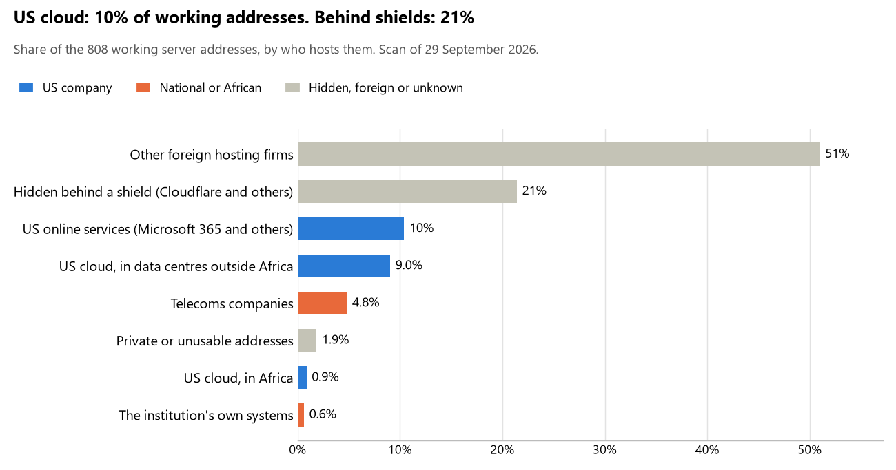

# Liberia: who hosts the state's front door

29 September 2026 · Bill Anderson · scan of 29 September 2026

The scan covered 31 state bodies, banks and state-owned companies in Liberia. 10% of their working server addresses are on US cloud: Amazon, Microsoft, Google or Oracle. 21% are behind shields such as Cloudflare, which hide the host. <1% are on government data centres or the institutions' own systems.

The scan found 684 web and mail names and 808 working addresses. 16 of the 31 institutions use US cloud for at least part of their estate. 7 use Microsoft for email and 4 use Google.

Of the 54 countries scanned so far, Liberia has the 35th highest US cloud share (median 13%) and the 14th highest share behind shields (median 12%).

## Where it lives

80 addresses are on US cloud. Where they are: 30% in Europe, 30% on worldwide delivery networks (no fixed location), 25% in a region the providers do not publish, 9% in Africa and 6% in North America.

173 addresses are behind shields: Cloudflare (95%) and Imperva (5%). The host behind a shield cannot be seen, so the US cloud share is a minimum.

## Banks against government

| Share of working addresses | Government (25) | Banks (6) |
| --- | --- | --- |
| On US cloud | 9% | 16% |
| …of which in Africa | <1% | 0% |
| US online services (Microsoft 365 and others) | 9% | 19% |
| Behind a shield | 23% | 12% |
| Government data centres | 0% | 0% |
| Run by the institution itself | 0% | 5% |
| Telecoms companies | 4% | 11% |
| African data centres and IT firms | 0% | 0% |
| Other foreign hosting firms | 53% | 36% |

4 of 6 banks and 12 of 25 government bodies use US cloud somewhere. "Government" includes the central bank, the payment switch, the stock exchange and the state-owned companies.

## Email

7 of the 31 institutions use Microsoft 365 for email and 4 use Google.

- **Microsoft 365:** 7. Liberian Senate, Ministry of Foreign Affairs, Liberia Revenue Authority, Central Bank of Liberia, Liberian Bank for Development and Investment, Afriland First Bank Liberia Limited and Liberia Electricity Corporation.
- **Google:** 4. Ministry of National Defense, Ministry of Finance and Development Planning, Liberia Institute of Statistics and Geo-Information Services and National Port Authority.
- **Foreign hosting firms:** 16. Executive Mansion (Corp.), Liberia National Police (Hetzner), Ministry of Justice (Corp.), Ministry of Internal Affairs (Corp.), International Bank (Liberia) Limited (GoDaddy.com, LLC), United Bank for Africa Liberia Limited (Host Europe), National Identification Registry (Hetzner), National Elections Commission (Contabo Inc.), Liberia Immigration Service (Hetzner), Ministry of Health (Hetzner), Ministry of Gender Children and Social Protection (Hetzner), Liberia Land Authority (GoDaddy), National Social Security and Welfare Corporation (Zoho), Public Procurement and Concessions Commission (Corp.), Liberia Telecommunications Authority (Zoho) and Liberia Anti-Corruption Commission (Corp.).
- **Behind a mail filter, provider not visible:** 1. General Auditing Commission.
- **Not identified:** 2. Guaranty Trust Bank (Liberia) Limited and AccessBank Liberia.
- **No mail on the domain scanned:** 1. Government of Liberia portal.

## Institution by institution

Each figure is a share of that institution's working addresses. The rest are with telecoms companies, African data centres, US online services or foreign hosts. Rows follow the order of institution types.

| Institution | Type | On US cloud | …in Africa | Behind a shield | Own or government | Email |
| --- | --- | --- | --- | --- | --- | --- |
| Executive Mansion | Presidency | 0% | 0% | 0% | 0% | Foreign host |
| Liberian Senate | Parliament | 11% | 0% | 0% | 0% | Microsoft |
| Ministry of Foreign Affairs | Foreign Affairs | 0% | 0% | 0% | 0% | Microsoft |
| Ministry of National Defense | Defence | 0% | 0% | 0% | 0% | Google |
| Liberia National Police | Police | 0% | 0% | 0% | 0% | Foreign host |
| Ministry of Justice | Justice | 0% | 0% | 0% | 0% | Foreign host |
| Ministry of Finance and Development Planning | Treasury / Finance | 10% | 0% | 0% | 0% | Google |
| Liberia Revenue Authority | Revenue Service | 15% | 5% | 3% | 0% | Microsoft |
| Ministry of Internal Affairs | Interior / Home Affairs | 0% | 0% | 0% | 0% | Foreign host |
| Central Bank of Liberia | Central Bank | 0% | 0% | 0% | 0% | Microsoft |
| Liberian Bank for Development and Investment | Commercial Banks | 24% | 0% | 0% | 0% | Microsoft |
| International Bank (Liberia) Limited | Commercial Banks | 15% | 0% | 0% | 15% | Foreign host |
| Guaranty Trust Bank (Liberia) Limited | Commercial Banks | 14% | 0% | 29% | 21% | Not identified |
| United Bank for Africa Liberia Limited | Commercial Banks | 18% | 0% | 45% | 0% | Foreign host |
| AccessBank Liberia | Commercial Banks | 0% | 0% | 0% | 0% | Not identified |
| Afriland First Bank Liberia Limited | Commercial Banks | 0% | 0% | 33% | 0% | Microsoft |
| National Identification Registry | Civil registry / National ID authority | 18% | 0% | 0% | 0% | Foreign host |
| National Elections Commission | Electoral commission | 0% | 0% | 99% | 0% | Foreign host |
| Liberia Institute of Statistics and Geo-Information Services | Statistics office | 17% | 0% | 0% | 0% | Google |
| Liberia Immigration Service | Immigration / Passports | 10% | 0% | 0% | 0% | Foreign host |
| Ministry of Health | Health ministry / National health insurance | 27% | 0% | 0% | 0% | Foreign host |
| Ministry of Gender Children and Social Protection | Social protection / Social registry | 0% | 0% | 0% | 0% | Foreign host |
| Liberia Land Authority | Land registry | 0% | 0% | 0% | 0% | Foreign host |
| National Social Security and Welfare Corporation | Sovereign wealth fund / National pension fund | 23% | 0% | 0% | 0% | Foreign host |
| Public Procurement and Concessions Commission | Public procurement authority | 0% | 0% | 0% | 0% | Foreign host |
| Liberia Electricity Corporation | Energy utility | 34% | 6% | 6% | 0% | Microsoft |
| National Port Authority | Ports authority | 45% | 0% | 0% | 0% | Google |
| Government of Liberia portal | E-government agency | no working address | | | | — |
| Liberia Telecommunications Authority | Communications regulator | 45% | 0% | 9% | 0% | Foreign host |
| General Auditing Commission | Audit office | 12% | 0% | 12% | 0% | Filtered |
| Liberia Anti-Corruption Commission | Anti-corruption commission | 0% | 0% | 0% | 0% | Foreign host |

No institution or working domain was found for 10 of the 36 types: Armed Forces, Customs, Intelligence, Data protection authority, National payment switch, Stock exchange, Securities regulator, State-owned telco / National backbone operator, National data centre / Government cloud operator and Cybersecurity agency / National CERT.

## What stood out

- **Little US cloud in Africa.** 9% of Liberia's US cloud addresses are in the providers' African data centres.
- **Core state bodies on foreign hosting firms.** Executive Mansion (Corp. and DigitalOcean), Ministry of Foreign Affairs (Corp.), Ministry of National Defense (Corp.), Liberia National Police (Hetzner), Ministry of Justice (Corp.) and Ministry of Finance and Development Planning (Hetzner and Contabo), and 3 more.
- **No Chinese cloud.** The scan found no address on Huawei, Alibaba or Tencent cloud.

## What this can and cannot tell you

The scan sees only the front door: websites, email, login portals, remote-access gateways and online banking. It cannot see where a bank's core ledger, the ID register or the payroll run.

- **Every US figure is a minimum.** Anything behind a shield or a mail filter could also be on US cloud. In Liberia that is 21% of working addresses.
- **It counts addresses, not importance.** An institution with many test and marketing sites weighs more than one with few.
- **The list of institutions was drawn up for this scan.** Each domain was checked to exist, not confirmed as the institution's main one.
- **It is a snapshot.** Every figure is as of 29 September 2026.
- **Nothing was touched.** The scan used public address lookups, public certificate records and the cloud companies' published address lists. It never connected to any institution's systems.

The data and method are in `R&D/Hyperscaler-dependence/scan/LBR/` and `R&D/Hyperscaler-dependence/HYPERSCALER-SCAN.md` in the Corpus repository.
