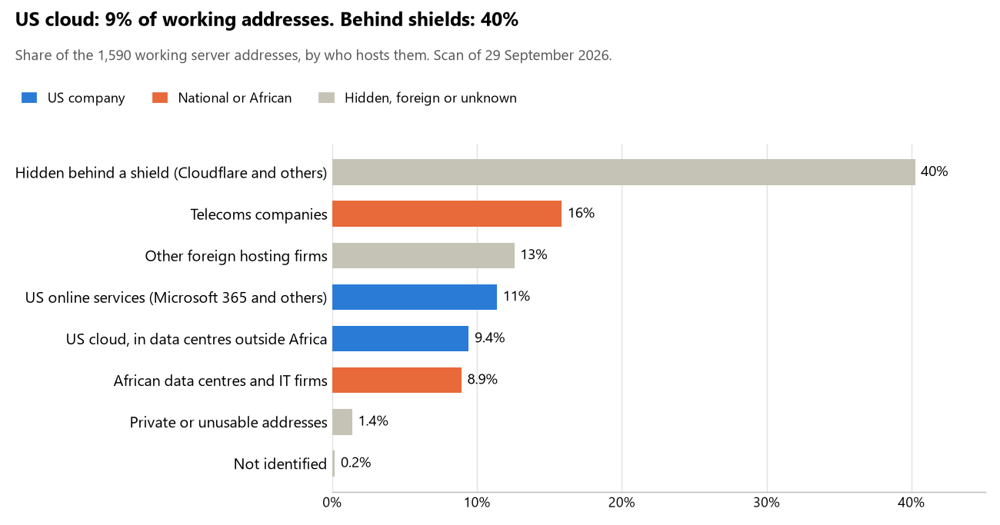

# Libya: who hosts the state's front door

29 September 2026 · Bill Anderson · scan of 29 September 2026

The scan covered 38 state bodies, banks and state-owned companies in Libya. 9% of their working server addresses are on US cloud: Amazon, Microsoft, Google or Oracle. 40% are behind shields such as Cloudflare, which hide the host. 0% are on government data centres or the institutions' own systems.

The scan found 1,210 web and mail names and 1,590 working addresses. 13 of the 38 institutions use US cloud for at least part of their estate. 16 use Microsoft for email and none use Google.

Of the 54 countries scanned so far, Libya has the 38th highest US cloud share (median 13%) and the 6th highest share behind shields (median 12%).

## Where it lives

150 addresses are on US cloud. Where they are: 83% in Europe, 10% in a region the providers do not publish, 4% on worldwide delivery networks (no fixed location) and 3% in North America.

640 addresses are behind shields: Cloudflare (97%), Sucuri (3%) and Bunnycdn (<1%). The host behind a shield cannot be seen, so the US cloud share is a minimum.

## Banks against government

| Share of working addresses | Government (28) | Banks (10) |
| --- | --- | --- |
| On US cloud | 5% | 25% |
| …of which in Africa | 0% | 0% |
| US online services (Microsoft 365 and others) | 8% | 22% |
| Behind a shield | 42% | 33% |
| Government data centres | 0% | 0% |
| Run by the institution itself | 0% | 0% |
| Telecoms companies | 20% | 3% |
| African data centres and IT firms | 10% | 5% |
| Other foreign hosting firms | 14% | 9% |

6 of 10 banks and 7 of 28 government bodies use US cloud somewhere. "Government" includes the central bank, the payment switch, the stock exchange and the state-owned companies.

## Email

16 of the 38 institutions use Microsoft 365 for email and none use Google.

- **Microsoft 365:** 16. Ministry of Interior, Central Bank of Libya, Jumhouria Bank, National Commercial Bank, Wahda Bank, Sahara Bank, Bank of Commerce and Development, North Africa Bank, Alwaha Bank, High National Elections Commission, Bureau of Statistics and Census, Moamalat, National Oil Corporation, Libyan Post Telecommunications and Information Technology Company, Citizen Service Center and National Information Security and Safety Authority.
- **Telecoms companies:** 5. Presidency of the Council of Ministers (Prime Minister's Office) (General Post and Telecommunication Company), Ministry of Foreign Affairs and International Cooperation (General Post and Telecommunication Company), Ministry of Health (General Post and Telecommunication Company), General Electricity Company of Libya (Bait Ashames for Data Communication) and National Anti-Corruption Commission (General Post and Telecommunication Company).
- **Foreign hosting firms:** 13. Ministry of Defence (Hetzner), Ministry of Justice (Hetzner), Attorney General's Office (Hetzner), Ministry of Finance (Hetzner), Libyan Tax Authority (Hetzner), Libyan Customs Authority (Hetzner), Internal Security Agency (Hetzner), Libyan Foreign Bank (Host Europe), General Information Authority (Hetzner), Social Security Fund (Hetzner), Libyan Capital Market Authority (Hetzner), Libyan Ports Company (Hetzner) and Audit Bureau (Hetzner).
- **Behind a mail filter, provider not visible:** 2. Mediterranean Bank and Libyan Investment Authority.
- **No mail on the domain scanned:** 2. Aman Bank and Libyan government parent zone.

## Institution by institution

Each figure is a share of that institution's working addresses. The rest are with telecoms companies, African data centres, US online services or foreign hosts. Rows follow the order of institution types.

| Institution | Type | On US cloud | …in Africa | Behind a shield | Own or government | Email |
| --- | --- | --- | --- | --- | --- | --- |
| Presidency of the Council of Ministers (Prime Minister's Office) | Presidency | 0% | 0% | 0% | 0% | Telecoms |
| Ministry of Foreign Affairs and International Cooperation | Foreign Affairs | 0% | 0% | 0% | 0% | Telecoms |
| Ministry of Defence | Defence | 0% | 0% | 7% | 0% | Foreign host |
| Ministry of Justice | Justice | 0% | 0% | 0% | 0% | Foreign host |
| Attorney General's Office | Justice | 0% | 0% | 11% | 0% | Foreign host |
| Ministry of Finance | Treasury / Finance | 0% | 0% | 0% | 0% | Foreign host |
| Libyan Tax Authority | Revenue Service | 0% | 0% | 90% | 0% | Foreign host |
| Libyan Customs Authority | Customs | 0% | 0% | 73% | 0% | Foreign host |
| Internal Security Agency | Intelligence | 0% | 0% | 97% | 0% | Foreign host |
| Ministry of Interior | Interior / Home Affairs | 0% | 0% | 11% | 0% | Microsoft |
| Central Bank of Libya | Central Bank | 12% | 0% | 63% | 0% | Microsoft |
| Jumhouria Bank | Commercial Banks | 29% | 0% | 14% | 0% | Microsoft |
| National Commercial Bank | Commercial Banks | 35% | 0% | 46% | 0% | Microsoft |
| Wahda Bank | Commercial Banks | 0% | 0% | 42% | 0% | Microsoft |
| Sahara Bank | Commercial Banks | 41% | 0% | 22% | 0% | Microsoft |
| Bank of Commerce and Development | Commercial Banks | 37% | 0% | 0% | 0% | Microsoft |
| North Africa Bank | Commercial Banks | 0% | 0% | 44% | 0% | Microsoft |
| Aman Bank | Commercial Banks | 64% | 0% | 0% | 0% | — |
| Libyan Foreign Bank | Commercial Banks | 0% | 0% | 98% | 0% | Foreign host |
| Alwaha Bank | Commercial Banks | 0% | 0% | 11% | 0% | Microsoft |
| Mediterranean Bank | Commercial Banks | 24% | 0% | 0% | 0% | Filtered |
| General Information Authority | Civil registry / National ID authority | 0% | 0% | 7% | 0% | Foreign host |
| High National Elections Commission | Electoral commission | 42% | 0% | 5% | 0% | Microsoft |
| Bureau of Statistics and Census | Statistics office | 17% | 0% | 0% | 0% | Microsoft |
| Ministry of Health | Health ministry / National health insurance | 0% | 0% | 0% | 0% | Telecoms |
| Social Security Fund | Social protection / Social registry | 0% | 0% | 7% | 0% | Foreign host |
| Moamalat | National payment switch | 0% | 0% | 63% | 0% | Microsoft |
| Libyan Capital Market Authority | Securities regulator | 0% | 0% | 58% | 0% | Foreign host |
| Libyan Investment Authority | Sovereign wealth fund / National pension fund | 2% | 0% | 5% | 0% | Filtered |
| General Electricity Company of Libya | Energy utility | 0% | 0% | 0% | 0% | Telecoms |
| National Oil Corporation | Energy utility | 0% | 0% | 91% | 0% | Microsoft |
| Libyan Ports Company | Ports authority | 0% | 0% | 46% | 0% | Foreign host |
| Libyan Post Telecommunications and Information Technology Company | State-owned telco / National backbone operator | 20% | 0% | 5% | 0% | Microsoft |
| Citizen Service Center | E-government agency | 23% | 0% | 0% | 0% | Microsoft |
| Libyan government parent zone | E-government agency | no working address | | | | — |
| National Information Security and Safety Authority | Cybersecurity agency / National CERT | 10% | 0% | 70% | 0% | Microsoft |
| Audit Bureau | Audit office | 0% | 0% | 89% | 0% | Foreign host |
| National Anti-Corruption Commission | Anti-corruption commission | 0% | 0% | 0% | 0% | Telecoms |

No institution or working domain was found for 10 of the 36 types: Parliament, Armed Forces, Police, Data protection authority, Immigration / Passports, Land registry, Stock exchange, Public procurement authority, National data centre / Government cloud operator and Communications regulator.

## What stood out

- **Most on US cloud.** Aman Bank (64%) has more than half its working addresses on US cloud.
- **Little US cloud in Africa.** 0% of Libya's US cloud addresses are in the providers' African data centres.
- **No Chinese cloud.** The scan found no address on Huawei, Alibaba or Tencent cloud.
- **Names anyone could claim.** One web address at High National Elections Commission points at a deleted cloud name that anyone could register and then publish under. We have flagged it and do not name it here.

## What this can and cannot tell you

The scan sees only the front door: websites, email, login portals, remote-access gateways and online banking. It cannot see where a bank's core ledger, the ID register or the payroll run.

- **Every US figure is a minimum.** Anything behind a shield or a mail filter could also be on US cloud. In Libya that is 40% of working addresses.
- **It counts addresses, not importance.** An institution with many test and marketing sites weighs more than one with few.
- **The list of institutions was drawn up for this scan.** Each domain was checked to exist, not confirmed as the institution's main one.
- **It is a snapshot.** Every figure is as of 29 September 2026.
- **Nothing was touched.** The scan used public address lookups, public certificate records and the cloud companies' published address lists. It never connected to any institution's systems.

The data and method are in `R&D/Hyperscaler-dependence/scan/LBY/` and `R&D/Hyperscaler-dependence/HYPERSCALER-SCAN.md` in the Corpus repository.
