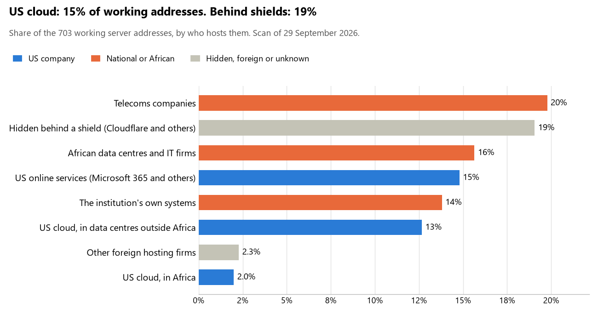

# Lesotho: who hosts the state's front door

29 September 2026 · Bill Anderson · scan of 29 September 2026

The scan covered 25 state bodies, banks and state-owned companies in Lesotho. 15% of their working server addresses are on US cloud: Amazon, Microsoft, Google or Oracle. 19% are behind shields such as Cloudflare, which hide the host. 14% are on government data centres or the institutions' own systems.

The scan found 563 web and mail names and 703 working addresses. 8 of the 25 institutions use US cloud for at least part of their estate. 12 use Microsoft for email and 1 use Google.

Of the 54 countries scanned so far, Lesotho has the 25th highest US cloud share (median 13%) and the 17th highest share behind shields (median 12%).

## Where it lives

103 addresses are on US cloud. Where they are: 50% in Europe, 33% on worldwide delivery networks (no fixed location), 14% in Africa, 3% in North America and <1% in Asia or the Middle East.

134 addresses are behind shields: Cloudflare (69%), Akamai (24%) and Imperva (7%). The host behind a shield cannot be seen, so the US cloud share is a minimum.

## Banks against government

| Share of working addresses | Government (21) | Banks (4) |
| --- | --- | --- |
| On US cloud | 11% | 20% |
| …of which in Africa | 3% | 1% |
| US online services (Microsoft 365 and others) | 16% | 13% |
| Behind a shield | 14% | 26% |
| Government data centres | 0% | 0% |
| Run by the institution itself | 19% | 6% |
| Telecoms companies | 22% | 17% |
| African data centres and IT firms | 14% | 18% |
| Other foreign hosting firms | 3% | <1% |

3 of 4 banks and 5 of 21 government bodies use US cloud somewhere. "Government" includes the central bank, the payment switch, the stock exchange and the state-owned companies.

## Email

12 of the 25 institutions use Microsoft 365 for email and 1 use Google.

- **Microsoft 365:** 12. Revenue Services Lesotho, Central Bank of Lesotho, Standard Lesotho Bank, Nedbank Lesotho, First National Bank Lesotho, Lesotho PostBank, Land Administration Authority, Public Officers' Defined Contribution Pension Fund, Lesotho Electricity Company, Econet Telecom Lesotho, Government of Lesotho portal and Directorate on Corruption and Economic Offences.
- **Google:** 1. Lesotho Communications Authority.
- **Telecoms companies (Comnet Pty Ltd):** 2. Independent Electoral Commission and Maseru Securities Market.
- **African hosts (Xneelo):** 1. Parliament of Lesotho.
- **No mail on the domain scanned:** 9. Ministry of Defence and National Security, Lesotho Defence Force, Lesotho Mounted Police Service, Ministry of Justice and Law, Ministry of Finance and Development Planning, Ministry of Home Affairs, Bureau of Statistics, Ministry of Health and Ministry of Social Development.

## Institution by institution

Each figure is a share of that institution's working addresses. The rest are with telecoms companies, African data centres, US online services or foreign hosts. Rows follow the order of institution types.

| Institution | Type | On US cloud | …in Africa | Behind a shield | Own or government | Email |
| --- | --- | --- | --- | --- | --- | --- |
| Parliament of Lesotho | Parliament | 0% | 0% | 0% | 0% | African host |
| Ministry of Defence and National Security | Defence | 0% | 0% | 0% | 0% | — |
| Lesotho Defence Force | Armed Forces | 0% | 0% | 0% | 0% | — |
| Lesotho Mounted Police Service | Police | 0% | 0% | 100% | 0% | — |
| Ministry of Justice and Law | Justice | 0% | 0% | 0% | 0% | — |
| Ministry of Finance and Development Planning | Treasury / Finance | 0% | 0% | 0% | 0% | — |
| Revenue Services Lesotho | Revenue Service | 0% | 0% | 23% | 0% | Microsoft |
| Ministry of Home Affairs | Interior / Home Affairs | 0% | 0% | 0% | 0% | — |
| Central Bank of Lesotho | Central Bank | 21% | 18% | 0% | 6% | Microsoft |
| Standard Lesotho Bank | Commercial Banks | 27% | 0% | 57% | 4% | Microsoft |
| Nedbank Lesotho | Commercial Banks | 24% | 8% | 0% | 0% | Microsoft |
| First National Bank Lesotho | Commercial Banks | 0% | 0% | 5% | 50% | Microsoft |
| Lesotho PostBank | Commercial Banks | 14% | 0% | 8% | 0% | Microsoft |
| Independent Electoral Commission | Electoral commission | 0% | 0% | 0% | 0% | Telecoms |
| Bureau of Statistics | Statistics office | 0% | 0% | 0% | 0% | — |
| Ministry of Health | Health ministry / National health insurance | 0% | 0% | 0% | 0% | — |
| Ministry of Social Development | Social protection / Social registry | 0% | 0% | 0% | 0% | — |
| Land Administration Authority | Land registry | 8% | 0% | 88% | 0% | Microsoft |
| Maseru Securities Market | Stock exchange | 40% | 0% | 0% | 0% | Telecoms |
| Public Officers' Defined Contribution Pension Fund | Sovereign wealth fund / National pension fund | 0% | 0% | 11% | 0% | Microsoft |
| Lesotho Electricity Company | Energy utility | 45% | 0% | 0% | 16% | Microsoft |
| Econet Telecom Lesotho | State-owned telco / National backbone operator | 13% | 6% | 0% | 85% | Microsoft |
| Government of Lesotho portal | E-government agency | 0% | 0% | 0% | 0% | Microsoft |
| Lesotho Communications Authority | Communications regulator | 0% | 0% | 13% | 0% | Google |
| Directorate on Corruption and Economic Offences | Anti-corruption commission | 0% | 0% | 0% | 0% | Microsoft |

No institution or working domain was found for 14 of the 36 types: Presidency, Foreign Affairs, Customs, Intelligence, Civil registry / National ID authority, Data protection authority, Immigration / Passports, National payment switch, Securities regulator, Public procurement authority, Ports authority, National data centre / Government cloud operator, Cybersecurity agency / National CERT and Audit office.

## What stood out

- **Little US cloud in Africa.** 14% of Lesotho's US cloud addresses are in the providers' African data centres.
- **No Chinese cloud.** The scan found no address on Huawei, Alibaba or Tencent cloud.

## What this can and cannot tell you

The scan sees only the front door: websites, email, login portals, remote-access gateways and online banking. It cannot see where a bank's core ledger, the ID register or the payroll run.

- **Every US figure is a minimum.** Anything behind a shield or a mail filter could also be on US cloud. In Lesotho that is 19% of working addresses.
- **It counts addresses, not importance.** An institution with many test and marketing sites weighs more than one with few.
- **The list of institutions was drawn up for this scan.** Each domain was checked to exist, not confirmed as the institution's main one.
- **It is a snapshot.** Every figure is as of 29 September 2026.
- **Nothing was touched.** The scan used public address lookups, public certificate records and the cloud companies' published address lists. It never connected to any institution's systems.

The data and method are in `R&D/Hyperscaler-dependence/scan/LSO/` and `R&D/Hyperscaler-dependence/HYPERSCALER-SCAN.md` in the Corpus repository.
