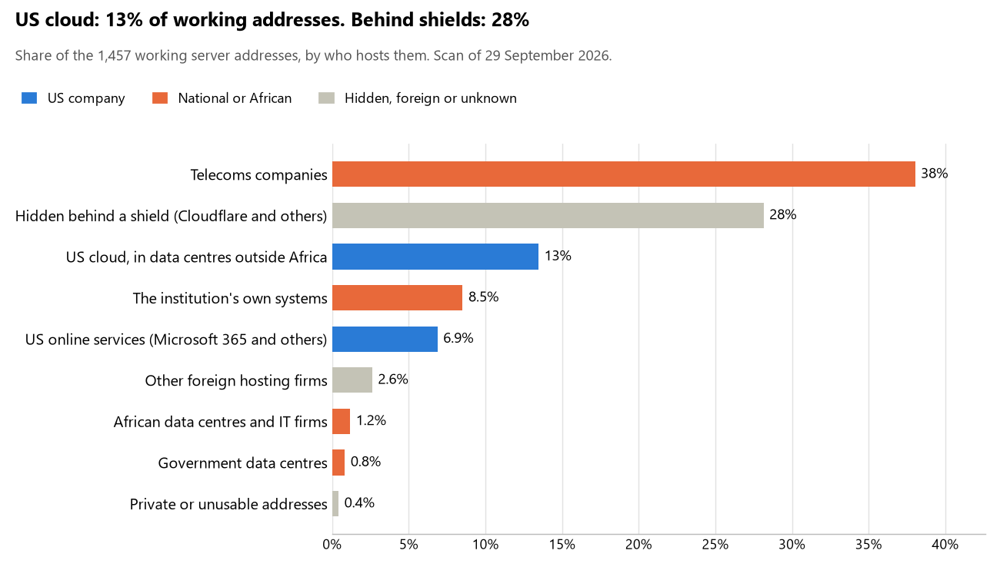

# Morocco: who hosts the state's front door

29 September 2026 · Bill Anderson · scan of 29 September 2026

The scan covered 41 state bodies, banks and state-owned companies in Morocco. 13% of their working server addresses are on US cloud: Amazon, Microsoft, Google or Oracle. 28% are behind shields such as Cloudflare, which hide the host. 9% are on government data centres or the institutions' own systems.

The scan found 1,073 web and mail names and 1,457 working addresses. 19 of the 41 institutions use US cloud for at least part of their estate. 10 use Microsoft for email and 2 use Google.

Of the 54 countries scanned so far, Morocco has the 27th highest US cloud share (median 13%) and the 8th highest share behind shields (median 12%).

## Where it lives

196 addresses are on US cloud. Where they are: 64% in Europe, 31% on worldwide delivery networks (no fixed location) and 6% in a region the providers do not publish.

410 addresses are behind shields: Cloudflare (62%), Akamai (19%) and Radware (14%). The host behind a shield cannot be seen, so the US cloud share is a minimum.

## Banks against government

| Share of working addresses | Government (32) | Banks (9) |
| --- | --- | --- |
| On US cloud | 14% | 13% |
| …of which in Africa | 0% | 0% |
| US online services (Microsoft 365 and others) | 10% | <1% |
| Behind a shield | 18% | 49% |
| Government data centres | 1% | 0% |
| Run by the institution itself | 13% | 0% |
| Telecoms companies | 41% | 31% |
| African data centres and IT firms | 2% | 0% |
| Other foreign hosting firms | 1% | 6% |

7 of 9 banks and 12 of 32 government bodies use US cloud somewhere. "Government" includes the central bank, the payment switch, the stock exchange and the state-owned companies.

## Email

10 of the 41 institutions use Microsoft 365 for email and 2 use Google.

- **Microsoft 365:** 10. Ministère de la Justice, Bank Al-Maghrib, Banque Centrale Populaire, Crédit Agricole du Maroc, CFG Bank, Ministère de la Santé et de la Protection sociale, Caisse Nationale de Sécurité Sociale, Bourse de Casablanca, Caisse Interprofessionnelle Marocaine de Retraites and Agence Nationale des Ports.
- **Google:** 2. Chambre des Conseillers and Haut-Commissariat au Plan.
- **Own mail servers:** 5. Ministère de l'Économie et des Finances, Administration des Douanes et Impôts Indirects, Maroc Telecom, Direction Générale de la Sécurité des Systèmes d'Information and Agence Nationale de Réglementation des Télécommunications.
- **Telecoms companies:** 16. Chambre des Représentants (MEDITELECOM), Direction Générale de la Sûreté Nationale (Office National des Postes et Telecommunications ONPT (Maroc Telecom) / IAM), Conseil supérieur du pouvoir judiciaire (Office National des Postes et Telecommunications ONPT (Maroc Telecom) / IAM), Direction Générale des Impôts (Office National des Postes et Telecommunications ONPT (Maroc Telecom) / IAM), Ministère de l'Intérieur (Wana Corporate), Bank of Africa (Office National des Postes et Telecommunications ONPT (Maroc Telecom) / IAM), CIH Bank (MEDITELECOM), Crédit du Maroc (Office National des Postes et Telecommunications ONPT (Maroc Telecom) / IAM), Agence Nationale de la Conservation Foncière (Wana Corporate), Centre Monétique Interbancaire (Office National des Postes et Telecommunications ONPT (Maroc Telecom) / IAM), Autorité Marocaine du Marché des Capitaux (Office National des Postes et Telecommunications ONPT (Maroc Telecom) / IAM), Caisse de Dépôt et de Gestion (Office National des Postes et Telecommunications ONPT (Maroc Telecom) / IAM), Portail des marchés publics (Office National des Postes et Telecommunications ONPT (Maroc Telecom) / IAM), Office National de l'Électricité et de l'Eau Potable (Office National des Postes et Telecommunications ONPT (Maroc Telecom) / IAM), Agence de Développement du Digital (Office National des Postes et Telecommunications ONPT (Maroc Telecom) / IAM) and Cour des Comptes (Office National des Postes et Telecommunications ONPT (Maroc Telecom) / IAM).
- **African hosts (NPONE):** 1. Commission Nationale de contrôle de la protection des Données à caractère Personnel.
- **Foreign hosting firms (BNP-Paribas BNP PARIBAS S.A.):** 1. BMCI.
- **Not identified:** 2. Attijariwafa Bank and Instance Nationale de la Probité de la Prévention et de la Lutte contre la Corruption.
- **No mail on the domain scanned:** 4. Ministère des Affaires étrangères, Portail des tribunaux (Mahakim), Société Générale Maroc and Élections Maroc (Ministère de l'Intérieur).

## Institution by institution

Each figure is a share of that institution's working addresses. The rest are with telecoms companies, African data centres, US online services or foreign hosts. Rows follow the order of institution types.

| Institution | Type | On US cloud | …in Africa | Behind a shield | Own or government | Email |
| --- | --- | --- | --- | --- | --- | --- |
| Chambre des Représentants | Parliament | 28% | 0% | 44% | 0% | Telecoms |
| Chambre des Conseillers | Parliament | 0% | 0% | 63% | 0% | Google |
| Ministère des Affaires étrangères | Foreign Affairs | 0% | 0% | 0% | 0% | — |
| Direction Générale de la Sûreté Nationale | Police | 0% | 0% | 0% | 6% | Telecoms |
| Ministère de la Justice | Justice | 4% | 0% | 0% | 0% | Microsoft |
| Conseil supérieur du pouvoir judiciaire | Justice | 0% | 0% | 0% | 0% | Telecoms |
| Portail des tribunaux (Mahakim) | Justice | 0% | 0% | 0% | 0% | — |
| Ministère de l'Économie et des Finances | Treasury / Finance | 0% | 0% | 0% | 100% | Own servers |
| Direction Générale des Impôts | Revenue Service | 0% | 0% | 0% | 57% | Telecoms |
| Administration des Douanes et Impôts Indirects | Customs | 0% | 0% | 0% | 55% | Own servers |
| Ministère de l'Intérieur | Interior / Home Affairs | 0% | 0% | 0% | 0% | Telecoms |
| Bank Al-Maghrib | Central Bank | 52% | 0% | 0% | 0% | Microsoft |
| Attijariwafa Bank | Commercial Banks | 6% | 0% | 92% | 0% | Not identified |
| Banque Centrale Populaire | Commercial Banks | 21% | 0% | 51% | 0% | Microsoft |
| Bank of Africa | Commercial Banks | 41% | 0% | 0% | 0% | Telecoms |
| Société Générale Maroc | Commercial Banks | 12% | 0% | 86% | 0% | — |
| Crédit Agricole du Maroc | Commercial Banks | 38% | 0% | 0% | 0% | Microsoft |
| BMCI | Commercial Banks | 0% | 0% | 79% | 0% | Foreign host |
| CIH Bank | Commercial Banks | 4% | 0% | 12% | 0% | Telecoms |
| Crédit du Maroc | Commercial Banks | 0% | 0% | 0% | 0% | Telecoms |
| CFG Bank | Commercial Banks | 11% | 0% | 51% | 0% | Microsoft |
| Commission Nationale de contrôle de la protection des Données à caractère Personnel | Data protection authority | 0% | 0% | 6% | 12% | African host |
| Élections Maroc (Ministère de l'Intérieur) | Electoral commission | 0% | 0% | 100% | 0% | — |
| Haut-Commissariat au Plan | Statistics office | 6% | 0% | 6% | 1% | Google |
| Ministère de la Santé et de la Protection sociale | Health ministry / National health insurance | 50% | 0% | 0% | 0% | Microsoft |
| Caisse Nationale de Sécurité Sociale | Health ministry / National health insurance | 21% | 0% | 0% | 0% | Microsoft |
| Agence Nationale de la Conservation Foncière | Land registry | 39% | 0% | 0% | 0% | Telecoms |
| Centre Monétique Interbancaire | National payment switch | 56% | 0% | 0% | 0% | Telecoms |
| Bourse de Casablanca | Stock exchange | 0% | 0% | 0% | 0% | Microsoft |
| Autorité Marocaine du Marché des Capitaux | Securities regulator | 32% | 0% | 0% | 0% | Telecoms |
| Caisse de Dépôt et de Gestion | Sovereign wealth fund / National pension fund | 48% | 0% | 0% | 0% | Telecoms |
| Caisse Interprofessionnelle Marocaine de Retraites | Sovereign wealth fund / National pension fund | 0% | 0% | 0% | 0% | Microsoft |
| Portail des marchés publics | Public procurement authority | 0% | 0% | 0% | 0% | Telecoms |
| Office National de l'Électricité et de l'Eau Potable | Energy utility | 0% | 0% | 0% | 0% | Telecoms |
| Agence Nationale des Ports | Ports authority | 33% | 0% | 17% | 0% | Microsoft |
| Maroc Telecom | State-owned telco / National backbone operator | 15% | 0% | 21% | 57% | Own servers |
| Agence de Développement du Digital | E-government agency | 0% | 0% | 0% | 13% | Telecoms |
| Direction Générale de la Sécurité des Systèmes d'Information | Cybersecurity agency / National CERT | 0% | 0% | 0% | 100% | Own servers |
| Agence Nationale de Réglementation des Télécommunications | Communications regulator | 0% | 0% | 0% | 100% | Own servers |
| Cour des Comptes | Audit office | 0% | 0% | 71% | 0% | Telecoms |
| Instance Nationale de la Probité de la Prévention et de la Lutte contre la Corruption | Anti-corruption commission | 0% | 0% | 82% | 0% | Not identified |

No institution or working domain was found for 8 of the 36 types: Presidency, Defence, Armed Forces, Intelligence, Civil registry / National ID authority, Immigration / Passports, Social protection / Social registry and National data centre / Government cloud operator.

## What stood out

- **Most on US cloud.** Centre Monétique Interbancaire (56%), Bank Al-Maghrib (52%) and Ministère de la Santé et de la Protection sociale (50%) have more than half their working addresses on US cloud.
- **Little US cloud in Africa.** 0% of Morocco's US cloud addresses are in the providers' African data centres.
- **Core state bodies at home.** Ministère de l'Économie et des Finances (100%) keeps at least 80% of its working addresses on government data centres or its own systems.
- **No Chinese cloud.** The scan found no address on Huawei, Alibaba or Tencent cloud.

## What this can and cannot tell you

The scan sees only the front door: websites, email, login portals, remote-access gateways and online banking. It cannot see where a bank's core ledger, the ID register or the payroll run.

- **Every US figure is a minimum.** Anything behind a shield or a mail filter could also be on US cloud. In Morocco that is 28% of working addresses.
- **It counts addresses, not importance.** An institution with many test and marketing sites weighs more than one with few.
- **The list of institutions was drawn up for this scan.** Each domain was checked to exist, not confirmed as the institution's main one.
- **It is a snapshot.** Every figure is as of 29 September 2026.
- **Nothing was touched.** The scan used public address lookups, public certificate records and the cloud companies' published address lists. It never connected to any institution's systems.

The data and method are in `R&D/Hyperscaler-dependence/scan/MAR/` and `R&D/Hyperscaler-dependence/HYPERSCALER-SCAN.md` in the Corpus repository.
