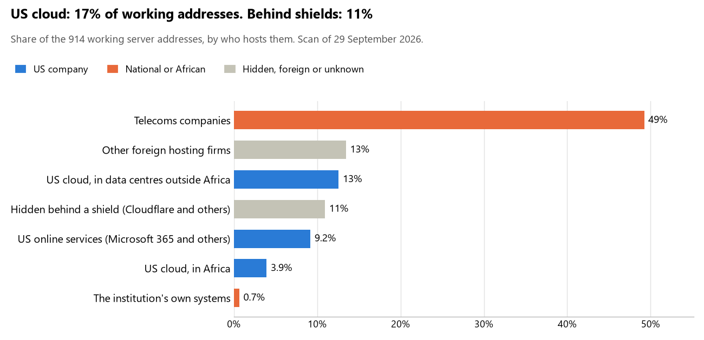

# Madagascar: who hosts the state's front door

29 September 2026 · Bill Anderson · scan of 29 September 2026

The scan covered 37 state bodies, banks and state-owned companies in Madagascar. 17% of their working server addresses are on US cloud: Amazon, Microsoft, Google or Oracle. 11% are behind shields such as Cloudflare, which hide the host. <1% are on government data centres or the institutions' own systems.

The scan found 691 web and mail names and 914 working addresses. 19 of the 37 institutions use US cloud for at least part of their estate. 9 use Microsoft for email and 3 use Google.

Of the 54 countries scanned so far, Madagascar has the 22nd highest US cloud share (median 13%) and the 29th highest share behind shields (median 12%).

## Where it lives

151 addresses are on US cloud. Where they are: 44% in Europe, 24% in Africa, 14% on worldwide delivery networks (no fixed location), 11% in Asia or the Middle East, 5% in North America and 3% in a region the providers do not publish.

100 addresses are behind shields: Cloudflare (98%) and Sucuri (2%). The host behind a shield cannot be seen, so the US cloud share is a minimum.

## Banks against government

| Share of working addresses | Government (29) | Banks (8) |
| --- | --- | --- |
| On US cloud | 17% | 16% |
| …of which in Africa | 5% | 1% |
| US online services (Microsoft 365 and others) | 4% | 27% |
| Behind a shield | 11% | 9% |
| Government data centres | 0% | 0% |
| Run by the institution itself | 0% | 3% |
| Telecoms companies | 54% | 31% |
| African data centres and IT firms | 0% | 0% |
| Other foreign hosting firms | 14% | 13% |

4 of 8 banks and 15 of 29 government bodies use US cloud somewhere. "Government" includes the central bank, the payment switch, the stock exchange and the state-owned companies.

## Email

9 of the 37 institutions use Microsoft 365 for email and 3 use Google.

- **Microsoft 365:** 9. Présidence de la République de Madagascar, BNI Madagascar, BRED Madagasikara Banque Populaire, Banque Malgache de l'Océan Indien (BMOI), MCB Madagascar, AccèsBanque Madagascar, SIPEM Banque, Telma (Yas Madagascar) and Cour des comptes.
- **Google:** 3. Ministère de l'Économie et des Finances, Commission électorale nationale indépendante (CENI) and Unité de gouvernance digitale (UGD).
- **Telecoms companies:** 16. Assemblée nationale (Telecom Malagasy), Ministère des Affaires étrangères (Telecom Malagasy), Ministère des Forces armées (Telecom Malagasy), Police nationale (Ministère de la Sécurité publique) (Telecom Malagasy), Ministère de la Justice (Telecom Malagasy), Direction générale des impôts (Telecom Malagasy), Direction générale des douanes (Telecom Malagasy), Ministère de l'Intérieur et de la Décentralisation (Telecom Malagasy), Banky Foiben'i Madagasikara (Telecom Malagasy), Institut national de la statistique (INSTAT) (Telecom Malagasy), Ministère de la Santé publique (Telecom Malagasy), Ministère de l'Aménagement du Territoire et des Services fonciers (Telecom Malagasy), Caisse nationale de prévoyance sociale (CNaPS) (Telecom Malagasy), Autorité de régulation des marchés publics (ARMP) (Telecom Malagasy), JIRAMA (Telecom Malagasy) and Autorité de régulation des technologies de communication (ARTEC) (Orange Madagascar).
- **US cloud:** 1. CIRT Madagascar.
- **Foreign hosting firms:** 4. Parlement de Madagascar (UK Dedicated Servers Limited), Sénat (Enix Ltd), Ministère de la Population et des Solidarités (OVH) and Bureau indépendant anti-corruption (BIANCO) (OVH).
- **Not identified (zone parente):** 1. Gouvernement malagasy.
- **No mail on the domain scanned:** 3. Bank of Africa Madagascar, BGFIBank Madagascar and Société du port à gestion autonome de Toamasina (SPAT).

## Institution by institution

Each figure is a share of that institution's working addresses. The rest are with telecoms companies, African data centres, US online services or foreign hosts. Rows follow the order of institution types.

| Institution | Type | On US cloud | …in Africa | Behind a shield | Own or government | Email |
| --- | --- | --- | --- | --- | --- | --- |
| Présidence de la République de Madagascar | Presidency | 38% | 0% | 0% | 0% | Microsoft |
| Parlement de Madagascar | Parliament | 0% | 0% | 0% | 0% | Foreign host |
| Assemblée nationale | Parliament | 0% | 0% | 83% | 0% | Telecoms |
| Sénat | Parliament | 18% | 0% | 0% | 0% | Foreign host |
| Ministère des Affaires étrangères | Foreign Affairs | 0% | 0% | 0% | 0% | Telecoms |
| Ministère des Forces armées | Defence | 0% | 0% | 0% | 0% | Telecoms |
| Police nationale (Ministère de la Sécurité publique) | Police | 11% | 0% | 0% | 0% | Telecoms |
| Ministère de la Justice | Justice | 0% | 0% | 0% | 0% | Telecoms |
| Ministère de l'Économie et des Finances | Treasury / Finance | 15% | 0% | 0% | 0% | Google |
| Direction générale des impôts | Revenue Service | 0% | 0% | 0% | 0% | Telecoms |
| Direction générale des douanes | Customs | 30% | 10% | 0% | 0% | Telecoms |
| Ministère de l'Intérieur et de la Décentralisation | Interior / Home Affairs | 14% | 0% | 0% | 0% | Telecoms |
| Banky Foiben'i Madagasikara | Central Bank | 0% | 0% | 0% | 0% | Telecoms |
| BNI Madagascar | Commercial Banks | 0% | 0% | 33% | 0% | Microsoft |
| Bank of Africa Madagascar | Commercial Banks | 0% | 0% | 0% | 0% | — |
| BRED Madagasikara Banque Populaire | Commercial Banks | 0% | 0% | 7% | 20% | Microsoft |
| Banque Malgache de l'Océan Indien (BMOI) | Commercial Banks | 32% | 6% | 0% | 0% | Microsoft |
| MCB Madagascar | Commercial Banks | 10% | 0% | 10% | 0% | Microsoft |
| AccèsBanque Madagascar | Commercial Banks | 31% | 0% | 0% | 0% | Microsoft |
| BGFIBank Madagascar | Commercial Banks | 0% | 0% | 100% | 0% | — |
| SIPEM Banque | Commercial Banks | 23% | 0% | 0% | 0% | Microsoft |
| Commission électorale nationale indépendante (CENI) | Electoral commission | 0% | 0% | 0% | 0% | Google |
| Institut national de la statistique (INSTAT) | Statistics office | 1% | 1% | 88% | 0% | Telecoms |
| Ministère de la Santé publique | Health ministry / National health insurance | 18% | 0% | 0% | 0% | Telecoms |
| Ministère de la Population et des Solidarités | Social protection / Social registry | 5% | 0% | 0% | 0% | Foreign host |
| Ministère de l'Aménagement du Territoire et des Services fonciers | Land registry | 25% | 0% | 0% | 0% | Telecoms |
| Caisse nationale de prévoyance sociale (CNaPS) | Sovereign wealth fund / National pension fund | 0% | 0% | 0% | 0% | Telecoms |
| Autorité de régulation des marchés publics (ARMP) | Public procurement authority | 0% | 0% | 0% | 0% | Telecoms |
| JIRAMA | Energy utility | 0% | 0% | 0% | 0% | Telecoms |
| Société du port à gestion autonome de Toamasina (SPAT) | Ports authority | 0% | 0% | 0% | 0% | — |
| Telma (Yas Madagascar) | State-owned telco / National backbone operator | 26% | 0% | 5% | 0% | Microsoft |
| Unité de gouvernance digitale (UGD) | E-government agency | 29% | 15% | 0% | 0% | Google |
| Gouvernement malagasy (zone parente) | E-government agency | 100% | 0% | 0% | 0% | Not identified |
| CIRT Madagascar | Cybersecurity agency / National CERT | 73% | 0% | 0% | 0% | US cloud |
| Autorité de régulation des technologies de communication (ARTEC) | Communications regulator | 0% | 0% | 0% | 0% | Telecoms |
| Cour des comptes | Audit office | 29% | 0% | 0% | 0% | Microsoft |
| Bureau indépendant anti-corruption (BIANCO) | Anti-corruption commission | 0% | 0% | 0% | 0% | Foreign host |

No institution or working domain was found for 9 of the 36 types: Armed Forces, Intelligence, Civil registry / National ID authority, Data protection authority, Immigration / Passports, National payment switch, Stock exchange, Securities regulator and National data centre / Government cloud operator.

## What stood out

- **Most on US cloud.** CIRT Madagascar (73%) has more than half its working addresses on US cloud.
- **Little US cloud in Africa.** 24% of Madagascar's US cloud addresses are in the providers' African data centres.
- **Core state bodies on foreign hosting firms.** Parlement de Madagascar (Hostinger and UK Dedicated Servers Limited) and Sénat (Enix Ltd).
- **No Chinese cloud.** The scan found no address on Huawei, Alibaba or Tencent cloud.

## What this can and cannot tell you

The scan sees only the front door: websites, email, login portals, remote-access gateways and online banking. It cannot see where a bank's core ledger, the ID register or the payroll run.

- **Every US figure is a minimum.** Anything behind a shield or a mail filter could also be on US cloud. In Madagascar that is 11% of working addresses.
- **It counts addresses, not importance.** An institution with many test and marketing sites weighs more than one with few.
- **The list of institutions was drawn up for this scan.** Each domain was checked to exist, not confirmed as the institution's main one.
- **It is a snapshot.** Every figure is as of 29 September 2026.
- **Nothing was touched.** The scan used public address lookups, public certificate records and the cloud companies' published address lists. It never connected to any institution's systems.

The data and method are in `R&D/Hyperscaler-dependence/scan/MDG/` and `R&D/Hyperscaler-dependence/HYPERSCALER-SCAN.md` in the Corpus repository.
