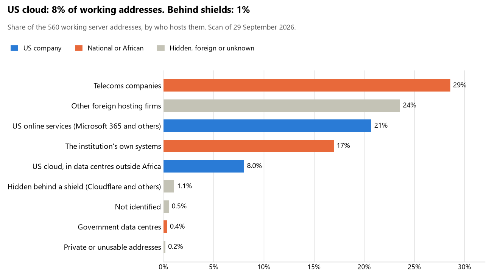

# Mali: who hosts the state's front door

29 September 2026 · Bill Anderson · scan of 29 September 2026

The scan covered 33 state bodies, banks and state-owned companies in Mali. 8% of their working server addresses are on US cloud: Amazon, Microsoft, Google or Oracle. 1% are behind shields such as Cloudflare, which hide the host. 17% are on government data centres or the institutions' own systems.

The scan found 408 web and mail names and 560 working addresses. 8 of the 33 institutions use US cloud for at least part of their estate. 9 use Microsoft for email and 1 use Google.

Of the 54 countries scanned so far, Mali has the 45th highest US cloud share (median 13%) and the 47th highest share behind shields (median 12%).

## Where it lives

45 addresses are on US cloud. Where they are: 60% in Europe, 27% on worldwide delivery networks (no fixed location) and 13% in a region the providers do not publish.

6 addresses are behind shields: Cloudflare (100%). The host behind a shield cannot be seen, so the US cloud share is a minimum.

## Banks against government

| Share of working addresses | Government (25) | Banks (8) |
| --- | --- | --- |
| On US cloud | 4% | 19% |
| …of which in Africa | 0% | 0% |
| US online services (Microsoft 365 and others) | 17% | 34% |
| Behind a shield | <1% | 3% |
| Government data centres | <1% | 0% |
| Run by the institution itself | 22% | 0% |
| Telecoms companies | 35% | 9% |
| African data centres and IT firms | 0% | 0% |
| Other foreign hosting firms | 20% | 35% |

4 of 8 banks and 4 of 25 government bodies use US cloud somewhere. "Government" includes the central bank, the payment switch, the stock exchange and the state-owned companies.

## Email

9 of the 33 institutions use Microsoft 365 for email and 1 use Google.

- **Microsoft 365:** 9. Ministère de l'Économie et des Finances, Banque de Développement du Mali (BDM-SA), Bank of Africa - Mali, Banque pour le Commerce et l'Industrie du Mali (BCI-Mali), AFG Bank Mali, Groupement interbancaire monétique de l'UEMOA (GIM-UEMOA), Bourse régionale des valeurs mobilières (BRVM), Autorité des marchés financiers de l'UMOA (AMF-UMOA) and Autorité de régulation des marchés publics et des délégations de service public (ARMDS).
- **Google (BCEAO):** 1. Banque centrale des États de l'Afrique de l'Ouest.
- **Own mail servers:** 3. Ministère de la Justice et des Droits de l'Homme, Autorité de protection des données à caractère personnel (APDP) and Agence des technologies de l'information et de la communication (AGETIC).
- **Telecoms companies:** 8. Présidence de la République du Mali (Society of Mali's Telecommunications), Police nationale du Mali (Society of Mali's Telecommunications), Ministère de la Santé et du Développement social (Society of Mali's Telecommunications), Caisse nationale d'assurance maladie (CANAM) (Orange Mali SA), Institut national de prévoyance sociale (INPS) (Orange Mali SA), Portail gouvernemental du Mali (Orange Mali SA), Autorité malienne de régulation des télécommunications/TIC et des postes (AMRTP) (Orange Mali SA) and Office central de lutte contre l'enrichissement illicite (OCLEI) (Society of Mali's Telecommunications).
- **Foreign hosting firms:** 4. Forces armées maliennes (DIRPA) (Contabo), Ministère de l'Administration territoriale et de la Décentralisation (Input Output Flood LLC), Ministère de la Sécurité et de la Protection civile (Input Output Flood LLC) and Banque Nationale de Développement Agricole (BNDA) (Groupe LWS SARL).
- **Behind a mail filter, provider not visible (BIM-SA):** 1. Banque Internationale pour le Mali.
- **Not identified:** 1. Direction générale des impôts.
- **No mail on the domain scanned:** 6. Ministère des Affaires étrangères et de la Coopération internationale, Direction générale des douanes, Banque Malienne de Solidarité (BMS-SA), Coris Bank International Mali, Institut national de la statistique (INSTAT) and Société des télécommunications du Mali (Sotelma-Malitel).

## Institution by institution

Each figure is a share of that institution's working addresses. The rest are with telecoms companies, African data centres, US online services or foreign hosts. Rows follow the order of institution types.

| Institution | Type | On US cloud | …in Africa | Behind a shield | Own or government | Email |
| --- | --- | --- | --- | --- | --- | --- |
| Présidence de la République du Mali | Presidency | 0% | 0% | 0% | 25% | Telecoms |
| Ministère des Affaires étrangères et de la Coopération internationale | Foreign Affairs | 0% | 0% | 0% | 100% | — |
| Forces armées maliennes (DIRPA) | Armed Forces | 0% | 0% | 0% | 0% | Foreign host |
| Police nationale du Mali | Police | 0% | 0% | 0% | 0% | Telecoms |
| Ministère de la Justice et des Droits de l'Homme | Justice | 0% | 0% | 0% | 100% | Own servers |
| Ministère de l'Économie et des Finances | Treasury / Finance | 6% | 0% | 0% | 59% | Microsoft |
| Direction générale des impôts | Revenue Service | 0% | 0% | 0% | 0% | Not identified |
| Direction générale des douanes | Customs | 40% | 0% | 0% | 0% | — |
| Ministère de l'Administration territoriale et de la Décentralisation | Interior / Home Affairs | 0% | 0% | 0% | 0% | Foreign host |
| Ministère de la Sécurité et de la Protection civile | Interior / Home Affairs | 0% | 0% | 0% | 0% | Foreign host |
| Banque centrale des États de l'Afrique de l'Ouest (BCEAO) | Central Bank | 10% | 0% | 0% | 0% | Google |
| Banque de Développement du Mali (BDM-SA) | Commercial Banks | 23% | 0% | 0% | 0% | Microsoft |
| Banque Internationale pour le Mali (BIM-SA) | Commercial Banks | 24% | 0% | 24% | 0% | Filtered |
| Bank of Africa - Mali | Commercial Banks | 0% | 0% | 0% | 0% | Microsoft |
| Banque Malienne de Solidarité (BMS-SA) | Commercial Banks | 67% | 0% | 0% | 0% | — |
| Banque pour le Commerce et l'Industrie du Mali (BCI-Mali) | Commercial Banks | 0% | 0% | 0% | 0% | Microsoft |
| AFG Bank Mali | Commercial Banks | 33% | 0% | 0% | 0% | Microsoft |
| Banque Nationale de Développement Agricole (BNDA) | Commercial Banks | 0% | 0% | 0% | 0% | Foreign host |
| Coris Bank International Mali | Commercial Banks | 0% | 0% | 0% | 0% | — |
| Autorité de protection des données à caractère personnel (APDP) | Data protection authority | 0% | 0% | 0% | 82% | Own servers |
| Institut national de la statistique (INSTAT) | Statistics office | 0% | 0% | 0% | 0% | — |
| Ministère de la Santé et du Développement social | Health ministry / National health insurance | 0% | 0% | 0% | 0% | Telecoms |
| Caisse nationale d'assurance maladie (CANAM) | Social protection / Social registry | 0% | 0% | 0% | 0% | Telecoms |
| Groupement interbancaire monétique de l'UEMOA (GIM-UEMOA) | National payment switch | 0% | 0% | 0% | 0% | Microsoft |
| Bourse régionale des valeurs mobilières (BRVM) | Stock exchange | 25% | 0% | 0% | 0% | Microsoft |
| Autorité des marchés financiers de l'UMOA (AMF-UMOA) | Securities regulator | 0% | 0% | 17% | 0% | Microsoft |
| Institut national de prévoyance sociale (INPS) | Sovereign wealth fund / National pension fund | 0% | 0% | 0% | 0% | Telecoms |
| Autorité de régulation des marchés publics et des délégations de service public (ARMDS) | Public procurement authority | 0% | 0% | 0% | 43% | Microsoft |
| Société des télécommunications du Mali (Sotelma-Malitel) | State-owned telco / National backbone operator | 0% | 0% | 0% | 71% | — |
| Agence des technologies de l'information et de la communication (AGETIC) | E-government agency | 0% | 0% | 0% | 100% | Own servers |
| Portail gouvernemental du Mali | E-government agency | 0% | 0% | 0% | 0% | Telecoms |
| Autorité malienne de régulation des télécommunications/TIC et des postes (AMRTP) | Communications regulator | 0% | 0% | 0% | 12% | Telecoms |
| Office central de lutte contre l'enrichissement illicite (OCLEI) | Anti-corruption commission | 0% | 0% | 0% | 0% | Telecoms |

No institution or working domain was found for 12 of the 36 types: Parliament, Defence, Intelligence, Civil registry / National ID authority, Electoral commission, Immigration / Passports, Land registry, Energy utility, Ports authority, National data centre / Government cloud operator, Cybersecurity agency / National CERT and Audit office.

## What stood out

- **Most on US cloud.** Banque Malienne de Solidarité (BMS-SA) (67%) has more than half its working addresses on US cloud.
- **Little US cloud in Africa.** 0% of Mali's US cloud addresses are in the providers' African data centres.
- **Core state bodies at home.** Ministère des Affaires étrangères et de la Coopération internationale (100%) and Ministère de la Justice et des Droits de l'Homme (100%) keep at least 80% of their working addresses on government data centres or their own systems.
- **Core state bodies on foreign hosting firms.** Forces armées maliennes (DIRPA) (Contabo), Ministère de l'Économie et des Finances (HostPapa and Groupe LWS SARL), Ministère de l'Administration territoriale et de la Décentralisation (Input Output Flood LLC), Ministère de la Sécurité et de la Protection civile (Input Output Flood LLC) and Banque centrale des États de l'Afrique de l'Ouest (BCEAO) (NETWORK TRANSIT HOLDINGS LLC and OVH).
- **No Chinese cloud.** The scan found no address on Huawei, Alibaba or Tencent cloud.

## What this can and cannot tell you

The scan sees only the front door: websites, email, login portals, remote-access gateways and online banking. It cannot see where a bank's core ledger, the ID register or the payroll run.

- **Every US figure is a minimum.** Anything behind a shield or a mail filter could also be on US cloud. In Mali that is 1% of working addresses.
- **It counts addresses, not importance.** An institution with many test and marketing sites weighs more than one with few.
- **The list of institutions was drawn up for this scan.** Each domain was checked to exist, not confirmed as the institution's main one.
- **It is a snapshot.** Every figure is as of 29 September 2026.
- **Nothing was touched.** The scan used public address lookups, public certificate records and the cloud companies' published address lists. It never connected to any institution's systems.

The data and method are in `R&D/Hyperscaler-dependence/scan/MLI/` and `R&D/Hyperscaler-dependence/HYPERSCALER-SCAN.md` in the Corpus repository.
