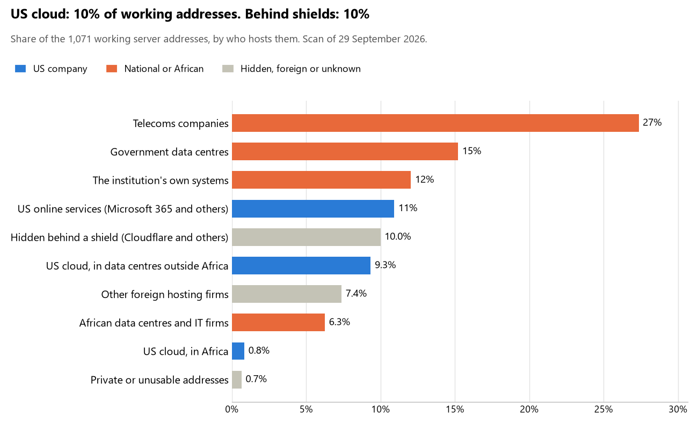

# Mozambique: who hosts the state's front door

29 September 2026 · Bill Anderson · scan of 29 September 2026

The scan covered 47 state bodies, banks and state-owned companies in Mozambique. 10% of their working server addresses are on US cloud: Amazon, Microsoft, Google or Oracle. 10% are behind shields such as Cloudflare, which hide the host. 27% are on government data centres or the institutions' own systems.

The scan found 970 web and mail names and 1,071 working addresses. 13 of the 47 institutions use US cloud for at least part of their estate. 11 use Microsoft for email and 1 use Google.

Of the 54 countries scanned so far, Mozambique has the 32nd highest US cloud share (median 13%) and the 31st highest share behind shields (median 12%).

## Where it lives

109 addresses are on US cloud. Where they are: 39% in Europe, 35% on worldwide delivery networks (no fixed location), 14% in a region the providers do not publish, 8% in Africa and 5% in North America.

107 addresses are behind shields: Cloudflare (84%), Datacamp (6%) and Sucuri (6%). The host behind a shield cannot be seen, so the US cloud share is a minimum.

## Banks against government

| Share of working addresses | Government (37) | Banks (10) |
| --- | --- | --- |
| On US cloud | 6% | 21% |
| …of which in Africa | <1% | <1% |
| US online services (Microsoft 365 and others) | 11% | 10% |
| Behind a shield | 6% | 19% |
| Government data centres | 22% | 0% |
| Run by the institution itself | 12% | 12% |
| Telecoms companies | 31% | 19% |
| African data centres and IT firms | 3% | 14% |
| Other foreign hosting firms | 9% | 5% |

7 of 10 banks and 6 of 37 government bodies use US cloud somewhere. "Government" includes the central bank, the payment switch, the stock exchange and the state-owned companies.

## Email

11 of the 47 institutions use Microsoft 365 for email and 1 use Google.

- **Microsoft 365:** 11. Ministério da Economia e Finanças, Banco de Moçambique, Millennium bim, Standard Bank Moçambique, FNB Moçambique, Nedbank Moçambique, First Capital Bank Moçambique, Bolsa de Valores de Moçambique, Portos e Caminhos de Ferro de Moçambique (CFM), Maputo Port Development Company and Instituto Nacional das Comunicações de Moçambique.
- **Google:** 1. Electricidade de Moçambique.
- **Government data centre:** 12. Presidência da República de Moçambique (INTIC), Assembleia da República (INTIC), Ministério dos Negócios Estrangeiros e Cooperação (INTIC), Ministério da Defesa Nacional (INTIC), Ministério da Justiça Assuntos Constitucionais e Religiosos (INTIC), Direcção Nacional de Identificação Civil (INTIC), Serviço Nacional de Migração (INTIC), Ministério da Saúde (INTIC), Instituto Nacional de Acção Social (INTIC), Instituto Nacional de Governo Electrónico (INTIC), Governo de Moçambique (parent zone) (INTIC) and CSIRT Nacional (Instituto Nacional das Comunicacoes de Mozambique).
- **Own mail servers:** 4. Autoridade Tributária de Moçambique, Moza Banco, Moçambique Telecom (Tmcel; absorbed TDM 2018) and Instituto Nacional de Tecnologias de Informação e Comunicação.
- **Telecoms companies:** 14. Forças Armadas de Defesa de Moçambique (TVCabo), Tribunal Supremo (TVCabo), Ministério do Interior (TVCabo), BCI - Banco Comercial e de Investimentos (TVCabo), Banco Nacional de Investimento (TVCabo), Secretariado Técnico de Administração Eleitoral (TVCabo), Instituto Nacional de Estatística (TVCabo), Direcção Nacional de Terras e Desenvolvimento Territorial (ABARI COMMUNICATIONS MOZAMBIQUE LDA), Sociedade Interbancária de Moçambique (SIMO) (TVCabo), Instituto Nacional de Segurança Social (Vodacom Mozambique), Unidade Funcional de Supervisão das Aquisições (TVCabo), Parque de Ciência e Tecnologia da Maluana (Centro de Dados de Maluana) (Vodacom Mozambique), Tribunal Administrativo (Moçambique Telecom, SA - TMCEL - Moçambique Telecom, SA) and Gabinete Central de Combate à Corrupção (TVCabo).
- **No mail on the domain scanned:** 5. Absa Bank Moçambique, Access Bank Moçambique, Direcção Nacional dos Registos e Notariado (registo civil), Serviço Nacional de Migração (eVisa) and Portal de Concursos Públicos.

## Institution by institution

Each figure is a share of that institution's working addresses. The rest are with telecoms companies, African data centres, US online services or foreign hosts. Rows follow the order of institution types.

| Institution | Type | On US cloud | …in Africa | Behind a shield | Own or government | Email |
| --- | --- | --- | --- | --- | --- | --- |
| Presidência da República de Moçambique | Presidency | 0% | 0% | 0% | 82% | Government |
| Assembleia da República | Parliament | 0% | 0% | 0% | 24% | Government |
| Ministério dos Negócios Estrangeiros e Cooperação | Foreign Affairs | 0% | 0% | 0% | 50% | Government |
| Ministério da Defesa Nacional | Defence | 0% | 0% | 0% | 82% | Government |
| Forças Armadas de Defesa de Moçambique | Armed Forces | 0% | 0% | 0% | 0% | Telecoms |
| Ministério da Justiça Assuntos Constitucionais e Religiosos | Justice | 0% | 0% | 0% | 83% | Government |
| Tribunal Supremo | Justice | 0% | 0% | 0% | 0% | Telecoms |
| Ministério da Economia e Finanças | Treasury / Finance | 0% | 0% | 0% | 18% | Microsoft |
| Autoridade Tributária de Moçambique | Revenue Service | 0% | 0% | 0% | 67% | Own servers |
| Ministério do Interior | Interior / Home Affairs | 0% | 0% | 63% | 0% | Telecoms |
| Banco de Moçambique | Central Bank | 39% | 0% | 0% | 0% | Microsoft |
| BCI - Banco Comercial e de Investimentos | Commercial Banks | 28% | 0% | 0% | 0% | Telecoms |
| Millennium bim | Commercial Banks | 0% | 0% | 0% | 0% | Microsoft |
| Standard Bank Moçambique | Commercial Banks | 32% | 0% | 46% | 20% | Microsoft |
| Absa Bank Moçambique | Commercial Banks | 21% | 0% | 5% | 5% | — |
| Moza Banco | Commercial Banks | 0% | 0% | 0% | 73% | Own servers |
| FNB Moçambique | Commercial Banks | 25% | 0% | 6% | 31% | Microsoft |
| Nedbank Moçambique | Commercial Banks | 8% | 8% | 0% | 0% | Microsoft |
| First Capital Bank Moçambique | Commercial Banks | 35% | 0% | 0% | 0% | Microsoft |
| Access Bank Moçambique | Commercial Banks | 0% | 0% | 100% | 0% | — |
| Banco Nacional de Investimento | Commercial Banks | 13% | 0% | 58% | 0% | Telecoms |
| Direcção Nacional de Identificação Civil | Civil registry / National ID authority | 0% | 0% | 0% | 73% | Government |
| Direcção Nacional dos Registos e Notariado (registo civil) | Civil registry / National ID authority | 0% | 0% | 0% | 0% | — |
| Secretariado Técnico de Administração Eleitoral | Electoral commission | 0% | 0% | 8% | 0% | Telecoms |
| Instituto Nacional de Estatística | Statistics office | 0% | 0% | 0% | 0% | Telecoms |
| Serviço Nacional de Migração | Immigration / Passports | 0% | 0% | 0% | 57% | Government |
| Serviço Nacional de Migração (eVisa) | Immigration / Passports | 0% | 0% | 60% | 30% | — |
| Ministério da Saúde | Health ministry / National health insurance | 0% | 0% | 0% | 47% | Government |
| Instituto Nacional de Acção Social | Social protection / Social registry | 0% | 0% | 0% | 92% | Government |
| Direcção Nacional de Terras e Desenvolvimento Territorial | Land registry | 0% | 0% | 0% | 0% | Telecoms |
| Sociedade Interbancária de Moçambique (SIMO) | National payment switch | 0% | 0% | 0% | 11% | Telecoms |
| Bolsa de Valores de Moçambique | Stock exchange | 26% | 0% | 0% | 0% | Microsoft |
| Instituto Nacional de Segurança Social | Sovereign wealth fund / National pension fund | 0% | 0% | 0% | 0% | Telecoms |
| Unidade Funcional de Supervisão das Aquisições | Public procurement authority | 0% | 0% | 0% | 0% | Telecoms |
| Portal de Concursos Públicos | Public procurement authority | no working address | | | | — |
| Electricidade de Moçambique | Energy utility | 1% | 1% | 36% | 25% | Google |
| Portos e Caminhos de Ferro de Moçambique (CFM) | Ports authority | 7% | 0% | 0% | 0% | Microsoft |
| Maputo Port Development Company | Ports authority | 27% | 9% | 9% | 0% | Microsoft |
| Moçambique Telecom (Tmcel; absorbed TDM 2018) | State-owned telco / National backbone operator | 0% | 0% | 0% | 100% | Own servers |
| Instituto Nacional de Governo Electrónico | E-government agency | 0% | 0% | 0% | 88% | Government |
| Governo de Moçambique (parent zone) | E-government agency | 0% | 0% | 0% | 50% | Government |
| Parque de Ciência e Tecnologia da Maluana (Centro de Dados de Maluana) | National data centre / Government cloud operator | 0% | 0% | 0% | 0% | Telecoms |
| CSIRT Nacional | Cybersecurity agency / National CERT | 0% | 0% | 0% | 100% | Government |
| Instituto Nacional de Tecnologias de Informação e Comunicação | Cybersecurity agency / National CERT | 0% | 0% | 0% | 93% | Own servers |
| Instituto Nacional das Comunicações de Moçambique | Communications regulator | 2% | 0% | 0% | 62% | Microsoft |
| Tribunal Administrativo | Audit office | 0% | 0% | 0% | 0% | Telecoms |
| Gabinete Central de Combate à Corrupção | Anti-corruption commission | 0% | 0% | 0% | 39% | Telecoms |

No institution or working domain was found for 5 of the 36 types: Police, Customs, Intelligence, Data protection authority and Securities regulator.

## What stood out

- **Little US cloud in Africa.** 8% of Mozambique's US cloud addresses are in the providers' African data centres.
- **Core state bodies at home.** Presidência da República de Moçambique (82%), Ministério da Defesa Nacional (82%) and Ministério da Justiça Assuntos Constitucionais e Religiosos (83%) keep at least 80% of their working addresses on government data centres or their own systems.
- **Core state bodies on foreign hosting firms.** Assembleia da República (Unified Layer (Bluehost)), Tribunal Supremo (FranTech Solutions) and Ministério da Economia e Finanças (Hostinger).
- **No Chinese cloud.** The scan found no address on Huawei, Alibaba or Tencent cloud.

## What this can and cannot tell you

The scan sees only the front door: websites, email, login portals, remote-access gateways and online banking. It cannot see where a bank's core ledger, the ID register or the payroll run.

- **Every US figure is a minimum.** Anything behind a shield or a mail filter could also be on US cloud. In Mozambique that is 10% of working addresses.
- **It counts addresses, not importance.** An institution with many test and marketing sites weighs more than one with few.
- **The list of institutions was drawn up for this scan.** Each domain was checked to exist, not confirmed as the institution's main one.
- **It is a snapshot.** Every figure is as of 29 September 2026.
- **Nothing was touched.** The scan used public address lookups, public certificate records and the cloud companies' published address lists. It never connected to any institution's systems.

The data and method are in `R&D/Hyperscaler-dependence/scan/MOZ/` and `R&D/Hyperscaler-dependence/HYPERSCALER-SCAN.md` in the Corpus repository.
