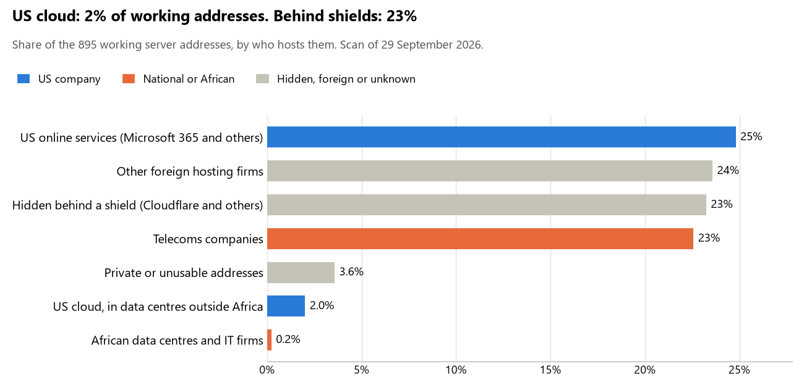

# Mauritania: who hosts the state's front door

29 September 2026 · Bill Anderson · scan of 29 September 2026

The scan covered 32 state bodies, banks and state-owned companies in Mauritania. 2% of their working server addresses are on US cloud: Amazon, Microsoft, Google or Oracle. 23% are behind shields such as Cloudflare, which hide the host. 0% are on government data centres or the institutions' own systems.

The scan found 515 web and mail names and 895 working addresses. 7 of the 32 institutions use US cloud for at least part of their estate. 15 use Microsoft for email and 1 use Google.

Of the 54 countries scanned so far, Mauritania has the 53rd highest US cloud share (median 13%) and the 12th highest share behind shields (median 12%).

## Where it lives

18 addresses are on US cloud. Where they are: 50% in a region the providers do not publish, 28% in Europe, 17% on worldwide delivery networks (no fixed location) and 6% in North America.

208 addresses are behind shields: Cloudflare (100%). The host behind a shield cannot be seen, so the US cloud share is a minimum.

## Banks against government

| Share of working addresses | Government (23) | Banks (9) |
| --- | --- | --- |
| On US cloud | <1% | 5% |
| …of which in Africa | 0% | 0% |
| US online services (Microsoft 365 and others) | 26% | 22% |
| Behind a shield | 28% | 12% |
| Government data centres | 0% | 0% |
| Run by the institution itself | 0% | 0% |
| Telecoms companies | 22% | 24% |
| African data centres and IT firms | 0% | <1% |
| Other foreign hosting firms | 22% | 28% |

4 of 9 banks and 3 of 23 government bodies use US cloud somewhere. "Government" includes the central bank, the payment switch, the stock exchange and the state-owned companies.

## Email

15 of the 32 institutions use Microsoft 365 for email and 1 use Google.

- **Microsoft 365:** 15. Ministère des Affaires étrangères, Ministère de la Défense nationale, Ministère de la Justice, Ministère de l'Économie et des Finances, Direction générale des Impôts, Ministère de l'Intérieur et de la Décentralisation, Banque Centrale de Mauritanie, Banque Mauritanienne pour l'Investissement, Banque Internationale d'Investissement, Banque Islamique de Mauritanie, Agence Nationale du Registre des Populations et des Titres Sécurisés, Ministère de la Santé, Caisse Nationale d'Assurance Maladie, Ministère de la Transformation Numérique (portail des procédures) and Cour des Comptes.
- **Google:** 1. Banque Populaire de Mauritanie.
- **Telecoms companies:** 3. Banque Mauritanienne pour le Commerce International (MATTEL), Banque Nationale de Mauritanie (Mauritanian Telecommunication Company) and Mauritel (Mauritanian Telecommunication Company).
- **Foreign hosting firms:** 11. Présidence de la République Islamique de Mauritanie (Infomaniak-AS Infomaniak Network SA), Assemblée nationale (Namecheap), Caisse de Dépôts et de Développement (O2SWITCH O2SWITCH SAS), Banque Al Wava Mauritanienne Islamique (Infomaniak-AS Infomaniak Network SA), Agence Nationale de la Statistique et de l'Analyse Démographique et Économique (Liquid Web), Caisse Nationale de Sécurité Sociale (Internap Holding LLC), GIMTEL (Infomaniak-AS Infomaniak Network SA), Autorité de Régulation des Marchés Publics (OVH), Société Mauritanienne d'Électricité (OVH), Port Autonome de Nouakchott (Infomaniak-AS Infomaniak Network SA) and Autorité de Régulation Multisectorielle (Unified Layer).
- **No mail on the domain scanned:** 2. Banque de Commerce et d'Industrie and Commission Électorale Nationale Indépendante.

## Institution by institution

Each figure is a share of that institution's working addresses. The rest are with telecoms companies, African data centres, US online services or foreign hosts. Rows follow the order of institution types.

| Institution | Type | On US cloud | …in Africa | Behind a shield | Own or government | Email |
| --- | --- | --- | --- | --- | --- | --- |
| Présidence de la République Islamique de Mauritanie | Presidency | 0% | 0% | 0% | 0% | Foreign host |
| Assemblée nationale | Parliament | 0% | 0% | 0% | 0% | Foreign host |
| Ministère des Affaires étrangères | Foreign Affairs | 3% | 0% | 0% | 0% | Microsoft |
| Ministère de la Défense nationale | Defence | 0% | 0% | 0% | 0% | Microsoft |
| Ministère de la Justice | Justice | 0% | 0% | 0% | 0% | Microsoft |
| Ministère de l'Économie et des Finances | Treasury / Finance | 0% | 0% | 0% | 0% | Microsoft |
| Direction générale des Impôts | Revenue Service | 0% | 0% | 0% | 0% | Microsoft |
| Ministère de l'Intérieur et de la Décentralisation | Interior / Home Affairs | 0% | 0% | 0% | 0% | Microsoft |
| Banque Centrale de Mauritanie | Central Bank | 0% | 0% | 17% | 0% | Microsoft |
| Banque Populaire de Mauritanie | Commercial Banks | 2% | 0% | 51% | 0% | Google |
| Banque Mauritanienne pour l'Investissement | Commercial Banks | 3% | 0% | 5% | 0% | Microsoft |
| Banque Mauritanienne pour le Commerce International | Commercial Banks | 0% | 0% | 0% | 0% | Telecoms |
| Banque Internationale d'Investissement | Commercial Banks | 12% | 0% | 5% | 0% | Microsoft |
| Banque Nationale de Mauritanie | Commercial Banks | 0% | 0% | 0% | 0% | Telecoms |
| Caisse de Dépôts et de Développement | Commercial Banks | 0% | 0% | 0% | 0% | Foreign host |
| Banque Al Wava Mauritanienne Islamique | Commercial Banks | 0% | 0% | 0% | 0% | Foreign host |
| Banque Islamique de Mauritanie | Commercial Banks | 25% | 0% | 0% | 0% | Microsoft |
| Banque de Commerce et d'Industrie | Commercial Banks | 0% | 0% | 0% | 0% | — |
| Agence Nationale du Registre des Populations et des Titres Sécurisés | Civil registry / National ID authority | 0% | 0% | 0% | 0% | Microsoft |
| Commission Électorale Nationale Indépendante | Electoral commission | 0% | 0% | 100% | 0% | — |
| Agence Nationale de la Statistique et de l'Analyse Démographique et Économique | Statistics office | 0% | 0% | 0% | 0% | Foreign host |
| Ministère de la Santé | Health ministry / National health insurance | 0% | 0% | 0% | 0% | Microsoft |
| Caisse Nationale d'Assurance Maladie | Health ministry / National health insurance | 0% | 0% | 0% | 0% | Microsoft |
| Caisse Nationale de Sécurité Sociale | Social protection / Social registry | 9% | 0% | 0% | 0% | Foreign host |
| GIMTEL | National payment switch | 0% | 0% | 98% | 0% | Foreign host |
| Autorité de Régulation des Marchés Publics | Public procurement authority | 0% | 0% | 0% | 0% | Foreign host |
| Société Mauritanienne d'Électricité | Energy utility | 0% | 0% | 0% | 0% | Foreign host |
| Port Autonome de Nouakchott | Ports authority | 20% | 0% | 0% | 0% | Foreign host |
| Mauritel | State-owned telco / National backbone operator | 0% | 0% | 0% | 0% | Telecoms |
| Ministère de la Transformation Numérique (portail des procédures) | E-government agency | 0% | 0% | 0% | 0% | Microsoft |
| Autorité de Régulation Multisectorielle | Communications regulator | 0% | 0% | 0% | 0% | Foreign host |
| Cour des Comptes | Audit office | 0% | 0% | 78% | 0% | Microsoft |

No institution or working domain was found for 13 of the 36 types: Armed Forces, Police, Customs, Intelligence, Data protection authority, Immigration / Passports, Land registry, Stock exchange, Securities regulator, Sovereign wealth fund / National pension fund, National data centre / Government cloud operator, Cybersecurity agency / National CERT and Anti-corruption commission.

## What stood out

- **Little US cloud in Africa.** 0% of Mauritania's US cloud addresses are in the providers' African data centres.
- **Core state bodies on foreign hosting firms.** Assemblée nationale (Namecheap and Hetzner), Ministère des Affaires étrangères (Hostinger) and Banque Centrale de Mauritanie (Scaleway SAS and DigitalOcean).
- **No Chinese cloud.** The scan found no address on Huawei, Alibaba or Tencent cloud.

## What this can and cannot tell you

The scan sees only the front door: websites, email, login portals, remote-access gateways and online banking. It cannot see where a bank's core ledger, the ID register or the payroll run.

- **Every US figure is a minimum.** Anything behind a shield or a mail filter could also be on US cloud. In Mauritania that is 23% of working addresses.
- **It counts addresses, not importance.** An institution with many test and marketing sites weighs more than one with few.
- **The list of institutions was drawn up for this scan.** Each domain was checked to exist, not confirmed as the institution's main one.
- **It is a snapshot.** Every figure is as of 29 September 2026.
- **Nothing was touched.** The scan used public address lookups, public certificate records and the cloud companies' published address lists. It never connected to any institution's systems.

The data and method are in `R&D/Hyperscaler-dependence/scan/MRT/` and `R&D/Hyperscaler-dependence/HYPERSCALER-SCAN.md` in the Corpus repository.
