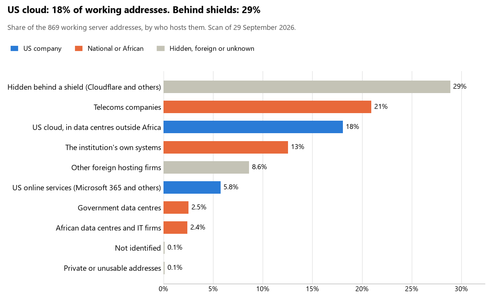

# Mauritius: who hosts the state's front door

29 September 2026 · Bill Anderson · scan of 29 September 2026

The scan covered 38 state bodies, banks and state-owned companies in Mauritius. 18% of their working server addresses are on US cloud: Amazon, Microsoft, Google or Oracle. 29% are behind shields such as Cloudflare, which hide the host. 15% are on government data centres or the institutions' own systems.

The scan found 1,050 web and mail names and 869 working addresses. 11 of the 38 institutions use US cloud for at least part of their estate. 9 use Microsoft for email and none use Google.

Of the 54 countries scanned so far, Mauritius has the 19th highest US cloud share (median 13%) and the 7th highest share behind shields (median 12%).

## Where it lives

157 addresses are on US cloud. Where they are: 67% in Europe, 18% on worldwide delivery networks (no fixed location), 12% in a region the providers do not publish and 3% in North America.

251 addresses are behind shields: Cloudflare (95%), Radware (3%) and Imperva (2%). The host behind a shield cannot be seen, so the US cloud share is a minimum.

## Banks against government

| Share of working addresses | Government (30) | Banks (8) |
| --- | --- | --- |
| On US cloud | 10% | 23% |
| …of which in Africa | 0% | 0% |
| US online services (Microsoft 365 and others) | 9% | 4% |
| Behind a shield | 8% | 41% |
| Government data centres | 7% | 0% |
| Run by the institution itself | 29% | 3% |
| Telecoms companies | 33% | 14% |
| African data centres and IT firms | <1% | 4% |
| Other foreign hosting firms | 3% | 12% |

6 of 8 banks and 5 of 30 government bodies use US cloud somewhere. "Government" includes the central bank, the payment switch, the stock exchange and the state-owned companies.

## Email

9 of the 38 institutions use Microsoft 365 for email and none use Google.

- **Microsoft 365:** 9. Bank of Mauritius, The Mauritius Commercial Bank, SBM Bank (Mauritius), Bank One, SBI (Mauritius), Central Electricity Board, Mauritius Ports Authority, Mauritius Telecom and Financial Crimes Commission.
- **Telecoms companies (Mauritius Telecom):** 2. Mauritius Revenue Authority and Information and Communication Technologies Authority.
- **African hosts (Rogers Capital Technology Services Ltd):** 1. MauBank.
- **Behind a mail filter, provider not visible:** 2. AfrAsia Bank and Financial Services Commission.
- **Not identified:** 1. Bank of Baroda Mauritius.
- **No mail on the domain scanned:** 23. Office of the President, National Assembly of Mauritius, Ministry of Foreign Affairs Regional Integration and International Trade, Prime Minister's Office (National Security), Mauritius Police Force, Attorney General's Office, Supreme Court of Mauritius, Ministry of Finance Economic Planning and Development, Ministry of Defence, Home Affairs and External Communications, Absa Bank (Mauritius), Civil Status Division, Data Protection Office, Electoral Commissioner's Office, Statistics Mauritius, Passport and Immigration Office, Ministry of Health and Wellness, Ministry of Social Integration Social Security and National Solidarity, Registrar General's Department, Stock Exchange of Mauritius, Public Procurement Office, Central Informatics Bureau, CERT-MU and National Audit Office.

## Institution by institution

Each figure is a share of that institution's working addresses. The rest are with telecoms companies, African data centres, US online services or foreign hosts. Rows follow the order of institution types.

| Institution | Type | On US cloud | …in Africa | Behind a shield | Own or government | Email |
| --- | --- | --- | --- | --- | --- | --- |
| Office of the President | Presidency | 0% | 0% | 0% | 100% | — |
| National Assembly of Mauritius | Parliament | 0% | 0% | 0% | 100% | — |
| Ministry of Foreign Affairs Regional Integration and International Trade | Foreign Affairs | 0% | 0% | 0% | 100% | — |
| Prime Minister's Office (National Security) | Defence | 0% | 0% | 0% | 33% | — |
| Mauritius Police Force | Police | 0% | 0% | 0% | 100% | — |
| Attorney General's Office | Justice | 0% | 0% | 0% | 100% | — |
| Supreme Court of Mauritius | Justice | 0% | 0% | 0% | 100% | — |
| Ministry of Finance Economic Planning and Development | Treasury / Finance | 0% | 0% | 0% | 100% | — |
| Mauritius Revenue Authority | Revenue Service | 0% | 0% | 0% | 0% | Telecoms |
| Ministry of Defence, Home Affairs and External Communications | Interior / Home Affairs | 0% | 0% | 0% | 100% | — |
| Bank of Mauritius | Central Bank | 45% | 0% | 0% | 0% | Microsoft |
| The Mauritius Commercial Bank | Commercial Banks | 7% | 0% | 14% | 0% | Microsoft |
| SBM Bank (Mauritius) | Commercial Banks | 18% | 0% | 16% | 22% | Microsoft |
| Absa Bank (Mauritius) | Commercial Banks | 72% | 0% | 6% | 0% | — |
| Bank One | Commercial Banks | <1% | 0% | 85% | 0% | Microsoft |
| AfrAsia Bank | Commercial Banks | 38% | 0% | 0% | 0% | Filtered |
| MauBank | Commercial Banks | 33% | 0% | 0% | 0% | African host |
| SBI (Mauritius) | Commercial Banks | 0% | 0% | 77% | 0% | Microsoft |
| Bank of Baroda Mauritius | Commercial Banks | 0% | 0% | 67% | 0% | Not identified |
| Civil Status Division | Civil registry / National ID authority | 0% | 0% | 0% | 100% | — |
| Data Protection Office | Data protection authority | 0% | 0% | 0% | 100% | — |
| Electoral Commissioner's Office | Electoral commission | 0% | 0% | 0% | 100% | — |
| Statistics Mauritius | Statistics office | 0% | 0% | 0% | 100% | — |
| Passport and Immigration Office | Immigration / Passports | 0% | 0% | 0% | 100% | — |
| Ministry of Health and Wellness | Health ministry / National health insurance | 0% | 0% | 0% | 100% | — |
| Ministry of Social Integration Social Security and National Solidarity | Social protection / Social registry | 0% | 0% | 0% | 100% | — |
| Registrar General's Department | Land registry | 0% | 0% | 0% | 0% | — |
| Stock Exchange of Mauritius | Stock exchange | 50% | 0% | 0% | 0% | — |
| Financial Services Commission | Securities regulator | 4% | 0% | 15% | 0% | Filtered |
| Public Procurement Office | Public procurement authority | 0% | 0% | 0% | 50% | — |
| Central Electricity Board | Energy utility | 29% | 0% | 0% | 0% | Microsoft |
| Mauritius Ports Authority | Ports authority | 0% | 0% | 22% | 0% | Microsoft |
| Mauritius Telecom | State-owned telco / National backbone operator | 0% | 0% | 0% | 98% | Microsoft |
| Central Informatics Bureau | E-government agency | 0% | 0% | 0% | 100% | — |
| CERT-MU | Cybersecurity agency / National CERT | 0% | 0% | 0% | 100% | — |
| Information and Communication Technologies Authority | Communications regulator | 0% | 0% | 24% | 0% | Telecoms |
| National Audit Office | Audit office | 0% | 0% | 0% | 100% | — |
| Financial Crimes Commission | Anti-corruption commission | 21% | 0% | 33% | 0% | Microsoft |

No institution or working domain was found for 6 of the 36 types: Armed Forces, Customs, Intelligence, National payment switch, Sovereign wealth fund / National pension fund and National data centre / Government cloud operator.

## What stood out

- **Most on US cloud.** Absa Bank (Mauritius) (72%) and Stock Exchange of Mauritius (50%) have more than half their working addresses on US cloud.
- **Little US cloud in Africa.** 0% of Mauritius's US cloud addresses are in the providers' African data centres.
- **No Chinese cloud.** The scan found no address on Huawei, Alibaba or Tencent cloud.

## What this can and cannot tell you

The scan sees only the front door: websites, email, login portals, remote-access gateways and online banking. It cannot see where a bank's core ledger, the ID register or the payroll run.

- **Every US figure is a minimum.** Anything behind a shield or a mail filter could also be on US cloud. In Mauritius that is 29% of working addresses.
- **It counts addresses, not importance.** An institution with many test and marketing sites weighs more than one with few.
- **The list of institutions was drawn up for this scan.** Each domain was checked to exist, not confirmed as the institution's main one.
- **It is a snapshot.** Every figure is as of 29 September 2026.
- **Nothing was touched.** The scan used public address lookups, public certificate records and the cloud companies' published address lists. It never connected to any institution's systems.

The data and method are in `R&D/Hyperscaler-dependence/scan/MUS/` and `R&D/Hyperscaler-dependence/HYPERSCALER-SCAN.md` in the Corpus repository.
