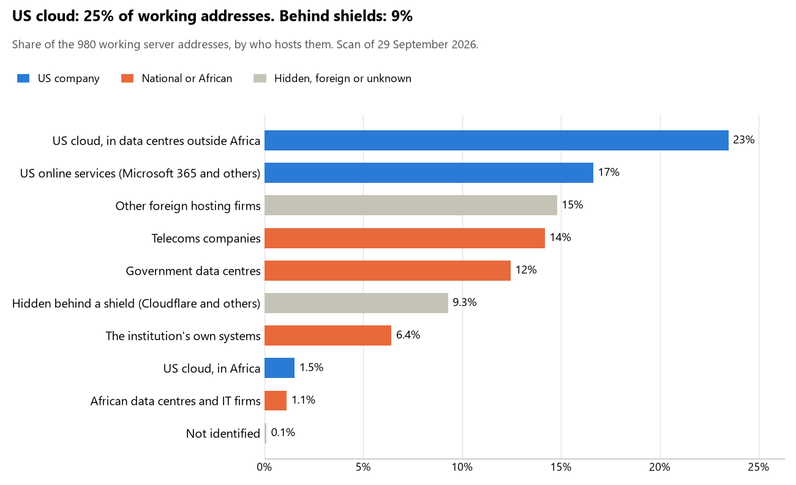

# Malawi: who hosts the state's front door

29 September 2026 · Bill Anderson · scan of 29 September 2026

The scan covered 30 state bodies, banks and state-owned companies in Malawi. 25% of their working server addresses are on US cloud: Amazon, Microsoft, Google or Oracle. 9% are behind shields such as Cloudflare, which hide the host. 19% are on government data centres or the institutions' own systems.

The scan found 693 web and mail names and 980 working addresses. 16 of the 30 institutions use US cloud for at least part of their estate. 14 use Microsoft for email and 1 use Google.

Of the 54 countries scanned so far, Malawi has the 9th highest US cloud share (median 13%) and the 34th highest share behind shields (median 12%).

## Where it lives

245 addresses are on US cloud. Where they are: 54% in Europe, 30% on worldwide delivery networks (no fixed location), 6% in Africa, 5% in a region the providers do not publish and 4% in North America.

91 addresses are behind shields: Cloudflare (56%), Akamai (35%) and Imperva (7%). The host behind a shield cannot be seen, so the US cloud share is a minimum.

## Banks against government

| Share of working addresses | Government (23) | Banks (7) |
| --- | --- | --- |
| On US cloud | 22% | 31% |
| …of which in Africa | 2% | <1% |
| US online services (Microsoft 365 and others) | 15% | 20% |
| Behind a shield | <1% | 27% |
| Government data centres | 19% | 0% |
| Run by the institution itself | 7% | 5% |
| Telecoms companies | 17% | 8% |
| African data centres and IT firms | 2% | 0% |
| Other foreign hosting firms | 18% | 9% |

6 of 7 banks and 10 of 23 government bodies use US cloud somewhere. "Government" includes the central bank, the payment switch, the stock exchange and the state-owned companies.

## Email

14 of the 30 institutions use Microsoft 365 for email and 1 use Google.

- **Microsoft 365:** 14. Malawi Revenue Authority, Reserve Bank of Malawi, Standard Bank Malawi, FDH Bank, First Capital Bank Malawi, NBS Bank, Centenary Bank Malawi, CDH Investment Bank, Malawi Electoral Commission, Malawi Stock Exchange, Public Procurement and Disposal of Assets Authority, Electricity Supply Corporation of Malawi, Malawi Telecommunications Limited and Malawi Communications Regulatory Authority.
- **Google:** 1. Judiciary of Malawi.
- **Government data centre (Department of E-Government):** 10. Office of the President and Cabinet, Ministry of Foreign Affairs, Malawi Defence Force, Malawi Police Service, Ministry of Justice, Ministry of Finance and Economic Affairs, National Registration Bureau, Ministry of Health, Ministry of Lands and National Audit Office.
- **African hosts (National Integrated Technologies Limited):** 1. Malswitch.
- **Foreign hosting firms (Zoho):** 1. Anti-Corruption Bureau.
- **Behind a mail filter, provider not visible:** 1. Department of Immigration and Citizenship Services.
- **Not identified:** 1. National Bank of Malawi.
- **No mail on the domain scanned:** 1. National Statistical Office.

## Institution by institution

Each figure is a share of that institution's working addresses. The rest are with telecoms companies, African data centres, US online services or foreign hosts. Rows follow the order of institution types.

| Institution | Type | On US cloud | …in Africa | Behind a shield | Own or government | Email |
| --- | --- | --- | --- | --- | --- | --- |
| Office of the President and Cabinet | Presidency | 0% | 0% | 0% | 90% | Government |
| Ministry of Foreign Affairs | Foreign Affairs | 0% | 0% | 0% | 100% | Government |
| Malawi Defence Force | Armed Forces | 0% | 0% | 0% | 100% | Government |
| Malawi Police Service | Police | 0% | 0% | 0% | 100% | Government |
| Ministry of Justice | Justice | 0% | 0% | 0% | 100% | Government |
| Judiciary of Malawi | Justice | 0% | 0% | 0% | 0% | Google |
| Ministry of Finance and Economic Affairs | Treasury / Finance | 0% | 0% | 0% | 100% | Government |
| Malawi Revenue Authority | Revenue Service | 76% | 1% | 0% | 15% | Microsoft |
| Reserve Bank of Malawi | Central Bank | 12% | 0% | 0% | 0% | Microsoft |
| National Bank of Malawi | Commercial Banks | 40% | 0% | 24% | 16% | Not identified |
| Standard Bank Malawi | Commercial Banks | 19% | <1% | 75% | 5% | Microsoft |
| FDH Bank | Commercial Banks | 54% | 0% | 0% | 0% | Microsoft |
| First Capital Bank Malawi | Commercial Banks | 38% | 0% | 0% | 0% | Microsoft |
| NBS Bank | Commercial Banks | 41% | 0% | 0% | 9% | Microsoft |
| Centenary Bank Malawi | Commercial Banks | 5% | 0% | 0% | 0% | Microsoft |
| CDH Investment Bank | Commercial Banks | 0% | 0% | 0% | 0% | Microsoft |
| National Registration Bureau | Civil registry / National ID authority | 0% | 0% | 0% | 80% | Government |
| Malawi Electoral Commission | Electoral commission | 9% | 0% | 0% | 0% | Microsoft |
| National Statistical Office | Statistics office | 0% | 0% | 0% | 50% | — |
| Department of Immigration and Citizenship Services | Immigration / Passports | 36% | 0% | 0% | 0% | Filtered |
| Ministry of Health | Health ministry / National health insurance | 21% | 12% | 0% | 56% | Government |
| Ministry of Lands | Land registry | 0% | 0% | 0% | 94% | Government |
| Malswitch | National payment switch | 0% | 0% | 0% | 0% | African host |
| Malawi Stock Exchange | Stock exchange | 23% | 0% | 5% | 0% | Microsoft |
| Public Procurement and Disposal of Assets Authority | Public procurement authority | 11% | 0% | 0% | 0% | Microsoft |
| Electricity Supply Corporation of Malawi | Energy utility | 26% | 0% | 0% | 46% | Microsoft |
| Malawi Telecommunications Limited | State-owned telco / National backbone operator | 39% | 12% | 0% | 29% | Microsoft |
| Malawi Communications Regulatory Authority | Communications regulator | 26% | 0% | 0% | 24% | Microsoft |
| National Audit Office | Audit office | 0% | 0% | 0% | 100% | Government |
| Anti-Corruption Bureau | Anti-corruption commission | 0% | 0% | 0% | 0% | Foreign host |

No institution or working domain was found for 13 of the 36 types: Parliament, Defence, Customs, Intelligence, Interior / Home Affairs, Data protection authority, Social protection / Social registry, Securities regulator, Sovereign wealth fund / National pension fund, Ports authority, E-government agency, National data centre / Government cloud operator and Cybersecurity agency / National CERT.

## What stood out

- **Most on US cloud.** Malawi Revenue Authority (76%) and FDH Bank (54%) have more than half their working addresses on US cloud.
- **Little US cloud in Africa.** 6% of Malawi's US cloud addresses are in the providers' African data centres.
- **Core state bodies at home.** Office of the President and Cabinet (90%), Ministry of Foreign Affairs (100%), Malawi Defence Force (100%), Malawi Police Service (100%), Ministry of Justice (100%) and Ministry of Finance and Economic Affairs (100%) keep at least 80% of their working addresses on government data centres or their own systems.
- **Core state bodies on foreign hosting firms.** Office of the President and Cabinet (Network Solutions), Judiciary of Malawi (Interserver) and Reserve Bank of Malawi (Clouvider Clouvider Limited).
- **No Chinese cloud.** The scan found no address on Huawei, Alibaba or Tencent cloud.
- **Names anyone could claim.** One web address at First Capital Bank Malawi points at a deleted cloud name that anyone could register and then publish under. We have flagged it and do not name it here.

## What this can and cannot tell you

The scan sees only the front door: websites, email, login portals, remote-access gateways and online banking. It cannot see where a bank's core ledger, the ID register or the payroll run.

- **Every US figure is a minimum.** Anything behind a shield or a mail filter could also be on US cloud. In Malawi that is 9% of working addresses.
- **It counts addresses, not importance.** An institution with many test and marketing sites weighs more than one with few.
- **The list of institutions was drawn up for this scan.** Each domain was checked to exist, not confirmed as the institution's main one.
- **It is a snapshot.** Every figure is as of 29 September 2026.
- **Nothing was touched.** The scan used public address lookups, public certificate records and the cloud companies' published address lists. It never connected to any institution's systems.

The data and method are in `R&D/Hyperscaler-dependence/scan/MWI/` and `R&D/Hyperscaler-dependence/HYPERSCALER-SCAN.md` in the Corpus repository.
