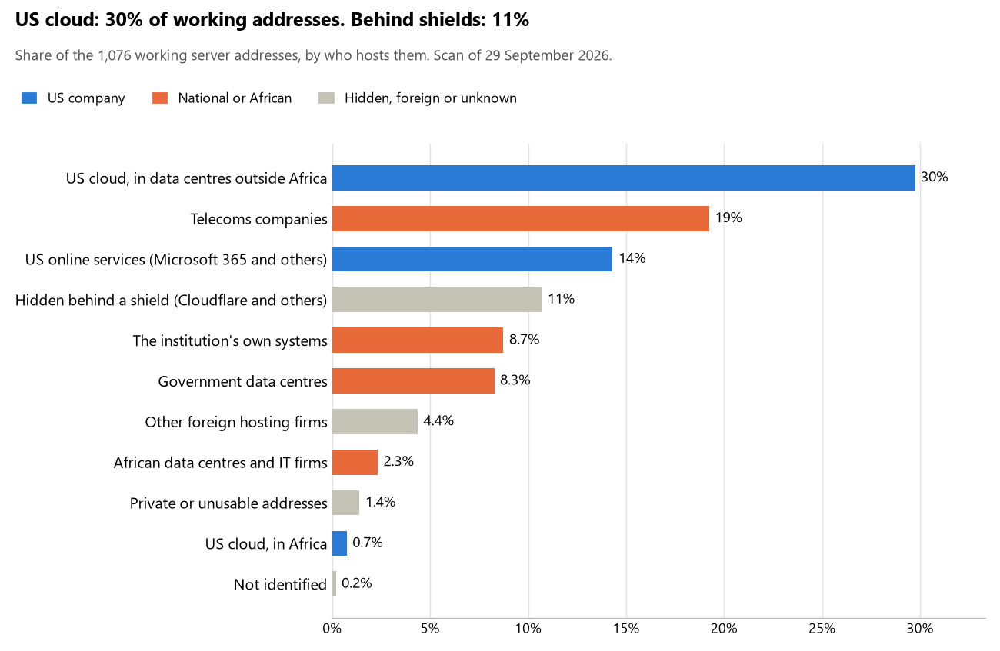

# Namibia: who hosts the state's front door

29 September 2026 · Bill Anderson · scan of 29 September 2026

The scan covered 34 state bodies, banks and state-owned companies in Namibia. 30% of their working server addresses are on US cloud: Amazon, Microsoft, Google or Oracle. 11% are behind shields such as Cloudflare, which hide the host. 17% are on government data centres or the institutions' own systems.

The scan found 775 web and mail names and 1,076 working addresses. 16 of the 34 institutions use US cloud for at least part of their estate. 17 use Microsoft for email and none use Google.

Of the 54 countries scanned so far, Namibia has the 3rd highest US cloud share (median 13%) and the 30th highest share behind shields (median 12%).

## Where it lives

328 addresses are on US cloud. Where they are: 78% in Europe, 18% on worldwide delivery networks (no fixed location), 2% in Africa and 2% in a region the providers do not publish.

115 addresses are behind shields: Cloudflare (68%), Akamai (31%) and Radware (<1%). The host behind a shield cannot be seen, so the US cloud share is a minimum.

## Banks against government

| Share of working addresses | Government (27) | Banks (7) |
| --- | --- | --- |
| On US cloud | 21% | 46% |
| …of which in Africa | <1% | <1% |
| US online services (Microsoft 365 and others) | 17% | 9% |
| Behind a shield | 6% | 19% |
| Government data centres | 13% | 0% |
| Run by the institution itself | 7% | 11% |
| Telecoms companies | 25% | 9% |
| African data centres and IT firms | 3% | 2% |
| Other foreign hosting firms | 5% | 3% |

7 of 7 banks and 9 of 27 government bodies use US cloud somewhere. "Government" includes the central bank, the payment switch, the stock exchange and the state-owned companies.

## Email

17 of the 34 institutions use Microsoft 365 for email and none use Google.

- **Microsoft 365:** 17. Namibia Revenue Agency, Bank of Namibia, First National Bank of Namibia, Bank Windhoek, Standard Bank Namibia, Nedbank Namibia, Bank BIC Namibia, Letshego Bank Namibia, Development Bank of Namibia, Namclear, Namibian Stock Exchange, Namibia Financial Institutions Supervisory Authority, Government Institutions Pension Fund, Central Procurement Board of Namibia, NamPower, Telecom Namibia and Communications Regulatory Authority of Namibia.
- **Government data centre (Government of the Republic of Namibia):** 12. Office of the President, Ministry of International Relations and Cooperation, Ministry of Defence and Veterans Affairs, Namibian Police Force, Ministry of Justice, Ministry of Finance and Public Enterprises, Ministry of Home Affairs, Immigration, Safety and Security, Ministry of Health and Social Services, Ministry of Gender Equality Poverty Eradication and Social Welfare, Office of the Prime Minister, Office of the Auditor General and Anti-Corruption Commission.
- **Telecoms companies:** 2. National Assembly of Namibia (Mobile Telecommunications, Ltd. - MTC - Mobile Telecommunications, Ltd.) and Namibian Ports Authority (Telecom Namibia).
- **African hosts (Click Cloud Hosting Services CC):** 1. Electoral Commission of Namibia.
- **Not identified:** 1. Judiciary of Namibia.
- **No mail on the domain scanned:** 1. Namibia Statistics Agency.

## Institution by institution

Each figure is a share of that institution's working addresses. The rest are with telecoms companies, African data centres, US online services or foreign hosts. Rows follow the order of institution types.

| Institution | Type | On US cloud | …in Africa | Behind a shield | Own or government | Email |
| --- | --- | --- | --- | --- | --- | --- |
| Office of the President | Presidency | 0% | 0% | 0% | 86% | Government |
| National Assembly of Namibia | Parliament | 0% | 0% | 0% | 42% | Telecoms |
| Ministry of International Relations and Cooperation | Foreign Affairs | 0% | 0% | 0% | 6% | Government |
| Ministry of Defence and Veterans Affairs | Defence | 0% | 0% | 0% | 86% | Government |
| Namibian Police Force | Police | 0% | 0% | 0% | 67% | Government |
| Ministry of Justice | Justice | 0% | 0% | 0% | 86% | Government |
| Judiciary of Namibia | Justice | no working address | | | | Not identified |
| Ministry of Finance and Public Enterprises | Treasury / Finance | 0% | 0% | 0% | 100% | Government |
| Namibia Revenue Agency | Revenue Service | 32% | 6% | 0% | 0% | Microsoft |
| Ministry of Home Affairs, Immigration, Safety and Security | Interior / Home Affairs | 0% | 0% | 0% | 83% | Government |
| Bank of Namibia | Central Bank | 50% | 0% | 0% | 0% | Microsoft |
| First National Bank of Namibia | Commercial Banks | 42% | 0% | 2% | 33% | Microsoft |
| Bank Windhoek | Commercial Banks | 38% | 3% | 11% | 41% | Microsoft |
| Standard Bank Namibia | Commercial Banks | 46% | 0% | 43% | 8% | Microsoft |
| Nedbank Namibia | Commercial Banks | 45% | 5% | 0% | 7% | Microsoft |
| Bank BIC Namibia | Commercial Banks | 50% | 0% | 0% | 0% | Microsoft |
| Letshego Bank Namibia | Commercial Banks | 51% | 0% | 4% | 0% | Microsoft |
| Development Bank of Namibia | Commercial Banks | 64% | 0% | 0% | 0% | Microsoft |
| Electoral Commission of Namibia | Electoral commission | 41% | 0% | 0% | 0% | African host |
| Namibia Statistics Agency | Statistics office | 0% | 0% | 0% | 0% | — |
| Ministry of Health and Social Services | Health ministry / National health insurance | 0% | 0% | 0% | 92% | Government |
| Ministry of Gender Equality Poverty Eradication and Social Welfare | Social protection / Social registry | 0% | 0% | 0% | 100% | Government |
| Namclear | National payment switch | 0% | 0% | 0% | 0% | Microsoft |
| Namibian Stock Exchange | Stock exchange | 33% | 0% | 50% | 0% | Microsoft |
| Namibia Financial Institutions Supervisory Authority | Securities regulator | 0% | 0% | 0% | 0% | Microsoft |
| Government Institutions Pension Fund | Sovereign wealth fund / National pension fund | 24% | 0% | 0% | 0% | Microsoft |
| Central Procurement Board of Namibia | Public procurement authority | 0% | 0% | 0% | 0% | Microsoft |
| NamPower | Energy utility | 24% | 0% | 0% | 45% | Microsoft |
| Namibian Ports Authority | Ports authority | 37% | 0% | 0% | 0% | Telecoms |
| Telecom Namibia | State-owned telco / National backbone operator | 21% | 4% | 0% | 52% | Microsoft |
| Office of the Prime Minister | E-government agency | 0% | 0% | 0% | 83% | Government |
| Communications Regulatory Authority of Namibia | Communications regulator | 44% | 0% | 0% | 0% | Microsoft |
| Office of the Auditor General | Audit office | 0% | 0% | 0% | 86% | Government |
| Anti-Corruption Commission | Anti-corruption commission | 0% | 0% | 0% | 71% | Government |

No institution or working domain was found for 9 of the 36 types: Armed Forces, Customs, Intelligence, Civil registry / National ID authority, Data protection authority, Immigration / Passports, Land registry, National data centre / Government cloud operator and Cybersecurity agency / National CERT.

## What stood out

- **Most on US cloud.** Development Bank of Namibia (64%), Letshego Bank Namibia (51%), Bank of Namibia (50%) and Bank BIC Namibia (50%) have more than half their working addresses on US cloud.
- **Little US cloud in Africa.** 2% of Namibia's US cloud addresses are in the providers' African data centres.
- **Core state bodies at home.** Office of the President (86%), Ministry of Defence and Veterans Affairs (86%), Ministry of Justice (86%), Ministry of Finance and Public Enterprises (100%) and Ministry of Home Affairs, Immigration, Safety and Security (83%) keep at least 80% of their working addresses on government data centres or their own systems.
- **No Chinese cloud.** The scan found no address on Huawei, Alibaba or Tencent cloud.

## What this can and cannot tell you

The scan sees only the front door: websites, email, login portals, remote-access gateways and online banking. It cannot see where a bank's core ledger, the ID register or the payroll run.

- **Every US figure is a minimum.** Anything behind a shield or a mail filter could also be on US cloud. In Namibia that is 11% of working addresses.
- **It counts addresses, not importance.** An institution with many test and marketing sites weighs more than one with few.
- **The list of institutions was drawn up for this scan.** Each domain was checked to exist, not confirmed as the institution's main one.
- **It is a snapshot.** Every figure is as of 29 September 2026.
- **Nothing was touched.** The scan used public address lookups, public certificate records and the cloud companies' published address lists. It never connected to any institution's systems.

The data and method are in `R&D/Hyperscaler-dependence/scan/NAM/` and `R&D/Hyperscaler-dependence/HYPERSCALER-SCAN.md` in the Corpus repository.
