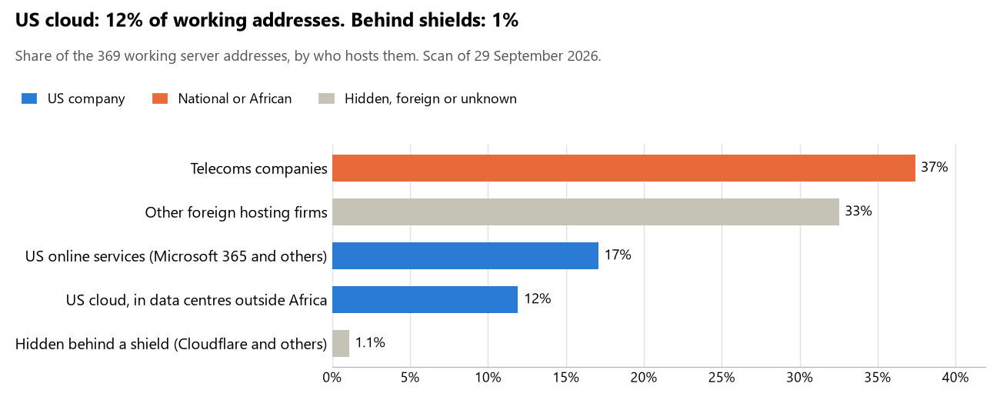

# Niger: who hosts the state's front door

29 September 2026 · Bill Anderson · scan of 29 September 2026

The scan covered 27 state bodies, banks and state-owned companies in Niger. 12% of their working server addresses are on US cloud: Amazon, Microsoft, Google or Oracle. 1% are behind shields such as Cloudflare, which hide the host. 0% are on government data centres or the institutions' own systems.

The scan found 274 web and mail names and 369 working addresses. 5 of the 27 institutions use US cloud for at least part of their estate. 6 use Microsoft for email and 1 use Google.

Of the 54 countries scanned so far, Niger has the 30th highest US cloud share (median 13%) and the 47th highest share behind shields (median 12%).

## Where it lives

44 addresses are on US cloud. Where they are: 77% in Europe, 14% on worldwide delivery networks (no fixed location) and 9% in North America.

4 addresses are behind shields: Cloudflare (100%). The host behind a shield cannot be seen, so the US cloud share is a minimum.

## Banks against government

| Share of working addresses | Government (21) | Banks (6) |
| --- | --- | --- |
| On US cloud | 6% | 29% |
| …of which in Africa | 0% | 0% |
| US online services (Microsoft 365 and others) | 21% | 5% |
| Behind a shield | 1% | 0% |
| Government data centres | 0% | 0% |
| Run by the institution itself | 0% | 0% |
| Telecoms companies | 47% | 11% |
| African data centres and IT firms | 0% | 0% |
| Other foreign hosting firms | 24% | 55% |

2 of 6 banks and 3 of 21 government bodies use US cloud somewhere. "Government" includes the central bank, the payment switch, the stock exchange and the state-owned companies.

## Email

6 of the 27 institutions use Microsoft 365 for email and 1 use Google.

- **Microsoft 365:** 6. Bank of Africa Niger, Banque internationale pour l'Afrique au Niger (BIA-Niger), GIM-UEMOA, Bourse régionale des valeurs mobilières (BRVM), Autorité des marchés financiers de l'UMOA (AMF-UMOA) and Autorité de régulation des communications électroniques et de la poste (ARCEP).
- **Google (BCEAO):** 1. Banque centrale des États de l'Afrique de l'Ouest.
- **Telecoms companies (Societe Nigerienne des Telecommunications):** 11. Présidence de la République du Niger, Assemblée nationale, Ministère des Affaires étrangères, Ministère de la Défense nationale, Direction générale de la Police nationale, Ministère de la Justice, Ministère des Finances, Direction générale des Impôts, Ministère de l'Intérieur, Ministère de la Santé publique and NIGELEC.
- **US cloud (Sonibank):** 1. Société nigérienne de banque.
- **Foreign hosting firms:** 4. Banque islamique du Niger (Groupe LWS SARL), Banque agricole du Niger (BAGRI) (Groupe LWS SARL), Commission électorale nationale indépendante (CENI) (Delta HighTech Ltd.) and Caisse nationale de sécurité sociale (CNSS) (Namecheap).
- **No mail on the domain scanned:** 4. Coris Bank International Niger, Institut national de la statistique (INS), Niger Telecoms and Gouvernement du Niger (portail).

## Institution by institution

Each figure is a share of that institution's working addresses. The rest are with telecoms companies, African data centres, US online services or foreign hosts. Rows follow the order of institution types.

| Institution | Type | On US cloud | …in Africa | Behind a shield | Own or government | Email |
| --- | --- | --- | --- | --- | --- | --- |
| Présidence de la République du Niger | Presidency | 0% | 0% | 0% | 0% | Telecoms |
| Assemblée nationale | Parliament | 0% | 0% | 0% | 0% | Telecoms |
| Ministère des Affaires étrangères | Foreign Affairs | 0% | 0% | 0% | 0% | Telecoms |
| Ministère de la Défense nationale | Defence | 0% | 0% | 0% | 0% | Telecoms |
| Direction générale de la Police nationale | Police | 0% | 0% | 0% | 0% | Telecoms |
| Ministère de la Justice | Justice | 0% | 0% | 0% | 0% | Telecoms |
| Ministère des Finances | Treasury / Finance | 0% | 0% | 0% | 0% | Telecoms |
| Direction générale des Impôts | Revenue Service | 0% | 0% | 0% | 0% | Telecoms |
| Ministère de l'Intérieur | Interior / Home Affairs | 0% | 0% | 0% | 0% | Telecoms |
| Banque centrale des États de l'Afrique de l'Ouest (BCEAO) | Central Bank | 10% | 0% | 0% | 0% | Google |
| Société nigérienne de banque (Sonibank) | Commercial Banks | 29% | 0% | 0% | 0% | US cloud |
| Bank of Africa Niger | Commercial Banks | 58% | 0% | 0% | 0% | Microsoft |
| Coris Bank International Niger | Commercial Banks | 0% | 0% | 0% | 0% | — |
| Banque internationale pour l'Afrique au Niger (BIA-Niger) | Commercial Banks | 0% | 0% | 0% | 0% | Microsoft |
| Banque islamique du Niger | Commercial Banks | 0% | 0% | 0% | 0% | Foreign host |
| Banque agricole du Niger (BAGRI) | Commercial Banks | 0% | 0% | 0% | 0% | Foreign host |
| Commission électorale nationale indépendante (CENI) | Electoral commission | 0% | 0% | 0% | 0% | Foreign host |
| Institut national de la statistique (INS) | Statistics office | 0% | 0% | 0% | 0% | — |
| Ministère de la Santé publique | Health ministry / National health insurance | 0% | 0% | 0% | 0% | Telecoms |
| GIM-UEMOA | National payment switch | 0% | 0% | 0% | 0% | Microsoft |
| Bourse régionale des valeurs mobilières (BRVM) | Stock exchange | 25% | 0% | 0% | 0% | Microsoft |
| Autorité des marchés financiers de l'UMOA (AMF-UMOA) | Securities regulator | 0% | 0% | 17% | 0% | Microsoft |
| Caisse nationale de sécurité sociale (CNSS) | Sovereign wealth fund / National pension fund | 0% | 0% | 0% | 0% | Foreign host |
| NIGELEC | Energy utility | 7% | 0% | 7% | 0% | Telecoms |
| Niger Telecoms | State-owned telco / National backbone operator | 0% | 0% | 0% | 0% | — |
| Gouvernement du Niger (portail) | E-government agency | 0% | 0% | 0% | 0% | — |
| Autorité de régulation des communications électroniques et de la poste (ARCEP) | Communications regulator | 0% | 0% | 0% | 0% | Microsoft |

No institution or working domain was found for 14 of the 36 types: Armed Forces, Customs, Intelligence, Civil registry / National ID authority, Data protection authority, Immigration / Passports, Social protection / Social registry, Land registry, Public procurement authority, Ports authority, National data centre / Government cloud operator, Cybersecurity agency / National CERT, Audit office and Anti-corruption commission.

## What stood out

- **Most on US cloud.** Bank of Africa Niger (58%) has more than half its working addresses on US cloud.
- **Little US cloud in Africa.** 0% of Niger's US cloud addresses are in the providers' African data centres.
- **Core state bodies on foreign hosting firms.** Banque centrale des États de l'Afrique de l'Ouest (BCEAO) (NETWORK TRANSIT HOLDINGS LLC and OVH).
- **No Chinese cloud.** The scan found no address on Huawei, Alibaba or Tencent cloud.

## What this can and cannot tell you

The scan sees only the front door: websites, email, login portals, remote-access gateways and online banking. It cannot see where a bank's core ledger, the ID register or the payroll run.

- **Every US figure is a minimum.** Anything behind a shield or a mail filter could also be on US cloud. In Niger that is 1% of working addresses.
- **It counts addresses, not importance.** An institution with many test and marketing sites weighs more than one with few.
- **The list of institutions was drawn up for this scan.** Each domain was checked to exist, not confirmed as the institution's main one.
- **It is a snapshot.** Every figure is as of 29 September 2026.
- **Nothing was touched.** The scan used public address lookups, public certificate records and the cloud companies' published address lists. It never connected to any institution's systems.

The data and method are in `R&D/Hyperscaler-dependence/scan/NER/` and `R&D/Hyperscaler-dependence/HYPERSCALER-SCAN.md` in the Corpus repository.
