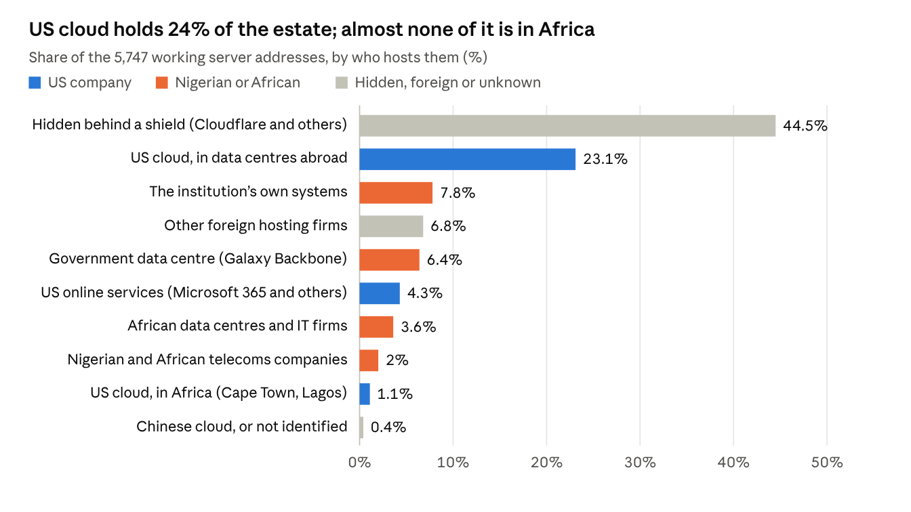

# Nigeria: who hosts the state's front door

28 September 2026 · Bill Anderson

About a quarter (24%) of the public-facing systems of 51 Nigerian state bodies, banks and utilities run on Amazon, Microsoft, Google or Oracle. Almost none of that (1% of the whole) is hosted in Africa. Another 44% sits behind Cloudflare and similar shields, so we can't see who hosts it. About one seventh (14%) runs on the government's Galaxy Backbone data centre or the institutions' own systems.

The scan covered the main ministries and agencies, the ten largest banks, the payment switches, the stock exchange and the state-owned companies. It found 6,665 web and mail names, pointing to 5,747 working server addresses. 36 of the 51 use US cloud for at least part of their public estate. 23 use Microsoft for email, and 2 use Google.

## Where it lives

More than half of the 1,393 US-cloud addresses are Amazon's and Microsoft's worldwide delivery networks, mostly Amazon's. About a third are in Europe, mainly Microsoft's Dublin and Amsterdam data centres. Only 64 (5%) are in Africa, and just 4 use Amazon's new Lagos zone. The rest are in the US, in India or not placed.

The shield share is the part we cannot see into. Cloudflare fronts most of it, with F5 and Imperva most of the rest. The servers behind them could be anywhere, including on US cloud, so the 24% is a floor, not a ceiling. Nigeria also leans on cheap foreign web hosts (7%) three times as much as Kenya or South Africa.

## Banks against government

In Nigeria the government leans on US cloud almost twice as much as the banks do. The banks hide two thirds of their estate behind shields.

| Share of working addresses | Government (41 bodies) | Banks (10) |
| --- | --- | --- |
| On US cloud | 30% | 16% |
| …of which hosted in Africa | 2% | 0% |
| US online services (Microsoft 365 and others) | 5% | 3% |
| Hidden behind a shield | 28% | 66% |
| Government data centre (Galaxy Backbone) | 11% | — |
| Run by the institution itself | 6% | 11% |
| Cheap foreign web hosts | 10% | 2% |
| African data centres and telecoms companies | 9% | 1% |

"Government" here includes the Central Bank, the two payment switches, the stock exchange and the state-owned companies. All ten banks use US cloud somewhere; so do 26 of the 41 government bodies.

## Email

Microsoft carries the email of 23 of the 51 institutions. The core of government, though, runs its mail through Galaxy Backbone, the state's own data centre.

- **Microsoft 365:** 23, including the Central Bank, both revenue services, the Finance ministry, NIBSS and seven of the ten banks.
- **Galaxy Backbone:** 11. They are State House, Defence, the Army, the Police, Foreign Affairs, Justice, Interior, Health, the Accountant-General, the Auditor-General and NIGCOMSAT.
- **Their own mail servers:** 4. They are Galaxy Backbone itself, the National ID authority, the National Assembly and the electoral commission.
- **Nigerian providers:** 5. The DSS and ngCERT use Backbone Connectivity Network, the EFCC uses Layer3 and the SEC uses MTN and MainOne. Customs uses its trade-system concessionaire.
- **Google:** 2. They are the National Judicial Council and the Immigration Service.
- **Other foreign providers:** 5. First Bank's mail runs on Amazon and the Transmission Company's on Microsoft Azure. Sterling Bank uses Zoho, the health insurance authority uses Contabo (a German budget server firm) and the ICPC uses a foreign web host.
- **No mail on the domain scanned:** Stanbic IBTC.

## Institution by institution

The data protection regulator, the stock exchange, the ID authority and the electoral commission lean hardest on US cloud. Fidelity Bank, the EFCC, Customs and ngCERT hide almost everything behind a shield. Each figure is a share of that institution's working addresses. Whatever a row does not add up to sits with telecoms companies, African data centres, US online services or foreign hosts.

| Institution | Sector | On US cloud | …of which in Africa | Behind a shield | Own or government | Email |
| --- | --- | --- | --- | --- | --- | --- |
| Data Protection Commission | Government | 95% | 76% | 0% | 0% | Microsoft |
| Nigerian Exchange Group | Government | 93% | 0% | 2% | 1% | Microsoft |
| National ID (NIMC) | Government | 84% | 0% | 1% | 11% | Own servers |
| Electoral commission (INEC) | Government | 80% | 0% | 7% | 0% | Own servers |
| National Assembly | Government | 47% | 0% | 0% | 47% | Own servers |
| National Pension Commission | Government | 46% | 0% | 0% | 4% | Microsoft |
| Health insurance (NHIA) | Government | 44% | 19% | 0% | 0% | Contabo |
| Nigeria Police Force | Government | 42% | 0% | 0% | 32% | Galaxy Backbone |
| First City Monument Bank | Bank | 41% | 1% | 28% | 12% | Microsoft |
| Zenith Bank | Bank | 39% | 0% | 15% | 41% | Microsoft |
| National Bureau of Statistics | Government | 38% | 0% | 0% | 17% | Microsoft |
| Nigeria Immigration Service | Government | 37% | 0% | 0% | 28% | Google |
| United Bank for Africa | Bank | 35% | 0% | 32% | 26% | Microsoft |
| Guaranty Trust Bank | Bank | 31% | 0% | 18% | 31% | Microsoft |
| Central Bank of Nigeria | Government | 28% | 1% | 56% | 15% | Microsoft |
| Stanbic IBTC | Bank | 28% | 0% | 66% | 7% | — |
| Union Bank | Bank | 27% | 0% | 19% | 44% | Microsoft |
| NIBSS (payment switch) | Government | 27% | 0% | 42% | 16% | Microsoft |
| First Bank of Nigeria | Bank | 26% | 0% | 34% | 36% | Amazon |
| Bureau of Public Procurement | Government | 25% | 0% | 0% | 25% | Microsoft |
| Transmission Company (TCN) | Government | 25% | 0% | 4% | 8% | Microsoft Azure |
| Nigeria Revenue Service | Government | 25% | 1% | 11% | 0% | Microsoft |
| Sovereign wealth fund (NSIA) | Government | 23% | 0% | 46% | 0% | Microsoft |
| Federal Ministry of Interior | Government | 19% | 0% | 0% | 54% | Galaxy Backbone |
| Access Bank | Bank | 17% | 0% | 72% | 2% | Microsoft |
| National Judicial Council | Government | 15% | 13% | 0% | 0% | Google |
| Nigerian Ports Authority | Government | 15% | 0% | 44% | 39% | Microsoft |
| Sterling Bank | Bank | 15% | 0% | 78% | 0% | Zoho |
| Securities regulator (SEC) | Government | 14% | 0% | 9% | 0% | MTN Nigeria |
| Federal Inland Revenue Service | Government | 13% | 0% | 7% | 6% | Microsoft |
| Interswitch | Government | 13% | 0% | 75% | 0% | Microsoft |
| NITDA | Government | 10% | 0% | 0% | 36% | Microsoft |
| Federal Ministry of Health | Government | 7% | 2% | 0% | 88% | Galaxy Backbone |
| Nigerian Communications Commission | Government | 2% | 0% | 69% | 1% | Microsoft |
| Nigeria Customs Service | Government | 1% | 0% | 88% | 0% | Trade Modernisation Project |
| Fidelity Bank | Bank | 1% | 0% | 97% | 0% | Microsoft |
| State House | Government | 0% | 0% | 0% | 94% | Galaxy Backbone |
| Ministry of Foreign Affairs | Government | 0% | 0% | 9% | 78% | Galaxy Backbone |
| Ministry of Defence | Government | 0% | 0% | 0% | 93% | Galaxy Backbone |
| Nigerian Army | Government | 0% | 0% | 4% | 4% | Galaxy Backbone |
| Federal Ministry of Justice | Government | 0% | 0% | 0% | 93% | Galaxy Backbone |
| Federal Ministry of Finance | Government | 0% | 0% | 0% | 50% | Microsoft |
| Accountant-General | Government | 0% | 0% | 0% | 89% | Galaxy Backbone |
| Department of State Services | Government | 0% | 0% | 23% | 23% | Backbone Connectivity Network |
| Social safety-nets office | Government | 0% | 0% | 0% | 0% | Microsoft |
| NIGCOMSAT | Government | 0% | 0% | 52% | 48% | Galaxy Backbone |
| Galaxy Backbone | Government | 0% | 0% | 0% | 100% | Own servers |
| ngCERT | Government | 0% | 0% | 88% | 7% | Backbone Connectivity Network |
| Auditor-General | Government | 0% | 0% | 0% | 100% | Galaxy Backbone |
| Anti-corruption (EFCC) | Government | 0% | 0% | 95% | 0% | Layer3 |
| Anti-corruption (ICPC) | Government | 0% | 0% | 24% | 30% | Cyberspace |

## What stood out

- **The core of the state is the most home-grown of the three countries.** State House, Defence, Justice, the Accountant-General and the Auditor-General keep 89–100% of their estate on Galaxy Backbone, with their mail there too. Nothing like it appears in Kenya or South Africa.
- **The electoral commission runs on Amazon in the US and Ireland.** 80% of INEC's estate is on Amazon, most of it in Virginia.
- **The national ID authority fronts its services through Amazon.** 84% of NIMC's estate is on US cloud, nearly all of it Amazon's worldwide delivery network.
- **The data protection regulator hosts in South Africa.** 95% of the Nigeria Data Protection Commission's estate is on Amazon, three quarters of it in Cape Town. The body that enforces where Nigerians' data may go keeps its own outside Nigeria.
- **Amazon's Lagos zone is barely used.** Only 4 addresses in the whole scan use it.
- **The judiciary's website sits with budget foreign hosts.** Most of the National Judicial Council's web estate is with WHG, a UK hosting firm, and Hawk Host, a Canadian one.
- **A little Chinese cloud.** One Zenith Bank address, apparently for security cameras, runs on Huawei Cloud.
- **Three government web addresses point at deleted cloud names that anyone could claim.** They are at the Central Bank, the Health ministry and the Accountant-General. Whoever claims them could publish under those addresses. We have flagged them and are not naming them here.

## What this can and cannot tell you

The scan sees only the front door: websites, email, login portals, remote-access gateways and online banking. It cannot see where a bank's core ledger, the ID register or the payroll actually run.

- **Every US figure is a floor.** Anything behind a shield or a mail filter could also be on US cloud, and we cannot tell.
- **It counts addresses, not importance.** An institution with many test and marketing sites weighs more than one with a few, whatever those sites do.
- **The list of institutions was drawn up for this scan.** Each domain was checked to exist, but not formally confirmed as the institution's main one.
- **It is a snapshot.** Every figure is as of 28 September 2026. Running the scan again in a year shows which way each institution is moving.
- **Nothing was touched.** The scan used public address lookups, public certificate records and the cloud companies' own published address lists. It never connected to any institution's systems.

The data and method are in `R&D/scan/NGA/` and `R&D/HYPERSCALER-SCAN.md` in the Corpus repository.
