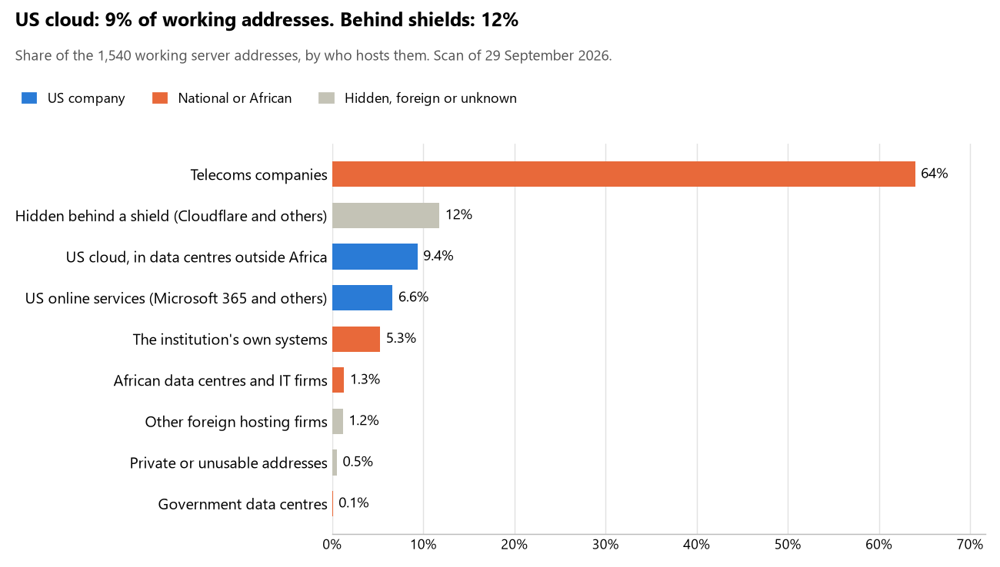

# Rwanda: who hosts the state's front door

29 September 2026 · Bill Anderson · scan of 29 September 2026

The scan covered 40 state bodies, banks and state-owned companies in Rwanda. 9% of their working server addresses are on US cloud: Amazon, Microsoft, Google or Oracle. 12% are behind shields such as Cloudflare, which hide the host. 5% are on government data centres or the institutions' own systems.

The scan found 1,577 web and mail names and 1,540 working addresses. 11 of the 40 institutions use US cloud for at least part of their estate. 9 use Microsoft for email and none use Google.

Of the 54 countries scanned so far, Rwanda has the 38th highest US cloud share (median 13%) and the 26th highest share behind shields (median 12%).

## Where it lives

144 addresses are on US cloud. Where they are: 82% in Europe, 17% on worldwide delivery networks (no fixed location) and 1% in North America.

181 addresses are behind shields: Cloudflare (90%), Imperva (9%) and F5 (<1%). The host behind a shield cannot be seen, so the US cloud share is a minimum.

## Banks against government

| Share of working addresses | Government (32) | Banks (8) |
| --- | --- | --- |
| On US cloud | 7% | 24% |
| …of which in Africa | 0% | 0% |
| US online services (Microsoft 365 and others) | 5% | 18% |
| Behind a shield | 10% | 20% |
| Government data centres | <1% | 0% |
| Run by the institution itself | 4% | 14% |
| Telecoms companies | 72% | 18% |
| African data centres and IT firms | 1% | <1% |
| Other foreign hosting firms | <1% | 4% |

3 of 8 banks and 8 of 32 government bodies use US cloud somewhere. "Government" includes the central bank, the payment switch, the stock exchange and the state-owned companies.

## Email

9 of the 40 institutions use Microsoft 365 for email and none use Google.

- **Microsoft 365:** 9. National Bank of Rwanda, Bank of Kigali, BPR Bank Rwanda, Bank of Africa Rwanda, Development Bank of Rwanda, RSwitch, Rwanda Stock Exchange, Rwanda Social Security Board and Rwanda Energy Group.
- **Own mail servers:** 1. Rwanda Revenue Authority.
- **Telecoms companies (KT RWANDA NETWORK Ltd):** 25. Office of the President, Parliament of Rwanda, Ministry of Foreign Affairs and International Cooperation, Ministry of Defence, Rwanda National Police, Ministry of Justice, Judiciary of Rwanda, Ministry of Finance and Economic Planning, Ministry of Internal Security, Zigama Credit and Savings Society, Cogebanque, National Identification Agency, National Electoral Commission, National Institute of Statistics of Rwanda, Directorate General of Immigration and Emigration, Ministry of Health, Local Administrative Entities Development Agency, Rwanda Land Management and Use Authority, Capital Market Authority, Korea Telecom Rwanda Networks, Irembo, Rwanda Information Society Authority, National Cyber Security Authority, Office of the Auditor General of State Finances and Office of the Ombudsman.
- **Behind a mail filter, provider not visible:** 2. Guaranty Trust Bank Rwanda and Rwanda Utilities Regulatory Authority.
- **No mail on the domain scanned:** 3. Rwanda Defence Force, Access Bank Rwanda and Rwanda Public Procurement Authority (Umucyo e-procurement).

## Institution by institution

Each figure is a share of that institution's working addresses. The rest are with telecoms companies, African data centres, US online services or foreign hosts. Rows follow the order of institution types.

| Institution | Type | On US cloud | …in Africa | Behind a shield | Own or government | Email |
| --- | --- | --- | --- | --- | --- | --- |
| Office of the President | Presidency | 0% | 0% | 0% | 0% | Telecoms |
| Parliament of Rwanda | Parliament | 0% | 0% | 0% | 0% | Telecoms |
| Ministry of Foreign Affairs and International Cooperation | Foreign Affairs | 0% | 0% | 0% | 0% | Telecoms |
| Ministry of Defence | Defence | 0% | 0% | 0% | 0% | Telecoms |
| Rwanda Defence Force | Armed Forces | 0% | 0% | 0% | 0% | — |
| Rwanda National Police | Police | 13% | 0% | 0% | 0% | Telecoms |
| Ministry of Justice | Justice | 0% | 0% | 0% | 0% | Telecoms |
| Judiciary of Rwanda | Justice | 6% | 0% | 0% | 0% | Telecoms |
| Ministry of Finance and Economic Planning | Treasury / Finance | 0% | 0% | 0% | 0% | Telecoms |
| Rwanda Revenue Authority | Revenue Service | 0% | 0% | 0% | 74% | Own servers |
| Ministry of Internal Security | Interior / Home Affairs | 0% | 0% | 0% | 0% | Telecoms |
| National Bank of Rwanda | Central Bank | 9% | 0% | 84% | <1% | Microsoft |
| Bank of Kigali | Commercial Banks | 41% | 0% | 0% | 42% | Microsoft |
| BPR Bank Rwanda | Commercial Banks | 6% | 0% | 51% | 0% | Microsoft |
| Guaranty Trust Bank Rwanda | Commercial Banks | 0% | 0% | 92% | 0% | Filtered |
| Access Bank Rwanda | Commercial Banks | 0% | 0% | 100% | 0% | — |
| Bank of Africa Rwanda | Commercial Banks | 0% | 0% | 0% | 0% | Microsoft |
| Zigama Credit and Savings Society | Commercial Banks | 0% | 0% | 0% | 0% | Telecoms |
| Cogebanque | Commercial Banks | 0% | 0% | 38% | 0% | Telecoms |
| Development Bank of Rwanda | Commercial Banks | 53% | 0% | 0% | 2% | Microsoft |
| National Identification Agency | Civil registry / National ID authority | 0% | 0% | 9% | 0% | Telecoms |
| National Electoral Commission | Electoral commission | 0% | 0% | 0% | 0% | Telecoms |
| National Institute of Statistics of Rwanda | Statistics office | 0% | 0% | 0% | 0% | Telecoms |
| Directorate General of Immigration and Emigration | Immigration / Passports | 0% | 0% | 0% | 0% | Telecoms |
| Ministry of Health | Health ministry / National health insurance | 12% | 0% | 0% | 0% | Telecoms |
| Local Administrative Entities Development Agency | Social protection / Social registry | 0% | 0% | 0% | 0% | Telecoms |
| Rwanda Land Management and Use Authority | Land registry | 0% | 0% | 22% | 0% | Telecoms |
| RSwitch | National payment switch | 0% | 0% | 0% | 0% | Microsoft |
| Rwanda Stock Exchange | Stock exchange | 27% | 0% | 0% | 0% | Microsoft |
| Capital Market Authority | Securities regulator | 0% | 0% | 0% | 0% | Telecoms |
| Rwanda Social Security Board | Sovereign wealth fund / National pension fund | 10% | 0% | 6% | 23% | Microsoft |
| Rwanda Public Procurement Authority (Umucyo e-procurement) | Public procurement authority | 0% | 0% | 0% | 0% | — |
| Rwanda Energy Group | Energy utility | 40% | 0% | 0% | 0% | Microsoft |
| Korea Telecom Rwanda Networks | State-owned telco / National backbone operator | 0% | 0% | 0% | 0% | Telecoms |
| Irembo | E-government agency | 15% | 0% | 15% | 0% | Telecoms |
| Rwanda Information Society Authority | National data centre / Government cloud operator | 0% | 0% | 0% | <1% | Telecoms |
| National Cyber Security Authority | Cybersecurity agency / National CERT | 0% | 0% | 0% | 0% | Telecoms |
| Rwanda Utilities Regulatory Authority | Communications regulator | 0% | 0% | 15% | 0% | Filtered |
| Office of the Auditor General of State Finances | Audit office | 0% | 0% | 0% | 0% | Telecoms |
| Office of the Ombudsman | Anti-corruption commission | 0% | 0% | 0% | 0% | Telecoms |

No institution or working domain was found for 4 of the 36 types: Customs, Intelligence, Data protection authority and Ports authority.

## What stood out

- **Most on US cloud.** Development Bank of Rwanda (53%) has more than half its working addresses on US cloud.
- **Little US cloud in Africa.** 0% of Rwanda's US cloud addresses are in the providers' African data centres.
- **No Chinese cloud.** The scan found no address on Huawei, Alibaba or Tencent cloud.

## What this can and cannot tell you

The scan sees only the front door: websites, email, login portals, remote-access gateways and online banking. It cannot see where a bank's core ledger, the ID register or the payroll run.

- **Every US figure is a minimum.** Anything behind a shield or a mail filter could also be on US cloud. In Rwanda that is 12% of working addresses.
- **It counts addresses, not importance.** An institution with many test and marketing sites weighs more than one with few.
- **The list of institutions was drawn up for this scan.** Each domain was checked to exist, not confirmed as the institution's main one.
- **It is a snapshot.** Every figure is as of 29 September 2026.
- **Nothing was touched.** The scan used public address lookups, public certificate records and the cloud companies' published address lists. It never connected to any institution's systems.

The data and method are in `R&D/Hyperscaler-dependence/scan/RWA/` and `R&D/Hyperscaler-dependence/HYPERSCALER-SCAN.md` in the Corpus repository.
