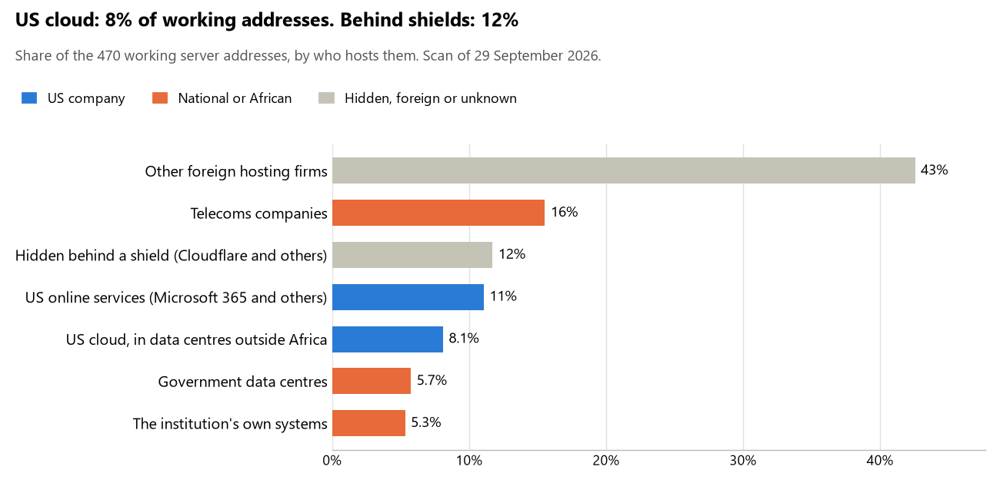

# Sudan: who hosts the state's front door

29 September 2026 · Bill Anderson · scan of 29 September 2026

The scan covered 28 state bodies, banks and state-owned companies in Sudan. 8% of their working server addresses are on US cloud: Amazon, Microsoft, Google or Oracle. 12% are behind shields such as Cloudflare, which hide the host. 11% are on government data centres or the institutions' own systems.

The scan found 354 web and mail names and 470 working addresses. 5 of the 28 institutions use US cloud for at least part of their estate. 2 use Microsoft for email and 1 use Google.

Of the 54 countries scanned so far, Sudan has the 44th highest US cloud share (median 13%) and the 27th highest share behind shields (median 12%).

## Where it lives

38 addresses are on US cloud. Where they are: 79% on worldwide delivery networks (no fixed location), 16% in North America, 3% in Europe and 3% in a region the providers do not publish.

55 addresses are behind shields: Cloudflare (100%). The host behind a shield cannot be seen, so the US cloud share is a minimum.

## Banks against government

| Share of working addresses | Government (18) | Banks (10) |
| --- | --- | --- |
| On US cloud | 9% | 6% |
| …of which in Africa | 0% | 0% |
| US online services (Microsoft 365 and others) | 9% | 14% |
| Behind a shield | 15% | 5% |
| Government data centres | 9% | 0% |
| Run by the institution itself | 8% | 0% |
| Telecoms companies | 16% | 15% |
| African data centres and IT firms | 0% | 0% |
| Other foreign hosting firms | 34% | 60% |

3 of 10 banks and 2 of 18 government bodies use US cloud somewhere. "Government" includes the central bank, the payment switch, the stock exchange and the state-owned companies.

## Email

2 of the 28 institutions use Microsoft 365 for email and 1 use Google.

- **Microsoft 365:** 2. Ministry of Interior and Saudi Sudanese Bank.
- **Google:** 1. Ministry of Justice.
- **Government data centre (National Information Center):** 5. Transitional Sovereignty Council, Ministry of Foreign Affairs, Ministry of Finance and Economic Planning, Federal Ministry of Health and Republic of Sudan national government portal.
- **Telecoms companies (Sudatel):** 4. Sudan Customs Authority, Central Bank of Sudan, Faisal Islamic Bank of Sudan and Omdurman National Bank.
- **US cloud:** 1. Bank of Khartoum.
- **Foreign hosting firms:** 13. National Legislature (Namecheap), Sudan Judiciary (Namecheap), Al Salam Bank Sudan (Hetzner), Sudanese Islamic Bank (Kualo Limited), Nile Bank (Hetzner), Tadamon Islamic Bank (Turnkey Internet Inc.), Sudanese French Bank (Unified Layer), Blue Nile Mashreg Bank (VELIANET-AS velia.net Internetdienste GmbH), General Directorate of Passports and Immigration (Hetzner), Khartoum Stock Exchange (Unified Layer), Financial Markets Authority (Kualo Limited), Sea Ports Corporation (Interserver) and Telecommunications and Post Regulatory Authority (S.J.M. Steffann).
- **Behind a mail filter, provider not visible:** 1. Sudatel Telecom Group.
- **No mail on the domain scanned:** 1. Central Bureau of Statistics.

## Institution by institution

Each figure is a share of that institution's working addresses. The rest are with telecoms companies, African data centres, US online services or foreign hosts. Rows follow the order of institution types.

| Institution | Type | On US cloud | …in Africa | Behind a shield | Own or government | Email |
| --- | --- | --- | --- | --- | --- | --- |
| Transitional Sovereignty Council | Presidency | 0% | 0% | 0% | 67% | Government |
| National Legislature | Parliament | 0% | 0% | 0% | 0% | Foreign host |
| Ministry of Foreign Affairs | Foreign Affairs | 0% | 0% | 0% | 50% | Government |
| Ministry of Justice | Justice | 0% | 0% | 0% | 0% | Google |
| Sudan Judiciary | Justice | 0% | 0% | 60% | 0% | Foreign host |
| Ministry of Finance and Economic Planning | Treasury / Finance | 0% | 0% | 0% | 70% | Government |
| Sudan Customs Authority | Customs | 0% | 0% | 0% | 0% | Telecoms |
| Ministry of Interior | Interior / Home Affairs | 0% | 0% | 77% | 0% | Microsoft |
| Central Bank of Sudan | Central Bank | 0% | 0% | 18% | 0% | Telecoms |
| Bank of Khartoum | Commercial Banks | 46% | 0% | 15% | 0% | US cloud |
| Faisal Islamic Bank of Sudan | Commercial Banks | 10% | 0% | 0% | 0% | Telecoms |
| Omdurman National Bank | Commercial Banks | 0% | 0% | 0% | 0% | Telecoms |
| Al Salam Bank Sudan | Commercial Banks | 22% | 0% | 0% | 0% | Foreign host |
| Sudanese Islamic Bank | Commercial Banks | 0% | 0% | 11% | 0% | Foreign host |
| Nile Bank | Commercial Banks | 0% | 0% | 0% | 0% | Foreign host |
| Tadamon Islamic Bank | Commercial Banks | 0% | 0% | 0% | 0% | Foreign host |
| Saudi Sudanese Bank | Commercial Banks | 0% | 0% | 11% | 0% | Microsoft |
| Sudanese French Bank | Commercial Banks | 0% | 0% | 0% | 0% | Foreign host |
| Blue Nile Mashreg Bank | Commercial Banks | 0% | 0% | 0% | 0% | Foreign host |
| Central Bureau of Statistics | Statistics office | no working address | | | | — |
| General Directorate of Passports and Immigration | Immigration / Passports | 0% | 0% | 70% | 0% | Foreign host |
| Federal Ministry of Health | Health ministry / National health insurance | 7% | 0% | 0% | 29% | Government |
| Khartoum Stock Exchange | Stock exchange | 0% | 0% | 0% | 0% | Foreign host |
| Financial Markets Authority | Securities regulator | 0% | 0% | 18% | 0% | Foreign host |
| Sea Ports Corporation | Ports authority | 0% | 0% | 0% | 0% | Foreign host |
| Sudatel Telecom Group | State-owned telco / National backbone operator | 41% | 0% | 0% | 33% | Filtered |
| Republic of Sudan national government portal | E-government agency | 0% | 0% | 0% | 89% | Government |
| Telecommunications and Post Regulatory Authority | Communications regulator | 0% | 0% | 0% | 0% | Foreign host |

No institution or working domain was found for 18 of the 36 types: Defence, Armed Forces, Police, Revenue Service, Intelligence, Civil registry / National ID authority, Data protection authority, Electoral commission, Social protection / Social registry, Land registry, National payment switch, Sovereign wealth fund / National pension fund, Public procurement authority, Energy utility, National data centre / Government cloud operator, Cybersecurity agency / National CERT, Audit office and Anti-corruption commission.

## What stood out

- **Little US cloud in Africa.** 0% of Sudan's US cloud addresses are in the providers' African data centres.
- **Core state bodies on foreign hosting firms.** National Legislature (Namecheap), Ministry of Justice (Contabo), Sudan Judiciary (Namecheap), Ministry of Interior (Hetzner) and Central Bank of Sudan (Scaleway SAS).
- **No Chinese cloud.** The scan found no address on Huawei, Alibaba or Tencent cloud.

## What this can and cannot tell you

The scan sees only the front door: websites, email, login portals, remote-access gateways and online banking. It cannot see where a bank's core ledger, the ID register or the payroll run.

- **Every US figure is a minimum.** Anything behind a shield or a mail filter could also be on US cloud. In Sudan that is 12% of working addresses.
- **It counts addresses, not importance.** An institution with many test and marketing sites weighs more than one with few.
- **The list of institutions was drawn up for this scan.** Each domain was checked to exist, not confirmed as the institution's main one.
- **It is a snapshot.** Every figure is as of 29 September 2026.
- **Nothing was touched.** The scan used public address lookups, public certificate records and the cloud companies' published address lists. It never connected to any institution's systems.

The data and method are in `R&D/Hyperscaler-dependence/scan/SDN/` and `R&D/Hyperscaler-dependence/HYPERSCALER-SCAN.md` in the Corpus repository.
