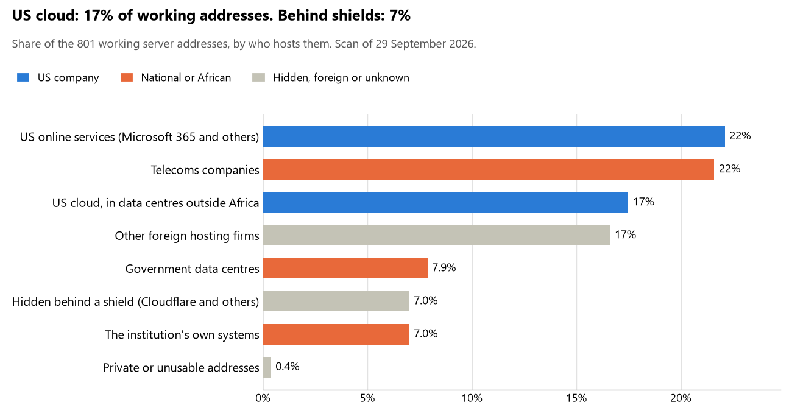

# Senegal: who hosts the state's front door

29 September 2026 · Bill Anderson · scan of 29 September 2026

The scan covered 38 state bodies, banks and state-owned companies in Senegal. 17% of their working server addresses are on US cloud: Amazon, Microsoft, Google or Oracle. 7% are behind shields such as Cloudflare, which hide the host. 15% are on government data centres or the institutions' own systems.

The scan found 566 web and mail names and 801 working addresses. 11 of the 38 institutions use US cloud for at least part of their estate. 14 use Microsoft for email and 1 use Google.

Of the 54 countries scanned so far, Senegal has the 21st highest US cloud share (median 13%) and the 40th highest share behind shields (median 12%).

## Where it lives

140 addresses are on US cloud. Where they are: 90% in Europe, 4% on worldwide delivery networks (no fixed location), 3% in North America and 3% in a region the providers do not publish.

56 addresses are behind shields: Cloudflare (75%), Akamai (20%) and Imperva (5%). The host behind a shield cannot be seen, so the US cloud share is a minimum.

## Banks against government

| Share of working addresses | Government (30) | Banks (8) |
| --- | --- | --- |
| On US cloud | 11% | 32% |
| …of which in Africa | 0% | 0% |
| US online services (Microsoft 365 and others) | 24% | 18% |
| Behind a shield | 5% | 10% |
| Government data centres | 11% | 0% |
| Run by the institution itself | 8% | 5% |
| Telecoms companies | 25% | 14% |
| African data centres and IT firms | 0% | 0% |
| Other foreign hosting firms | 15% | 20% |

4 of 8 banks and 7 of 30 government bodies use US cloud somewhere. "Government" includes the central bank, the payment switch, the stock exchange and the state-owned companies.

## Email

14 of the 38 institutions use Microsoft 365 for email and 1 use Google.

- **Microsoft 365:** 14. Bank of Africa Sénégal, Banque de l'Habitat du Sénégal, Banque nationale pour le développement économique, Agence nationale de l'État civil, GIM-UEMOA, Bourse régionale des valeurs mobilières (BRVM), Autorité des marchés financiers de l'UMOA (AMF-UMOA), Fonds souverain d'investissements stratégiques (FONSIS), Institution de prévoyance retraite du Sénégal (IPRES), Senelec, Port autonome de Dakar, Autorité de régulation des télécommunications et des postes, Cour des comptes and Office national de lutte contre la fraude et la corruption.
- **Google (BCEAO):** 1. Banque centrale des États de l'Afrique de l'Ouest.
- **Government data centre (Agence De l'Informatique de l'Etat):** 5. Assemblée nationale, Ministère des Forces armées, Commission de protection des données personnelles, Sénégal Numérique S.A. (ex-ADIE) and Portail gouvernemental.
- **Own mail servers:** 4. Ministère de l'Intégration africaine et des Affaires étrangères, Ministère de l'Intérieur et de la Sécurité publique, Ministère de la Santé et de l'Action sociale and Sonatel.
- **Telecoms companies:** 5. Présidence de la République (SONATEL), Ministère des Finances et du Budget (SONATEL), Direction générale des Douanes (SAGA AFRICA HOLDINGS LIMITED), CBAO Groupe Attijariwafa bank (SONATEL) and Agence nationale de la Statistique et de la Démographie (SAGA AFRICA HOLDINGS LIMITED).
- **Foreign hosting firms:** 3. Banque Islamique du Sénégal (IONOS), Direction générale des Élections (Unified Layer) and Autorité de régulation de la commande publique (REGISTER-AS REGISTER S.P.A.).
- **No mail on the domain scanned:** 6. Direction générale de la Police nationale, Ministère de la Justice, Direction générale des Impôts et des Domaines, Société Générale Sénégal, BICIS Groupe SUNU and Coris Bank International Sénégal.

## Institution by institution

Each figure is a share of that institution's working addresses. The rest are with telecoms companies, African data centres, US online services or foreign hosts. Rows follow the order of institution types.

| Institution | Type | On US cloud | …in Africa | Behind a shield | Own or government | Email |
| --- | --- | --- | --- | --- | --- | --- |
| Présidence de la République | Presidency | 0% | 0% | 46% | 0% | Telecoms |
| Assemblée nationale | Parliament | 0% | 0% | 25% | 50% | Government |
| Ministère de l'Intégration africaine et des Affaires étrangères | Foreign Affairs | 0% | 0% | 0% | 50% | Own servers |
| Ministère des Forces armées | Defence | 0% | 0% | 0% | 100% | Government |
| Direction générale de la Police nationale | Police | 0% | 0% | 0% | 100% | — |
| Ministère de la Justice | Justice | 0% | 0% | 0% | 100% | — |
| Ministère des Finances et du Budget | Treasury / Finance | 0% | 0% | 0% | 43% | Telecoms |
| Direction générale des Impôts et des Domaines | Revenue Service | 0% | 0% | 0% | 0% | — |
| Direction générale des Douanes | Customs | 0% | 0% | 0% | 0% | Telecoms |
| Ministère de l'Intérieur et de la Sécurité publique | Interior / Home Affairs | 0% | 0% | 0% | 100% | Own servers |
| Banque centrale des États de l'Afrique de l'Ouest (BCEAO) | Central Bank | 10% | 0% | 0% | 0% | Google |
| CBAO Groupe Attijariwafa bank | Commercial Banks | 38% | 0% | 0% | 0% | Telecoms |
| Société Générale Sénégal | Commercial Banks | 0% | 0% | 14% | 59% | — |
| Banque Islamique du Sénégal | Commercial Banks | 0% | 0% | 0% | 0% | Foreign host |
| Bank of Africa Sénégal | Commercial Banks | 40% | 0% | 0% | 0% | Microsoft |
| BICIS Groupe SUNU | Commercial Banks | 0% | 0% | 100% | 0% | — |
| Banque de l'Habitat du Sénégal | Commercial Banks | 43% | 0% | 20% | 0% | Microsoft |
| Banque nationale pour le développement économique | Commercial Banks | 39% | 0% | 0% | 0% | Microsoft |
| Coris Bank International Sénégal | Commercial Banks | 0% | 0% | 0% | 0% | — |
| Agence nationale de l'État civil | Civil registry / National ID authority | 0% | 0% | 0% | 0% | Microsoft |
| Commission de protection des données personnelles | Data protection authority | 0% | 0% | 0% | 100% | Government |
| Direction générale des Élections | Electoral commission | 0% | 0% | 27% | 0% | Foreign host |
| Agence nationale de la Statistique et de la Démographie | Statistics office | 0% | 0% | 0% | 10% | Telecoms |
| Ministère de la Santé et de l'Action sociale | Health ministry / National health insurance | 0% | 0% | 0% | 100% | Own servers |
| GIM-UEMOA | National payment switch | 0% | 0% | 0% | 0% | Microsoft |
| Bourse régionale des valeurs mobilières (BRVM) | Stock exchange | 28% | 0% | 0% | 0% | Microsoft |
| Autorité des marchés financiers de l'UMOA (AMF-UMOA) | Securities regulator | 0% | 0% | 13% | 0% | Microsoft |
| Fonds souverain d'investissements stratégiques (FONSIS) | Sovereign wealth fund / National pension fund | 20% | 0% | 10% | 0% | Microsoft |
| Institution de prévoyance retraite du Sénégal (IPRES) | Sovereign wealth fund / National pension fund | 33% | 0% | 0% | 0% | Microsoft |
| Autorité de régulation de la commande publique | Public procurement authority | 0% | 0% | 0% | 0% | Foreign host |
| Senelec | Energy utility | 46% | 0% | 0% | 24% | Microsoft |
| Port autonome de Dakar | Ports authority | 0% | 0% | 0% | 0% | Microsoft |
| Sonatel | State-owned telco / National backbone operator | 13% | 0% | 0% | 67% | Own servers |
| Sénégal Numérique S.A. (ex-ADIE) | E-government agency | 0% | 0% | 0% | 100% | Government |
| Portail gouvernemental | E-government agency | 0% | 0% | 0% | 100% | Government |
| Autorité de régulation des télécommunications et des postes | Communications regulator | 6% | 0% | 0% | 0% | Microsoft |
| Cour des comptes | Audit office | 0% | 0% | 0% | 0% | Microsoft |
| Office national de lutte contre la fraude et la corruption | Anti-corruption commission | 0% | 0% | 0% | 35% | Microsoft |

No institution or working domain was found for 7 of the 36 types: Armed Forces, Intelligence, Immigration / Passports, Social protection / Social registry, Land registry, National data centre / Government cloud operator and Cybersecurity agency / National CERT.

## What stood out

- **Little US cloud in Africa.** 0% of Senegal's US cloud addresses are in the providers' African data centres.
- **Core state bodies at home.** Ministère des Forces armées (100%) and Ministère de l'Intérieur et de la Sécurité publique (100%) keep at least 80% of their working addresses on government data centres or their own systems.
- **Core state bodies on foreign hosting firms.** Présidence de la République (OVH), Assemblée nationale (Hetzner), Direction générale des Douanes (Hostinger) and Banque centrale des États de l'Afrique de l'Ouest (BCEAO) (NETWORK TRANSIT HOLDINGS LLC and Digiweb ltd).
- **No Chinese cloud.** The scan found no address on Huawei, Alibaba or Tencent cloud.

## What this can and cannot tell you

The scan sees only the front door: websites, email, login portals, remote-access gateways and online banking. It cannot see where a bank's core ledger, the ID register or the payroll run.

- **Every US figure is a minimum.** Anything behind a shield or a mail filter could also be on US cloud. In Senegal that is 7% of working addresses.
- **It counts addresses, not importance.** An institution with many test and marketing sites weighs more than one with few.
- **The list of institutions was drawn up for this scan.** Each domain was checked to exist, not confirmed as the institution's main one.
- **It is a snapshot.** Every figure is as of 29 September 2026.
- **Nothing was touched.** The scan used public address lookups, public certificate records and the cloud companies' published address lists. It never connected to any institution's systems.

The data and method are in `R&D/Hyperscaler-dependence/scan/SEN/` and `R&D/Hyperscaler-dependence/HYPERSCALER-SCAN.md` in the Corpus repository.
