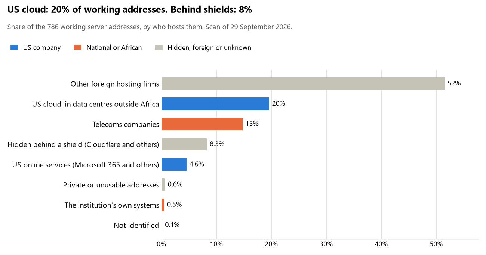

# Sierra Leone: who hosts the state's front door

29 September 2026 · Bill Anderson · scan of 29 September 2026

The scan covered 34 state bodies, banks and state-owned companies in Sierra Leone. 20% of their working server addresses are on US cloud: Amazon, Microsoft, Google or Oracle. 8% are behind shields such as Cloudflare, which hide the host. <1% are on government data centres or the institutions' own systems.

The scan found 808 web and mail names and 786 working addresses. 16 of the 34 institutions use US cloud for at least part of their estate. 6 use Microsoft for email and none use Google.

Of the 54 countries scanned so far, Sierra Leone has the 16th highest US cloud share (median 13%) and the 36th highest share behind shields (median 12%).

## Where it lives

154 addresses are on US cloud. Where they are: 40% in Europe, 38% in North America, 18% on worldwide delivery networks (no fixed location), 3% in a region the providers do not publish and 1% in Asia or the Middle East.

65 addresses are behind shields: Cloudflare (85%), Imperva (14%) and F5 (2%). The host behind a shield cannot be seen, so the US cloud share is a minimum.

## Banks against government

| Share of working addresses | Government (27) | Banks (7) |
| --- | --- | --- |
| On US cloud | 18% | 27% |
| …of which in Africa | 0% | 0% |
| US online services (Microsoft 365 and others) | 5% | <1% |
| Behind a shield | 8% | 10% |
| Government data centres | 0% | 0% |
| Run by the institution itself | 0% | 3% |
| Telecoms companies | 13% | 21% |
| African data centres and IT firms | 0% | 0% |
| Other foreign hosting firms | 55% | 36% |

4 of 7 banks and 12 of 27 government bodies use US cloud somewhere. "Government" includes the central bank, the payment switch, the stock exchange and the state-owned companies.

## Email

6 of the 34 institutions use Microsoft 365 for email and none use Google.

- **Microsoft 365:** 6. National Revenue Authority, First Bank Sierra Leone, Zenith Bank Sierra Leone, National Commission for Social Action, National Social Security and Insurance Trust and National Public Procurement Authority.
- **Telecoms companies:** 4. Sierra Leone Judiciary (123.Net, Inc.), Sierra Leone Commercial Bank (ONLIME SL LIMITED), Union Trust Bank (123.Net, Inc.) and Electricity Distribution and Supply Authority (Afcom (SL) Limited).
- **US cloud:** 5. Parliament of Sierra Leone, Office of National Security, Statistics Sierra Leone, National Telecommunications Commission and Anti-Corruption Commission.
- **Foreign hosting firms:** 10. State House Sierra Leone (LiquidNet US LLC), Ministry of Foreign Affairs and International Cooperation (Zoho), Ministry of Defence (Zoho), Office of the Attorney General and Ministry of Justice (Zoho), Bank of Sierra Leone (Host Europe), Rokel Commercial Bank (Liquid Web), National Civil Registration Authority (Unified Layer), Ministry of Health (Awareness Software Limited), Ministry of Lands, Housing and Country Planning (Zoho) and Audit Service Sierra Leone (Zoho).
- **Behind a mail filter, provider not visible:** 2. Ministry of Finance and Guaranty Trust Bank Sierra Leone.
- **No mail on the domain scanned:** 7. Sierra Leone Police, Ministry of Internal Affairs, Access Bank Sierra Leone, Electoral Commission for Sierra Leone, Sierra Leone Ports Authority, Sierratel and Government of Sierra Leone.

## Institution by institution

Each figure is a share of that institution's working addresses. The rest are with telecoms companies, African data centres, US online services or foreign hosts. Rows follow the order of institution types.

| Institution | Type | On US cloud | …in Africa | Behind a shield | Own or government | Email |
| --- | --- | --- | --- | --- | --- | --- |
| State House Sierra Leone | Presidency | 0% | 0% | 0% | 0% | Foreign host |
| Parliament of Sierra Leone | Parliament | 57% | 0% | 0% | 0% | US cloud |
| Ministry of Foreign Affairs and International Cooperation | Foreign Affairs | 0% | 0% | 0% | 0% | Foreign host |
| Ministry of Defence | Defence | 0% | 0% | 0% | 0% | Foreign host |
| Sierra Leone Police | Police | 100% | 0% | 0% | 0% | — |
| Office of the Attorney General and Ministry of Justice | Justice | 0% | 0% | 0% | 0% | Foreign host |
| Sierra Leone Judiciary | Justice | 0% | 0% | 0% | 0% | Telecoms |
| Ministry of Finance | Treasury / Finance | 27% | 0% | 0% | 0% | Filtered |
| National Revenue Authority | Revenue Service | 21% | 0% | 0% | 0% | Microsoft |
| Office of National Security | Intelligence | 100% | 0% | 0% | 0% | US cloud |
| Ministry of Internal Affairs | Interior / Home Affairs | no working address | | | | — |
| Bank of Sierra Leone | Central Bank | 0% | 0% | 0% | 0% | Foreign host |
| Sierra Leone Commercial Bank | Commercial Banks | 18% | 0% | 0% | 0% | Telecoms |
| Rokel Commercial Bank | Commercial Banks | 0% | 0% | 0% | 0% | Foreign host |
| Union Trust Bank | Commercial Banks | 0% | 0% | 0% | 0% | Telecoms |
| Guaranty Trust Bank Sierra Leone | Commercial Banks | 52% | 0% | 33% | 12% | Filtered |
| First Bank Sierra Leone | Commercial Banks | 100% | 0% | 0% | 0% | Microsoft |
| Access Bank Sierra Leone | Commercial Banks | 0% | 0% | 100% | 0% | — |
| Zenith Bank Sierra Leone | Commercial Banks | 20% | 0% | 15% | 0% | Microsoft |
| National Civil Registration Authority | Civil registry / National ID authority | 0% | 0% | 0% | 0% | Foreign host |
| Electoral Commission for Sierra Leone | Electoral commission | 0% | 0% | 0% | 0% | — |
| Statistics Sierra Leone | Statistics office | 51% | 0% | 0% | 0% | US cloud |
| Ministry of Health | Health ministry / National health insurance | 7% | 0% | 0% | 0% | Foreign host |
| National Commission for Social Action | Social protection / Social registry | 24% | 0% | 0% | 0% | Microsoft |
| Ministry of Lands, Housing and Country Planning | Land registry | 7% | 0% | 0% | 0% | Foreign host |
| National Social Security and Insurance Trust | Sovereign wealth fund / National pension fund | 8% | 0% | 0% | 0% | Microsoft |
| National Public Procurement Authority | Public procurement authority | 0% | 0% | 0% | 0% | Microsoft |
| Electricity Distribution and Supply Authority | Energy utility | 0% | 0% | 94% | 0% | Telecoms |
| Sierra Leone Ports Authority | Ports authority | no working address | | | | — |
| Sierratel | State-owned telco / National backbone operator | 0% | 0% | 0% | 0% | — |
| Government of Sierra Leone | E-government agency | 0% | 0% | 0% | 0% | — |
| National Telecommunications Commission | Communications regulator | 92% | 0% | 0% | 0% | US cloud |
| Audit Service Sierra Leone | Audit office | 0% | 0% | 0% | 0% | Foreign host |
| Anti-Corruption Commission | Anti-corruption commission | 84% | 0% | 0% | 0% | US cloud |

No institution or working domain was found for 9 of the 36 types: Armed Forces, Customs, Data protection authority, Immigration / Passports, National payment switch, Stock exchange, Securities regulator, National data centre / Government cloud operator and Cybersecurity agency / National CERT.

## What stood out

- **Most on US cloud.** Office of National Security (100%), First Bank Sierra Leone (100%), National Telecommunications Commission (92%), Anti-Corruption Commission (84%) and Parliament of Sierra Leone (57%) have more than half their working addresses on US cloud. 2 more are over half.
- **Little US cloud in Africa.** 0% of Sierra Leone's US cloud addresses are in the providers' African data centres.
- **Core state bodies on foreign hosting firms.** State House Sierra Leone (Leaseweb UK Limited), Ministry of Foreign Affairs and International Cooperation (Leaseweb UK Limited), Ministry of Defence (Akamai Connected Cloud (Linode)), Office of the Attorney General and Ministry of Justice (Leaseweb UK Limited), Ministry of Finance (MICHCOM MICHCOM LIMITED) and National Revenue Authority (Host Europe (GoDaddy)), and 1 more.
- **No Chinese cloud.** The scan found no address on Huawei, Alibaba or Tencent cloud.

## What this can and cannot tell you

The scan sees only the front door: websites, email, login portals, remote-access gateways and online banking. It cannot see where a bank's core ledger, the ID register or the payroll run.

- **Every US figure is a minimum.** Anything behind a shield or a mail filter could also be on US cloud. In Sierra Leone that is 8% of working addresses.
- **It counts addresses, not importance.** An institution with many test and marketing sites weighs more than one with few.
- **The list of institutions was drawn up for this scan.** Each domain was checked to exist, not confirmed as the institution's main one.
- **It is a snapshot.** Every figure is as of 29 September 2026.
- **Nothing was touched.** The scan used public address lookups, public certificate records and the cloud companies' published address lists. It never connected to any institution's systems.

The data and method are in `R&D/Hyperscaler-dependence/scan/SLE/` and `R&D/Hyperscaler-dependence/HYPERSCALER-SCAN.md` in the Corpus repository.
