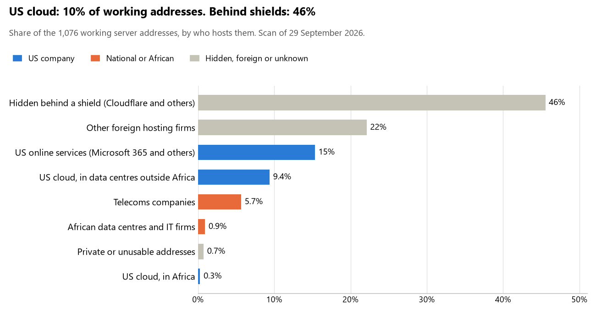

# Somalia: who hosts the state's front door

29 September 2026 · Bill Anderson · scan of 29 September 2026

The scan covered 28 state bodies, banks and state-owned companies in Somalia. 10% of their working server addresses are on US cloud: Amazon, Microsoft, Google or Oracle. 46% are behind shields such as Cloudflare, which hide the host. 0% are on government data centres or the institutions' own systems.

The scan found 856 web and mail names and 1,076 working addresses. 16 of the 28 institutions use US cloud for at least part of their estate. 6 use Microsoft for email and 18 use Google.

Of the 54 countries scanned so far, Somalia has the 36th highest US cloud share (median 13%) and the 4th highest share behind shields (median 12%).

## Where it lives

104 addresses are on US cloud. Where they are: 46% in Europe, 27% in a region the providers do not publish, 19% on worldwide delivery networks (no fixed location), 5% in Asia or the Middle East and 3% in Africa.

490 addresses are behind shields: Cloudflare (100%). The host behind a shield cannot be seen, so the US cloud share is a minimum.

## Banks against government

| Share of working addresses | Government (18) | Banks (10) |
| --- | --- | --- |
| On US cloud | 7% | 15% |
| …of which in Africa | <1% | 0% |
| US online services (Microsoft 365 and others) | 13% | 19% |
| Behind a shield | 54% | 28% |
| Government data centres | 0% | 0% |
| Run by the institution itself | 0% | 0% |
| Telecoms companies | 1% | 15% |
| African data centres and IT firms | 0% | 3% |
| Other foreign hosting firms | 24% | 19% |

6 of 10 banks and 10 of 18 government bodies use US cloud somewhere. "Government" includes the central bank, the payment switch, the stock exchange and the state-owned companies.

## Email

6 of the 28 institutions use Microsoft 365 for email and 18 use Google.

- **Microsoft 365:** 6. Ministry of Foreign Affairs and International Cooperation, Ministry of Finance, Central Bank of Somalia, Salaam Somali Bank, Amal Bank and SomBank.
- **Google:** 18. Ministry of Defence, Somali Police Force, Ministry of Justice and Constitutional Affairs, Ministry of Internal Security, Premier Bank, Mybank Limited, Amana Bank, Daryeel Bank, Galaxy International Bank, National Identification and Registration Authority (NIRA), National Independent Electoral and Boundaries Commission, Somali National Bureau of Statistics, Ministry of Health and Human Services, Ministry of Labour and Social Affairs, Somali Ports Authority, Mogadishu Port Authority, National Communications Authority and Office of the Auditor General.
- **Foreign hosting firms (Zoho):** 1. International Bank of Somalia.
- **Behind a mail filter, provider not visible:** 1. Dahabshil Bank International.
- **No mail on the domain scanned:** 2. Office of the President (Villa Somalia) and Federal Government of Somalia government zone.

## Institution by institution

Each figure is a share of that institution's working addresses. The rest are with telecoms companies, African data centres, US online services or foreign hosts. Rows follow the order of institution types.

| Institution | Type | On US cloud | …in Africa | Behind a shield | Own or government | Email |
| --- | --- | --- | --- | --- | --- | --- |
| Office of the President (Villa Somalia) | Presidency | 0% | 0% | 0% | 0% | — |
| Ministry of Foreign Affairs and International Cooperation | Foreign Affairs | 18% | 0% | 4% | 0% | Microsoft |
| Ministry of Defence | Defence | 2% | 0% | 98% | 0% | Google |
| Somali Police Force | Police | 0% | 0% | 94% | 0% | Google |
| Ministry of Justice and Constitutional Affairs | Justice | 0% | 0% | 89% | 0% | Google |
| Ministry of Finance | Treasury / Finance | 4% | 0% | 58% | 0% | Microsoft |
| Ministry of Internal Security | Interior / Home Affairs | 39% | 11% | 11% | 0% | Google |
| Central Bank of Somalia | Central Bank | 4% | 0% | 17% | 0% | Microsoft |
| International Bank of Somalia | Commercial Banks | 32% | 0% | 0% | 0% | Foreign host |
| Premier Bank | Commercial Banks | 17% | 0% | 0% | 0% | Google |
| Salaam Somali Bank | Commercial Banks | 36% | 0% | 0% | 0% | Microsoft |
| Dahabshil Bank International | Commercial Banks | 22% | 0% | 0% | 0% | Filtered |
| Amal Bank | Commercial Banks | 0% | 0% | 0% | 0% | Microsoft |
| Mybank Limited | Commercial Banks | 0% | 0% | 84% | 0% | Google |
| Amana Bank | Commercial Banks | 0% | 0% | 87% | 0% | Google |
| SomBank | Commercial Banks | 24% | 0% | 7% | 0% | Microsoft |
| Daryeel Bank | Commercial Banks | 3% | 0% | 6% | 0% | Google |
| Galaxy International Bank | Commercial Banks | 0% | 0% | 86% | 0% | Google |
| National Identification and Registration Authority (NIRA) | Civil registry / National ID authority | 0% | 0% | 90% | 0% | Google |
| National Independent Electoral and Boundaries Commission | Electoral commission | 21% | 0% | 42% | 0% | Google |
| Somali National Bureau of Statistics | Statistics office | 2% | 2% | 0% | 0% | Google |
| Ministry of Health and Human Services | Health ministry / National health insurance | 35% | 0% | 0% | 0% | Google |
| Ministry of Labour and Social Affairs | Social protection / Social registry | 0% | 0% | 25% | 0% | Google |
| Somali Ports Authority | Ports authority | 0% | 0% | 50% | 0% | Google |
| Mogadishu Port Authority | Ports authority | 6% | 0% | 63% | 0% | Google |
| Federal Government of Somalia government zone | E-government agency | no working address | | | | — |
| National Communications Authority | Communications regulator | 2% | 0% | 90% | 0% | Google |
| Office of the Auditor General | Audit office | 0% | 0% | 66% | 0% | Google |

No institution or working domain was found for 18 of the 36 types: Parliament, Armed Forces, Revenue Service, Customs, Intelligence, Data protection authority, Immigration / Passports, Land registry, National payment switch, Stock exchange, Securities regulator, Sovereign wealth fund / National pension fund, Public procurement authority, Energy utility, State-owned telco / National backbone operator, National data centre / Government cloud operator, Cybersecurity agency / National CERT and Anti-corruption commission.

## What stood out

- **Little US cloud in Africa.** 3% of Somalia's US cloud addresses are in the providers' African data centres.
- **Core state bodies on foreign hosting firms.** Office of the President (Villa Somalia) (DigitalOcean), Ministry of Foreign Affairs and International Cooperation (Hostinger and mvps MVPS LTD), Ministry of Justice and Constitutional Affairs (Contabo and DigitalOcean) and Ministry of Internal Security (Hostinger).
- **No Chinese cloud.** The scan found no address on Huawei, Alibaba or Tencent cloud.

## What this can and cannot tell you

The scan sees only the front door: websites, email, login portals, remote-access gateways and online banking. It cannot see where a bank's core ledger, the ID register or the payroll run.

- **Every US figure is a minimum.** Anything behind a shield or a mail filter could also be on US cloud. In Somalia that is 46% of working addresses.
- **It counts addresses, not importance.** An institution with many test and marketing sites weighs more than one with few.
- **The list of institutions was drawn up for this scan.** Each domain was checked to exist, not confirmed as the institution's main one.
- **It is a snapshot.** Every figure is as of 29 September 2026.
- **Nothing was touched.** The scan used public address lookups, public certificate records and the cloud companies' published address lists. It never connected to any institution's systems.

The data and method are in `R&D/Hyperscaler-dependence/scan/SOM/` and `R&D/Hyperscaler-dependence/HYPERSCALER-SCAN.md` in the Corpus repository.
