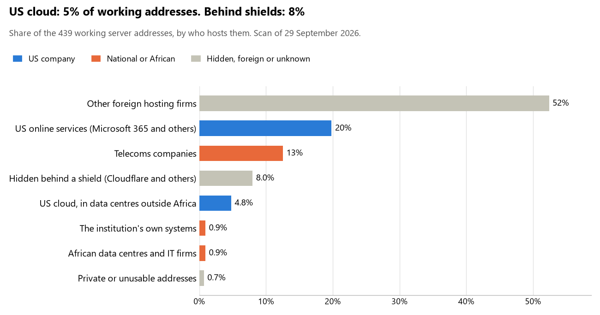

# South Sudan: who hosts the state's front door

29 September 2026 · Bill Anderson · scan of 29 September 2026

The scan covered 20 state bodies, banks and state-owned companies in South Sudan. 5% of their working server addresses are on US cloud: Amazon, Microsoft, Google or Oracle. 8% are behind shields such as Cloudflare, which hide the host. <1% are on government data centres or the institutions' own systems.

The scan found 370 web and mail names and 439 working addresses. 5 of the 20 institutions use US cloud for at least part of their estate. 7 use Microsoft for email and none use Google.

Of the 54 countries scanned so far, South Sudan has the 51st highest US cloud share (median 13%) and the 38th highest share behind shields (median 12%).

## Where it lives

21 addresses are on US cloud. Where they are: 67% in Europe, 24% on worldwide delivery networks (no fixed location) and 10% in North America.

35 addresses are behind shields: Cloudflare (100%). The host behind a shield cannot be seen, so the US cloud share is a minimum.

## Banks against government

| Share of working addresses | Government (17) | Banks (3) |
| --- | --- | --- |
| On US cloud | 4% | 8% |
| …of which in Africa | 0% | 0% |
| US online services (Microsoft 365 and others) | 19% | 27% |
| Behind a shield | 7% | 16% |
| Government data centres | 0% | 0% |
| Run by the institution itself | 0% | 8% |
| Telecoms companies | 14% | 4% |
| African data centres and IT firms | 1% | 0% |
| Other foreign hosting firms | 55% | 35% |

1 of 3 banks and 4 of 17 government bodies use US cloud somewhere. "Government" includes the central bank, the payment switch, the stock exchange and the state-owned companies.

## Email

7 of the 20 institutions use Microsoft 365 for email and none use Google.

- **Microsoft 365:** 7. Office of the President, Ministry of Finance and Planning, Bank of South Sudan, Co-operative Bank of South Sudan, National Elections Commission, National Communication Authority and National Audit Chamber.
- **Foreign hosting firms:** 10. Transitional National Legislative Assembly (Namecheap), Ministry of Foreign Affairs and International Cooperation (Zoho), Ministry of Justice and Constitutional Affairs (Namecheap), South Sudan National Revenue Authority (Zoho), Buffalo Commercial Bank (Unified Layer), National Bureau of Statistics (OVH), Directorate of Nationality Passports and Immigration (Zoho), Ministry of Health (Namecheap), South Sudan Pension Fund (PhoenixNAP) and Government eServices portal (Zoho).
- **Behind a mail filter, provider not visible:** 1. Public Procurement and Disposal of Assets Authority.
- **No mail on the domain scanned:** 2. KCB Bank South Sudan and Government of South Sudan eGovernment portal.

## Institution by institution

Each figure is a share of that institution's working addresses. The rest are with telecoms companies, African data centres, US online services or foreign hosts. Rows follow the order of institution types.

| Institution | Type | On US cloud | …in Africa | Behind a shield | Own or government | Email |
| --- | --- | --- | --- | --- | --- | --- |
| Office of the President | Presidency | 28% | 0% | 44% | 0% | Microsoft |
| Transitional National Legislative Assembly | Parliament | 0% | 0% | 0% | 0% | Foreign host |
| Ministry of Foreign Affairs and International Cooperation | Foreign Affairs | 0% | 0% | 0% | 0% | Foreign host |
| Ministry of Justice and Constitutional Affairs | Justice | 0% | 0% | 0% | 0% | Foreign host |
| Ministry of Finance and Planning | Treasury / Finance | 0% | 0% | 0% | 0% | Microsoft |
| South Sudan National Revenue Authority | Revenue Service | 0% | 0% | 11% | 0% | Foreign host |
| Bank of South Sudan | Central Bank | 0% | 0% | 0% | 0% | Microsoft |
| KCB Bank South Sudan | Commercial Banks | 33% | 0% | 67% | 0% | — |
| Co-operative Bank of South Sudan | Commercial Banks | 0% | 0% | 0% | 19% | Microsoft |
| Buffalo Commercial Bank | Commercial Banks | 0% | 0% | 0% | 0% | Foreign host |
| National Elections Commission | Electoral commission | 0% | 0% | 0% | 0% | Microsoft |
| National Bureau of Statistics | Statistics office | 0% | 0% | 0% | 0% | Foreign host |
| Directorate of Nationality Passports and Immigration | Immigration / Passports | 0% | 0% | 33% | 0% | Foreign host |
| Ministry of Health | Health ministry / National health insurance | 0% | 0% | 0% | 0% | Foreign host |
| South Sudan Pension Fund | Sovereign wealth fund / National pension fund | 0% | 0% | 0% | 0% | Foreign host |
| Public Procurement and Disposal of Assets Authority | Public procurement authority | 21% | 0% | 21% | 0% | Filtered |
| Government of South Sudan eGovernment portal | E-government agency | no working address | | | | — |
| Government eServices portal | E-government agency | 3% | 0% | 5% | 0% | Foreign host |
| National Communication Authority | Communications regulator | 7% | 0% | 0% | 0% | Microsoft |
| National Audit Chamber | Audit office | 0% | 0% | 0% | 0% | Microsoft |

No institution or working domain was found for 19 of the 36 types: Defence, Armed Forces, Police, Customs, Intelligence, Interior / Home Affairs, Civil registry / National ID authority, Data protection authority, Social protection / Social registry, Land registry, National payment switch, Stock exchange, Securities regulator, Energy utility, Ports authority, State-owned telco / National backbone operator, National data centre / Government cloud operator, Cybersecurity agency / National CERT and Anti-corruption commission.

## What stood out

- **Little US cloud in Africa.** 0% of South Sudan's US cloud addresses are in the providers' African data centres.
- **Core state bodies on foreign hosting firms.** Transitional National Legislative Assembly (Namecheap), Ministry of Foreign Affairs and International Cooperation (Namecheap), Ministry of Justice and Constitutional Affairs (Namecheap), Ministry of Finance and Planning (Namecheap), South Sudan National Revenue Authority (DigitalOcean) and Bank of South Sudan (Namecheap).
- **No Chinese cloud.** The scan found no address on Huawei, Alibaba or Tencent cloud.

## What this can and cannot tell you

The scan sees only the front door: websites, email, login portals, remote-access gateways and online banking. It cannot see where a bank's core ledger, the ID register or the payroll run.

- **Every US figure is a minimum.** Anything behind a shield or a mail filter could also be on US cloud. In South Sudan that is 8% of working addresses.
- **It counts addresses, not importance.** An institution with many test and marketing sites weighs more than one with few.
- **The list of institutions was drawn up for this scan.** Each domain was checked to exist, not confirmed as the institution's main one.
- **It is a snapshot.** Every figure is as of 29 September 2026.
- **Nothing was touched.** The scan used public address lookups, public certificate records and the cloud companies' published address lists. It never connected to any institution's systems.

The data and method are in `R&D/Hyperscaler-dependence/scan/SSD/` and `R&D/Hyperscaler-dependence/HYPERSCALER-SCAN.md` in the Corpus repository.
