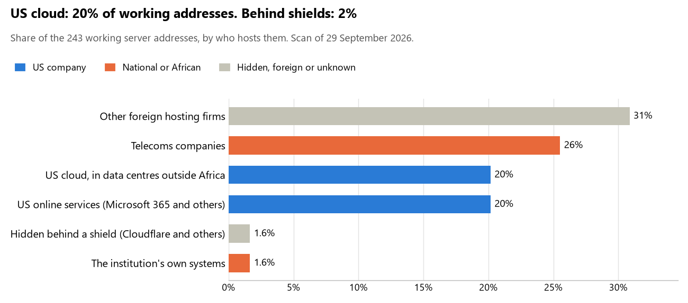

# Sao Tome and Principe: who hosts the state's front door

29 September 2026 · Bill Anderson · scan of 29 September 2026

The scan covered 20 state bodies, banks and state-owned companies in Sao Tome and Principe. 20% of their working server addresses are on US cloud: Amazon, Microsoft, Google or Oracle. 2% are behind shields such as Cloudflare, which hide the host. 2% are on government data centres or the institutions' own systems.

The scan found 146 web and mail names and 243 working addresses. 12 of the 20 institutions use US cloud for at least part of their estate. 3 use Microsoft for email and 5 use Google.

Of the 54 countries scanned so far, Sao Tome and Principe has the 15th highest US cloud share (median 13%) and the 46th highest share behind shields (median 12%).

## Where it lives

49 addresses are on US cloud. Where they are: 57% in Europe, 29% on worldwide delivery networks (no fixed location) and 14% in North America.

4 addresses are behind shields: Cloudflare (100%). The host behind a shield cannot be seen, so the US cloud share is a minimum.

## Banks against government

| Share of working addresses | Government (18) | Banks (2) |
| --- | --- | --- |
| On US cloud | 19% | 24% |
| …of which in Africa | 0% | 0% |
| US online services (Microsoft 365 and others) | 17% | 35% |
| Behind a shield | <1% | 5% |
| Government data centres | 0% | 0% |
| Run by the institution itself | 2% | 0% |
| Telecoms companies | 25% | 27% |
| African data centres and IT firms | 0% | 0% |
| Other foreign hosting firms | 35% | 8% |

1 of 2 banks and 11 of 18 government bodies use US cloud somewhere. "Government" includes the central bank, the payment switch, the stock exchange and the state-owned companies.

## Email

3 of the 20 institutions use Microsoft 365 for email and 5 use Google.

- **Microsoft 365:** 3. Banco Internacional de São Tomé e Príncipe (BISTP), Empresa de Água e Electricidade (EMAE) and Empresa Nacional de Administração dos Portos (ENAPORT).
- **Google:** 5. Polícia Judiciária, Ministério do Planeamento Finanças e Economia Azul, Direcção Geral dos Registos Notariado e Identificação, Comissão Eleitoral Nacional and Tribunal de Contas.
- **Telecoms companies (Companhia Santomense de Telecomunicacoes):** 1. Governo de São Tomé e Príncipe (parent zone).
- **US cloud (CST):** 1. Companhia Santomense de Telecomunicações.
- **Foreign hosting firms:** 7. Presidência da República (PlanetHoster), Supremo Tribunal de Justiça (OVH), Banco Central de São Tomé e Príncipe (Hetzner), Afriland First Bank STP (Newfold Digital, Inc.), Instituto Nacional de Estatística (DOMINIOS, S.A.), Ministério da Saúde (DOMINIOS, S.A.) and Autoridade Geral de Regulação (AGER) (Zoho).
- **No mail on the domain scanned:** 3. Assembleia Nacional, Serviço de Migração e Fronteiras and Portal do Governo.

## Institution by institution

Each figure is a share of that institution's working addresses. The rest are with telecoms companies, African data centres, US online services or foreign hosts. Rows follow the order of institution types.

| Institution | Type | On US cloud | …in Africa | Behind a shield | Own or government | Email |
| --- | --- | --- | --- | --- | --- | --- |
| Presidência da República | Presidency | 0% | 0% | 0% | 0% | Foreign host |
| Assembleia Nacional | Parliament | 50% | 0% | 0% | 0% | — |
| Polícia Judiciária | Police | 60% | 0% | 0% | 0% | Google |
| Supremo Tribunal de Justiça | Justice | 0% | 0% | 0% | 0% | Foreign host |
| Ministério do Planeamento Finanças e Economia Azul | Treasury / Finance | 72% | 0% | 11% | 0% | Google |
| Banco Central de São Tomé e Príncipe | Central Bank | 45% | 0% | 0% | 0% | Foreign host |
| Banco Internacional de São Tomé e Príncipe (BISTP) | Commercial Banks | 29% | 0% | 0% | 0% | Microsoft |
| Afriland First Bank STP | Commercial Banks | 0% | 0% | 33% | 0% | Foreign host |
| Direcção Geral dos Registos Notariado e Identificação | Civil registry / National ID authority | 60% | 0% | 0% | 0% | Google |
| Comissão Eleitoral Nacional | Electoral commission | 15% | 0% | 0% | 0% | Google |
| Instituto Nacional de Estatística | Statistics office | 0% | 0% | 0% | 0% | Foreign host |
| Serviço de Migração e Fronteiras | Immigration / Passports | 17% | 0% | 0% | 0% | — |
| Ministério da Saúde | Health ministry / National health insurance | 0% | 0% | 0% | 0% | Foreign host |
| Empresa de Água e Electricidade (EMAE) | Energy utility | 6% | 0% | 0% | 11% | Microsoft |
| Empresa Nacional de Administração dos Portos (ENAPORT) | Ports authority | 5% | 0% | 0% | 0% | Microsoft |
| Companhia Santomense de Telecomunicações (CST) | State-owned telco / National backbone operator | 25% | 0% | 0% | 17% | US cloud |
| Governo de São Tomé e Príncipe (parent zone) | E-government agency | 0% | 0% | 0% | 0% | Telecoms |
| Portal do Governo | E-government agency | 0% | 0% | 0% | 0% | — |
| Autoridade Geral de Regulação (AGER) | Communications regulator | 0% | 0% | 0% | 0% | Foreign host |
| Tribunal de Contas | Audit office | 9% | 0% | 0% | 0% | Google |

No institution or working domain was found for 18 of the 36 types: Foreign Affairs, Defence, Armed Forces, Revenue Service, Customs, Intelligence, Interior / Home Affairs, Data protection authority, Social protection / Social registry, Land registry, National payment switch, Stock exchange, Securities regulator, Sovereign wealth fund / National pension fund, Public procurement authority, National data centre / Government cloud operator, Cybersecurity agency / National CERT and Anti-corruption commission.

## What stood out

- **Most on US cloud.** Ministério do Planeamento Finanças e Economia Azul (72%), Polícia Judiciária (60%) and Direcção Geral dos Registos Notariado e Identificação (60%) have more than half their working addresses on US cloud.
- **Little US cloud in Africa.** 0% of Sao Tome and Principe's US cloud addresses are in the providers' African data centres.
- **Core state bodies on foreign hosting firms.** Presidência da República (PlanetHoster), Assembleia Nacional (Team Internet AG), Supremo Tribunal de Justiça (OVH), Ministério do Planeamento Finanças e Economia Azul (Contabo) and Banco Central de São Tomé e Príncipe (Hetzner).
- **No Chinese cloud.** The scan found no address on Huawei, Alibaba or Tencent cloud.

## What this can and cannot tell you

The scan sees only the front door: websites, email, login portals, remote-access gateways and online banking. It cannot see where a bank's core ledger, the ID register or the payroll run.

- **Every US figure is a minimum.** Anything behind a shield or a mail filter could also be on US cloud. In Sao Tome and Principe that is 2% of working addresses.
- **It counts addresses, not importance.** An institution with many test and marketing sites weighs more than one with few.
- **The list of institutions was drawn up for this scan.** Each domain was checked to exist, not confirmed as the institution's main one.
- **It is a snapshot.** Every figure is as of 29 September 2026.
- **Nothing was touched.** The scan used public address lookups, public certificate records and the cloud companies' published address lists. It never connected to any institution's systems.

The data and method are in `R&D/Hyperscaler-dependence/scan/STP/` and `R&D/Hyperscaler-dependence/HYPERSCALER-SCAN.md` in the Corpus repository.
