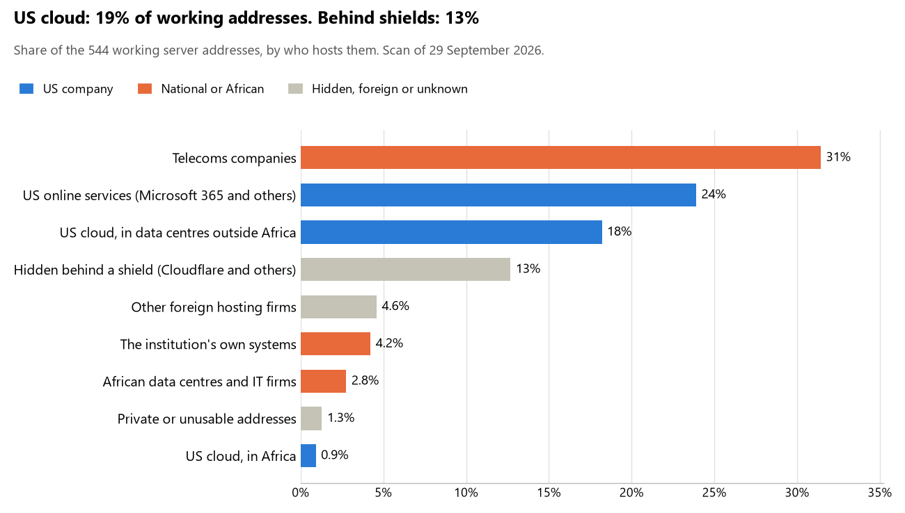

# Eswatini: who hosts the state's front door

29 September 2026 · Bill Anderson · scan of 29 September 2026

The scan covered 17 state bodies, banks and state-owned companies in Eswatini. 19% of their working server addresses are on US cloud: Amazon, Microsoft, Google or Oracle. 13% are behind shields such as Cloudflare, which hide the host. 4% are on government data centres or the institutions' own systems.

The scan found 332 web and mail names and 544 working addresses. 10 of the 17 institutions use US cloud for at least part of their estate. 12 use Microsoft for email and none use Google.

Of the 54 countries scanned so far, Eswatini has the 18th highest US cloud share (median 13%) and the 25th highest share behind shields (median 12%).

## Where it lives

104 addresses are on US cloud. Where they are: 61% in Europe, 26% on worldwide delivery networks (no fixed location), 8% in a region the providers do not publish, 5% in Africa and <1% in North America.

69 addresses are behind shields: Cloudflare (52%), Akamai (46%) and Radware (1%). The host behind a shield cannot be seen, so the US cloud share is a minimum.

## Banks against government

| Share of working addresses | Government (13) | Banks (4) |
| --- | --- | --- |
| On US cloud | 20% | 18% |
| …of which in Africa | <1% | 2% |
| US online services (Microsoft 365 and others) | 30% | 11% |
| Behind a shield | 3% | 35% |
| Government data centres | 0% | 0% |
| Run by the institution itself | 3% | 7% |
| Telecoms companies | 33% | 27% |
| African data centres and IT firms | 4% | 0% |
| Other foreign hosting firms | 6% | 1% |

2 of 4 banks and 8 of 13 government bodies use US cloud somewhere. "Government" includes the central bank, the payment switch, the stock exchange and the state-owned companies.

## Email

12 of the 17 institutions use Microsoft 365 for email and none use Google.

- **Microsoft 365:** 12. Eswatini Revenue Service, Central Bank of Eswatini, Standard Bank Eswatini, Nedbank Eswatini, Eswatini Bank, Eswatini Stock Exchange, Financial Services Regulatory Authority, Eswatini National Provident Fund, Eswatini Public Procurement Regulatory Agency, Eswatini Electricity Company, Eswatini Posts and Telecommunications Corporation and Eswatini Communications Commission.
- **Telecoms companies:** 3. Judiciary of Eswatini (SWAZILAND PTC), Tibiyo Taka Ngwane (Real Image Internet) and Government of Eswatini portal (SWAZILAND PTC).
- **Foreign hosting firms (Hetzner):** 1. Elections and Boundaries Commission.
- **No mail on the domain scanned:** 1. First National Bank Eswatini.

## Institution by institution

Each figure is a share of that institution's working addresses. The rest are with telecoms companies, African data centres, US online services or foreign hosts. Rows follow the order of institution types.

| Institution | Type | On US cloud | …in Africa | Behind a shield | Own or government | Email |
| --- | --- | --- | --- | --- | --- | --- |
| Judiciary of Eswatini | Justice | 0% | 0% | 0% | 0% | Telecoms |
| Eswatini Revenue Service | Revenue Service | 31% | 3% | 0% | 38% | Microsoft |
| Central Bank of Eswatini | Central Bank | 16% | 0% | 0% | 0% | Microsoft |
| Standard Bank Eswatini | Commercial Banks | 20% | 0% | 58% | 5% | Microsoft |
| Nedbank Eswatini | Commercial Banks | 25% | 8% | 0% | 3% | Microsoft |
| First National Bank Eswatini | Commercial Banks | 0% | 0% | 10% | 50% | — |
| Eswatini Bank | Commercial Banks | 0% | 0% | 0% | 0% | Microsoft |
| Elections and Boundaries Commission | Electoral commission | 0% | 0% | 0% | 0% | Foreign host |
| Eswatini Stock Exchange | Stock exchange | 37% | 0% | 0% | 0% | Microsoft |
| Financial Services Regulatory Authority | Securities regulator | 35% | 3% | 0% | 0% | Microsoft |
| Eswatini National Provident Fund | Sovereign wealth fund / National pension fund | 24% | 0% | 0% | 0% | Microsoft |
| Tibiyo Taka Ngwane | Sovereign wealth fund / National pension fund | 0% | 0% | 0% | 0% | Telecoms |
| Eswatini Public Procurement Regulatory Agency | Public procurement authority | 28% | 0% | 31% | 0% | Microsoft |
| Eswatini Electricity Company | Energy utility | 0% | 0% | 0% | 0% | Microsoft |
| Eswatini Posts and Telecommunications Corporation | State-owned telco / National backbone operator | 0% | 0% | 0% | 0% | Microsoft |
| Government of Eswatini portal | E-government agency | 3% | 0% | 0% | 0% | Telecoms |
| Eswatini Communications Commission | Communications regulator | 25% | 0% | 0% | 0% | Microsoft |

No institution or working domain was found for 23 of the 36 types: Presidency, Parliament, Foreign Affairs, Defence, Armed Forces, Police, Treasury / Finance, Customs, Intelligence, Interior / Home Affairs, Civil registry / National ID authority, Data protection authority, Statistics office, Immigration / Passports, Health ministry / National health insurance, Social protection / Social registry, Land registry, National payment switch, Ports authority, National data centre / Government cloud operator, Cybersecurity agency / National CERT, Audit office and Anti-corruption commission.

## What stood out

- **Little US cloud in Africa.** 5% of Eswatini's US cloud addresses are in the providers' African data centres.
- **Core state bodies on foreign hosting firms.** Central Bank of Eswatini (Hetzner).
- **No Chinese cloud.** The scan found no address on Huawei, Alibaba or Tencent cloud.

## What this can and cannot tell you

The scan sees only the front door: websites, email, login portals, remote-access gateways and online banking. It cannot see where a bank's core ledger, the ID register or the payroll run.

- **Every US figure is a minimum.** Anything behind a shield or a mail filter could also be on US cloud. In Eswatini that is 13% of working addresses.
- **It counts addresses, not importance.** An institution with many test and marketing sites weighs more than one with few.
- **The list of institutions was drawn up for this scan.** Each domain was checked to exist, not confirmed as the institution's main one.
- **It is a snapshot.** Every figure is as of 29 September 2026.
- **Nothing was touched.** The scan used public address lookups, public certificate records and the cloud companies' published address lists. It never connected to any institution's systems.

The data and method are in `R&D/Hyperscaler-dependence/scan/SWZ/` and `R&D/Hyperscaler-dependence/HYPERSCALER-SCAN.md` in the Corpus repository.
