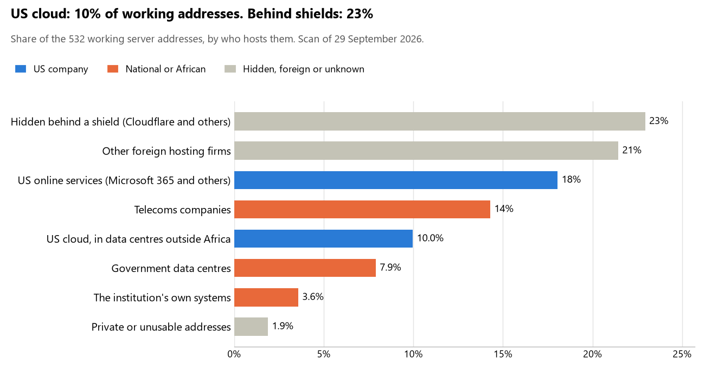

# Seychelles: who hosts the state's front door

29 September 2026 · Bill Anderson · scan of 29 September 2026

The scan covered 30 state bodies, banks and state-owned companies in Seychelles. 10% of their working server addresses are on US cloud: Amazon, Microsoft, Google or Oracle. 23% are behind shields such as Cloudflare, which hide the host. 11% are on government data centres or the institutions' own systems.

The scan found 376 web and mail names and 532 working addresses. 13 of the 30 institutions use US cloud for at least part of their estate. 18 use Microsoft for email and none use Google.

Of the 54 countries scanned so far, Seychelles has the 34th highest US cloud share (median 13%) and the 13th highest share behind shields (median 12%).

## Where it lives

53 addresses are on US cloud. Where they are: 28% in Europe, 26% on worldwide delivery networks (no fixed location), 21% in North America, 15% in Asia or the Middle East and 9% in a region the providers do not publish.

122 addresses are behind shields: Cloudflare (80%), Fastly (10%) and Radware (7%). The host behind a shield cannot be seen, so the US cloud share is a minimum.

## Banks against government

| Share of working addresses | Government (24) | Banks (6) |
| --- | --- | --- |
| On US cloud | 9% | 13% |
| …of which in Africa | 0% | 0% |
| US online services (Microsoft 365 and others) | 18% | 19% |
| Behind a shield | 25% | 15% |
| Government data centres | 10% | 0% |
| Run by the institution itself | 3% | 7% |
| Telecoms companies | 13% | 18% |
| African data centres and IT firms | 0% | 0% |
| Other foreign hosting firms | 20% | 28% |

4 of 6 banks and 9 of 24 government bodies use US cloud somewhere. "Government" includes the central bank, the payment switch, the stock exchange and the state-owned companies.

## Email

18 of the 30 institutions use Microsoft 365 for email and none use Google.

- **Microsoft 365:** 18. Office of the President, National Assembly of Seychelles, Ministry of Foreign Affairs, Ministry of Finance, Seychelles Revenue Commission, Central Bank of Seychelles, Seychelles Commercial Bank, MCB Seychelles, Electoral Commission of Seychelles, Ministry of Health, MERJ Exchange, Financial Services Authority, Public Utilities Corporation, Seychelles Ports Authority, Cable & Wireless Seychelles, Department of Information Communications Technology, Anti-Corruption Commission of Seychelles and Department of Information Communications Technology (DICT).
- **Government data centre (Department of ICT Government of Seychelles):** 5. Seychelles Police Force, Ministry of Home Affairs, National Bureau of Statistics, Immigration and Civil Status Division and Land Registration Division.
- **Foreign hosting firms (Zoho):** 2. Judiciary of Seychelles and Seychelles Pension Fund.
- **Behind a mail filter, provider not visible:** 2. Nouvobanq and Al Salam Bank Seychelles.
- **No mail on the domain scanned:** 3. Absa Bank Seychelles, Bank of Baroda Seychelles and Trop-X.

## Institution by institution

Each figure is a share of that institution's working addresses. The rest are with telecoms companies, African data centres, US online services or foreign hosts. Rows follow the order of institution types.

| Institution | Type | On US cloud | …in Africa | Behind a shield | Own or government | Email |
| --- | --- | --- | --- | --- | --- | --- |
| Office of the President | Presidency | 0% | 0% | 0% | 57% | Microsoft |
| National Assembly of Seychelles | Parliament | 6% | 0% | 0% | 0% | Microsoft |
| Ministry of Foreign Affairs | Foreign Affairs | 29% | 0% | 0% | 43% | Microsoft |
| Seychelles Police Force | Police | 0% | 0% | 0% | 83% | Government |
| Judiciary of Seychelles | Justice | 0% | 0% | 0% | 0% | Foreign host |
| Ministry of Finance | Treasury / Finance | 0% | 0% | 0% | 33% | Microsoft |
| Seychelles Revenue Commission | Revenue Service | 0% | 0% | 29% | 36% | Microsoft |
| Ministry of Home Affairs | Interior / Home Affairs | 0% | 0% | 0% | 50% | Government |
| Central Bank of Seychelles | Central Bank | 0% | 0% | 0% | 0% | Microsoft |
| Seychelles Commercial Bank | Commercial Banks | 0% | 0% | 0% | 0% | Microsoft |
| Absa Bank Seychelles | Commercial Banks | 20% | 0% | 26% | 23% | — |
| MCB Seychelles | Commercial Banks | 10% | 0% | 10% | 0% | Microsoft |
| Nouvobanq | Commercial Banks | 19% | 0% | 0% | 0% | Filtered |
| Bank of Baroda Seychelles | Commercial Banks | 0% | 0% | 0% | 0% | — |
| Al Salam Bank Seychelles | Commercial Banks | 10% | 0% | 60% | 0% | Filtered |
| Electoral Commission of Seychelles | Electoral commission | 0% | 0% | 13% | 0% | Microsoft |
| National Bureau of Statistics | Statistics office | 33% | 0% | 0% | 50% | Government |
| Immigration and Civil Status Division | Immigration / Passports | 0% | 0% | 67% | 28% | Government |
| Ministry of Health | Health ministry / National health insurance | 0% | 0% | 0% | 80% | Microsoft |
| Land Registration Division | Land registry | 0% | 0% | 0% | 83% | Government |
| Trop-X | Stock exchange | 50% | 0% | 0% | 0% | — |
| MERJ Exchange | Stock exchange | 77% | 0% | 0% | 0% | Microsoft |
| Financial Services Authority | Securities regulator | 10% | 0% | 0% | 0% | Microsoft |
| Seychelles Pension Fund | Sovereign wealth fund / National pension fund | 0% | 0% | 94% | 0% | Foreign host |
| Public Utilities Corporation | Energy utility | 0% | 0% | 0% | 0% | Microsoft |
| Seychelles Ports Authority | Ports authority | 6% | 0% | 0% | 0% | Microsoft |
| Cable & Wireless Seychelles | State-owned telco / National backbone operator | 5% | 0% | 10% | 24% | Microsoft |
| Department of Information Communications Technology | E-government agency | 0% | 0% | 0% | 25% | Microsoft |
| Anti-Corruption Commission of Seychelles | Anti-corruption commission | 16% | 0% | 68% | 0% | Microsoft |
| Department of Information Communications Technology (DICT) | E-government agency | 0% | 0% | 0% | 86% | Microsoft |

No institution or working domain was found for 13 of the 36 types: Defence, Armed Forces, Customs, Intelligence, Civil registry / National ID authority, Data protection authority, Social protection / Social registry, National payment switch, Public procurement authority, National data centre / Government cloud operator, Cybersecurity agency / National CERT, Communications regulator and Audit office.

## What stood out

- **Most on US cloud.** MERJ Exchange (77%) has more than half its working addresses on US cloud.
- **Little US cloud in Africa.** 0% of Seychelles's US cloud addresses are in the providers' African data centres.
- **Core state bodies at home.** Seychelles Police Force (83%) keeps at least 80% of its working addresses on government data centres or its own systems.
- **Core state bodies on foreign hosting firms.** Office of the President (SuperHosting.BG Ltd.), National Assembly of Seychelles (OVH), Ministry of Foreign Affairs (Wildcard UK Limited), Judiciary of Seychelles (OVH and Host Europe (GoDaddy)), Ministry of Finance (OrangeHost) and Seychelles Revenue Commission (Hosting), and 1 more.
- **No Chinese cloud.** The scan found no address on Huawei, Alibaba or Tencent cloud.

## What this can and cannot tell you

The scan sees only the front door: websites, email, login portals, remote-access gateways and online banking. It cannot see where a bank's core ledger, the ID register or the payroll run.

- **Every US figure is a minimum.** Anything behind a shield or a mail filter could also be on US cloud. In Seychelles that is 23% of working addresses.
- **It counts addresses, not importance.** An institution with many test and marketing sites weighs more than one with few.
- **The list of institutions was drawn up for this scan.** Each domain was checked to exist, not confirmed as the institution's main one.
- **It is a snapshot.** Every figure is as of 29 September 2026.
- **Nothing was touched.** The scan used public address lookups, public certificate records and the cloud companies' published address lists. It never connected to any institution's systems.

The data and method are in `R&D/Hyperscaler-dependence/scan/SYC/` and `R&D/Hyperscaler-dependence/HYPERSCALER-SCAN.md` in the Corpus repository.
