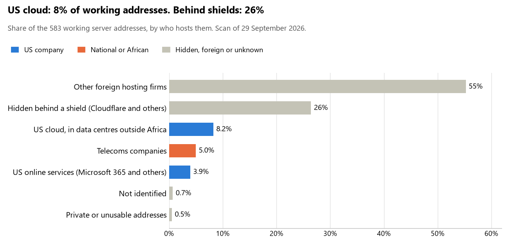

# Chad: who hosts the state's front door

29 September 2026 · Bill Anderson · scan of 29 September 2026

The scan covered 30 state bodies, banks and state-owned companies in Chad. 8% of their working server addresses are on US cloud: Amazon, Microsoft, Google or Oracle. 26% are behind shields such as Cloudflare, which hide the host. 0% are on government data centres or the institutions' own systems.

The scan found 441 web and mail names and 583 working addresses. 9 of the 30 institutions use US cloud for at least part of their estate. 3 use Microsoft for email and 1 use Google.

Of the 54 countries scanned so far, Chad has the 43rd highest US cloud share (median 13%) and the 10th highest share behind shields (median 12%).

## Where it lives

48 addresses are on US cloud. Where they are: 73% in Europe, 15% on worldwide delivery networks (no fixed location), 10% in a region the providers do not publish and 2% in North America.

154 addresses are behind shields: Cloudflare (97%) and Imperva (3%). The host behind a shield cannot be seen, so the US cloud share is a minimum.

## Banks against government

| Share of working addresses | Government (26) | Banks (4) |
| --- | --- | --- |
| On US cloud | 9% | 5% |
| …of which in Africa | 0% | 0% |
| US online services (Microsoft 365 and others) | 4% | 0% |
| Behind a shield | 23% | 67% |
| Government data centres | 0% | 0% |
| Run by the institution itself | 0% | 0% |
| Telecoms companies | 5% | 2% |
| African data centres and IT firms | 0% | 0% |
| Other foreign hosting firms | 58% | 26% |

1 of 4 banks and 8 of 26 government bodies use US cloud somewhere. "Government" includes the central bank, the payment switch, the stock exchange and the state-owned companies.

## Email

3 of the 30 institutions use Microsoft 365 for email and 1 use Google.

- **Microsoft 365:** 3. Agence Nationale de Gestion des Élections, Bourse des Valeurs Mobilières de l'Afrique Centrale and Commission de Surveillance du Marché Financier de l'Afrique Centrale.
- **Google:** 1. Ministère des Finances; du Budget; de l'Économie; du Plan et de la Coopération internationale.
- **Telecoms companies:** 3. Présidence de la République du Tchad (Sahel Fiber Telecommunication Chad), Ministère des Finances (former domain) (Sahel Fiber Telecommunication Chad) and Banque des États de l'Afrique Centrale (CAMTEL).
- **Foreign hosting firms:** 16. Sénat (PlanetHoster), Direction Générale des Impôts (InMotion Hosting), Direction Générale des Douanes et Droits Indirects (Contabo), Ministère de la Sécurité Publique et de l'Immigration (PlanetHoster), Commercial Bank Tchad (Contabo), United Bank for Africa Tchad (Host Europe), Agence Nationale des Titres Sécurisés (Zoho), Institut National de la Statistique et des Études Économiques et Démographiques (Groupe LWS SARL), Ministère de la Santé publique (PlanetHoster), Caisse Nationale de Prévoyance Sociale (site alternatif) (OVH), Autorité de Régulation des Marchés Publics (OVH), Agence de Développement des Technologies de l'Information et de la Communication (PlanetHoster), Agence Nationale de Sécurité Informatique et de Certification Électronique (Zoho), Autorité de Régulation des Communications Électroniques et des Postes (PlanetHoster), Cour des comptes (Interserver) and Autorité Indépendante de Lutte contre la Corruption (O2SWITCH O2SWITCH SAS).
- **Behind a mail filter, provider not visible:** 1. Ministère des Affaires étrangères.
- **No mail on the domain scanned:** 6. Assemblée nationale, Coris Bank International Tchad, Banque Agricole et Commerciale, Caisse Nationale de Prévoyance Sociale, Groupement Interbancaire Monétique de l'Afrique Centrale and Portail officiel du Gouvernement tchadien.

## Institution by institution

Each figure is a share of that institution's working addresses. The rest are with telecoms companies, African data centres, US online services or foreign hosts. Rows follow the order of institution types.

| Institution | Type | On US cloud | …in Africa | Behind a shield | Own or government | Email |
| --- | --- | --- | --- | --- | --- | --- |
| Présidence de la République du Tchad | Presidency | 0% | 0% | 90% | 0% | Telecoms |
| Assemblée nationale | Parliament | 0% | 0% | 100% | 0% | — |
| Sénat | Parliament | 0% | 0% | 0% | 0% | Foreign host |
| Ministère des Affaires étrangères | Foreign Affairs | 24% | 0% | 24% | 0% | Filtered |
| Ministère des Finances; du Budget; de l'Économie; du Plan et de la Coopération internationale | Treasury / Finance | 4% | 0% | 0% | 0% | Google |
| Ministère des Finances (former domain) | Treasury / Finance | 0% | 0% | 0% | 0% | Telecoms |
| Direction Générale des Impôts | Revenue Service | 0% | 0% | 96% | 0% | Foreign host |
| Direction Générale des Douanes et Droits Indirects | Customs | 0% | 0% | 0% | 0% | Foreign host |
| Ministère de la Sécurité Publique et de l'Immigration | Interior / Home Affairs | 0% | 0% | 0% | 0% | Foreign host |
| Banque des États de l'Afrique Centrale | Central Bank | 50% | 0% | 0% | 0% | Telecoms |
| Commercial Bank Tchad | Commercial Banks | 0% | 0% | 63% | 0% | Foreign host |
| Coris Bank International Tchad | Commercial Banks | 0% | 0% | 0% | 0% | — |
| United Bank for Africa Tchad | Commercial Banks | 18% | 0% | 45% | 0% | Foreign host |
| Banque Agricole et Commerciale | Commercial Banks | 0% | 0% | 100% | 0% | — |
| Agence Nationale des Titres Sécurisés | Civil registry / National ID authority | 14% | 0% | 0% | 0% | Foreign host |
| Agence Nationale de Gestion des Élections | Electoral commission | 0% | 0% | 0% | 0% | Microsoft |
| Institut National de la Statistique et des Études Économiques et Démographiques | Statistics office | 0% | 0% | 0% | 0% | Foreign host |
| Ministère de la Santé publique | Health ministry / National health insurance | 4% | 0% | 0% | 0% | Foreign host |
| Caisse Nationale de Prévoyance Sociale | Social protection / Social registry | 0% | 0% | 22% | 0% | — |
| Caisse Nationale de Prévoyance Sociale (site alternatif) | Social protection / Social registry | 0% | 0% | 0% | 0% | Foreign host |
| Groupement Interbancaire Monétique de l'Afrique Centrale | National payment switch | 0% | 0% | 0% | 0% | — |
| Bourse des Valeurs Mobilières de l'Afrique Centrale | Stock exchange | 0% | 0% | 0% | 0% | Microsoft |
| Commission de Surveillance du Marché Financier de l'Afrique Centrale | Securities regulator | 44% | 0% | 25% | 0% | Microsoft |
| Autorité de Régulation des Marchés Publics | Public procurement authority | 0% | 0% | 0% | 0% | Foreign host |
| Agence de Développement des Technologies de l'Information et de la Communication | E-government agency | 0% | 0% | 0% | 0% | Foreign host |
| Portail officiel du Gouvernement tchadien | E-government agency | no working address | | | | — |
| Agence Nationale de Sécurité Informatique et de Certification Électronique | Cybersecurity agency / National CERT | 5% | 0% | 75% | 0% | Foreign host |
| Autorité de Régulation des Communications Électroniques et des Postes | Communications regulator | 0% | 0% | 0% | 0% | Foreign host |
| Cour des comptes | Audit office | 0% | 0% | 0% | 0% | Foreign host |
| Autorité Indépendante de Lutte contre la Corruption | Anti-corruption commission | 6% | 0% | 0% | 0% | Foreign host |

No institution or working domain was found for 13 of the 36 types: Defence, Armed Forces, Police, Justice, Intelligence, Data protection authority, Immigration / Passports, Land registry, Sovereign wealth fund / National pension fund, Energy utility, Ports authority, State-owned telco / National backbone operator and National data centre / Government cloud operator.

## What stood out

- **Most on US cloud.** Banque des États de l'Afrique Centrale (50%) has more than half its working addresses on US cloud.
- **Little US cloud in Africa.** 0% of Chad's US cloud addresses are in the providers' African data centres.
- **Core state bodies on foreign hosting firms.** Sénat (PlanetHoster), Ministère des Affaires étrangères (Hostinger), Ministère des Finances; du Budget; de l'Économie; du Plan et de la Coopération internationale (InMotion Hosting), Ministère des Finances (former domain) (OVH), Direction Générale des Douanes et Droits Indirects (Contabo) and Ministère de la Sécurité Publique et de l'Immigration (PlanetHoster).
- **No Chinese cloud.** The scan found no address on Huawei, Alibaba or Tencent cloud.

## What this can and cannot tell you

The scan sees only the front door: websites, email, login portals, remote-access gateways and online banking. It cannot see where a bank's core ledger, the ID register or the payroll run.

- **Every US figure is a minimum.** Anything behind a shield or a mail filter could also be on US cloud. In Chad that is 26% of working addresses.
- **It counts addresses, not importance.** An institution with many test and marketing sites weighs more than one with few.
- **The list of institutions was drawn up for this scan.** Each domain was checked to exist, not confirmed as the institution's main one.
- **It is a snapshot.** Every figure is as of 29 September 2026.
- **Nothing was touched.** The scan used public address lookups, public certificate records and the cloud companies' published address lists. It never connected to any institution's systems.

The data and method are in `R&D/Hyperscaler-dependence/scan/TCD/` and `R&D/Hyperscaler-dependence/HYPERSCALER-SCAN.md` in the Corpus repository.
