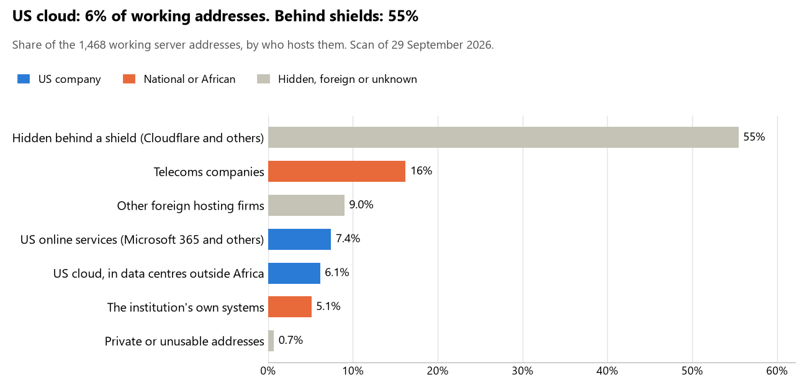

# Togo: who hosts the state's front door

29 September 2026 · Bill Anderson · scan of 29 September 2026

The scan covered 37 state bodies, banks and state-owned companies in Togo. 6% of their working server addresses are on US cloud: Amazon, Microsoft, Google or Oracle. 55% are behind shields such as Cloudflare, which hide the host. 5% are on government data centres or the institutions' own systems.

The scan found 719 web and mail names and 1,468 working addresses. 9 of the 37 institutions use US cloud for at least part of their estate. 12 use Microsoft for email and 9 use Google.

Of the 54 countries scanned so far, Togo has the 48th highest US cloud share (median 13%) and the 1st highest share behind shields (median 12%).

## Where it lives

90 addresses are on US cloud. Where they are: 76% in Europe, 18% on worldwide delivery networks (no fixed location) and 7% in a region the providers do not publish.

814 addresses are behind shields: Cloudflare (100%). The host behind a shield cannot be seen, so the US cloud share is a minimum.

## Banks against government

| Share of working addresses | Government (32) | Banks (5) |
| --- | --- | --- |
| On US cloud | 3% | 43% |
| …of which in Africa | 0% | 0% |
| US online services (Microsoft 365 and others) | 7% | 14% |
| Behind a shield | 60% | 2% |
| Government data centres | 0% | 0% |
| Run by the institution itself | 6% | 0% |
| Telecoms companies | 15% | 29% |
| African data centres and IT firms | 0% | 0% |
| Other foreign hosting firms | 9% | 12% |

2 of 5 banks and 7 of 32 government bodies use US cloud somewhere. "Government" includes the central bank, the payment switch, the stock exchange and the state-owned companies.

## Email

12 of the 37 institutions use Microsoft 365 for email and 9 use Google.

- **Microsoft 365:** 12. Union Togolaise de Banque, IB Bank Togo, BIA-Togo, Bank of Africa Togo, Institut national d'assurance maladie, GIM-UEMOA, Bourse régionale des valeurs mobilières (BRVM), Autorité des marchés financiers de l'UMOA (AMF-UMOA), Autorité de régulation de la commande publique, Compagnie énergie électrique du Togo, Togocom and Agence nationale de la cybersécurité.
- **Google:** 9. Présidence de la République togolaise, Ministère des Affaires étrangères, Ministère de la Défense nationale, Office togolais des recettes, Banque centrale des États de l'Afrique de l'Ouest (BCEAO), Agence nationale d'identification, Agence Togo Digital, Portail du gouvernement (zone gouv.tg) and Autorité de régulation des communications électroniques et des postes.
- **Own mail servers:** 6. Ministère de la Justice et des Droits humains, Ministère des Finances et du Budget, Direction générale du Trésor et de la Comptabilité publique, Ministère de la Sécurité et de la Protection civile, Instance de protection des données à caractère personnel and Ministère de la Santé et de l'Hygiène publique.
- **Telecoms companies:** 3. Présidence du Conseil (TOGOTEL-AS), Caisse nationale de sécurité sociale (TOGOTEL-AS) and CERT.tg (Cote d'Ivoire SAS).
- **US cloud:** 1. Cour des comptes.
- **Foreign hosting firms:** 4. Assemblée nationale (Hosteur SA), Institut national de la statistique et des études économiques et démographiques (Contabo), Port autonome de Lomé (OVH) and HAPLUCIA (Hosting).
- **Behind a mail filter, provider not visible:** 1. Commission électorale nationale indépendante.
- **No mail on the domain scanned:** 1. Coris Bank International Togo.

## Institution by institution

Each figure is a share of that institution's working addresses. The rest are with telecoms companies, African data centres, US online services or foreign hosts. Rows follow the order of institution types.

| Institution | Type | On US cloud | …in Africa | Behind a shield | Own or government | Email |
| --- | --- | --- | --- | --- | --- | --- |
| Présidence de la République togolaise | Presidency | 0% | 0% | 93% | 0% | Google |
| Présidence du Conseil | Presidency | 0% | 0% | 11% | 0% | Telecoms |
| Assemblée nationale | Parliament | 0% | 0% | 67% | 0% | Foreign host |
| Ministère des Affaires étrangères | Foreign Affairs | 0% | 0% | 90% | 0% | Google |
| Ministère de la Défense nationale | Defence | 0% | 0% | 95% | 0% | Google |
| Ministère de la Justice et des Droits humains | Justice | 0% | 0% | 97% | 1% | Own servers |
| Ministère des Finances et du Budget | Treasury / Finance | 0% | 0% | 62% | 28% | Own servers |
| Direction générale du Trésor et de la Comptabilité publique | Treasury / Finance | 0% | 0% | 0% | 53% | Own servers |
| Office togolais des recettes | Revenue Service | 0% | 0% | 0% | 0% | Google |
| Ministère de la Sécurité et de la Protection civile | Interior / Home Affairs | 0% | 0% | 92% | 3% | Own servers |
| Banque centrale des États de l'Afrique de l'Ouest (BCEAO) | Central Bank | 10% | 0% | 0% | 0% | Google |
| Coris Bank International Togo | Commercial Banks | 0% | 0% | 0% | 0% | — |
| Union Togolaise de Banque | Commercial Banks | 64% | 0% | 0% | 0% | Microsoft |
| IB Bank Togo | Commercial Banks | 0% | 0% | 0% | 0% | Microsoft |
| BIA-Togo | Commercial Banks | 0% | 0% | 10% | 0% | Microsoft |
| Bank of Africa Togo | Commercial Banks | 60% | 0% | 0% | 0% | Microsoft |
| Agence nationale d'identification | Civil registry / National ID authority | 0% | 0% | 82% | 0% | Google |
| Instance de protection des données à caractère personnel | Data protection authority | 0% | 0% | 0% | 20% | Own servers |
| Commission électorale nationale indépendante | Electoral commission | 16% | 0% | 16% | 0% | Filtered |
| Institut national de la statistique et des études économiques et démographiques | Statistics office | 18% | 0% | 0% | 9% | Foreign host |
| Ministère de la Santé et de l'Hygiène publique | Health ministry / National health insurance | 0% | 0% | 96% | 1% | Own servers |
| Institut national d'assurance maladie | Health ministry / National health insurance | 14% | 0% | 69% | 0% | Microsoft |
| Caisse nationale de sécurité sociale | Social protection / Social registry | 0% | 0% | 89% | 0% | Telecoms |
| GIM-UEMOA | National payment switch | 0% | 0% | 0% | 0% | Microsoft |
| Bourse régionale des valeurs mobilières (BRVM) | Stock exchange | 32% | 0% | 0% | 0% | Microsoft |
| Autorité des marchés financiers de l'UMOA (AMF-UMOA) | Securities regulator | 0% | 0% | 13% | 0% | Microsoft |
| Autorité de régulation de la commande publique | Public procurement authority | 0% | 0% | 0% | 0% | Microsoft |
| Compagnie énergie électrique du Togo | Energy utility | 0% | 0% | 0% | 0% | Microsoft |
| Port autonome de Lomé | Ports authority | 0% | 0% | 0% | 0% | Foreign host |
| Togocom | State-owned telco / National backbone operator | 0% | 0% | 0% | 0% | Microsoft |
| Agence Togo Digital | E-government agency | 0% | 0% | 84% | 0% | Google |
| Portail du gouvernement (zone gouv.tg) | E-government agency | 0% | 0% | 29% | 0% | Google |
| Agence nationale de la cybersécurité | Cybersecurity agency / National CERT | 0% | 0% | 67% | 0% | Microsoft |
| CERT.tg | Cybersecurity agency / National CERT | 0% | 0% | 29% | 0% | Telecoms |
| Autorité de régulation des communications électroniques et des postes | Communications regulator | 0% | 0% | 0% | 78% | Google |
| Cour des comptes | Audit office | 25% | 0% | 75% | 0% | US cloud |
| HAPLUCIA | Anti-corruption commission | 21% | 0% | 0% | 0% | Foreign host |

No institution or working domain was found for 8 of the 36 types: Armed Forces, Police, Customs, Intelligence, Immigration / Passports, Land registry, Sovereign wealth fund / National pension fund and National data centre / Government cloud operator.

## What stood out

- **Most on US cloud.** Union Togolaise de Banque (64%) and Bank of Africa Togo (60%) have more than half their working addresses on US cloud.
- **Little US cloud in Africa.** 0% of Togo's US cloud addresses are in the providers' African data centres.
- **Core state bodies on foreign hosting firms.** Présidence du Conseil (OVH and Hosteur SA), Assemblée nationale (Hosteur SA and OVH), Ministère des Affaires étrangères (Hosteur SAS), Ministère de la Défense nationale (Hosteur SAS), Ministère de la Justice et des Droits humains (Hosteur SA) and Ministère des Finances et du Budget (Hosteur SA), and 4 more.
- **No Chinese cloud.** The scan found no address on Huawei, Alibaba or Tencent cloud.

## What this can and cannot tell you

The scan sees only the front door: websites, email, login portals, remote-access gateways and online banking. It cannot see where a bank's core ledger, the ID register or the payroll run.

- **Every US figure is a minimum.** Anything behind a shield or a mail filter could also be on US cloud. In Togo that is 55% of working addresses.
- **It counts addresses, not importance.** An institution with many test and marketing sites weighs more than one with few.
- **The list of institutions was drawn up for this scan.** Each domain was checked to exist, not confirmed as the institution's main one.
- **It is a snapshot.** Every figure is as of 29 September 2026.
- **Nothing was touched.** The scan used public address lookups, public certificate records and the cloud companies' published address lists. It never connected to any institution's systems.

The data and method are in `R&D/Hyperscaler-dependence/scan/TGO/` and `R&D/Hyperscaler-dependence/HYPERSCALER-SCAN.md` in the Corpus repository.
