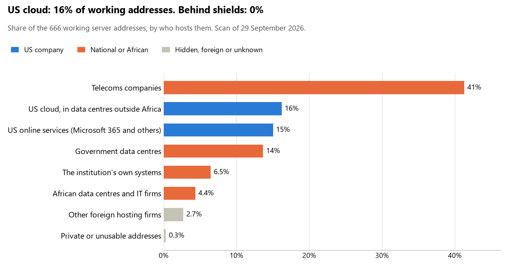

# Tunisia: who hosts the state's front door

29 September 2026 · Bill Anderson · scan of 29 September 2026

The scan covered 39 state bodies, banks and state-owned companies in Tunisia. 16% of their working server addresses are on US cloud: Amazon, Microsoft, Google or Oracle. 0% are behind shields such as Cloudflare, which hide the host. 20% are on government data centres or the institutions' own systems.

The scan found 456 web and mail names and 666 working addresses. 11 of the 39 institutions use US cloud for at least part of their estate. 10 use Microsoft for email and none use Google.

Of the 54 countries scanned so far, Tunisia has the 23rd highest US cloud share (median 13%) and the 53rd highest share behind shields (median 12%).

## Where it lives

108 addresses are on US cloud. Where they are: 84% in Europe, 11% in a region the providers do not publish, 4% on worldwide delivery networks (no fixed location) and <1% in Asia or the Middle East.

## Banks against government

| Share of working addresses | Government (29) | Banks (10) |
| --- | --- | --- |
| On US cloud | 9% | 29% |
| …of which in Africa | 0% | 0% |
| US online services (Microsoft 365 and others) | 11% | 22% |
| Behind a shield | 0% | 0% |
| Government data centres | 20% | 2% |
| Run by the institution itself | 10% | <1% |
| Telecoms companies | 43% | 39% |
| African data centres and IT firms | 6% | 2% |
| Other foreign hosting firms | <1% | 6% |

6 of 10 banks and 5 of 29 government bodies use US cloud somewhere. "Government" includes the central bank, the payment switch, the stock exchange and the state-owned companies.

## Email

10 of the 39 institutions use Microsoft 365 for email and none use Google.

- **Microsoft 365:** 10. Assemblée des représentants du peuple, Banque centrale de Tunisie, Banque Internationale Arabe de Tunisie (BIAT), Société Tunisienne de Banque (STB), BH Bank, Banque de Tunisie, Union Bancaire pour le Commerce et l'Industrie (UBCI), Institut national de la statistique, Tunisie Télécom and Centre national de l'informatique.
- **Government data centre (Agence Tunisienne Internet - ATI - Agence Tunisienne Internet):** 5. Ministère de la Justice, Ministère des Finances, Direction générale des douanes, Ministère des Affaires sociales and TUNEPS (Haute instance de la commande publique).
- **Own mail servers:** 1. Portail national du gouvernement tunisien.
- **Telecoms companies:** 15. Présidence de la République tunisienne (TN-BB-AS), Ministère des Affaires étrangères (TN-BB-AS), Ministère de la Défense nationale (TN-BB-AS), Ministère de l'Intérieur (TN-BB-AS), Banque Nationale Agricole (BNA) (Orange Tunisie), Amen Bank (Orange Tunisie), Attijari Bank (Orange Tunisie), Arab Tunisian Bank (ATB) (Orange Tunisie), Caisse nationale d'assurance maladie (Orange Tunisie), Caisse nationale de sécurité sociale (TOPNET), Office de la topographie et du cadastre (TN-BB-AS), Conseil du marché financier (TOPNET), Caisse nationale de retraite et de prévoyance sociale (TOPNET), Office de la marine marchande et des ports (TOPNET) and Agence nationale de la sécurité informatique (TN-BB-AS).
- **African hosts:** 3. Société monétique Tunisie (Cloud Temple Tunisia), Bourse de Tunis (3S INF) and Société tunisienne de l'électricité et du gaz (3S INF).
- **Foreign hosting firms:** 2. Union Internationale de Banques (UIB) (Societe Generale S.A.) and Instance supérieure indépendante pour les élections (OVH).
- **No mail on the domain scanned:** 3. Direction générale des impôts, Instance nationale de protection des données personnelles and Ministère de la Santé.

## Institution by institution

Each figure is a share of that institution's working addresses. The rest are with telecoms companies, African data centres, US online services or foreign hosts. Rows follow the order of institution types.

| Institution | Type | On US cloud | …in Africa | Behind a shield | Own or government | Email |
| --- | --- | --- | --- | --- | --- | --- |
| Présidence de la République tunisienne | Presidency | 0% | 0% | 0% | 13% | Telecoms |
| Assemblée des représentants du peuple | Parliament | 5% | 0% | 0% | 43% | Microsoft |
| Ministère des Affaires étrangères | Foreign Affairs | 7% | 0% | 0% | 53% | Telecoms |
| Ministère de la Défense nationale | Defence | 0% | 0% | 0% | 5% | Telecoms |
| Ministère de la Justice | Justice | 0% | 0% | 0% | 83% | Government |
| Ministère des Finances | Treasury / Finance | 0% | 0% | 0% | 50% | Government |
| Direction générale des impôts | Revenue Service | 0% | 0% | 0% | 100% | — |
| Direction générale des douanes | Customs | 0% | 0% | 0% | 67% | Government |
| Ministère de l'Intérieur | Interior / Home Affairs | 0% | 0% | 0% | 45% | Telecoms |
| Banque centrale de Tunisie | Central Bank | 38% | 0% | 0% | 29% | Microsoft |
| Banque Internationale Arabe de Tunisie (BIAT) | Commercial Banks | 25% | 0% | 0% | 0% | Microsoft |
| Banque Nationale Agricole (BNA) | Commercial Banks | 43% | 0% | 0% | 9% | Telecoms |
| Société Tunisienne de Banque (STB) | Commercial Banks | 28% | 0% | 0% | 11% | Microsoft |
| Amen Bank | Commercial Banks | 0% | 0% | 0% | 0% | Telecoms |
| Attijari Bank | Commercial Banks | 0% | 0% | 0% | 0% | Telecoms |
| BH Bank | Commercial Banks | 39% | 0% | 0% | 0% | Microsoft |
| Union Internationale de Banques (UIB) | Commercial Banks | 0% | 0% | 0% | 0% | Foreign host |
| Banque de Tunisie | Commercial Banks | 57% | 0% | 0% | 0% | Microsoft |
| Union Bancaire pour le Commerce et l'Industrie (UBCI) | Commercial Banks | 0% | 0% | 0% | 0% | Microsoft |
| Arab Tunisian Bank (ATB) | Commercial Banks | 36% | 0% | 0% | 4% | Telecoms |
| Instance nationale de protection des données personnelles | Data protection authority | no working address | | | | — |
| Instance supérieure indépendante pour les élections | Electoral commission | 0% | 0% | 0% | 0% | Foreign host |
| Institut national de la statistique | Statistics office | 0% | 0% | 0% | 31% | Microsoft |
| Ministère de la Santé | Health ministry / National health insurance | 0% | 0% | 0% | 0% | — |
| Caisse nationale d'assurance maladie | Health ministry / National health insurance | 0% | 0% | 0% | 0% | Telecoms |
| Ministère des Affaires sociales | Social protection / Social registry | 69% | 0% | 0% | 14% | Government |
| Caisse nationale de sécurité sociale | Social protection / Social registry | 0% | 0% | 0% | 0% | Telecoms |
| Office de la topographie et du cadastre | Land registry | 0% | 0% | 0% | 55% | Telecoms |
| Société monétique Tunisie | National payment switch | 0% | 0% | 0% | 0% | African host |
| Bourse de Tunis | Stock exchange | 0% | 0% | 0% | 0% | African host |
| Conseil du marché financier | Securities regulator | 0% | 0% | 0% | 0% | Telecoms |
| Caisse nationale de retraite et de prévoyance sociale | Sovereign wealth fund / National pension fund | 0% | 0% | 0% | 0% | Telecoms |
| TUNEPS (Haute instance de la commande publique) | Public procurement authority | 0% | 0% | 0% | 50% | Government |
| Société tunisienne de l'électricité et du gaz | Energy utility | 0% | 0% | 0% | 0% | African host |
| Office de la marine marchande et des ports | Ports authority | 0% | 0% | 0% | 0% | Telecoms |
| Tunisie Télécom | State-owned telco / National backbone operator | 0% | 0% | 0% | 61% | Microsoft |
| Portail national du gouvernement tunisien | E-government agency | 0% | 0% | 0% | 100% | Own servers |
| Centre national de l'informatique | National data centre / Government cloud operator | 3% | 0% | 0% | 5% | Microsoft |
| Agence nationale de la sécurité informatique | Cybersecurity agency / National CERT | 0% | 0% | 0% | 25% | Telecoms |

No institution or working domain was found for 8 of the 36 types: Armed Forces, Police, Intelligence, Civil registry / National ID authority, Immigration / Passports, Communications regulator, Audit office and Anti-corruption commission.

## What stood out

- **Most on US cloud.** Ministère des Affaires sociales (69%) and Banque de Tunisie (57%) have more than half their working addresses on US cloud.
- **Little US cloud in Africa.** 0% of Tunisia's US cloud addresses are in the providers' African data centres.
- **Core state bodies at home.** Ministère de la Justice (83%) keeps at least 80% of its working addresses on government data centres or its own systems.
- **No Chinese cloud.** The scan found no address on Huawei, Alibaba or Tencent cloud.

## What this can and cannot tell you

The scan sees only the front door: websites, email, login portals, remote-access gateways and online banking. It cannot see where a bank's core ledger, the ID register or the payroll run.

- **Every US figure is a minimum.** Anything behind a shield or a mail filter could also be on US cloud. In Tunisia that is 0% of working addresses.
- **It counts addresses, not importance.** An institution with many test and marketing sites weighs more than one with few.
- **The list of institutions was drawn up for this scan.** Each domain was checked to exist, not confirmed as the institution's main one.
- **It is a snapshot.** Every figure is as of 29 September 2026.
- **Nothing was touched.** The scan used public address lookups, public certificate records and the cloud companies' published address lists. It never connected to any institution's systems.

The data and method are in `R&D/Hyperscaler-dependence/scan/TUN/` and `R&D/Hyperscaler-dependence/HYPERSCALER-SCAN.md` in the Corpus repository.
