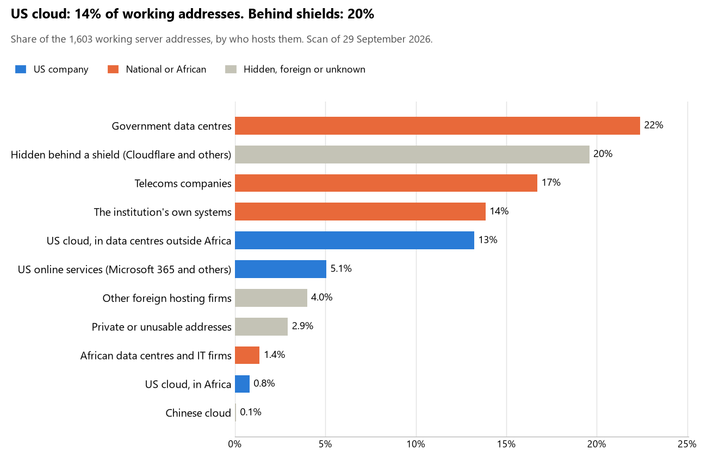

# Tanzania: who hosts the state's front door

29 September 2026 · Bill Anderson · scan of 29 September 2026

The scan covered 44 state bodies, banks and state-owned companies in Tanzania. 14% of their working server addresses are on US cloud: Amazon, Microsoft, Google or Oracle. 20% are behind shields such as Cloudflare, which hide the host. 36% are on government data centres or the institutions' own systems.

The scan found 1,538 web and mail names and 1,603 working addresses. 12 of the 44 institutions use US cloud for at least part of their estate. 9 use Microsoft for email and 1 use Google.

Of the 54 countries scanned so far, Tanzania has the 26th highest US cloud share (median 13%) and the 15th highest share behind shields (median 12%).

## Where it lives

225 addresses are on US cloud. Where they are: 57% in Europe, 18% on worldwide delivery networks (no fixed location), 14% in North America, 6% in Africa and 5% in a region the providers do not publish.

314 addresses are behind shields: Cloudflare (87%), Akamai (10%) and Radware (3%). The host behind a shield cannot be seen, so the US cloud share is a minimum.

## Banks against government

| Share of working addresses | Government (34) | Banks (10) |
| --- | --- | --- |
| On US cloud | 5% | 26% |
| …of which in Africa | 0% | 2% |
| US online services (Microsoft 365 and others) | 2% | 9% |
| Behind a shield | 0% | 45% |
| Government data centres | 40% | <1% |
| Run by the institution itself | 19% | 8% |
| Telecoms companies | 27% | 4% |
| African data centres and IT firms | <1% | 2% |
| Other foreign hosting firms | 3% | 6% |

7 of 10 banks and 5 of 34 government bodies use US cloud somewhere. "Government" includes the central bank, the payment switch, the stock exchange and the state-owned companies.

## Email

9 of the 44 institutions use Microsoft 365 for email and 1 use Google.

- **Microsoft 365:** 9. Tanzania Revenue Authority, NMB Bank, Exim Bank Tanzania, People's Bank of Zanzibar, Azania Bank, Absa Bank Tanzania, KCB Bank Tanzania, Dar es Salaam Stock Exchange and Tanzania Electric Supply Company.
- **Google:** 1. Public Service Social Security Fund.
- **Government data centre:** 23. State House (Ikulu) (e-Government Authority), Parliament of the United Republic of Tanzania (e-Government Authority), Ministry of Foreign Affairs and East African Cooperation (e-Government Authority), Ministry of Defence and National Service (e-Government Authority), Tanzania Police Force (e-Government Authority), Ministry of Constitutional and Legal Affairs (e-Government Authority), Judiciary of Tanzania (e-Government Authority), Ministry of Finance (e-Government Authority), Ministry of Home Affairs (e-Government Authority), National Identification Authority (e-Government Authority), Personal Data Protection Commission (e-Government Authority), Independent National Electoral Commission (e-Government Authority), National Bureau of Statistics (e-Government Authority), Tanzania Immigration Services Department (e-Government Authority), National Health Insurance Fund (e-Government Authority), Tanzania Social Action Fund (e-Government Authority), Ministry of Lands Housing and Human Settlements Development (e-Government Authority), Capital Markets and Securities Authority (e-Government Authority), Public Procurement Regulatory Authority (e-Government Authority), National e-Procurement System of Tanzania (NeST) (e-Government Authority), Tanzania Ports Authority (e-Government Authority), Tanzania Telecommunications Corporation (e-Government Authority) and TZ-CERT (TANZANIA COMMUNICATIONS  REGULATORY AUTHORITY).
- **Own mail servers:** 4. CRDB Bank, Tanzania Commercial Bank, e-Government Authority and Tanzania Communications Regulatory Authority.
- **Telecoms companies (TANZANIA TELECOMMUNICATIONS CO. LTD):** 4. Ministry of Health, National Social Security Fund, National Audit Office of Tanzania and Prevention and Combating of Corruption Bureau.
- **Behind a mail filter, provider not visible:** 2. Bank of Tanzania and National Bank of Commerce.
- **No mail on the domain scanned:** 1. Stanbic Bank Tanzania.

## Institution by institution

Each figure is a share of that institution's working addresses. The rest are with telecoms companies, African data centres, US online services or foreign hosts. Rows follow the order of institution types.

| Institution | Type | On US cloud | …in Africa | Behind a shield | Own or government | Email |
| --- | --- | --- | --- | --- | --- | --- |
| State House (Ikulu) | Presidency | 0% | 0% | 0% | 86% | Government |
| Parliament of the United Republic of Tanzania | Parliament | 0% | 0% | 0% | 89% | Government |
| Ministry of Foreign Affairs and East African Cooperation | Foreign Affairs | 0% | 0% | 0% | 75% | Government |
| Ministry of Defence and National Service | Defence | 11% | 0% | 0% | 67% | Government |
| Tanzania Police Force | Police | 0% | 0% | 0% | 50% | Government |
| Ministry of Constitutional and Legal Affairs | Justice | 0% | 0% | 0% | 54% | Government |
| Judiciary of Tanzania | Justice | 0% | 0% | 0% | 90% | Government |
| Ministry of Finance | Treasury / Finance | 0% | 0% | 0% | 62% | Government |
| Tanzania Revenue Authority | Revenue Service | 0% | 0% | 0% | 74% | Microsoft |
| Ministry of Home Affairs | Interior / Home Affairs | 0% | 0% | 0% | 82% | Government |
| Bank of Tanzania | Central Bank | 31% | 0% | 0% | 20% | Filtered |
| CRDB Bank | Commercial Banks | 61% | 12% | 18% | 20% | Own servers |
| NMB Bank | Commercial Banks | 32% | 0% | 37% | 13% | Microsoft |
| National Bank of Commerce | Commercial Banks | 20% | 4% | 0% | 0% | Filtered |
| Exim Bank Tanzania | Commercial Banks | 62% | 0% | 0% | 7% | Microsoft |
| Stanbic Bank Tanzania | Commercial Banks | 0% | 0% | 91% | 0% | — |
| People's Bank of Zanzibar | Commercial Banks | 0% | 0% | 67% | 0% | Microsoft |
| Azania Bank | Commercial Banks | 21% | 0% | 54% | <1% | Microsoft |
| Tanzania Commercial Bank | Commercial Banks | 0% | 0% | 0% | 92% | Own servers |
| Absa Bank Tanzania | Commercial Banks | 33% | 0% | 17% | 25% | Microsoft |
| KCB Bank Tanzania | Commercial Banks | 31% | 0% | 36% | 0% | Microsoft |
| National Identification Authority | Civil registry / National ID authority | 0% | 0% | 0% | 28% | Government |
| Personal Data Protection Commission | Data protection authority | 0% | 0% | 0% | 73% | Government |
| Independent National Electoral Commission | Electoral commission | 0% | 0% | 0% | 92% | Government |
| National Bureau of Statistics | Statistics office | 0% | 0% | 0% | 88% | Government |
| Tanzania Immigration Services Department | Immigration / Passports | 0% | 0% | 0% | 31% | Government |
| Ministry of Health | Health ministry / National health insurance | 3% | 0% | 0% | 17% | Telecoms |
| National Health Insurance Fund | Health ministry / National health insurance | 0% | 0% | 0% | 88% | Government |
| Tanzania Social Action Fund | Social protection / Social registry | 0% | 0% | 0% | 93% | Government |
| Ministry of Lands Housing and Human Settlements Development | Land registry | 0% | 0% | 0% | 83% | Government |
| Dar es Salaam Stock Exchange | Stock exchange | 17% | 0% | 0% | 0% | Microsoft |
| Capital Markets and Securities Authority | Securities regulator | 0% | 0% | 0% | 67% | Government |
| National Social Security Fund | Sovereign wealth fund / National pension fund | 0% | 0% | 0% | 54% | Telecoms |
| Public Service Social Security Fund | Sovereign wealth fund / National pension fund | 0% | 0% | 0% | 100% | Google |
| Public Procurement Regulatory Authority | Public procurement authority | 0% | 0% | 0% | 88% | Government |
| National e-Procurement System of Tanzania (NeST) | Public procurement authority | 0% | 0% | 0% | 70% | Government |
| Tanzania Electric Supply Company | Energy utility | 0% | 0% | 0% | 32% | Microsoft |
| Tanzania Ports Authority | Ports authority | 0% | 0% | 0% | 97% | Government |
| Tanzania Telecommunications Corporation | State-owned telco / National backbone operator | 0% | 0% | 0% | 84% | Government |
| e-Government Authority | E-government agency | 0% | 0% | 0% | 79% | Own servers |
| TZ-CERT | Cybersecurity agency / National CERT | 0% | 0% | 0% | 91% | Government |
| Tanzania Communications Regulatory Authority | Communications regulator | 0% | 0% | 0% | 97% | Own servers |
| National Audit Office of Tanzania | Audit office | 20% | 0% | 0% | 27% | Telecoms |
| Prevention and Combating of Corruption Bureau | Anti-corruption commission | 0% | 0% | 0% | 20% | Telecoms |

No institution or working domain was found for 5 of the 36 types: Armed Forces, Customs, Intelligence, National payment switch and National data centre / Government cloud operator.

## What stood out

- **Most on US cloud.** Exim Bank Tanzania (62%) and CRDB Bank (61%) have more than half their working addresses on US cloud.
- **Little US cloud in Africa.** 6% of Tanzania's US cloud addresses are in the providers' African data centres.
- **Core state bodies at home.** State House (Ikulu) (86%), Parliament of the United Republic of Tanzania (89%), Judiciary of Tanzania (90%) and Ministry of Home Affairs (82%) keep at least 80% of their working addresses on government data centres or their own systems.
- **Chinese cloud.** 1 address, all at NMB Bank, is on Chinese cloud.

## What this can and cannot tell you

The scan sees only the front door: websites, email, login portals, remote-access gateways and online banking. It cannot see where a bank's core ledger, the ID register or the payroll run.

- **Every US figure is a minimum.** Anything behind a shield or a mail filter could also be on US cloud. In Tanzania that is 20% of working addresses.
- **It counts addresses, not importance.** An institution with many test and marketing sites weighs more than one with few.
- **The list of institutions was drawn up for this scan.** Each domain was checked to exist, not confirmed as the institution's main one.
- **It is a snapshot.** Every figure is as of 29 September 2026.
- **Nothing was touched.** The scan used public address lookups, public certificate records and the cloud companies' published address lists. It never connected to any institution's systems.

The data and method are in `R&D/Hyperscaler-dependence/scan/TZA/` and `R&D/Hyperscaler-dependence/HYPERSCALER-SCAN.md` in the Corpus repository.
